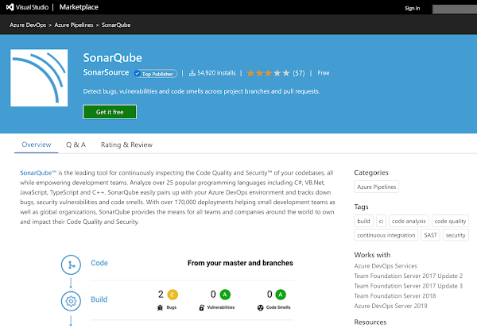

I've recently found myself developing [custom pipelines task extensions for Azure DevOps](https://docs.microsoft.com/en-us/azure/devops/extend/develop/add-build-task?view=azure-devops). The extensions being developed end up in the [Azure DevOps Marketplace](https://marketplace.visualstudio.com/azuredevops). What you see there when you look at existing extensions is some pretty lovely documentation.



<!--truncate-->

## How can our tasks look as lovely?

That, my friends, is the question to answer. Good documentation is key to success. Here's the ask: when a custom task is installed it becomes available in the marketplace, we want it to:

- contain documentation
- that documentation should support images... For a picture, famously, speaks a thousand words

## Mark(Down) our manifest

To get documentation showing up in the marketplace, we need to take a look at the `vss-extension.json` file which lies at the root of our extension folder. It's a kind of manifest file and is documented [here](https://docs.microsoft.com/en-us/azure/devops/extend/develop/manifest?view=azure-devops).

[Tucked away in the docs, you'll find mention of a `content` property and the words:](https://docs.microsoft.com/en-us/azure/devops/extend/develop/manifest?view=azure-devops#discovery-attributes)

> Dictionary of content files that describe your extension to users... Each file is assumed to be in [GitHub Flavored Markdown format](https://help.github.com/articles/github-flavored-markdown/). The path of each item is the path to the markdown file in the extension. Valid keys: `details`.

This means we can have a Markdown file in our repo which documents our task. To stay consistent with most projects, a solid choice is to use the `README/index.md` that sits in the root of the project to this end.

So the simple addition of this:

```json
{
  //...
  "content": {
    "details": {
      "path": "README/index.md"
    }
  }
  //...
}
```

Gives us documentation in the marketplace. Yay!

## Now the images...

If we are referencing images in our `README/index.md` then, as it stands right now, they won't show up in the marketplace. It'll be broken link city. Imagine some Markdown like this:

```md

```

This is entirely correct and supported, but won't work by default. This is because these images need to be specified in the [`files` property](https://docs.microsoft.com/en-us/azure/devops/extend/develop/manifest?view=azure-devops#files) of the `vss-extension.json`.

```json
{
  //...
  "content": {
    "details": {
      "path": "README/index.md"
    }
  },
  "files": [
    {
      "path": "images",
      "addressable": true
    }
  ]
  //...
}
```

Consider the above; the `path` of `images` includes everything inside the `images` folder in the task. However, it's crucial that the [`"addressable": true`](https://docs.microsoft.com/en-us/azure/devops/extend/develop/manifest?view=azure-devops#properties-1) is present as well. It's this that makes the files in this `path` URL-addressable. And without that, the images won't be displayed.

That's it! We're done! We can have rich, image inclusive, documentation in our custom tasks.

A final note: it's possible to specify individual files rather than whole paths in the `files` directory and you might want to do that if you're being very careful around file size. There is a maximum size for a custom task and it's easy to breach it. But by and large I find that "allowlisting" a single directory is easier.
