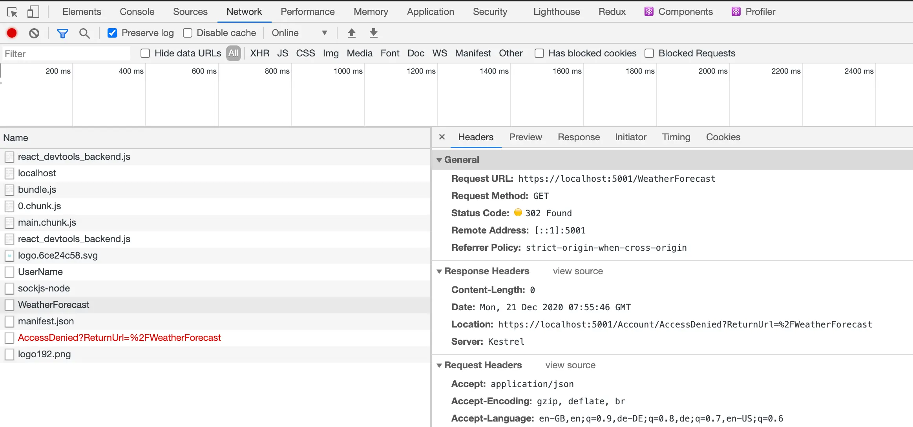
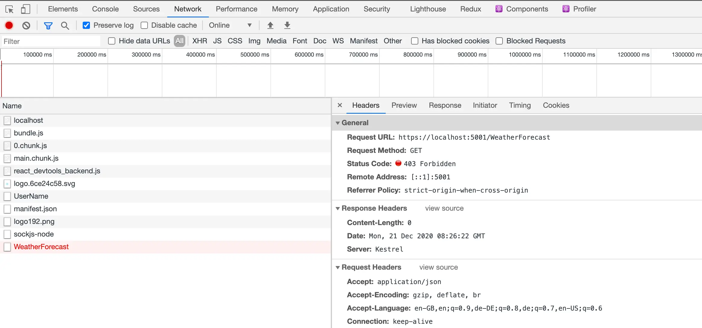

By default `Microsoft.Identity.Web` responds to unauthorized requests with a 302 (redirect). Do you want a 403 (forbidden) instead? Here's how.

<!--truncate-->

If you're using the tremendous [Azure Active Directory for authentication with ASP.NET](https://docs.microsoft.com/en-us/azure/active-directory/develop/scenario-web-app-sign-user-app-configuration?tabs=aspnetcore) then there's a good chance you're using the [`Microsoft.Identity.Web`](https://github.com/AzureAD/microsoft-identity-web) library. It's this that allows us to drop the following statement into the `ConfigureServices` method of our `Startup` class:

```cs
services.AddMicrosoftIdentityWebAppAuthentication(Configuration);
```

Which (combined with configuration in our `appsettings.json` files) hooks us up with Azure AD for authentication. This is 95% awesome. The 5% is what we're here for. Here's a screenshot of the scenario that troubles us:



We've made a request to `/WeatherForecast`; a secured endpoint (a controller decorated with the `Authorize` attribute). We're authenticated; the app knows who we are. But we're not authorized / allowed to access this endpoint. We don't have permission. The HTTP specification caters directly for this scenario with [status code `403 Forbidden`](https://tools.ietf.org/html/rfc7231#section-6.5.3):

> The 403 (Forbidden) status code indicates that the server understood the request but refuses to authorize it.

However, `Microsoft.Identity.Web` is ploughing another furrow. Instead of returning `403`, it's returning `302 Found` and redirecting the browser to `https://localhost:5001/Account/AccessDenied?ReturnUrl=%2FWeatherForecast`. Now the intentions here are _great_. If you wanted to implement a page in your application at that endpoint that displayed some kind of useful message it would be really useful. However, what if you want the more HTTP-y behaviour instead? In the case of a HTTP request triggered by JavaScript (typical for Single Page Applications) then this redirect isn't that helpful. JavaScript doesn't really know what to do with the `302` and whilst you could code around this, it's not desirable.

We want `403` - we don't want `302`.

## Give us `403`

You can have this behaviour by dropping the following code after your `services.AddMicrosoftIdentityWebAppAuthentication`:

```cs
services.Configure<CookieAuthenticationOptions>(CookieAuthenticationDefaults.AuthenticationScheme, options =>
{
    options.Events.OnRedirectToAccessDenied = new Func<RedirectContext<CookieAuthenticationOptions>, Task>(context =>
    {
        context.Response.StatusCode = StatusCodes.Status403Forbidden;
        return context.Response.CompleteAsync();
    });
});
```

This code hijacks the redirect to AccessDenied and transforms it into a `403` instead. Tremendous! What does this look like?



This is the behaviour we want!

## Extra customisation bonus points

You may want to have some nuance to the way you handle unauthorized requests. Because of the nature of `OnRedirectToAccessDenied` this is entirely possible; you have complete access to the requests coming in which you can use to direct behaviour. To take a single example, let's say we want to direct normal browsing behaviour (AKA humans clicking about in Chrome) which is not authorized to a given screen, otherwise provide `403`s. What would that look like?

```cs
services.Configure<CookieAuthenticationOptions>(CookieAuthenticationDefaults.AuthenticationScheme, options =>
{
    options.Events.OnRedirectToAccessDenied = new Func<RedirectContext<CookieAuthenticationOptions>, Task>(context =>
    {
        var isRequestForHtml = context.Request.Headers["Accept"].ToString().Contains("text/html");
        if (isRequestForHtml) {
            context.Response.StatusCode = StatusCodes.Status302Found;
            context.Response.Headers["Location"] = "/unauthorized";
        }
        else {
            context.Response.StatusCode = StatusCodes.Status403Forbidden;
        }

        return context.Response.CompleteAsync();
    });
});
```

So above, we check the request `Accept` headers and see if they contain `"text/html"`; which we're using as a signal that the request came from a users browsing. (This may not be bulletproof; better suggestions gratefully received.) If the request does contain a `"text/html"``Accept` header then we redirect the client to an `/unauthorized` screen, otherwise we return `403` as we did before. Super flexible and powerful!
