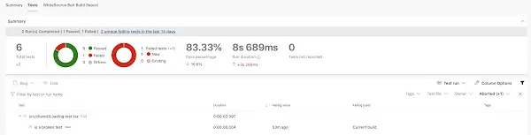

This post explains how to integrate the tremendous test runner [Jest](https://jestjs.io/) with the continuous integration platform [Azure Pipelines](https://azure.microsoft.com/en-gb/services/devops/pipelines/?nav=min). Perhaps we're setting up a new project and we've created a new React app with [Create React App](https://create-react-app.dev/). This ships with Jest support out of the box. How do we get that plugged into Pipelines such that:

1. Tests run as part of our pipeline
2. A failing test fails the build
3. Test results reported in Azure Pipelines UI

Related: there is a [post on Vitest and Azure Pipelines](../2023-08-05-azure-pipelines-meet-vitest/index.md).

<!--truncate-->

## Tests run as part of our pipeline

First of all, lets get the tests running. Crack open your `azure-pipelines.yml` file and, in the appropriate place add the following:

```yml
- task: Npm@1
  displayName: npm run test
  inputs:
    command: 'custom'
    workingDir: 'src/client-app'
    customCommand: 'run test'
```

The above will, when run, trigger a `npm run test` in the `src/client-app` folder of my project (it's here where my React app lives). You'd imagine this would just work™️ - but life is not that simple. This is because Jest, by default, runs in watch mode. This is blocking and so not appropriate for CI.

In our `src/client-app/package.json` let's create a new script that runs the tests but _not_ in watch mode:

```json
"test:ci": "npm run test -- --watchAll=false",
```

and switch our `azure-pipelines.yml` to use it:

```yml
- task: Npm@1
  displayName: npm run test
  inputs:
    command: 'custom'
    workingDir: 'src/client-app'
    customCommand: 'run test:ci'
```

Boom! We're now running tests as part of our pipeline. And also, failing tests will fail the build, because of Jest's default behaviour of exiting with status code 1 on failed tests.

## Tests results are reported in Azure Pipelines UI

Pipelines has a really nice UI for reporting test results. If you're using something like .NET then you'll find that test results just magically show up there. We'd like that for our Jest tests as well. And we can have it.

The way we achieve this is by:

1. Producing test results in a format that can be subsequently processed
2. Using those test results to publish to Azure Pipelines

The way that you configure Jest test output is through usage of [`reporters`](https://jestjs.io/docs/en/cli#--reporters). However, Create React App doesn't support these. However that's not an issue, as the marvellous [Dan Abramov](https://twitter.com/dan_abramov) demonstrates [here](https://github.com/facebook/create-react-app/issues/2474#issuecomment-306340526).

We need to install the [`jest-junit`](https://github.com/jest-community/jest-junit) package to our `client-app`:

```
npm install jest-junit --save-dev
```

And we'll tweak our `test:ci` script to use the `jest-junit` reporter as well:

```json
"test:ci": "npm run test -- --watchAll=false --reporters=default --reporters=jest-junit",
```

We also need to add some configuration to our `package.json` in the form of a `jest-junit` element:

```json
"jest-junit": {
        "suiteNameTemplate": "{filepath}",
        "outputDirectory": ".",
        "outputName": "junit.xml"
    }
```

The above configuration will use the name of the test file as the suite name in the results, which should speed up the tracking down of the failing test. The other values specify where the test results should be published to, in this case the root of our `client-app` with the filename `junit.xml`.

Now our CI is producing our test results, how do we get them into Pipelines? For that we need the [Publish test results task](https://docs.microsoft.com/en-us/azure/devops/pipelines/tasks/test/publish-test-results?view=azure-devops&tabs=trx%2Cyaml) and a new step in our `azure-pipelines.yml` _after_ our `npm run test` step:

```yml
- task: Npm@1
  displayName: npm run test
  inputs:
    command: 'custom'
    workingDir: 'src/client-app'
    customCommand: 'run test:ci'

- task: PublishTestResults@2
  displayName: 'supply npm test results to pipelines'
  condition: succeededOrFailed() # because otherwise we won't know what tests failed
  inputs:
    testResultsFiles: 'src/client-app/junit.xml'
```

This will read the test results from our `src/client-app/junit.xml` file and pump them into Pipelines. Do note that we're _always_ running this step; so if the previous step failed (as it would in the case of a failing test) we still pump out the details of what that failure was. Like so:


And that's it! Azure Pipelines and Jest integrated.


