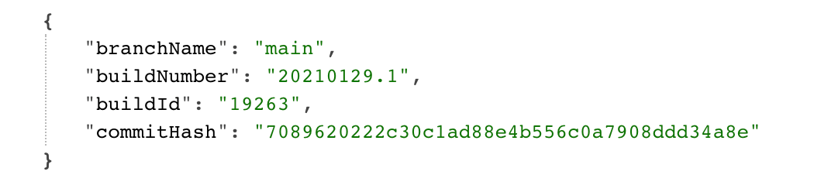
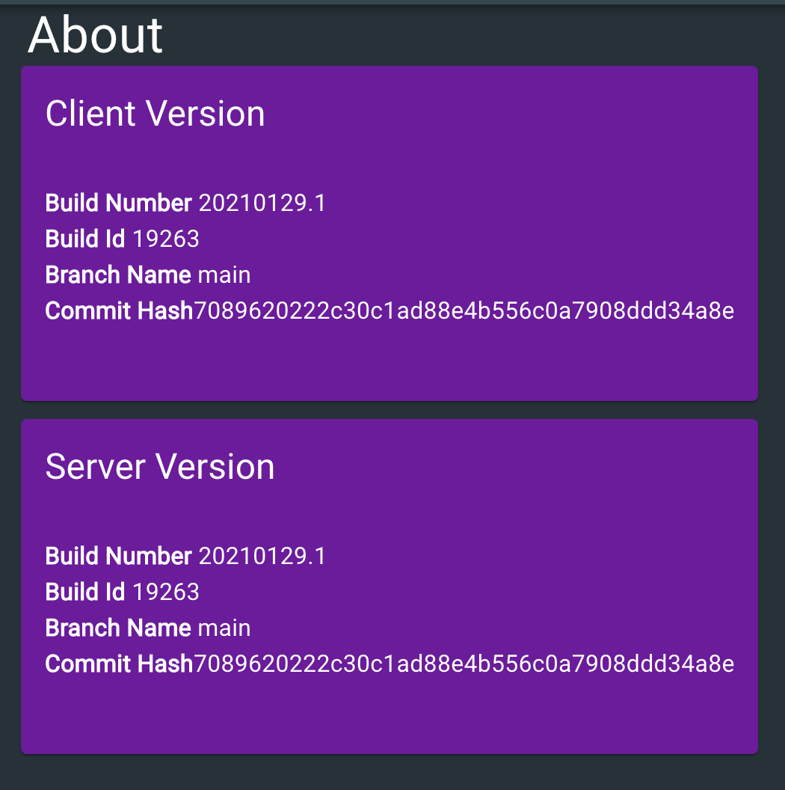

How do you answer the question: "what version of my application is running in Production right now?" This post demonstrates how to surface the build metadata that represents the version of your app, from your app using Azure Pipelines and ASP.NET.

<!--truncate-->

Many is the time where I've been pondering over why something isn't working as expected and burned a disappointing amount of time before realising that I'm playing with an old version of an app. Wouldn't it be great give our app a way to say: "Hey! I'm version 1.2.3.4 of your app; built from this commit hash, I was built on Wednesday, I was the nineth build that day and I was built from the `main` branch. And I'm an Aries." Or something like that.

This post was inspired by [Scott Hanselman's similar post on the topic](https://www.hanselman.com/blog/adding-a-git-commit-hash-and-azure-devops-build-number-and-build-id-to-an-aspnet-website). Ultimately this ended up going in a fairly different direction and so seemed worthy of a post of its own.

A particular difference is that this is targeting SPAs. Famously, cache invalidation is hard. It's possible for the HTML/JS/CSS of your app to be stale due to aggressive caching. So we're going to make it possible to see build information for both when the SPA (or "client") is built, as well as when the .NET app (or "server") is built. We're using a specific type of SPA here; a [React](https://reactjs.org/) SPA built with [TypeScript](https://www.typescriptlang.org/) and [Material UI](https://material-ui.com/), however the principles here are general; you could surface this up any which way you choose.

## Putting build info into `azure-pipelines.yml`

The first thing we're going to do is to inject our build details into two identical `buildinfo.json` files; one that sits in the server codebase and which will be used to drive the server build information, and one that sits in the client codebase to drive the client equivalent. They'll end up looking something like this:

```json
{
  "buildNumber": "20210130.1",
  "buildId": "123456",
  "branchName": "main",
  "commitHash": "7089620222c30c1ad88e4b556c0a7908ddd34a8e"
}
```

We generate this by adding the following `yml` to the beginning of our `azure-pipelines.yml` (crucially before the client or server build take place):

```yml
- script: |
      echo -e -n "{\"buildNumber\":\"$(Build.BuildNumber)\",\"buildId\":\"$(Build.BuildId)\",\"branchName\":\"$(Build.SourceBranchName)\",\"commitHash\":\"$(Build.SourceVersion)\"}" > "$(Build.SourcesDirectory)/src/client-app/src/buildinfo.json"
      echo -e -n "{\"buildNumber\":\"$(Build.BuildNumber)\",\"buildId\":\"$(Build.BuildId)\",\"branchName\":\"$(Build.SourceBranchName)\",\"commitHash\":\"$(Build.SourceVersion)\"}" > "$(Build.SourcesDirectory)/src/server-app/Server/buildinfo.json"
    displayName: "emit build details as JSON"
    failOnStderr: true
```

As you can see, we're placing the following variables that are available at build time in Azure Pipelines, into the `buildinfo.json`:

- `BuildNumber` - The name of the completed build; which usually takes the form of a date in the `yyyyMMdd` format, suffixed by `.x` where `x` is a number that increments representing the number of builds that have taken place on the given day.
- `BuildId` - The ID of the record for the completed build.
- `SourceVersion` - This is the commit hash of the source code in Git
- `SourceBranchName` - The name of the branch in Git.

[There's many variables available in Azure Pipelines that can be used](https://docs.microsoft.com/en-us/azure/devops/pipelines/build/variables?view=azure-devops&tabs=yaml#build-variables-devops-services) - we've picked out the ones most interesting to us.

## Surfacing the server build info

Our pipeline is dropping the `buildinfo.json` over pre-existing stub `buildinfo.json` files in both our client and server codebases. The stub files look like this:

```json
{
  "buildNumber": "yyyyMMdd.x",
  "buildId": "xxxxxx",
  "branchName": "",
  "commitHash": "LOCAL_BUILD"
}
```

In our .NET app, the `buildinfo.json` file has been dropped in the root of the app. And as luck would have it, all JSON files are automatically included in a .NET build and so it will be available at runtime. We want to surface this file through an API, and we also want to use it to stamp details into our logs.

So we need to parse the file, and for that we'll use this:

```cs
using System;
using System.IO;
using System.Text.Json;

namespace Server {
    public record BuildInfo(string BranchName, string BuildNumber, string BuildId, string CommitHash);

    public static class AppVersionInfo {
        private const string _buildFileName = "buildinfo.json";
        private static BuildInfo _fileBuildInfo = new(
            BranchName: "",
            BuildNumber: DateTime.UtcNow.ToString("yyyyMMdd") + ".0",
            BuildId: "xxxxxx",
            CommitHash: $"Not yet initialised - call {nameof(InitialiseBuildInfoGivenPath)}"
        );

        public static void InitialiseBuildInfoGivenPath(string path) {
            var buildFilePath = Path.Combine(path, _buildFileName);
            if (File.Exists(buildFilePath)) {
                try {
                    var buildInfoJson = File.ReadAllText(buildFilePath);
                    var buildInfo = JsonSerializer.Deserialize<BuildInfo>(buildInfoJson, new JsonSerializerOptions {
                        PropertyNamingPolicy = JsonNamingPolicy.CamelCase
                    });
                    if (buildInfo == null) throw new Exception($"Failed to deserialise {_buildFileName}");

                    _fileBuildInfo = buildInfo;
                } catch (Exception) {
                    _fileBuildInfo = new BuildInfo(
                        BranchName: "",
                        BuildNumber: DateTime.UtcNow.ToString("yyyyMMdd") + ".0",
                        BuildId: "xxxxxx",
                        CommitHash: "Failed to load build info from buildinfo.json"
                    );
                }
            }
        }

        public static BuildInfo GetBuildInfo() => _fileBuildInfo;
    }
}
```

The above code reads the `buildinfo.json` file and deserialises it into a `BuildInfo` record which is then surfaced up by the `GetBuildInfo` method. We initialise this at the start of our `Program.cs` like so:

```cs
public static int Main(string[] args) {
    AppVersionInfo.InitialiseBuildInfoGivenPath(Directory.GetCurrentDirectory());
    // Now we're free to call AppVersionInfo.GetBuildInfo()
    // ....
}
```

Now we need a controller to surface this information up. We'll add ourselves a `BuildInfoController.cs`:

```cs
using Microsoft.AspNetCore.Authorization;
using Microsoft.AspNetCore.Mvc;

namespace Server.Controllers {
    [ApiController]
    public class BuildInfoController : ControllerBase {
        [AllowAnonymous]
        [HttpGet("api/build")]
        public BuildInfo GetBuild() => AppVersionInfo.GetBuildInfo();
    }
}
```

This exposes an `api/build` endpoint in our .NET app that, when hit, will display the following JSON:



## Surfacing the client build info

Our server now lets the world know which version it is running and this is tremendous. Now let's make our client do the same.

Very little is required to achieve this. Again we have a `buildinfo.json` sat in the root of our codebase. We're able to import it as a module in TypeScript because we've set the following property in our `tsconfig.json`:

```json
"resolveJsonModule": true,
```

As a consequence, consumption is as simple as:

```ts
import clientBuildInfo from './buildinfo.json';
```

Which provides us with a `clientBuildInfo` which TypeScript automatically derives as this type:

```ts
type ClientBuildInfo = {
  buildNumber: string;
  buildId: string;
  branchName: string;
  commitHash: string;
};
```

How you choose to use that information is entirely your choice. We're going to add ourselves an "about" screen in our app, which displays both client info (loaded using the mechanism above) and server info (`fetch`ed from the `/api/build` endpoint).

```tsx
import {
  Card,
  CardContent,
  CardHeader,
  createStyles,
  Grid,
  makeStyles,
  Theme,
  Typography,
  Zoom,
} from '@material-ui/core';
import React from 'react';
import clientBuildInfo from '../../buildinfo.json';
import { projectsPurple } from '../shared/colors';
import { Loading } from '../shared/Loading';
import { TransitionContainer } from '../shared/TransitionContainer';

const useStyles = (cardColor: string) =>
  makeStyles((theme: Theme) =>
    createStyles({
      card: {
        padding: theme.spacing(0),
        backgroundColor: cardColor,
        color: theme.palette.common.white,
        minHeight: theme.spacing(28),
      },
      avatar: {
        backgroundColor: theme.palette.getContrastText(cardColor),
        color: cardColor,
      },
      main: {
        padding: theme.spacing(2),
      },
    }),
  )();

type Styles = ReturnType<typeof useStyles>;

const AboutPage: React.FC = () => {
  const [serverBuildInfo, setServerBuildInfo] =
    React.useState<typeof clientBuildInfo>();

  React.useEffect(() => {
    fetch('/api/build')
      .then((response) => response.json())
      .then(setServerBuildInfo);
  }, []);

  const classes = useStyles(projectsPurple);

  return (
    <TransitionContainer>
      <Grid container spacing={3}>
        <Grid item xs={12} sm={12} container alignItems="center">
          <Grid item>
            <Typography variant="h4" component="h1">
              About
            </Typography>
          </Grid>
        </Grid>
      </Grid>
      <Grid container spacing={1}>
        <BuildInfo
          classes={classes}
          title="Client Version"
          {...clientBuildInfo}
        />
      </Grid>
      <br />
      <Grid container spacing={1}>
        {serverBuildInfo ? (
          <BuildInfo
            classes={classes}
            title="Server Version"
            {...serverBuildInfo}
          />
        ) : (
          <Loading />
        )}
      </Grid>
    </TransitionContainer>
  );
};

interface Props {
  classes: Styles;
  title: string;
  branchName: string;
  buildNumber: string;
  buildId: string;
  commitHash: string;
}

const BuildInfo: React.FC<Props> = ({
  classes,
  title,
  branchName,
  buildNumber,
  buildId,
  commitHash,
}) => (
  <Zoom mountOnEnter unmountOnExit in={true}>
    <Card className={classes.card}>
      <CardHeader title={title} />
      <CardContent className={classes.main}>
        <Typography variant="body1" component="p">
          <b>Build Number</b> {buildNumber}
        </Typography>
        <Typography variant="body1" component="p">
          <b>Build Id</b> {buildId}
        </Typography>
        <Typography variant="body1" component="p">
          <b>Branch Name</b> {branchName}
        </Typography>
        <Typography variant="body1" component="p">
          <b>Commit Hash</b> {commitHash}
        </Typography>
      </CardContent>
    </Card>
  </Zoom>
);

export default AboutPage;
```

When the above page is viewed it looks like this:



And that's it! Our app is clearly telling us what version is being run, both on the server and in the client. Thanks to Scott Hanselman for his work which inspired this.
