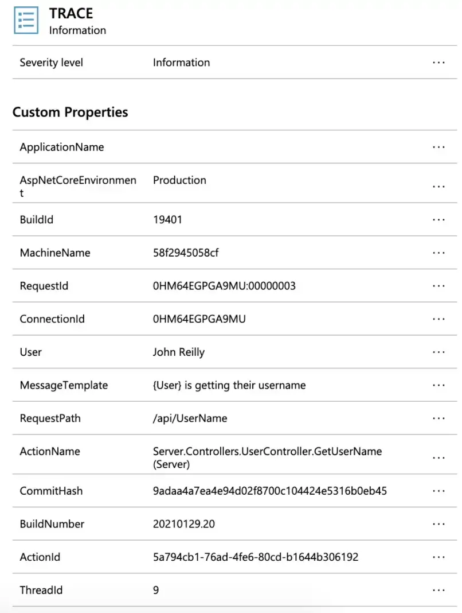

If you're deploying an ASP.NET application to Azure App Services / Azure Container Apps or similar, there's a decent chance you'll also be using the fantastic [Serilog](https://serilog.net/) and will want to plug it into Azure's [Application Insights](https://docs.microsoft.com/en-us/azure/azure-monitor/app/app-insights-overview).


<!--truncate-->

## Updated: 26/11/2022

This post will show you how it's done, and it'll also build upon the [build info work from our previous post](2021-01-29-surfacing-azure-pipelines-build-info-in-an-aspnet-react-app/index.md). In what way? Great question. Well logs are a tremendous diagnostic tool. If you have logs which display some curious behaviour, and you'd like to replicate that in another environment, you really want to take exactly that version of the codebase out to play. Our last post introduced build info into our application in the form of our `AppVersionInfo` class that looks something like this:

```json
{
  "buildNumber": "20210130.1",
  "buildId": "123456",
  "branchName": "main",
  "commitHash": "7089620222c30c1ad88e4b556c0a7908ddd34a8e"
}
```

We'd initially exposed an endpoint in our application which surfaced up this information. Now we're going to take that self same information and bake it into our log messages by making use of [Serilog's enrichment functionality](https://github.com/serilog/serilog/wiki/Enrichment). Build info and Serilog's enrichment are the double act your logging has been waiting for.

## Let's plug it together

We're going to need a number of Serilog dependencies added to our `.csproj`:

```xml
<PackageReference Include="Serilog.AspNetCore" Version="3.4.0" />
<PackageReference Include="Serilog.Enrichers.Environment" Version="2.1.3" />
<PackageReference Include="Serilog.Enrichers.Thread" Version="3.1.0" />
<PackageReference Include="Serilog.Sinks.ApplicationInsights" Version="3.1.0" />
<PackageReference Include="Serilog.Sinks.Async" Version="1.4.0" />
```

The earlier in your application lifetime you get logging wired up, the happier you will be. Earlier, means more information when you're diagnosing issues. So we want to start in our `Program.cs`; `Startup.cs` would be just _way_ too late.

```cs
public class Program {
    const string APP_NAME = "MyAmazingApp";

    public static int Main(string[] args) {
        AppVersionInfo.InitialiseBuildInfoGivenPath(Directory.GetCurrentDirectory());
        LoggerConfigurationExtensions.SetupLoggerConfiguration(APP_NAME, AppVersionInfo.GetBuildInfo());

        try
        {
            Log.Information("Starting web host");
            CreateHostBuilder(args).Build().Run();
            return 0;
        }
        catch (Exception ex)
        {
            Log.Fatal(ex, "Host terminated unexpectedly");
            return 1;
        }
        finally
        {
            Log.CloseAndFlush();
        }
    }

    public static IHostBuilder CreateHostBuilder(string[] args) =>
        Host.CreateDefaultBuilder(args)
            .UseSerilog((hostBuilderContext, services, loggerConfiguration) => {
                loggerConfiguration.ConfigureBaseLogging(APP_NAME, AppVersionInfo.GetBuildInfo());
                loggerConfiguration.AddApplicationInsightsLogging(services, hostBuilderContext.Configuration);
            })
            .ConfigureWebHostDefaults(webBuilder => {
                webBuilder
                    .UseStartup<Startup>();
            });
}
```

If you look at the code above you'll see that the first line of code that executes is `AppVersionInfo.InitialiseBuildInfoGivenPath`. This initialises our `AppVersionInfo` so we have meaningful build info to pump into our logs. The next thing we do is to configure Serilog with `LoggerConfigurationExtensions.SetupLoggerConfiguration`. This provides us with a configured logger so we are free to log any issues that take place during startup. (Incidentally, after startup you'll likely inject an `ILogger` into your classes rather than using the static `Log` directly.)

Finally, we call `CreateHostBuilder` which in turn calls `UseSerilog` to plug Serilog into ASP.NET. If you take a look inside the body of `UseSerilog` you'll see we configure the logging of ASP.NET (in the same way we did for Serilog) and we hook into Application Insights as well. There's been a number of references to `LoggerConfigurationExtensions`. Let's take a look at it:

```cs
internal static class LoggerConfigurationExtensions {
    internal static void SetupLoggerConfiguration(string appName, BuildInfo buildInfo) {
        Log.Logger = new LoggerConfiguration()
            .ConfigureBaseLogging(appName, buildInfo)
            .CreateLogger();
    }

    internal static LoggerConfiguration ConfigureBaseLogging(
        this LoggerConfiguration loggerConfiguration,
        string appName,
        BuildInfo buildInfo
    ) {
        loggerConfiguration
            .MinimumLevel.Debug()
            .MinimumLevel.Override("Microsoft", LogEventLevel.Information)
            // AMAZING COLOURS IN THE CONSOLE!!!!
            .WriteTo.Async(a => a.Console(theme: AnsiConsoleTheme.Code))
            .Enrich.FromLogContext()
            .Enrich.WithMachineName()
            .Enrich.WithThreadId()
            // Build information as custom properties
            .Enrich.WithProperty(nameof(buildInfo.BuildId), buildInfo.BuildId)
            .Enrich.WithProperty(nameof(buildInfo.BuildNumber), buildInfo.BuildNumber)
            .Enrich.WithProperty(nameof(buildInfo.BranchName), buildInfo.BranchName)
            .Enrich.WithProperty(nameof(buildInfo.CommitHash), buildInfo.CommitHash)
            .Enrich.WithProperty("ApplicationName", appName);

        return loggerConfiguration;
    }

    internal static LoggerConfiguration AddApplicationInsightsLogging(this LoggerConfiguration loggerConfiguration, IServiceProvider services, IConfiguration configuration)
    {
        if (!string.IsNullOrWhiteSpace(configuration.GetValue<string>("APPINSIGHTS_INSTRUMENTATIONKEY")))
        {
            loggerConfiguration.WriteTo.ApplicationInsights(
                services.GetRequiredService<TelemetryConfiguration>(),
                TelemetryConverter.Traces);
        }

        return loggerConfiguration;
    }
}
```

If we take a look at the `ConfigureBaseLogging` method above, we can see that our logs are being enriched with the build info, property by property. We're also giving ourselves a beautifully coloured console thanks to Serilog's glorious [theme support](https://github.com/serilog/serilog-sinks-console#themes):


Take a moment to admire the salmon pinks. Is it not lovely?

Finally we come to the main act. Plugging in Application Insights is as simple as dropping in `loggerConfiguration.WriteTo.ApplicationInsights` into our configuration. You'll note that this depends upon the existence of an application setting of `APPINSIGHTS_INSTRUMENTATIONKEY` - this is the secret sauce that we need to be in place so we can pipe logs merrily to Application Insights. So you'll need this configuration in place so this works.



As you can see, we now have the likes of `BuildNumber`, `CommitHash` and friends visible on each log. Happy diagnostic days!

I'm indebted to the marvellous [Marcel Michau](https://twitter.com/MarcelMichau) who showed me how to get the fiddlier parts of how to get Application Insights plugged in the right way. Thanks chap!
