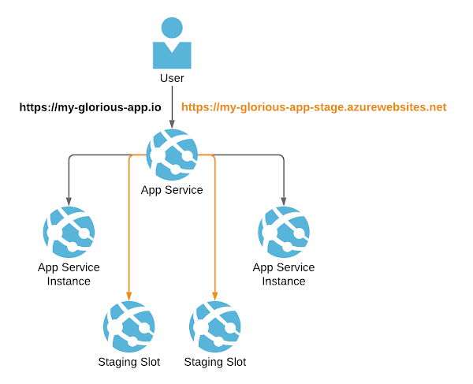
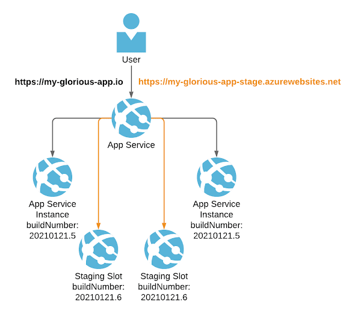
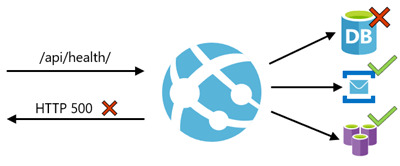

I've been working recently on zero downtime deployments using Azure App Service. They're facilitated by a combination of [Health checks](https://docs.microsoft.com/en-us/azure/app-service/monitor-instances-health-check) and [deployment slots](https://docs.microsoft.com/en-us/azure/app-service/deploy-staging-slots). This post will talk about why this is important and how it works.

<!--truncate-->

## Why zero downtime deployments?

Historically (and for many applications, currently) deployment results in downtime. A period of time during the release where an application is not available to users whilst the new version is deployed. There are a number of downsides to releases with downtime:

1. Your users cannot use your application. This will frustrate them and make them sad.
2. Because you're a kind person and you want your users to be happy, you'll optimise to make their lives better. You'll release when the fewest users are accessing your application. It will likely mean you'll end up working late, early or at weekends.
3. Again because you want to reduce impact on users, you'll release less often. This means that every release will bring with it a greater collection of changes. This is turn will often result in a large degree of focus on manually testing each release, to reduce the likelihood of bugs ending up in users hands. This is a noble aim, but it drags the teams focus away from shipping.

Put simply: downtime in releases impacts customer happiness and leads to reduced pace for teams. It's a vicious circle.

But if we turn it around, what does it look like if releases have _no_ downtime at all?

1. Your users can always use your application. This will please them.
2. Your team is now safe to release at any time, day or night. They will likely release more often as a consequence.
3. If your team has sufficient automated testing in place, they're now in a position where they can move to [Continuous Deployment](https://www.atlassian.com/continuous-delivery/principles/continuous-integration-vs-delivery-vs-deployment).
4. Releases become boring. This is good. They "just work™️" and so the team can focus instead on building the cool features that are going to make users lives even better.

## Manual zero downtime releases with App Services

App Services have the ability to scale out. To [quote the docs](https://azure.microsoft.com/en-us/blog/scaling-up-and-scaling-out-in-windows-azure-web-sites/):

> A scale out operation is the equivalent of creating multiple copies of your web site and adding a load balancer to distribute the demand between them. When you scale out ... there is no need to configure load balancing separately since this is already provided by the platform.

As you can see, scaling out works by having multiple instances of your app. Deployment slots are exactly this, but with an extra twist. If you add a deployment slot to your App Service, then you **no longer deploy to production**. Instead you deploy to your staging slot. Your staging slot is accessible in the same way your production slot is accessible. So whilst your users may go to [https://my-glorious-app.io](https://my-glorious-app.io), your staging slot may live at [https://my-glorious-app-stage.azurewebsites.net](https://my-glorious-app-stage.azurewebsites.net) instead. Because this is accessible, this is testable. You are in a position to test the deployed application before making it generally available.



Once you're happy that everything looks good, you can "swap slots". What this means, is the version of the app living in the staging slot, gets moved into the production slot. So that which lived at [https://my-glorious-app-stage.azurewebsites.net](https://my-glorious-app-stage.azurewebsites.net) moves to [https://my-glorious-app.io](https://my-glorious-app.io). For a more details on what that involves [read this](https://docs.microsoft.com/en-us/azure/app-service/deploy-staging-slots#what-happens-during-a-swap). The significant take home is this: there is no downtime. Traffic stops being routed to the old instance and starts being routed to the new one. It's as simple as that.

I should mention at this point that there's a [number of zero downtime strategies out there](https://opensource.com/article/17/5/colorful-deployments) and slots can help support a number of these. This includes canary deployments, where a subset of traffic is routed to the new version prior to it being opened out more widely. In our case, we're looking at rolling deployments, where we replace the currently running instances of our application with the new ones; but it's worth being aware that there are other strategies that slots can facilitate.

So what does it look like when slots swap? Well, to test that out, we swapped slots on our two App Service instances. We repeatedly CURLed our apps [`api/build`](../2021-01-29-surfacing-azure-pipelines-build-info-in-an-aspnet-react-app/index.md) endpoint that exposes the build information; to get visibility around which version of our app we were routing traffic to. This is what we saw:

```
Thu Jan 21 11:51:51 GMT 2021
{"buildNumber":"20210121.5","buildId":"17992","commitHash":"c2122919df54bfa6a0d20bceb9f06890f822b26e"}
Thu Jan 21 11:51:54 GMT 2021
{"buildNumber":"20210121.6","buildId":"18015","commitHash":"062ac1488fcf1737fe1dbab0d05c095786218f30"}
Thu Jan 21 11:51:57 GMT 2021
{"buildNumber":"20210121.5","buildId":"17992","commitHash":"c2122919df54bfa6a0d20bceb9f06890f822b26e"}
Thu Jan 21 11:52:00 GMT 2021
{"buildNumber":"20210121.6","buildId":"18015","commitHash":"062ac1488fcf1737fe1dbab0d05c095786218f30"}
Thu Jan 21 11:52:03 GMT 2021
{"buildNumber":"20210121.6","buildId":"18015","commitHash":"062ac1488fcf1737fe1dbab0d05c095786218f30"}
Thu Jan 21 11:52:05 GMT 2021
{"buildNumber":"20210121.6","buildId":"18015","commitHash":"062ac1488fcf1737fe1dbab0d05c095786218f30"}
Thu Jan 21 11:52:08 GMT 2021
{"buildNumber":"20210121.5","buildId":"17992","commitHash":"c2122919df54bfa6a0d20bceb9f06890f822b26e"}
Thu Jan 21 11:52:10 GMT 2021
{"buildNumber":"20210121.6","buildId":"18015","commitHash":"062ac1488fcf1737fe1dbab0d05c095786218f30"}
Thu Jan 21 11:52:12 GMT 2021
{"buildNumber":"20210121.5","buildId":"17992","commitHash":"c2122919df54bfa6a0d20bceb9f06890f822b26e"}
Thu Jan 21 11:52:15 GMT 2021
{"buildNumber":"20210121.6","buildId":"18015","commitHash":"062ac1488fcf1737fe1dbab0d05c095786218f30"}
Thu Jan 21 11:52:17 GMT 2021
{"buildNumber":"20210121.6","buildId":"18015","commitHash":"062ac1488fcf1737fe1dbab0d05c095786218f30"}
```

The first new version of our application showed up in a production slot at 11:51:54, and the last old version showed up at 11:52:12. So it took a total of 15 seconds to complete the transition from hitting only instances of the old application to hitting only instances of the new application. During that 15 seconds either old or new versions of the application would be serving traffic. Significantly, there was always a version of the application returning responses.

This is _very_ exciting! We have zero downtime deployments!

## Rollbacks for bonus points

We now have the new version of the app (`buildNumber: 20210121.6`) in the production slot, and the old version of the app (`buildNumber: 20210121.5`) in the staging slot.

Slots have a tremendous rollback story. If it emerges that there was some uncaught issue in your release and you'd like to revert to the previous version, you can! Just as we swapped just now to move `buildNumber: 20210121.6` from the staging slot to the production slot and `buildNumber: 20210121.5` the other way, we can swap right back and revert our release like so:



Once again users going to [https://my-glorious-app.io](https://my-glorious-app.io) are hitting `buildNumber: 20210121.5`.

This is also _very_ exciting! We have zero downtime deployments _and_ rollbacks!

## Automated zero downtime releases with Health checks

The final piece of the puzzle here automation. You're a sophisticated team, you've put a great deal of energy into automating your tests. You don't want your release process to be manual for this very reason; you trust your test coverage. You want to move to Continuous Deployment.

Fortunately, automating swapping slots is a breeze with `azure-pipelines.yml`. Consider the following:

```yml
- job: DeployApp
        displayName: Deploy app
        dependsOn:
        - DeployARMTemplates

        steps:
        - download: current
          artifact: webapp

        - task: AzureWebApp@1
          displayName: 'Deploy Web Application'
          inputs:
            azureSubscription: $(serviceConnection)
            resourceGroupName: $(azureResourceGroup)
            appName: $(appServiceName)
            package: $(Pipeline.Workspace)/webapp/**/*.zip
            slotName: stage
            deployToSlotOrASE: true
            deploymentMethod: auto

      - job: SwapSlots
        displayName: Swap Slots
        dependsOn:
        - DeployApp

        steps:
          - task: AzureAppServiceManage@0
            displayName: Swap Slots
            inputs:
              action: 'Swap Slots'
              azureSubscription: $(serviceConnection)
              resourceGroupName: $(azureResourceGroup)
              webAppName: $(appServiceName)
              SourceSlot: 'stage'
```

The first job here, deploys our previously built `webapp` to the `stage` slot. The second job swaps the slot.

When I first considered this, the question rattling around in the back of my mind was this: how does App Service know when it's safe to swap? What if we swap before our app has fully woken up and started serving responses?

It so happens that using [Health checks, App Service caters for this beautifully](https://docs.microsoft.com/en-us/azure/app-service/monitor-instances-health-check). A health check endpoint is a URL in your application which, when hit, checks the dependencies of your application. "Is the database accessible?" "Are the APIs I depend upon accessible?" The diagram from the docs expresses it very well:



This approach is very similar to [liveness, readiness and startup probes in Kubernetes](https://kubernetes.io/docs/tasks/configure-pod-container/configure-liveness-readiness-startup-probes/). To make use of Health checks, in our ARM template for our App Service we have configured a `healthCheckPath`:

```json
"siteConfig": {
    "linuxFxVersion": "[parameters('linuxFxVersion')]",
    "alwaysOn": true,
    "http20Enabled": true,
    "minTlsVersion": "1.2",
    "healthCheckPath": "/api/health",
    //...
}
```

This tells App Service where to look to check the health. The health check endpoint itself is provided by the `MapHealthChecks` in our `Startup.cs` of our .NET application:

```cs
app.UseEndpoints(endpoints => {
    endpoints.MapControllerRoute(
        name: "default",
        pattern: "{controller}/{action=Index}/{id?}");

    endpoints.MapHealthChecks("/api/health");
});
```

You read a full list of all the ways App Service uses Health checks [here](https://docs.microsoft.com/en-us/azure/app-service/monitor-instances-health-check#what-app-service-does-with-health-checks). Pertinent for zero downtime deployments is this:

> when scaling up or out, App Service pings the Health check path to ensure new instances are ready.

This is the magic sauce. App Service doesn't route traffic to an instance until it's given the thumbs up that it's ready in the form of passing health checks. This is excellent; it is this that makes automated zero downtime releases a reality.

Props to the various Azure teams that have made this possible; I'm very impressed by the way in which the Health checks and slots can be combined together to support some tremendous use cases.
