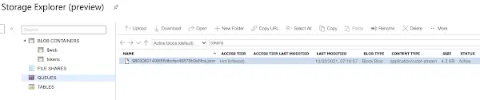

I [wrote recently about zero downtime deployments on Azure App Service](../2021-02-11-azure-app-service-health-checks-and-zero-downtime-deployments/index.md). Many applications require authentication, and ours is no exception. In our case we're using Azure Active Directory facilitated by ["Easy Auth"](https://docs.microsoft.com/en-us/azure/app-service/overview-authentication-authorization) which provides authentication to our App Service.

<!--truncate-->

Our app uses a Linux App Service. It's worth knowing that Linux App Services run as a Docker container. As a consequence, Easy Auth works in a slightly different way; effectively as a middleware. [To quote the docs on Easy Auth](https://docs.microsoft.com/en-us/azure/app-service/overview-authentication-authorization#on-containers):

> This module handles several things for your app:
>
> - Authenticates users with the specified provider
> - Validates, stores, and refreshes tokens
> - Manages the authenticated session
> - Injects identity information into request headers The module runs separately from your application code and is configured using app settings. No SDKs, specific languages, or changes to your application code are required.
>
> The authentication and authorization module runs in a separate container, isolated from your application code. Using what's known as the [Ambassador](https://docs.microsoft.com/en-us/azure/architecture/patterns/ambassador) pattern, it interacts with the incoming traffic to perform similar functionality as on Windows.

However, [Microsoft have acknowledged there is a potential bug in Easy Auth support at present](https://social.msdn.microsoft.com/Forums/en-US/dde551b2-c86d-474b-b0a6-cc66163785a1/restarting-azure-app-service-on-linux-with-azure-active-directory-authentication-resets-authme#b59951ab-623a-4442-a221-80c157387bbe). When the app service is restarted, the stored tokens are removed, and **authentication begins to fail**. As you might well imagine, authentication similarly starts to fail when a new app service is introduced - as is the case during deployment.

This is really significant. You may well have "zero downtime deployment", but it doesn't amount to a hill of beans if the moment you've deployed your users find they're effectively logged out. [The advice from Microsoft](https://social.msdn.microsoft.com/Forums/en-US/dde551b2-c86d-474b-b0a6-cc66163785a1/restarting-azure-app-service-on-linux-with-azure-active-directory-authentication-resets-authme#b59951ab-623a-4442-a221-80c157387bbe) is to use [Blob Storage for Token Cache](https://docs.microsoft.com/en-gb/archive/blogs/jpsanders/azure-app-service-authentication-using-a-blob-storage-for-token-cache):

[Chris Gillum](https://twitter.com/cgillum) said in a [blog on the topic](https://cgillum.tech/2016/03/07/app-service-token-store/):

> you can provision an Azure Blob Storage container and configure your web app with a SaS URL (with read/write/list access) pointing to that blob container. This SaS URL can then be saved to the `WEBSITE_AUTH_TOKEN_CONTAINER_SASURL` app setting. When this app setting is present, all tokens will be stored in and fetched from the specified blob container.

To turn that into something visual, what's suggested is this:


## SaS-sy ARM Templates

I have the good fortune to work with some very talented people. One of them, [John McCormick](https://github.com/jmccor99) turned his hand to putting this proposed solution into `azure-pipelines.yml` and ARM template-land. First of all, let's look at our `azure-pipelines.yml`. We add the following, prior to our deployment job:

```yml
- job: SASGen
        displayName: Generate SAS Token

        steps:
          - task: AzurePowerShell@4
            name: ObtainSasTokenTask
            inputs:
              azureSubscription: $(serviceConnection)
              ScriptType: inlineScript
              Inline: |
                $startTime = Get-Date
                $expiryTime = $startTime.AddDays(90)
                $storageAcc = Get-AzStorageAccount -ResourceGroupName $(azureResourceGroup) -Name $(storageAccountName)
                $ctx = $storageAcc.Context
                $sas = New-AzStorageContainerSASToken -Context $ctx -Name "tokens" -Permission "rwl" -Protocol HttpsOnly -StartTime $startTime -ExpiryTime $expiryTime -FullUri
                Write-Host "##vso[task.setvariable variable=sasToken;issecret=true;isOutput=true]$sas"
              azurePowerShellVersion: 'LatestVersion'

      - job: DeployAppARMTemplates
        variables:
          sasToken: $[dependencies.SASGen.outputs['ObtainSasTokenTask.sasToken'] ]
        displayName: Deploy App ARM Templates
        dependsOn:
        - SASGen

        steps:
          - task: AzureResourceManagerTemplateDeployment@3
            displayName: Deploy app-service ARM Template
            inputs:
              deploymentScope: Resource Group
              azureResourceManagerConnection: $(serviceConnection)
              subscriptionId: $(subscriptionId)
              action: Create Or Update Resource Group
              resourceGroupName: $(azureResourceGroup)
              location: $(location)
              templateLocation: Linked artifact
              csmFile: 'infra/app-service/azuredeploy.json'
              csmParametersFile: 'infra/azuredeploy.parameters.json'
              overrideParameters: >-
                -sasUrl $(sasToken)
              deploymentMode: Incremental
```

There's two notable things happening above:

1. In the `SASGen` job, a PowerShell script runs that [generates a SaS token URL](https://docs.microsoft.com/en-us/powershell/module/az.storage/new-azstoragecontainersastoken?view=azps-5.5.0) with read, write and list permissions that will last for 90 days. (Incidentally, there is a way to do this via [ARM templates, and without PowerShell](https://stackoverflow.com/a/56127006/761388) \- but alas it didn't seem to work when we experimented with it.)
2. The generated (secret) token URL (`sasUrl`) is passed as a parameter to our App Service ARM template. The ARM template sets an appsetting for the app service:

```json
{
    "apiVersion": "2020-09-01",
    "name": "appsettings",
    "type": "config",
    "properties": {
        "WEBSITE_AUTH_TOKEN_CONTAINER_SASURL": "[parameters('sasUrl')]"
    }
},
```

If you google `WEBSITE_AUTH_TOKEN_CONTAINER_SASURL` you will not find a geat deal. Documentation is short. What you will find is [Jeff Sanders excellent blog on the topic](http://jsandersblog.azurewebsites.net/2017/08/10/azure-app-service-authentication-using-a-blob-storage-for-token-cache/). It is, in terms of content, it has some commonality with this post; except in Jeff's example he's manually implementing the workaround in the Azure Portal.

## What's actually happening?

With this in place, every time someone logs into your app a JSON token is written to the storage like so:



If you take the trouble to look inside you'll find something like this tucked away:

```json
{
  "encrypted": true,
  "tokens": {
    "aad": "herewith_a_very_very_long_encrypted_token"
  },
  "version": 1
}
```

With this in place, you can safely restart your app service and / or deploy a new one, safe in the knowledge that the tokens will live on in the storage account, and that consequently you will not be unauthenticating users.
