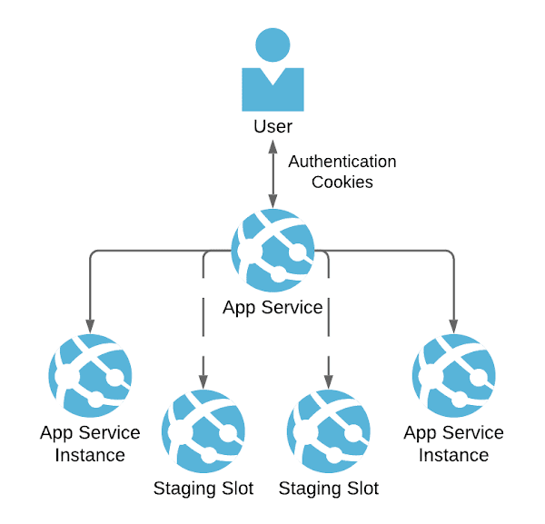
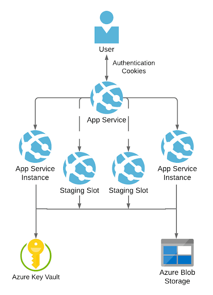

I've written lately about [zero downtime releases with Azure App Service](../2021-02-11-azure-app-service-health-checks-and-zero-downtime-deployments/index.md). Zero downtime releases are only successful if your authentication mechanism survives a new deployment. We looked in my last post at [how to achieve this with Azure's in-built authentication mechanism; Easy Auth](../2021-02-16-easy-auth-tokens-survive-releases-on-linux-azure-app-service/index.md).

<!--truncate-->

We're now going to look at how the same goal can be achieved if your ASP.NET application is authenticating another way. We achieve this through use of the [ASP.NET Data Protection](https://docs.microsoft.com/en-us/aspnet/core/security/data-protection/configuration/overview) system. Andrew Lock has written [an excellent walkthrough on the topic](https://andrewlock.net/an-introduction-to-the-data-protection-system-in-asp-net-core/) and I encourage you to read it.

We're interested in the ASP.NET data-protection system because it encrypts and decrypts sensitive data including the authentication cookie. It's wonderful that the data protection does this, but at the same time it presents a problem. We would like to route traffic to _multiple_ instances of our application… So traffic could go to instance 1, instance 2 of our app etc.



How can we ensure the different instances of our app can read the authentication cookies regardless of the instance that produced them? How can we ensure that instance 1 can read cookies produced by instance 2 and vice versa? And for that matter, we'd like all instances to be able to read cookies whether they were produced by an instance in a production or staging slot.

We're aiming to avoid the use of "sticky sessions" and ARRAffinity cookies. These ensure that traffic is continually routed to the same instance. Routing to the same instance explicitly prevents us from stopping routing traffic to an old instance and starting routing to a new one.

With the data protection activated and multiple instances of your app service you immediately face the issue that different instances of the app will be unable to read cookies they did not create. This is the default behaviour of data protection. [To quote the docs:](https://docs.microsoft.com/en-us/aspnet/core/host-and-deploy/web-farm?view=aspnetcore-5.0#data-protection)

> Data Protection relies upon a set of cryptographic keys stored in a key ring. When the Data Protection system is initialized, it applies default settings that store the key ring locally. Under the default configuration, a unique key ring is stored on each node of the web farm. Consequently, each web farm node can't decrypt data that's encrypted by an app on any other node.

The problem here is the data protection keys (the key ring) is being stored locally on each instance. What are the implications of this? Well, For example, instance 2 doesn't have access to the keys instance 1 is using and so can't decrypt instance 1 cookies.

## Sharing is caring

What we need to do is move away from storing keys locally, and to storing it in a _shared_ place instead. We're going to store data protection keys in Azure Blob Storage and protect the keys with Azure Key Vault:



All instances of the application can access the key ring and consequently sharing cookies is enabled. [As the documentation attests](https://docs.microsoft.com/en-us/aspnet/core/security/data-protection/configuration/overview?view=aspnetcore-5.0#protectkeyswithazurekeyvault), enabling this is fairly simple. It amounts to adding the following packages to your ASP.NET app:

- [`Azure.Extensions.AspNetCore.DataProtection.Blobs`](https://www.nuget.org/packages/Azure.Extensions.AspNetCore.DataProtection.Blobs)
- [`Azure.Extensions.AspNetCore.DataProtection.Keys`](https://www.nuget.org/packages/Azure.Extensions.AspNetCore.DataProtection.Keys)

And adding the following to the `ConfigureServices` in your ASP.NET app:

```cs
services.AddDataProtection().SetApplicationName("OurWebApp")
        // azure credentials require storage blob contributor role permissions
        // eg https://my-storage-account.blob.core.windows.net/keys/key
        .PersistKeysToAzureBlobStorage(new Uri($"https://{Configuration["StorageAccountName"]}.blob.core.windows.net/keys/key"), new DefaultAzureCredential())

        // azure credentials require key vault crypto role permissions
        // eg https://my-key-vault.vault.azure.net/keys/dataprotection
        .ProtectKeysWithAzureKeyVault(new Uri($"https://{Configuration["KeyVaultName"]}.vault.azure.net/keys/dataprotection"), new DefaultAzureCredential());
```

In the above example you can see we're passing the name of our Storage account and Key Vault via configuration.

There's one more crucial piece of the puzzle here; and it's role assignments, better known as permissions. Your App Service needs to be able to read and write to Azure Key Vault and the Azure Blob Storage. The permissions of [Storage Blob Data Contributor](https://docs.microsoft.com/en-us/azure/role-based-access-control/built-in-roles#storage-blob-data-contributor) and [Key Vault Crypto Officer](https://docs.microsoft.com/en-us/azure/role-based-access-control/built-in-roles#key-vault-crypto-officer-preview) are sufficient to enable this. (If you'd like to see what configuring that looks like via ARM templates then [check out this post](../2021-02-08-arm-templates-security-role-assignments/index.md).)

With this in place we're able to route traffic to any instance of our application, secure in the knowledge that it will be able to read the cookies. Furthermore, we've enabled zero downtime releases as a direct consequence.
