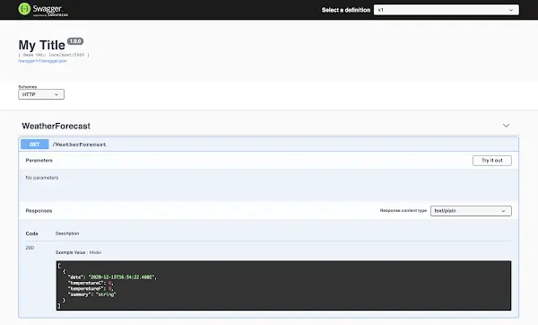

Generating clients for APIs is a tremendous way to reduce the amount of work you have to do when you're building a project. Why handwrite that code when it can be auto-generated for you quickly and accurately by a tool like [NSwag](https://github.com/RicoSuter/NSwag)? To quote the docs:

<!--truncate-->

> The NSwag project provides tools to generate OpenAPI specifications from existing ASP.NET Web API controllers and client code from these OpenAPI specifications. The project combines the functionality of Swashbuckle (OpenAPI/Swagger generation) and AutoRest (client generation) in one toolchain.

There's some great posts out there that show you how to generate the clients with NSwag using an `nswag.json` file directly from a .NET project.

However, what if you want to use NSwag purely for its client generation capabilities? You may have an API written with another language / platform that exposes a Swagger endpoint, that you simply wish to create a client for. How do you do that? Also, if you want to do some special customisation of the clients you're generating, you may find yourself struggling to configure that in `nswag.json`. In that case, it's possible to hook into NSwag directly to do this with a simple .NET console app.

This post will:

- Create a .NET API which exposes a Swagger endpoint. (Alternatively, you could use any other Swagger endpoint; [for example an Express API](https://blog.logrocket.com/documenting-your-express-api-with-swagger/).)
- Create a .NET console app which can create both TypeScript and CSharp clients from a Swagger endpoint.
- Create a script which, when run, creates a TypeScript client.
- Consume the API using the generated client in a simple TypeScript application.

You will need both [Node.js](https://nodejs.org/en/) and the [.NET SDK](https://dotnet.microsoft.com/download) installed.

## Create an API

We'll now create an API which exposes a [Swagger / Open API](https://swagger.io/resources/open-api/) endpoint. Whilst we're doing that we'll create a TypeScript React app which we'll use later on. We'll drop to the command line and enter the following commands which use the .NET SDK, node and the `create-react-app` package:

```shell
mkdir src
cd src
npx create-react-app client-app --template typescript
mkdir server-app
cd server-app
dotnet new api -o API
cd API
dotnet add package NSwag.AspNetCore
```

We now have a .NET API with a dependency on NSwag. We'll start to use it by replacing the `Startup.cs` that's been generated with the following:

```cs
using Microsoft.AspNetCore.Builder;
using Microsoft.AspNetCore.Hosting;
using Microsoft.Extensions.Configuration;
using Microsoft.Extensions.DependencyInjection;
using Microsoft.Extensions.Hosting;

namespace API
{
    public class Startup
    {
        const string ALLOW_DEVELOPMENT_CORS_ORIGINS_POLICY = "AllowDevelopmentSpecificOrigins";
        const string LOCAL_DEVELOPMENT_URL = "http://localhost:3000";

        public Startup(IConfiguration configuration)
        {
            Configuration = configuration;
        }

        public IConfiguration Configuration { get; }

        // This method gets called by the runtime. Use this method to add services to the container.
        public void ConfigureServices(IServiceCollection services)
        {

            services.AddControllers();

            services.AddCors(options => {
                options.AddPolicy(name: ALLOW_DEVELOPMENT_CORS_ORIGINS_POLICY,
                    builder => {
                        builder.WithOrigins(LOCAL_DEVELOPMENT_URL)
                            .AllowAnyMethod()
                            .AllowAnyHeader()
                            .AllowCredentials();
                    });
            });

            // Register the Swagger services
            services.AddSwaggerDocument();
        }

        // This method gets called by the runtime. Use this method to configure the HTTP request pipeline.
        public void Configure (IApplicationBuilder app, IWebHostEnvironment env)
        {
            if (env.IsDevelopment())
            {
                app.UseDeveloperExceptionPage();
            }
            else
            {
                app.UseExceptionHandler("/Error");
                app.UseHsts ();
                app.UseHttpsRedirection();
            }

            app.UseDefaultFiles();
            app.UseStaticFiles();

            app.UseRouting();

            app.UseAuthorization();

            // Register the Swagger generator and the Swagger UI middlewares
            app.UseOpenApi();
            app.UseSwaggerUi3();

            if (env.IsDevelopment())
                app.UseCors(ALLOW_DEVELOPMENT_CORS_ORIGINS_POLICY);

            app.UseEndpoints(endpoints =>
            {
                endpoints.MapControllers();
            });
        }
    }
}
```

The significant changes in the above `Startup.cs` are:

1. Exposing a Swagger endpoint with `UseOpenApi` and `UseSwaggerUi3`. NSwag will automagically create Swagger endpoints in your application for all your controllers. The .NET template ships with a `WeatherForecastController`.
2. Allowing [Cross-Origin Requests (CORS)](https://docs.microsoft.com/en-us/aspnet/core/security/cors) which is useful during development (and will facilitate a demo later).

Back in the root of our project we're going to initialise an npm project. We're going to use this to put in place a number of handy [`npm scripts`](https://docs.npmjs.com/cli/v6/using-npm/scripts) that will make our project easier to work with. So we'll `npm init` and accept all the defaults.

Now we're going add some dependencies which our scripts will use: `npm install cpx cross-env npm-run-all start-server-and-test`

We'll also add ourselves some `scripts` to our `package.json`:

```json
"scripts": {
    "postinstall": "npm run install:client-app && npm run install:server-app",
    "install:client-app": "cd src/client-app && npm install",
    "install:server-app": "cd src/server-app/API && dotnet restore",
    "build": "npm run build:client-app && npm run build:server-app",
    "build:client-app": "cd src/client-app && npm run build",
    "postbuild:client-app": "cpx \"src/client-app/build/**/*.*\" \"src/server-app/API/wwwroot/\"",
    "build:server-app": "cd src/server-app/API && dotnet build --configuration release",
    "start": "run-p start:client-app start:server-app",
    "start:client-app": "cd src/client-app && npm start",
    "start:server-app": "cross-env ASPNETCORE_URLS=http://*:5000 ASPNETCORE_ENVIRONMENT=Development dotnet watch --project src/server-app/API run --no-launch-profile"
  }
```

Let's walk through what the above scripts provide us with:

- Running `npm install` in the root of our project will not only install dependencies for our root `package.json`, thanks to our `postinstall`, `install:client-app` and `install:server-app` scripts it will install the React app and .NET app dependencies as well.
- Running `npm run build` will build our client and server apps.
- Running `npm run start` will start both our React app and our .NET app. Our React app will be started at [http://localhost:3000](http://localhost:3000). Our .NET app will be started at [http://localhost:5000](http://localhost:5000) (some environment variables are passed to it with [`cross-env`](https://github.com/kentcdodds/cross-env) ).

Once `npm run start` has been run, you will find a Swagger endpoint at [http://localhost:5000/swagger](http://localhost:5000/swagger):



## The client generator project

Now we've scaffolded our Swagger-ed API, we want to put together the console app that will generate our typed clients.

```shell
cd src/server-app
dotnet new console -o APIClientGenerator
cd APIClientGenerator
dotnet add package NSwag.CodeGeneration.CSharp
dotnet add package NSwag.CodeGeneration.TypeScript
dotnet add package NSwag.Core
```

We now have a console app with dependencies on the code generation portions of NSwag. Now let's change up `Program.cs` to make use of this:

```cs
using System;
using System.IO;
using System.Threading.Tasks;
using NJsonSchema;
using NJsonSchema.CodeGeneration.TypeScript;
using NJsonSchema.Visitors;
using NSwag;
using NSwag.CodeGeneration.CSharp;
using NSwag.CodeGeneration.TypeScript;

namespace APIClientGenerator
{
    class Program
    {
        static async Task Main(string[] args)
        {
            if (args.Length != 3)
                throw new ArgumentException("Expecting 3 arguments: URL, generatePath, language");

            var url = args[0];
            var generatePath = Path.Combine(Directory.GetCurrentDirectory(), args[1]);
            var language = args[2];

            if (language != "TypeScript" && language != "CSharp")
                throw new ArgumentException("Invalid language parameter; valid values are TypeScript and CSharp");

            if (language == "TypeScript")
                await GenerateTypeScriptClient(url, generatePath);
            else
                await GenerateCSharpClient(url, generatePath);
        }

        async static Task GenerateTypeScriptClient(string url, string generatePath) =>
            await GenerateClient(
                document: await OpenApiDocument.FromUrlAsync(url),
                generatePath: generatePath,
                generateCode: (OpenApiDocument document) =>
                {
                    var settings = new TypeScriptClientGeneratorSettings();

                    settings.TypeScriptGeneratorSettings.TypeStyle = TypeScriptTypeStyle.Interface;
                    settings.TypeScriptGeneratorSettings.TypeScriptVersion = 3.5M;
                    settings.TypeScriptGeneratorSettings.DateTimeType = TypeScriptDateTimeType.String;

                    var generator = new TypeScriptClientGenerator(document, settings);
                    var code = generator.GenerateFile();

                    return code;
                }
            );

        async static Task GenerateCSharpClient(string url, string generatePath) =>
            await GenerateClient(
                document: await OpenApiDocument.FromUrlAsync(url),
                generatePath: generatePath,
                generateCode: (OpenApiDocument document) =>
                {
                    var settings = new CSharpClientGeneratorSettings
                    {
                        UseBaseUrl = false
                    };

                    var generator = new CSharpClientGenerator(document, settings);
                    var code = generator.GenerateFile();
                    return code;
                }
            );

        private async static Task GenerateClient(OpenApiDocument document, string generatePath, Func<OpenApiDocument, string> generateCode)
        {
            Console.WriteLine($"Generating {generatePath}...");

            var code = generateCode(document);

            await System.IO.File.WriteAllTextAsync(generatePath, code);
        }
    }
}
```

We've created ourselves a simple .NET console application that creates TypeScript and CSharp clients for a given Swagger URL. It expects three arguments:

- `url` \- the url of the `swagger.json` file to generate a client for.
- `generatePath` \- the path where the generated client file should be placed, relative to this project.
- `language` \- the language of the client to generate; valid values are "TypeScript" and "CSharp".

To create a TypeScript client with it then we'd use the following command:

```shell
dotnet run --project src/server-app/APIClientGenerator http://localhost:5000/swagger/v1/swagger.json src/client-app/src/clients.ts TypeScript
```

However, for this to run successfully, we'll first have to ensure the API is running. It would be great if we had a single command we could run that would:

- bring up the API
- generate a client
- bring down the API

Let's make that.

## Building a "make a client" script

In the root of the project we're going to add the following `scripts`:

```json
"generate-client:server-app": "start-server-and-test generate-client:server-app:serve http-get://localhost:5000/swagger/v1/swagger.json generate-client:server-app:generate",
"generate-client:server-app:serve": "cross-env ASPNETCORE_URLS=http://*:5000 ASPNETCORE_ENVIRONMENT=Development dotnet run --project src/server-app/API --no-launch-profile",
"generate-client:server-app:generate": "dotnet run --project src/server-app/APIClientGenerator http://localhost:5000/swagger/v1/swagger.json src/client-app/src/clients.ts TypeScript",
```

Let's walk through what's happening here. Running `npm run generate-client:server-app` will:

- Use the [`start-server-and-test`](https://github.com/bahmutov/start-server-and-test) package to spin up our server-app by running the `generate-client:server-app:serve` script.
- `start-server-and-test` waits for the Swagger endpoint to start responding to requests. When it does start responding, `start-server-and-test` runs the `generate-client:server-app:generate` script which runs our APIClientGenerator console app and provides it with the URL where our swagger can be found, the path of the file to generate and the language of "TypeScript"

If you were wanting to generate a C# client (say if you were writing a [Blazor](https://blog.logrocket.com/js-free-frontends-blazor/) app) then you could change the `generate-client:server-app:generate` script as follows:

```json
"generate-client:server-app:generate": "dotnet run --project src/server-app/ApiClientGenerator http://localhost:5000/swagger/v1/swagger.json clients.cs CSharp",
```

## Consume our generated API client

Let's run the `npm run generate-client:server-app` command. It creates a `clients.ts` file which nestles nicely inside our `client-app`. We're going to exercise that in a moment. First of all, let's enable proxying from our `client-app` to our `server-app` following the instructions in the [Create React App docs](https://create-react-app.dev/docs/proxying-api-requests-in-development/) and adding the following to our `client-app/package.json`:

```json
"proxy": "http://localhost:5000"
```

Now let's start our apps with `npm run start`. We'll then replace the contents of `App.tsx` with:

```jsx
import React from "react";
import "./App.css";
import { WeatherForecast, WeatherForecastClient } from "./clients";

function App() {
  const [weather, setWeather] = React.useState<WeatherForecast[] | null>();
  React.useEffect(() => {
    async function loadWeather() {
      const weatherClient = new WeatherForecastClient(/* baseUrl */ "");
      const forecast = await weatherClient.get();
      setWeather(forecast);
    }
    loadWeather();
  }, [setWeather]);

  return (
    <div className="App">
      <header className="App-header">
        {weather ? (
          <table>
            <thead>
              <tr>
                <th>Date</th>
                <th>Summary</th>
                <th>Centigrade</th>
                <th>Fahrenheit</th>
              </tr>
            </thead>
            <tbody>
              {weather.map(({ date, summary, temperatureC, temperatureF }) => (
                <tr key={date}>
                  <td>{new Date(date).toLocaleDateString()}</td>
                  <td>{summary}</td>
                  <td>{temperatureC}</td>
                  <td>{temperatureF}</td>
                </tr>
              ))}
            </tbody>
          </table>
        ) : (
          <p>Loading weather...</p>
        )}
      </header>
    </div>
  );
}

export default App;
```

Inside the `React.useEffect` above you can see we create a new instance of the auto-generated `WeatherForecastClient`. We then call `weatherClient.get()` which sends the `GET` request to the server to acquire the data and provides it in a strongly typed fashion (`get()` returns an array of `WeatherForecast`). This is then displayed on the page like so:


As you an see we're loading data from the server using our auto-generated client. We're reducing the amount of code we have to write _and_ we're reducing the likelihood of errors.

This post was originally posted on [LogRocket](https://blog.logrocket.com/generate-typescript-csharp-clients-nswag-api/).

<head>
    <link rel="canonical" href="https://blog.logrocket.com/generate-typescript-csharp-clients-nswag-api/" />
</head>
