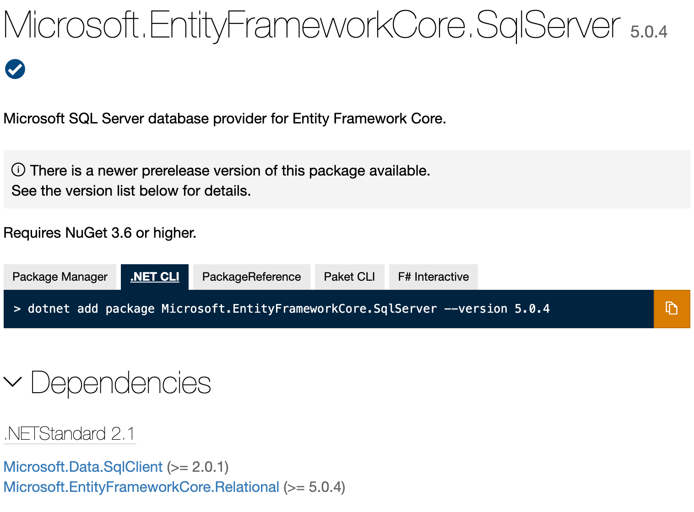
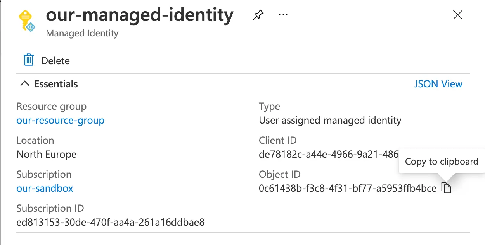

Managed Identity offers a very secure way for applications running in Azure to connect to Azure SQL databases. It's an approach that does not require code changes; merely configuration of connection string and associated resources. Hence it has a good developer experience. Importantly, it allows us to avoid exposing our database to username / password authentication, and hence making it a tougher target for bad actors.

<!--truncate-->

This post talks us through using managed identity for connecting to Azure SQL.

## `Integrated Security=true`

Everyone is deploying to the cloud. Few are the organisations that view deployment to data centers they manage as the future. This is generally a good thing, however in the excitement of the new, it's possible to forget some of the good properties that "on premise" deployment afforded when it came to connectivity and authentication.

I speak of course, of our old friend `Integrated Security=true`. When you seek to connect a web application to a database, you'll typically use some kind of database connection string. And back in the day, it may have looked something like this:

```
Data Source=myServer;Initial Catalog=myDB;Integrated Security=true;
```

The above provides a database server, a database and also `Integrated Security=true`. When you see `Integrated Security=true`, what you're essentially looking at is an instruction to use the identity that an application is running under (typically called a "service account") as the authentication credential to secure access to the database. Under the covers, this amounts to [Windows Authentication](https://docs.microsoft.com/en-us/dotnet/framework/data/adonet/sql/authentication-in-sql-server).

The significant thing about this approach is that it is more secure than using usernames and passwords in the connection string. If you have to use username and password to authenticate, then you need to persist them somewhere - so you need to make sure that's secure. Also, if someone manages to acquire that username and password, they're free to get access to the database and do malicious things.

Bottom line: the less you are sharing authentication credentials, the better your security. Integrated Security is a harder nut to crack than username and password. The thing to note about the above phrase is "Windows Authentication". Web Apps in Azure / AWS etc do not typically use Windows Authentication when it comes to connecting to the database. Connecting with username / password is far more common.

What if there was a way to have the developer experience of `Integrated Security=true` without needing to use Windows Authentication? There is.

## Managed Identity

The docs express the purpose of [managed identity](https://docs.microsoft.com/en-us/azure/active-directory/managed-identities-azure-resources/overview) well:

> A common challenge for developers is the management of secrets and credentials to secure communication between different services. On Azure, managed identities eliminate the need for developers having to manage credentials by providing an identity for the Azure resource in Azure AD and using it to obtain Azure Active Directory (Azure AD) tokens

Historically a certain amount of ceremony was required to use managed identity to connect to a database, and could involve augmenting a `DbContext` like so:

```cs
public MyDbContext(DbContextOptions options) : base(options) {
    var conn = (Microsoft.Data.SqlClient.SqlConnection)Database.GetDbConnection();
    var credential = new DefaultAzureCredential();
    var token = credential
        .GetToken(
            new Azure.Core.TokenRequestContext(new[] { "https://database.windows.net/.default" })
        );
    conn.AccessToken = token.Token;
}
```

This mechanism works, and has the tremendous upside of no longer requiring credentials be passed in a connection string. However, as you can see this isn't the simplest of setups. And also, what if you don't want to use managed identity when you're developing locally? This approach has baggage and forces us to make code changes.

## Connection String alone

The wonderful aspect of the original `Integrated Security=true` approach, was that there were no code changes required; one need only supply the connection string. Just configuration.

This is now possible with Azure SQL thanks to [this PR](https://github.com/dotnet/SqlClient/pull/730) to the [Microsoft.Data.SqlClient](https://www.nuget.org/packages/Microsoft.Data.SqlClient/) nuget package. (Incidentally, [Microsoft.Data.SqlClient is the successor to System.Data.SqlClient.](https://devblogs.microsoft.com/dotnet/introducing-the-new-microsoftdatasqlclient/))

Support for connection string managed identities [shipped with v2.1](https://github.com/dotnet/SqlClient/blob/master/release-notes/2.1/2.1.0/index.md#Azure-Active-Directory-Managed-Identity-authentication). Connection strings can look slightly different depending on the type of managed identity you're using:

```
// For System Assigned Managed Identity
"Server:{serverURL}; Authentication=Active Directory MSI; Initial Catalog={db};"

// For System Assigned Managed Identity
"Server:{serverURL}; Authentication=Active Directory Managed Identity; Initial Catalog={db};"

// For User Assigned Managed Identity
"Server:{serverURL}; Authentication=Active Directory MSI; User Id={ObjectIdOfManagedIdentity}; Initial Catalog={db};"

// For User Assigned Managed Identity
"Server:{serverURL}; Authentication=Active Directory Managed Identity; User Id={ObjectIdOfManagedIdentity}; Initial Catalog={db};"
```

Regardless of the approach, you can see that none of the connection strings have credentials in them. And that's special.

## Usage with Entity Framework Core 5

If you're using Entity Framework Core, you might be struggling to get this working and encountering strange error messages. In my ASP.NET project I had a dependendency on
[Microsoft.EntityFrameworkCore.SqlServer@5](https://www.nuget.org/packages/Microsoft.EntityFrameworkCore.SqlServer/5.0.4).



If you look close above, you'll see that the package has a dependency on Microsoft.Data.SqlClient, but crucially on 2.0.1 or greater. So if `dotnet` has installed a version of Microsoft.Data.SqlClient which is _less_ than 2.1 then the functionality required will not be installed. The resolution is simple, ensure that the required version is installed:

```
dotnet add package Microsoft.Data.SqlClient --version 2.1.2
```

The version which we want to use is 2.1 (or greater) and fortunately that is compatible with Entity Framework Core 5. Incidentally, when Entity Framework Core 6 ships it will no longer be necessary to manually specify this dependency as it already requires Microsoft.Data.SqlClient@2.1 as a minimum.

## User Assigned Managed Identity

If you're using user assigned managed identity, you'll need to supply the object id of your managed identity, which you can find in the [Azure Portal](https://portal.azure.com/):



You can configure this in ARM as well, but cryptically, the object id goes by the nom de plume of `principalId` (thanks to my partner in crime [John McCormick](https://github.com/jmccor99) for puzzling that out):

```json
"CONNECTIONSTRINGS__OURDBCONNECTION": "[concat('Server=tcp:', parameters('sqlServerName') , '.database.windows.net,1433;Initial Catalog=', parameters('sqlDatabaseName'),';Authentication=Active Directory MSI',';User Id=', reference(resourceId('Microsoft.ManagedIdentity/userAssignedIdentities/', parameters('managedIdentityName')), '2018-11-30').principalId)]"
```

That's it! With managed identity handling your authentication you can sleep easy, knowing you should be in a better place security wise.
