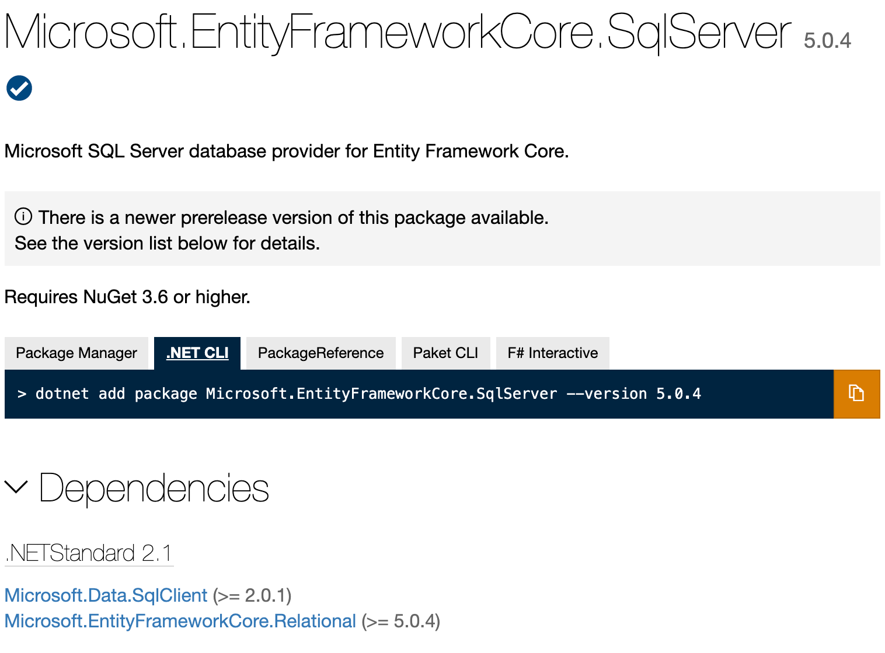
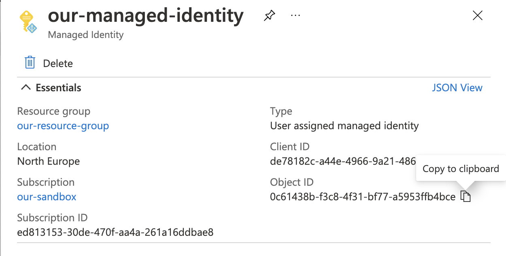

[Docusaurus](https://v2.docusaurus.io/) is, amongst other things, a Markdown powered blogging platform. My blog has lived happily on [Blogger](https://www.blogger.com/) for the past decade.  I'm considering moving, but losing my historic content as part of the move was never an option. This post goes through what it would like to move from Blogger to Docusaurus *without* losing your content.

It is imperative that the world never forgets what I was doing with jQuery in 2012.

## Blog as code

Everything is better when it's code.  Infrastructure as code. Awesome right? So naturally "blog as code" must be better than just a blog.  More seriously, [Markdown](https://en.wikipedia.org/wiki/Markdown) is a tremendous documentation format. Simple, straightforward and, like Goldilocks, "just right". For a long time I've written everything as Markdown. My years of toil down the Open Source mines have preconditioned me to be very MD-disposed.

I started out writing this blog a long time ago as pure HTML. Not the smoothest of writing formats. At some point I got into the habit of spinning up a new repo in GitHub for a new blogpost, writing it in Markdown and piping it through a variety of tools to convert it into HTML for publication on Blogger.  As time passed I felt I'd be a lot happier if I wasn't creating a repo each time. What if I did all my blogging in a single repo and used that as the code that represented my blog?

Just having that thought laid the seeds for what was to follow:
1. An investigation into importing my content from Blogger into a GitHub repo
2. An experimental port to Docusaurus
3. The automation of publication to Docusaurus and Blogger

We're going to go through 1 and 2 now.

## I want everything

The first thing was obtaining my blog content. This is a mass of HTML that lived inside Blogger's database. (I assume they have a database; I haven't actually checked.) There's a "Back up content" option inside Blogger to allow this:


It provides you with an XML file with a dispiritingly small size. Ten years blogging? You'll get change out of 4Mb it turns out. 

## From HTML in XML to Markdown

We now want to take that XML and:

- Extract each blog post (and it's associated metadata; title / tags and whatnot) 
- Convert the HTML content of each blog post from HTML to Markdown and save it as an .MD file
- Download the images used in the blogpost so they can be stored in the repo alogside

To do this we're going to whip up a smallish TypeScript console app.  Let's initialise it with the packages we're going to need:

```
yarn init
yarn add @types/axios @types/he @types/jsdom @types/node @types/showdown axios fast-xml-parser he jsdom showdown ts-node typescript
```

We're using:
- [`fast-xml-parser`](https://github.com/NaturalIntelligence/fast-xml-parser) to parse XML
- [`he`](https://github.com/mathiasbynens/he), [jsdom](https://github.com/jsdom/jsdom) and [showdown](https://github.com/showdownjs/showdown) to convert HTML to Markdown
- [`axios`](https://github.com/axios/axios) to download images
- [`typescript`](https://github.com/microsoft/TypeScript) to code in and [`ts-node`](https://github.com/TypeStrong/ts-node) to make our TypeScript Node.js console app.


```cs
public MyDbContext(DbContextOptions options) : base(options) {
    var conn = (Microsoft.Data.SqlClient.SqlConnection)Database.GetDbConnection();
    var credential = new DefaultAzureCredential();
    var token = credential
        .GetToken(
            new Azure.Core.TokenRequestContext(new[] { "https://database.windows.net/.default" })
        );
    conn.AccessToken = token.Token;
}
```

This mechanism works, and has the tremendous upside of no longer requiring credentials be passed in a connection string.  However, as you can see this isn't the simplest of setups.  And also, what if you don't want to use managed identity when you're developing locally?  This approach has baggage and forces us to make code changes.

#### Connection String alone

The wonderful aspect of the original `Integrated Security=true` approach, was that there were no code changes required; one need only supply the connection string. Just configuration.

This is now possible with Azure SQL thanks to [this PR](https://github.com/dotnet/SqlClient/pull/730) to the [Microsoft.Data.SqlClient](https://www.nuget.org/packages/Microsoft.Data.SqlClient/) nuget package. (Incidentally, [Microsoft.Data.SqlClient is the successor to System.Data.SqlClient.](https://devblogs.microsoft.com/dotnet/introducing-the-new-microsoftdatasqlclient/))

Support for connection string managed identities [shipped with v2.1](https://github.com/dotnet/SqlClient/blob/master/release-notes/2.1/2.1.0.md#Azure-Active-Directory-Managed-Identity-authentication). Connection strings can look slightly different depending on the type of managed identity you're using:

```
// For System Assigned Managed Identity
"Server:{serverURL}; Authentication=Active Directory MSI; Initial Catalog={db};"

// For System Assigned Managed Identity
"Server:{serverURL}; Authentication=Active Directory Managed Identity; Initial Catalog={db};"

// For User Assigned Managed Identity
"Server:{serverURL}; Authentication=Active Directory MSI; User Id={ObjectIdOfManagedIdentity}; Initial Catalog={db};"

// For User Assigned Managed Identity
"Server:{serverURL}; Authentication=Active Directory Managed Identity; User Id={ObjectIdOfManagedIdentity}; Initial Catalog={db};"
```

Regardless of the approach, you can see that none of the connection strings have credentials in them.  And that's special.

#### Usage with Entity Framework Core 5

If you're using Entity Framework Core, you might be struggling to get this working and encountering strange error messages.  In my ASP.NET project I had a dependendency on 
[Microsoft.EntityFrameworkCore.SqlServer@5](https://www.nuget.org/packages/Microsoft.EntityFrameworkCore.SqlServer/5.0.4).



If you look close above, you'll see that the package has a dependency on Microsoft.Data.SqlClient, but crucially on 2.0.1 or greater.  So if `dotnet` has installed a version of Microsoft.Data.SqlClient which is *less* than 2.1 then the functionality required will not be installed. The resolution is simple, ensure that the required version is installed:

```
dotnet add package Microsoft.Data.SqlClient --version 2.1.2
```

The version which we want to use is 2.1 (or greater) and fortunately that is compatible with Entity Framework Core 5.  Incidentally, when Entity Framework Core 6 ships it will no longer be necessary to manually specify this dependency as it already requires Microsoft.Data.SqlClient@2.1 as a minimum.

#### User Assigned Managed Identity

If you're using user assigned managed identity, you'll need to supply the object id of your managed identity, which you can find in the [Azure Portal](https://portal.azure.com/):



You can configure this in ARM as well, but cryptically, the object id goes by the nom de plume of `principalId` (thanks to my partner in crime [John McCormick](<https://github.com/jmccor99>) for puzzling that out):

```json
"CONNECTIONSTRINGS__OURDBCONNECTION": "[concat('Server=tcp:', parameters('sqlServerName') , '.database.windows.net,1433;Initial Catalog=', parameters('sqlDatabaseName'),';Authentication=Active Directory MSI',';User Id=', reference(resourceId('Microsoft.ManagedIdentity/userAssignedIdentities/', parameters('managedIdentityName')), '2018-11-30').principalId)]"
```

That's it! With managed identity handling your authentication you can sleep easy, knowing you should be in a better place security wise.