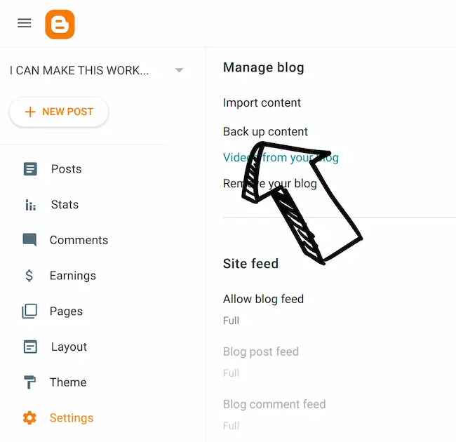
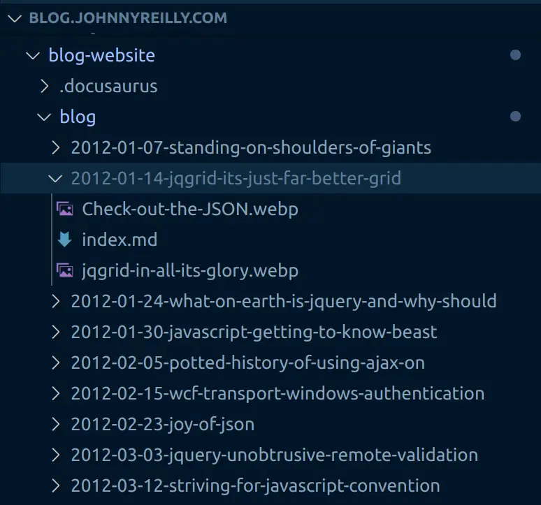
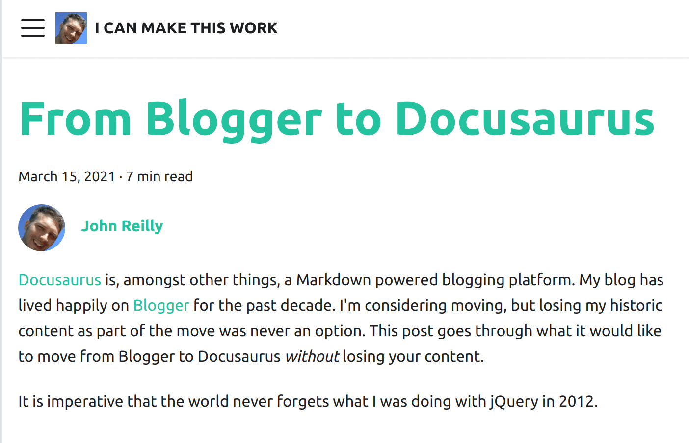
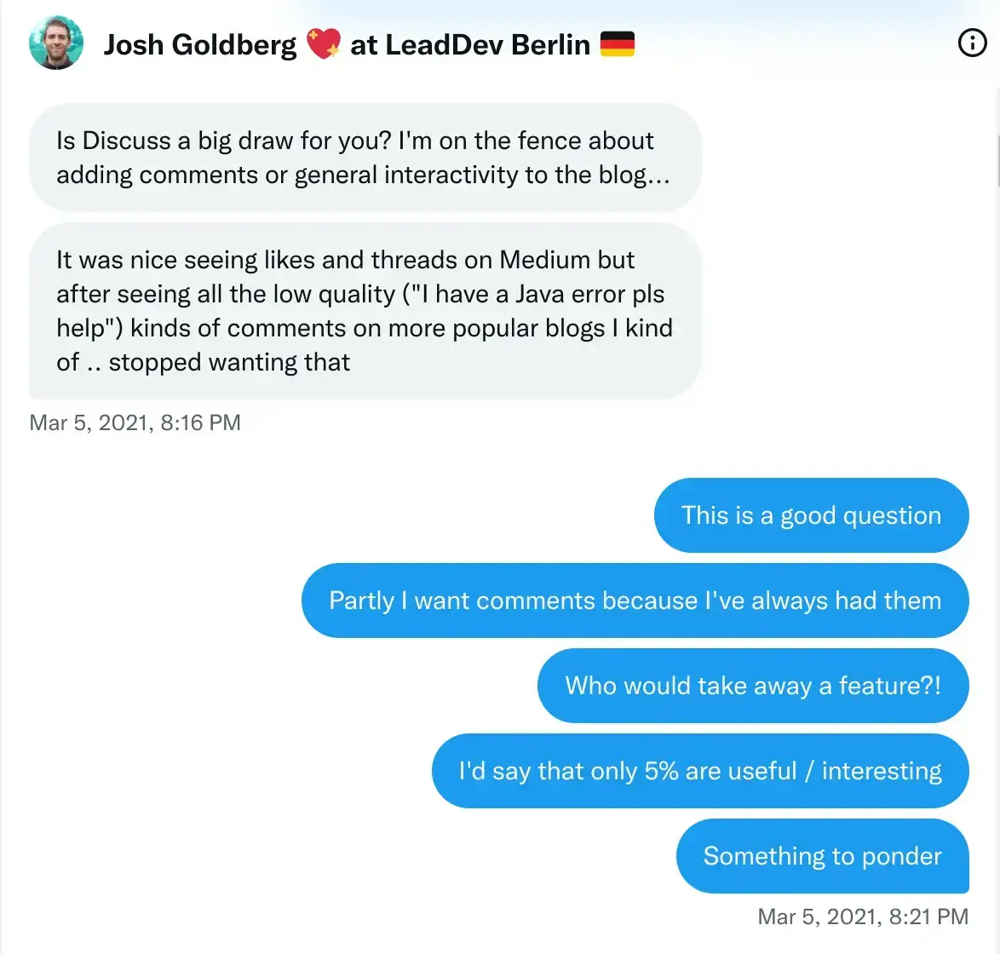
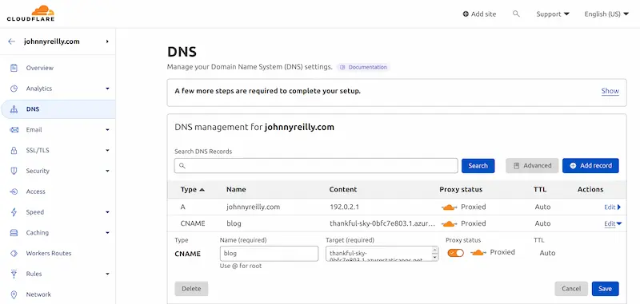
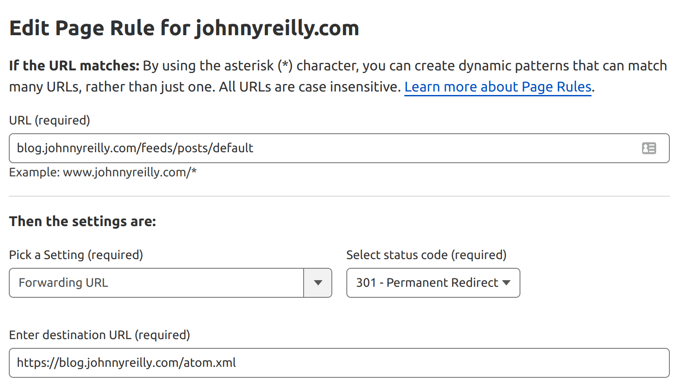

This post documents how to migrate a blog from Blogger to Docusaurus.


<!--truncate-->

## Updated 5th November 2022

This post started out as an investigation into migrating from Blogger to Docusaurus. In the end I very much made the leap, and would recommend doing so to others. I've transformed this post into a "definitive guide" on how to migrate. I intend to maintain this on an ongoing basis for the benefit of the community.

Because I rather like what I originally wrote when I was in "investigation mode", I have largely left it in place. However, there are new sections which have been added in to augment what's there.

## Introduction

[Docusaurus](https://v2.docusaurus.io/) is, amongst other things, a Markdown powered blogging platform. My blog has lived happily on [Blogger](https://www.blogger.com/) for the past decade. I'm considering moving, but losing my historic content as part of the move was never an option. This post goes through what it would look like to move from Blogger to Docusaurus _without_ losing your content.

It is imperative that the world never forgets what I was doing with jQuery in 2012.

## Blog as code

Everything is better when it's code. Infrastructure as code. Awesome right? So naturally "blog as code" must be better than just a blog. More seriously, [Markdown](https://en.wikipedia.org/wiki/Markdown) is a tremendous documentation format. Simple, straightforward and, like Goldilocks, "just right". For a long time I've written everything as Markdown. My years of toil down the Open Source mines have preconditioned me to be very MD-disposed.

I started out writing this blog a long time ago as pure HTML. Not the smoothest of writing formats. At some point I got into the habit of spinning up a new repo in GitHub for a new blogpost, writing it in Markdown and piping it through a variety of tools to convert it into HTML for publication on Blogger. As time passed I felt I'd be a lot happier if I wasn't creating a repo each time. What if I did all my blogging in a single repo and used that as the code that represented my blog?

Just having that thought laid the seeds for what was to follow:

1. An investigation into importing my content from Blogger into a GitHub repo
2. An experimental port to Docusaurus

We're going to go this now. First, let's create ourselves a Docusaurus site for our blog:

```
npx create-docusaurus@latest blog-website classic
```

This creates a standard Docusaurus site in the `blog-website` directory. In there we'll find a `docusaurus.config.js` file. There's much that can be configured here. It's worth remembering that Docusaurus is a tool for building documentation sites that also happens to feature a blog component. We're going to use it as a blog only. So we'll deactivate the docs component and configure the blog component to be the home page of our site, following the [Docusaurus documentation](https://docusaurus.io/docs/blog#blog-only-mode):

```js
module.exports = {
  // ...
  presets: [
    [
      '@docusaurus/preset-classic',
      /** @type {import('@docusaurus/preset-classic').Options} */
      ({
        docs: false, // Deactivate docs
        blog: {
          blogTitle: 'I CAN MAKE THIS WORK',
          blogDescription: 'The blog of johnnyreilly',
          blogSidebarCount: 5,
          postsPerPage: 1,
          path: './blog',
          routeBasePath: '/', // Make blog the home page
          showReadingTime: true,
          editUrl:
            'https://github.com/johnnyreilly/blog.johnnyreilly.com/edit/main/blog-website/',
        },
        theme: {
          customCss: require.resolve('./src/css/custom.css'),
        },
      }),
    ],
  ],
  // ...
};
```

## Downloading your Blogger content

In order that we can migrate, we must obtain the blog content. This is a mass of HTML that lived inside Blogger's database. (One assumes they have a database; I haven't actually checked.) There's a `Back up content` option inside Blogger's settings to allow this:



It provides you with an XML file with a dispiritingly small size. Ten years blogging? You'll get change out of 4Mb it turns out.

## From HTML in XML to Markdown

We now want to take that XML and:

- Extract each blog post (and it's associated metadata; title / tags and whatnot)
- Convert the HTML content of each blog post from HTML to Markdown, and save it as a Markdown file
- Download the images used in the blogpost so they can be stored in the repo as well

To do this we're going to whip up a smallish TypeScript console app. Let's initialise it with the packages we're going to need:

```
mkdir from-blogger-to-docusaurus
cd from-blogger-to-docusaurus
npx typescript --init
yarn init -y
yarn add @types/he@^1.1.2 @types/jsdom@^20.0.0 @types/node@^18.11.9 @types/showdown@^2.0.0 axios@^1.1.3 fast-xml-parser@^3.21.1 he@^1.2.0 jsdom@^20.0.2 showdown@^2.1.0 ts-node@^10.9.1 typescript@^4.8.4
```

We're using:

- [`fast-xml-parser`](https://github.com/NaturalIntelligence/fast-xml-parser) to parse XML
- [`he`](https://github.com/mathiasbynens/he), [`jsdom`](https://github.com/jsdom/jsdom) and [`showdown`](https://github.com/showdownjs/showdown) to convert HTML to Markdown
- [`axios`](https://github.com/axios/axios) to download images
- [`typescript`](https://github.com/microsoft/TypeScript) to code in and [`ts-node`](https://github.com/TypeStrong/ts-node) to make our TypeScript Node.js console app.

Now we have all the packages we need, it's time to write our script.

```ts
import fs from 'fs';
import path from 'path';
import showdown from 'showdown';
import he from 'he';
import jsdom from 'jsdom';
import axios from 'axios';
import fastXmlParser from 'fast-xml-parser';

const bloggerXmlPath = './blog-03-17-2021.xml';
const docusaurusDirectory = '../blog-website';
const notMarkdownable: string[] = [];

const author = 'johnnyreilly';
const author_name = 'John Reilly';
const author_url = 'https://twitter.com/johnny_reilly';
const author_image_url = 'https://johnnyreilly.com/img/profile.jpg';

async function makePostsFromXML() {
  const blogDir = path.resolve(docusaurusDirectory, 'blog');

  await deleteExistingFiles(blogDir);

  await makeAuthorsYml(blogDir);

  const posts = await getPosts();

  for (const post of posts) {
    await makePostIntoMarkDownAndDownloadImages(post);
  }
  if (notMarkdownable.length)
    console.log(
      'These blog posts could not be turned into MarkDown - go find out why!',
      notMarkdownable,
    );
}

async function deleteExistingFiles(directory: string) {
  const filesAndFolders = await fs.promises.readdir(directory);
  for (const file of filesAndFolders) {
    try {
      await fs.promises.unlink(path.join(directory, file));
    } catch (e) {
      await fs.promises.rm(path.join(directory, file), {
        recursive: true,
        force: true,
      });
    }
  }
}

/**
 * Make an authors.yml file
 *
 * johnnyreilly:
 *   name: John Reilly
 *   url: https://twitter.com/johnny_reilly
 *   image_url: https://johnnyreilly.com/img/profile.jpg
 */
async function makeAuthorsYml(directory: string) {
  const authorsYml = `${author}:
  name: ${author_name}
  url: ${author_url}
  image_url: ${author_image_url}
`;

  await fs.promises.writeFile(
    path.join(directory, 'authors.yml'),
    authorsYml,
    'utf-8',
  );
}

async function getPosts(): Promise<Post[]> {
  const xml = await fs.promises.readFile(bloggerXmlPath, 'utf-8');

  const options = {
    attributeNamePrefix: '@_',
    attrNodeName: 'attr', //default is 'false'
    textNodeName: '#text',
    ignoreAttributes: false,
    ignoreNameSpace: false,
    allowBooleanAttributes: true,
    parseNodeValue: true,
    parseAttributeValue: true,
    trimValues: true,
    cdataTagName: '__cdata', //default is 'false'
    cdataPositionChar: '\\c',
    parseTrueNumberOnly: false,
    arrayMode: true, //"strict"
    attrValueProcessor: (val: string, attrName: string) =>
      he.decode(val, { isAttributeValue: true }), //default is a=>a
    tagValueProcessor: (val: string, tagName: string) => he.decode(val), //default is a=>a
  };

  const traversalObj = fastXmlParser.getTraversalObj(xml, options);
  const blog = fastXmlParser.convertToJson(traversalObj, options);

  const postsRaw = blog.feed[0].entry.filter(
    (entry: any) =>
      entry.category.some(
        (category: any) =>
          category.attr['@_term'] ===
          'http://schemas.google.com/blogger/2008/kind#post',
      ) &&
      entry.link.some(
        (link: any) =>
          link.attr['@_href'] && link.attr['@_type'] === 'text/html',
      ) &&
      entry.published < '2021-03-07',
  );

  const posts: Post[] = postsRaw.map((entry: any) => {
    return {
      title: entry.title[0]['#text'],
      content: entry.content[0]['#text'],
      published: entry.published,
      link: entry.link.find(
        (link: any) =>
          link.attr['@_href'] && link.attr['@_type'] === 'text/html',
      )
        ? entry.link.find(
            (link: any) =>
              link.attr['@_href'] && link.attr['@_type'] === 'text/html',
          ).attr['@_href']
        : undefined,
      tags:
        Array.isArray(entry.category) &&
        entry.category.some(
          (category: any) =>
            category.attr['@_scheme'] === 'http://www.blogger.com/atom/ns#',
        )
          ? entry.category
              .filter(
                (category: any) =>
                  category.attr['@_scheme'] ===
                    'http://www.blogger.com/atom/ns#' &&
                  category.attr['@_term'] !== 'constructor',
              ) // 'constructor' will make docusaurus choke
              .map((category: any) => category.attr['@_term'])
          : [],
    };
  });

  for (const post of posts) {
    const { content, ...others } = post;
    console.log(others, content.length);
    if (!content || !others.title || !others.published)
      throw new Error('No content');
  }

  return posts.filter((post) => post.link);
}

async function makePostIntoMarkDownAndDownloadImages(post: Post) {
  const converter = new showdown.Converter({
    ghCodeBlocks: true,
  });
  const linkSections = post.link.split('/');
  const linkSlug = linkSections[linkSections.length - 1];
  const blogdirname =
    post.published.substring(0, 10) + '-' + linkSlug.replace('.html', '');

  const blogdirPath = path.resolve(docusaurusDirectory, 'blog', blogdirname);

  if (!fs.existsSync(blogdirPath)) {
    fs.mkdirSync(blogdirPath);
  }

  const contentProcessed = post.content
    // remove stray <br /> tags
    .replace(/<br\s*\/?>/gi, '\n')
    // translate <code class="lang-cs" into <code class="language-cs"> to be showdown friendly
    .replace(/code class="lang-/gi, 'code class="language-')
    // convert <!-- into <!---
    .replace(/<!--/gi, '\n<!---\n')
    .replace(/-->/gi, '\n--->\n');
  const images: string[] = [];
  const dom = new jsdom.JSDOM(contentProcessed);
  let markdown = '';
  try {
    markdown = converter
      .makeMarkdown(contentProcessed, dom.window.document)
      // bigger titles
      .replace(/#### /g, '## ')

      // <div style="width:100%;height:0;padding-bottom:56%;position:relative;"><iframe src="https://giphy.com/embed/l7JDTHpsXM26k" width="100%" height="100%" style="position:absolute" frameborder="0" class="giphy-embed" allowfullscreen=""></iframe></div>

      // The mechanism below extracts the underlying iframe
      .replace(/<div.*(<iframe.*">).*<\/div>/g, (replacer) => {
        const dom = new jsdom.JSDOM(replacer);
        const iframe = dom?.window?.document?.querySelector('iframe');
        return iframe?.outerHTML ?? '';
      })

      // The mechanism below strips class and style attributes from iframes - react hates them
      .replace(/<iframe.*<\/iframe>/g, (replacer) => {
        const dom = new jsdom.JSDOM(replacer);
        const iframe = dom?.window?.document?.querySelector('iframe');
        iframe?.removeAttribute('class');
        iframe?.removeAttribute('style');
        return iframe?.outerHTML ?? '';
      })

      // capitalise appropriately
      .replace(/frameborder/g, 'frameBorder')
      .replace(/allowfullscreen/g, 'allowFullScreen')
      .replace(/charset/g, 'charSet')

      // Deals with these:
      // [](<https://4.bp.blogspot.com/-b9-GrL0IXaY/Xmqj4GRhKXI/AAAAAAAAT5s/ZoceUInSY5EWXeCr2LkGV9Zvea8S6-mUgCPcBGAYYCw/s1600/hello_world_idb_keyval.png>)We successfully wrote something into IndexedDB, read it back and printed that value to the console. Amazing!
      .replace(
        /\[!\[null\]\(<(.*?)\].*?>\)/g,
        (match) =>
          ` + 1, match.indexOf('>'))})\n\n`,
      )

      // Blogger tends to put images in HTML that looks like this:
      // <div class="separator" style="clear: both;"><a href="https://1.bp.blogspot.com/-UwrtZigWg78/YDqN82KbjVI/AAAAAAAAZTE/Umezr1MGQicnxMMr5rQHD4xKINg9fasDACLcBGAsYHQ/s783/traffic-to-app-service.png" style="display: block; padding: 1em 0; text-align: center; "></a></div>

      // The mechanism below extracts the underlying image path and it's alt text
      .replace(
        /(<div.*>)*\w*(<a .*>)*()(<\/a>)*.*(<\/div>)*/g,
        (replacer) => {
          const div = new jsdom.JSDOM(replacer);
          const img = div?.window?.document?.querySelector('img');
          const alt = img?.getAttribute('alt') ?? '';
          const src = img?.getAttribute('src') ?? '';

          if (src) images.push(src);

          return ``;
        },
      );
  } catch (e) {
    console.log(post.link);
    console.log(e);
    notMarkdownable.push(post.link);
    return;
  }

  for (const url of images) {
    try {
      const localUrl = await downloadImage(url, blogdirPath);
      markdown = markdown.replace(url, localUrl);
    } catch (e) {
      console.error(`Failed to download ${url}`);
    }
  }

  const content = `---
title: "${post.title}"
authors: ${author}
tags: [${post.tags.join(', ')}]
hide_table_of_contents: false
---
${markdown}
`;

  await fs.promises.writeFile(
    path.resolve(docusaurusDirectory, 'blog', blogdirPath, 'index.md'),
    content,
  );
}

async function downloadImage(url: string, directory: string) {
  console.log(`Downloading ${url}`);
  const pathParts = new URL(url).pathname.split('/');
  const filename = decodeURIComponent(pathParts[pathParts.length - 1]);

  const pathTo = path.join(directory, filename);

  const writer = fs.createWriteStream(pathTo);

  const response = await axios({
    url,
    method: 'GET',
    responseType: 'stream',
  });

  response.data.pipe(writer);

  return new Promise<string>((resolve, reject) => {
    writer.on('finish', () => resolve(filename));
    writer.on('error', reject);
  });
}

interface Post {
  title: string;
  content: string;
  published: string;
  link: string;
  tags: string[];
}

// do it!
makePostsFromXML();
```

To summarise what the script does, it:

- deletes the default blog posts
- creates a new `authors.yml` file with my details in
- parses the blog XML into an array of `Post`s
- each post is then converted from HTML into Markdown, a Docusaurus header is created and prepended, then the `index.md` file is saved to the `blog-website/blog/{POST_NAME}` directory
- the images of each post are downloaded with Axios and saved to the `blog-website/blog/{POST_NAME}` directory

[To see the full code, you can find it on the GitHub repository that now represents the blog.](https://github.com/johnnyreilly/blog.johnnyreilly.com/tree/main/from-blogger-to-docusaurus)

If you're trying to do this yourself, you'll want to change some of the variable values in the script; such as the author details.

## Bringing it all together

To run the script, we add the following script to the `package.json`:

```json
  "scripts": {
    "start": "ts-node index.ts"
  },
```

And have ourselves a merry little `yarn start` to kick off the process. In a very short period of time, if you crack open the `blogs` directory of your Docusaurus site you'll see a collection of folders, Markdown files and images. These represent your blog and are ready to power Docusaurus:



I have slightly papered over some details here. For my own case I discovered that I hadn't always written perfect HTML when blogging. I had to go in and fix the HTML in a number of historic blogs and re-download, to get cleanish Markdown.

I also learned that a number of my blog's images had vanished from Blogger at some point. This makes me all the more convinced that storing your blog in a repo is a good idea. Things should not "go missing".

If we now run `yarn start` in the `blog-website` directory we can see the blog in action:



Congratulations! We're now the proud owners of a Docusaurus blog site based upon our Blogger content.

If you've got some curiously named image files you might encounter some minor issues that need fixing up. This should get you 95% the way there though. Docusaurus does a great job of telling you when there's issues.

## Redirecting from Blogger URLs to Docusaurus URLs

The final step is to redirect from the old Blogger URLs to the new Docusaurus URLs. Blogger URLs look like this: `/2019/10/definitely-typed-movie.html`. On the other hand, Docusaurus URLs look like this: [`/2019/10/08/definitely-typed-movie`](https://johnnyreilly.com/definitely-typed-the-movie).

I'll want to redirect from the former to the latter. I'll use the `@docusaurus/plugin-client-redirects` plugin to do this. Inside the `docusaurus.config.js` file, I'll add the following to the `plugins` section:

```js
module.exports = {
  // ...
  plugins: [
    // ...
    [
      'client-redirects',
      /** @type {import('@docusaurus/plugin-client-redirects').Options} */
      ({
        createRedirects: function (existingPath) {
          if (existingPath.match(urlRegex)) {
            const [, year, month, date, slug] = existingPath.split('/');
            const oldUrl = `/${year}/${month}/${slug}.html`;

            // eg redirect from /2019/10/definitely-typed-movie.html -> /2019/10/08/definitely-typed-movie
            console.log(`redirect from ${oldUrl} -> ${existingPath}`);

            return [oldUrl, `/${year}/${month}/${slug}`];
          }
        },
      }),
    ],
    // ...
  ],
};
```

The function above will be run during the build process for each URL. And consequently a client side redirect will be created to go from the landing URL to the Docusaurus URL. The `console.log` is there to help me see what's going on. I don't actually need it.

Having this in place should protect my SEO when the domain switches from Blogger to Docusaurus. Long term I shouldn't need this approach in place.

## Comments

I'd always had comments on my blog. First with Blogger's in-built functionality and then with [Disqus](https://disqus.com/). One thing that Docusaurus doesn't support by default is comments for blog posts. [There's a feature request for it here.](https://docusaurus.io/feature-requests/p/comments-in-documents-or-blogs) However, it doesn't exist right now.

For a while I considered this a dealbreaker, and wasn't planning to complete the migration. But then I had a discussion with [Josh Goldberg](https://twitter.com/JoshuaKGoldberg) as to the value of comments. Essentially that they are nice, but not essential.



I rather came to agree with the notion that comments were only slightly interesting as I looked back at the comments I'd received on my blog over the years. So I decided to go ahead _without_ comments. I remain happy with that choice, so thanks Josh!

However, if it's important to you, there are ways to support comments. One example is using [Giscus](https://giscus.app/); [here is a guide on how to integrate it](https://dipakparmar.medium.com/how-to-add-giscus-to-your-docs-site-built-with-docusaurus-d57fa7f8e2f3).

## DNS and RSS

At this point I had a repository that represented my blog. I had a Docusaurus site that represented my blog. When I ran `yarn build` I got a Docusaurus site that looked like my blog. I had a redirect mechanism in place to protect my SEO.

I was ready to make the switch.

Hosting is a choice. When I initially migrated, I made use of GitHub Pages. I also experimented with Netlify. [Finally I moved to using Azure Static Web Apps to make use of preview environments.](../2023-02-01-migrating-from-github-pages-to-azure-static-web-apps/index.md) There are many choices out there - you can pick the one that works best for you.

Once your site is up, the last stage of the migration is updating your DNS to point to the Docusaurus site. I use [Cloudflare](https://www.cloudflare.com/) to manage my domain names and so that's where I made the switch.



## RSS / Atom feeds

If you're like me, you'll want to keep your RSS feed. I didn't want to disrupting people who consumed my RSS feed as I migrated.

Happily, [Docusaurus ships with RSS / Atom in the box](https://docusaurus.io/docs/blog#feed). Even happier still, most of the feed URLs in Blogger match the same URLs in Docusaurus. There was one exception in the form of the `/feeds/posts/default` feed which is an Atom feed. Docusaurus has an `atom.xml` feed but it's not in the same place.

This isn't a significant issue as I can create a page rule in Cloudflare to redirect from the old URL (https://johnnyreilly.com/feeds/posts/default) to the new URL (https://johnnyreilly.com/atom.xml):



## Conclusion

I've migrated to Docusaurus and have been happily running there for a while now. I'm very happy with the result.

This post is intended to be a community resource that helps folk migrate from Blogger to Docusaurus. If you should find issues with the migration, please do let me know and help make this resource even better.
