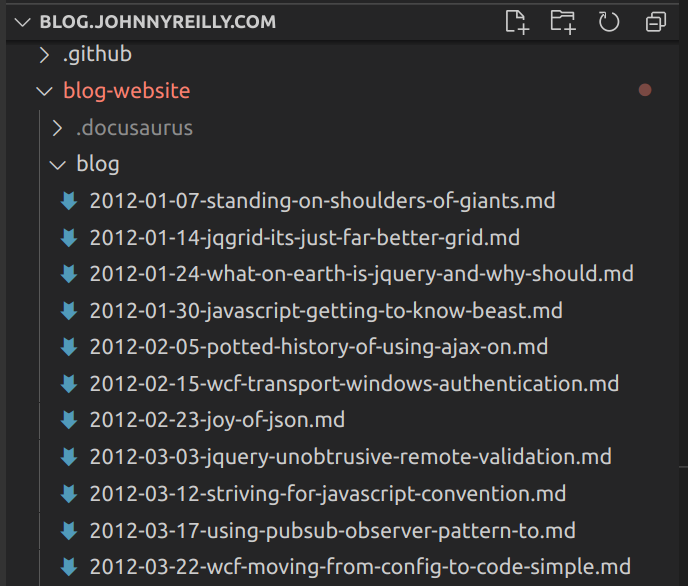
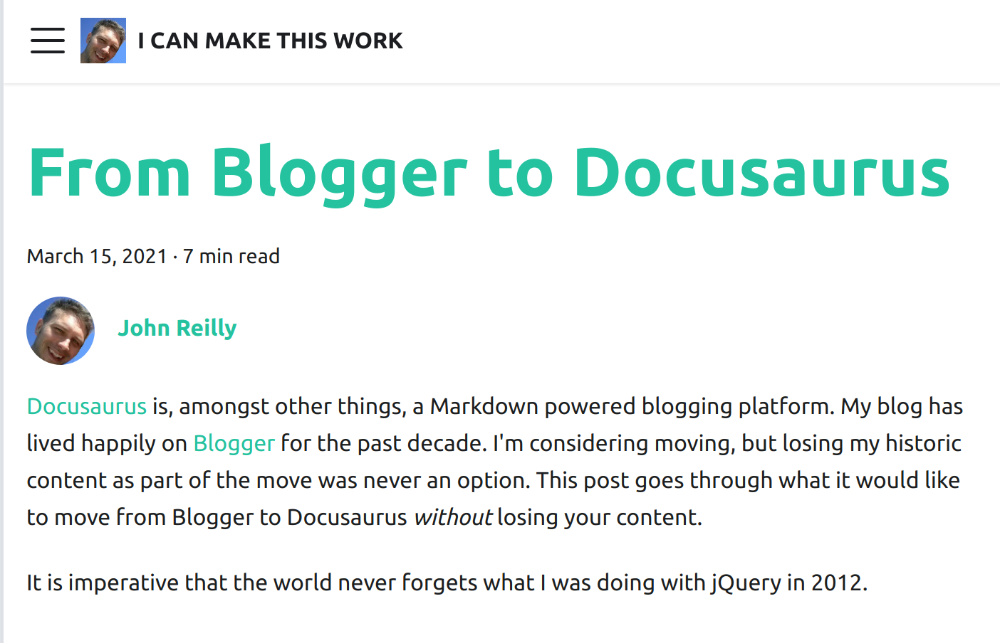

[Docusaurus](https://v2.docusaurus.io/) is, amongst other things, a Markdown powered blogging platform. My blog has lived happily on [Blogger](https://www.blogger.com/) for the past decade.  I'm considering moving, but losing my historic content as part of the move was never an option. This post goes through what it would look like to move from Blogger to Docusaurus *without* losing your content.

It is imperative that the world never forgets what I was doing with jQuery in 2012.

## Blog as code

Everything is better when it's code.  Infrastructure as code. Awesome right? So naturally "blog as code" must be better than just a blog.  More seriously, [Markdown](https://en.wikipedia.org/wiki/Markdown) is a tremendous documentation format. Simple, straightforward and, like Goldilocks, "just right". For a long time I've written everything as Markdown. My years of toil down the Open Source mines have preconditioned me to be very MD-disposed.

I started out writing this blog a long time ago as pure HTML. Not the smoothest of writing formats. At some point I got into the habit of spinning up a new repo in GitHub for a new blogpost, writing it in Markdown and piping it through a variety of tools to convert it into HTML for publication on Blogger.  As time passed I felt I'd be a lot happier if I wasn't creating a repo each time. What if I did all my blogging in a single repo and used that as the code that represented my blog?

Just having that thought laid the seeds for what was to follow:
1. An investigation into importing my content from Blogger into a GitHub repo
2. An experimental port to Docusaurus
3. The automation of publication to Docusaurus and Blogger

We're going to go through 1 and 2 now.  But before we do that, let's create ourselves a Docusaurus site for our blog:

```
npx @docusaurus/init@latest init blog-website classic
```

## I want everything

The first thing to do, was obtain my blog content. This is a mass of HTML that lived inside Blogger's database. (One assumes they have a database; I haven't actually checked.) There's a "Back up content" option inside Blogger to allow this:


It provides you with an XML file with a dispiritingly small size. Ten years blogging? You'll get change out of 4Mb it turns out. 

## From HTML in XML to Markdown

We now want to take that XML and:

- Extract each blog post (and it's associated metadata; title / tags and whatnot) 
- Convert the HTML content of each blog post from HTML to Markdown and save it as a `.md` file
- Download the images used in the blogpost so they can be stored in the repo alongside

To do this we're going to whip up a smallish TypeScript console app.  Let's initialise it with the packages we're going to need:

```
mkdir from-blogger-to-docusaurus
cd from-blogger-to-docusaurus
npx typescript --init
yarn init
yarn add @types/axios @types/he @types/jsdom @types/node @types/showdown axios fast-xml-parser he jsdom showdown ts-node typescript
```

We're using:
- [`fast-xml-parser`](https://github.com/NaturalIntelligence/fast-xml-parser) to parse XML
- [`he`](https://github.com/mathiasbynens/he), [jsdom](https://github.com/jsdom/jsdom) and [showdown](https://github.com/showdownjs/showdown) to convert HTML to Markdown
- [`axios`](https://github.com/axios/axios) to download images
- [`typescript`](https://github.com/microsoft/TypeScript) to code in and [`ts-node`](https://github.com/TypeStrong/ts-node) to make our TypeScript Node.js console app.

Now we have all the packages we need, it's time to write our script.

```ts
import fs from 'fs'
import path from 'path'
import showdown from 'showdown';
import he from 'he'
import jsdom from 'jsdom'
import axios from 'axios';
import fastXmlParser from 'fast-xml-parser';

const bloggerXmlPath = './blog-03-13-2021.xml';
const docusaurusDirectory = '../blog-website';
const notMarkdownable: string[] = [];

async function fromXmlToMarkDown() {
    const posts = await getPosts();

    for (const post of posts) {
        await makePostIntoMarkDownAndDownloadImages(post);
    }
    if (notMarkdownable.length)
        console.log('These blog posts could not be turned into MarkDown - go find out why!', notMarkdownable)
}

async function getPosts(): Promise<Post[]> {
    const xml = await fs.promises.readFile(bloggerXmlPath, 'utf-8');

    const options = {
        attributeNamePrefix: "@_",
        attrNodeName: "attr", //default is 'false'
        textNodeName: "#text",
        ignoreAttributes: false,
        ignoreNameSpace: false,
        allowBooleanAttributes: true,
        parseNodeValue: true,
        parseAttributeValue: true,
        trimValues: true,
        cdataTagName: "__cdata", //default is 'false'
        cdataPositionChar: "\\c",
        parseTrueNumberOnly: false,
        arrayMode: true, //"strict"
        attrValueProcessor: (val: string, attrName: string) => he.decode(val, { isAttributeValue: true }),//default is a=>a
        tagValueProcessor: (val: string, tagName: string) => he.decode(val), //default is a=>a
    };

    const traversalObj = fastXmlParser.getTraversalObj(xml, options);
    const blog = fastXmlParser.convertToJson(traversalObj, options);


    const postsRaw = blog.feed[0].entry
        .filter((entry: any) =>
            entry.category.some((category: any) => category.attr['@_term'] === "http://schemas.google.com/blogger/2008/kind#post") &&
            entry.link.some((link: any) => link.attr["@_href"] && link.attr["@_type"] === "text/html") &&
            entry.published < '2021-03-07'
        );

    const posts: Post[] = postsRaw.map((entry: any) => {
        return {
            title: entry.title[0]['#text'],
            content: entry.content[0]['#text'],
            published: entry.published,
            link: entry.link.find((link: any) => link.attr["@_href"] && link.attr["@_type"] === "text/html")
                ? entry.link.find((link: any) => link.attr["@_href"] && link.attr["@_type"] === "text/html").attr["@_href"]
                : undefined,
            tags: Array.isArray(entry.category) && entry.category.some((category: any) => category.attr['@_scheme'] === "http://www.blogger.com/atom/ns#")
                ? entry.category
                    .filter((category: any) => category.attr['@_scheme'] === "http://www.blogger.com/atom/ns#" && category.attr["@_term"] !== 'constructor') // 'constructor' will make docusaurus choke
                    .map((category: any) => category.attr["@_term"])
                : []
        };
    })

    for (const post of posts) {
        const { content, ...others } = post;
        console.log(others, content.length)
        if (!content || !others.title || !others.published) throw new Error("No content");
    }

    return posts.filter(post => post.link);
}

async function makePostIntoMarkDownAndDownloadImages(post: Post) {
    const converter = new showdown.Converter({
        ghCodeBlocks: true
    });
    const linkSections = post.link.split('/');
    const linkSlug = linkSections[linkSections.length - 1]
    const filename = post.published.substr(0, 10) + '-' + linkSlug.replace('.html', '.md');

    const contentProcessed = post.content
        // remove stray <br /> tags 
        .replace(/<br\s*\/?>/gi, '\n')
        // translate <code class="lang-cs" into <code class="language-cs"> to be showdown friendly
        .replace(/code class="lang-/gi, 'code class="language-');

    const images: string[] = [];
    const dom = new jsdom.JSDOM(contentProcessed);
    let markdown = "";
    try {
        markdown = converter.makeMarkdown(contentProcessed, dom.window.document)
            // bigger titles
            .replace(/#### /g, '## ')
            
            // <div style="width:100%;height:0;padding-bottom:56%;position:relative;"><iframe src="https://giphy.com/embed/l7JDTHpsXM26k" width="100%" height="100%" style="position:absolute" frameborder="0" class="giphy-embed" allowfullscreen=""></iframe></div>
            
            // The mechanism below extracts the underlying iframe
            .replace(/<div.*(<iframe.*">).*<\/div>/g, (replacer) => {
                const dom = new jsdom.JSDOM(replacer);
                const iframe = dom?.window?.document?.querySelector("iframe");
                return iframe?.outerHTML ?? '';
            })
            
            // The mechanism below strips class and style attributes from iframes - react hates them
            .replace(/<iframe.*<\/iframe>/g, (replacer) => {
                const dom = new jsdom.JSDOM(replacer);
                const iframe = dom?.window?.document?.querySelector("iframe");
                iframe?.removeAttribute('class')
                iframe?.removeAttribute('style')
                return iframe?.outerHTML ?? '';
            })
            
            // capitalise appropriately
            .replace(/frameborder/g, 'frameBorder')
            .replace(/allowfullscreen/g, 'allowFullScreen')
            .replace(/charset/g, 'charSet')

            // Blogger tends to put images in HTML that looks like this:
            // <div class="separator" style="clear: both;"><a href="https://1.bp.blogspot.com/-UwrtZigWg78/YDqN82KbjVI/AAAAAAAAZTE/Umezr1MGQicnxMMr5rQHD4xKINg9fasDACLcBGAsYHQ/s783/traffic-to-app-service.png" style="display: block; padding: 1em 0; text-align: center; "></a></div>
            
            // The mechanism below extracts the underlying image path and it's alt text
            .replace(/<div.*().*<\/div>/g, (replacer) => {
                const div = new jsdom.JSDOM(replacer);
                const img = div?.window?.document?.querySelector("img");
                const alt = img?.getAttribute('alt') ?? '';
                const src = img?.getAttribute('src') ?? '';

                if (src) images.push(src);

                return ``
            });
    }
    catch (e) {
        console.log(post.link)
        console.log(e)
        notMarkdownable.push(post.link)
        return;
    }

    const imageDirectory = filename.replace('.md', '');
    for (const url of images) {
        try {
            const localUrl = await downloadImage(url, imageDirectory);
            markdown = markdown.replace(url, '../static/blog/' + localUrl);
        } catch (e) {
            console.error(`Failed to download ${url}`)
        }
    }

    const content = `---
title: "${post.title}"
author: John Reilly
author_url: https://github.com/johnnyreilly
author_image_url: https://avatars.githubusercontent.com/u/1010525?s=400&u=294033082cfecf8ad1645b4290e362583b33094a&v=4
tags: [${post.tags.join(', ')}]
hide_table_of_contents: false
---
${markdown}
`;

    await fs.promises.writeFile(path.resolve(docusaurusDirectory, 'blog', filename), content);
}

async function downloadImage(url: string, directory: string) {
    console.log(`Downloading ${url}`);
    const pathParts = new URL(url).pathname.split('/');
    const filename = pathParts[pathParts.length - 1];
    const directoryTo = path.resolve(docusaurusDirectory, 'static', 'blog', directory);
    const pathTo = path.resolve(docusaurusDirectory, 'static', 'blog', directory, filename);

    if (!fs.existsSync(directoryTo)) {
        fs.mkdirSync(directoryTo);
    }

    const writer = fs.createWriteStream(pathTo)

    const response = await axios({
        url,
        method: 'GET',
        responseType: 'stream'
    })

    response.data.pipe(writer)

    return new Promise<string>((resolve, reject) => {
        writer.on('finish', () => resolve(directory + '/' + filename))
        writer.on('error', reject)
    })
}


interface Post { 
    title: string;
    content: string;
    published: string;
    link: string;
    tags: string[];
}

// do it!
fromXmlToMarkDown();
```

To summarise what the script does, it:

- parses the blog XML into an array of `Post`s
- each post is then converted from HTML into Markdown, a Docusaurus header is created and prepended, then the file is saved to the `blog-website/blog` directory
- the images of each post are downloaded with Axios and saved to the `blog-website/static/blog/{POST NAME}` directory

## Bringing it all together

To run the script, we add the following script to the `package.json`:

```
  "scripts": {
    "start": "ts-node index.ts"
  },
```

And have ourselves a merry little `yarn start` to kick off the process. In a very short period of time, if you crack open the `blogs` directory of your Docusaurus site you'll see a collection of Markdown files which represent your blog and are ready to power Docusaurus:



I have slightly papered over some details here.  For my own case I discovered that I hadn't always written perfect HTML when blogging. I had to go in and fix the HTML in a number of historic blogs such that the mechanism would work. I also learned that a number of my screenshots that I use to illustrate posts have vanished from Blogger at some point.  This makes me all the more convinced that storing your blog in a repo is a good idea.  Things should not "go missing".

Congratulations! We're now the proud owners of a Docusaurus blog site based upon our Blogger content that looks something like this: 



## Making the move?

Now that I've got the content, I'm theoretically safe to migrate from Blogger to Docusaurus.  I'm pondering this now and I have come up with a checklist of criteria to satisfy before I do.  You can have a read of the [criteria here](https://github.com/johnnyreilly/blog.johnnyreilly.com#migrating-to-docusauras).

Odds are, I'm likely to make the move; it's probably just a matter of time.