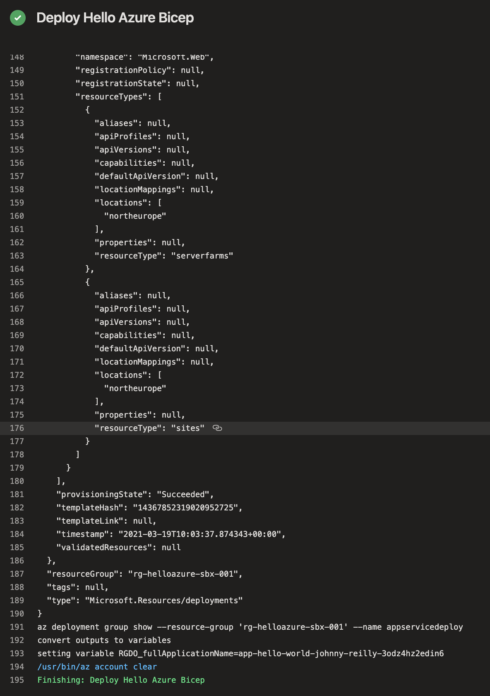

[Bicep](https://github.com/Azure/bicep) is a terser and more readable alternative language to ARM templates. Running ARM templates in Azure Pipelines is straightforward. However, there isn't yet a first class experience for running Bicep in Azure Pipelines. This post demonstrates an approach that can be used until a Bicep task is available.


<!--truncate-->

## Bicep: mostly ARMless

If you've been working with Azure and infrastructure as code, you'll likely have encountered [ARM templates](https://docs.microsoft.com/en-us/azure/azure-resource-manager/templates/overview). They're a domain specific language that lives inside JSON, used to define the infrastructure that is deployed to Azure; App Services, Key Vaults and the like.

ARM templates are quite verbose and not the easiest thing to read. This is a consequence of being effectively a language nestled inside another language. Bicep is an alternative language which is far more readable. Bicep transpiles down to ARM templates, in the same way that TypeScript transpiles down to JavaScript.

Bicep is quite new, but already it enjoys feature parity with ARM templates (as of [v0.3](https://github.com/Azure/bicep/releases/tag/v0.3.1)) and ships as part of the [Azure CLI](https://github.com/MicrosoftDocs/azure-docs-cli/blob/master/docs-ref-conceptual/release-notes-azure-cli/index.md#arm-1). However, as Bicep is new, it doesn't yet have a dedicated Azure Pipelines task for deployment. This should exist in future, perhaps as soon as the [v0.4 release](https://github.com/Azure/bicep/issues/1341). In the meantime there's an alternative way to achieve this which we'll go through.

## App Service with Bicep

Let's take a simple Bicep file, `azuredeploy.bicep`, which is designed to deploy an App Service resource to Azure. It looks like this:

```bicep
@description('Tags that our resources need')
param tags object = {
  costCenter: 'todo: replace'
  environment: 'todo: replace'
  application: 'todo: replace with app name'
  description: 'todo: replace'
  managedBy: 'ARM'
}

@minLength(2)
@description('Base name of the resource such as web app name and app service plan')
param applicationName string

@description('Location for all resources.')
param location string = resourceGroup().location

@description('The SKU of App Service Plan')
param sku string

var appServicePlanName_var = 'plan-${applicationName}-${tags.environment}'
var linuxFxVersion = 'DOTNETCORE|5.0'
var fullApplicationName_var = 'app-${applicationName}-${uniqueString(applicationName)}'

resource appServicePlanName 'Microsoft.Web/serverfarms@2019-08-01' = {
  name: appServicePlanName_var
  location: location
  sku: {
    name: sku
  }
  kind: 'linux'
  tags: {
    CostCenter: tags.costCenter
    Environment: tags.environment
    Description: tags.description
    ManagedBy: tags.managedBy
  }
  properties: {
    reserved: true
  }
}

resource fullApplicationName 'Microsoft.Web/sites@2018-11-01' = {
  name: fullApplicationName_var
  location: location
  kind: 'app'
  tags: {
    CostCenter: tags.costCenter
    Environment: tags.environment
    Description: tags.description
    ManagedBy: tags.managedBy
  }
  properties: {
    serverFarmId: appServicePlanName.id
    clientAffinityEnabled: true
    siteConfig: {
      appSettings: []
      linuxFxVersion: linuxFxVersion
      alwaysOn: false
      ftpsState: 'Disabled'
      http20Enabled: true
      minTlsVersion: '1.2'
      remoteDebuggingEnabled: false
    }
    httpsOnly: true
  }
  identity: {
    type: 'SystemAssigned'
  }
}

output fullApplicationName string = fullApplicationName_var
```

When transpiled down to an ARM template, this Bicep file more than doubles in size:

- `azuredeploy.bicep` - 1782 bytes
- `azuredeploy.json` - 3863 bytes

This tells you something of the advantage of Bicep. The template comes with an associated `azuredeploy.parameters.json` file:

```json
{
  "$schema": "https://schema.management.azure.com/schemas/2019-04-01/deploymentParameters.json#",
  "contentVersion": "1.0.0.0",
  "parameters": {
    "tags": {
      "value": {
        "costCenter": "8888",
        "environment": "stg",
        "application": "hello-azure",
        "description": "App Service for hello-azure",
        "managedBy": "ARM"
      }
    },
    "sku": {
      "value": "B1"
    }
  }
}
```

It's worth remembering that you can use the same parameters files with Bicep that you can use with ARM templates. This is great for minimising friction when it comes to migrating.

## Bicep in `azure-pipelines.yml`

Now we have our Bicep file, we want to execute it from the context of an Azure Pipeline. If we were working directly with the ARM template we'd likely have something like this in place:

```yml
- task: AzureResourceManagerTemplateDeployment@3
  displayName: 'Deploy Hello Azure ARM'
  inputs:
    azureResourceManagerConnection: '$(azureSubscription)'
    action: Create Or Update Resource Group
    resourceGroupName: '$(resourceGroupName)'
    location: 'North Europe'
    templateLocation: Linked artifact
    csmFile: 'infra/app-service/azuredeploy.json'
    csmParametersFile: 'infra/app-service/azuredeploy.parameters.json'
    deploymentMode: Incremental
    deploymentOutputs: resourceGroupDeploymentOutputs
    overrideParameters: -applicationName $(Build.Repository.Name)

- pwsh: |
    $outputs = ConvertFrom-Json '$(resourceGroupDeploymentOutputs)'
    foreach ($output in $outputs.PSObject.Properties) {
        Write-Host "##vso[task.setvariable variable=RGDO_$($output.Name)]$($output.Value.value)"
    }
  displayName: 'Turn ARM outputs into variables'
```

There's two tasks above. The first is the native task for ARM deployments which takes our ARM template and our parameters and deploys them. The second task takes the output variables from the first task and converts them into Azure Pipeline variables such that they can be referenced later in the pipeline. In this case this variablifies our `fullApplicationName` output.

There is, as yet, no `BicepTemplateDeployment@1`. [Though it's coming](https://github.com/Azure/bicep/issues/1341). In the meantime, the marvellous [Alex Frankel](https://twitter.com/adotfrank) [advised](https://github.com/Azure/bicep/issues/1341#issuecomment-802010110):

> I'd recommend using the [Azure CLI task](https://docs.microsoft.com/azure/devops/pipelines/tasks/deploy/azure-cli?view=azure-devops) to deploy. As long as that task is updated to Az CLI version 2.20 or later, it will automatically install the bicep CLI when calling `az deployment group create -f main.bicep`.

Let's give it a go!

```yml
- task: AzureCLI@2
  displayName: 'Deploy Hello Azure Bicep'
  inputs:
    azureSubscription: '$(azureSubscription)'
    scriptType: bash
    scriptLocation: inlineScript
    inlineScript: |
      az --version

      echo "az deployment group create --resource-group '$(resourceGroupName)' --name appservicedeploy"
      az deployment group create --resource-group '$(resourceGroupName)' --name appservicedeploy \
        --template-file infra/app-service/azuredeploy.bicep \
        --parameters infra/app-service/azuredeploy.parameters.json \
        --parameters applicationName='$(Build.Repository.Name)'

      echo "az deployment group show --resource-group '$(resourceGroupName)' --name appservicedeploy"
      deploymentoutputs=$(az deployment group show --resource-group '$(resourceGroupName)' --name appservicedeploy \
        --query properties.outputs)

      echo 'convert outputs to variables'
      echo $deploymentoutputs | jq -c '. | to_entries[] | [.key, .value.value]' |
        while IFS=$"\n" read -r c; do
          outputname=$(echo "$c" | jq -r '.[0]')
          outputvalue=$(echo "$c" | jq -r '.[1]')
          echo "setting variable RGDO_$outputname=$outputvalue"
          echo "##vso[task.setvariable variable=RGDO_$outputname]$outputvalue"
        done
```

The above is just a single Azure CLI task (as advised). It invokes `az deployment group create` passing the relevant parameters. It then acquires the output properties using `az deployment group show`. Finally it once again converts these outputs to Azure Pipeline variables with some [`jq`](https://stedolan.github.io/jq/) smarts.

This works right now, and running it results in something like the output below. So if you're excited about Bicep and don't want to wait for 0.4 to start moving on this, then this can get you going. To track the progress of the custom task, [keep an eye on this issue](https://github.com/Azure/bicep/issues/1341).



## Update: an even simpler alternative

There is even a simpler way to do this which I discovered subsequent to writing this. [Have a read](../2021-03-23-bicep-meet-azure-pipelines-2/index.md).
