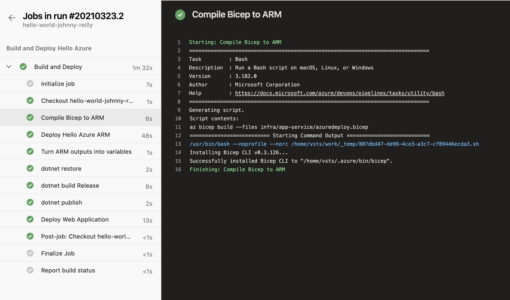

[Last time](./2021-03-20-bicep-meet-azure-pipelines.md) I wrote about how to use the Azure CLI to run Bicep within the context of an Azure Pipeline. The solution was relatively straightforward, and involved using `az deployment group create` in a task. There's an easier way.


## The easier way

The target reader of the previous post was someone who was already using `AzureResourceManagerTemplateDeployment@3` in an Azure Pipeline to deploy an ARM template. Rather than replacing your existing `AzureResourceManagerTemplateDeployment@3` tasks, all you need do is insert a prior `bash` step that compiles the Bicep to ARM, which your existing template can then process. It looks like this:

```yml
        - bash: az bicep build --files infra/app-service/azuredeploy.bicep
          displayName: "Compile Bicep to ARM"
```

This will take your Bicep template of `azuredeploy.bicep`, transpile it into an ARM template named `azuredeploy.json` which a subsequent `AzureResourceManagerTemplateDeployment@3` task can process. Since this is just exercising the Azure CLI, using `bash` is not required; powershell etc would also be fine; it's just required that the Azure CLI is available in a pipeline.

In fact this simple task could even be a one-liner if you didn't fancy using the `displayName`. (Though I say keep it; optimising for readability is generally a good shout.) A full pipeline could look like this:

```yml
        - bash: az bicep build --files infra/app-service/azuredeploy.bicep
          displayName: "Compile Bicep to ARM"

        - task: AzureResourceManagerTemplateDeployment@3
          displayName: "Deploy Hello Azure ARM"
          inputs:
            azureResourceManagerConnection: '$(azureSubscription)'
            action: Create Or Update Resource Group
            resourceGroupName: '$(resourceGroupName)'
            location: 'North Europe'
            templateLocation: Linked artifact
            csmFile: 'infra/app-service/azuredeploy.json' # created by bash script
            csmParametersFile: 'infra/app-service/azuredeploy.parameters.json'
            deploymentMode: Incremental
            deploymentOutputs: resourceGroupDeploymentOutputs
            overrideParameters: -applicationName $(Build.Repository.Name)

        - pwsh: |
            $outputs = ConvertFrom-Json '$(resourceGroupDeploymentOutputs)'
            foreach ($output in $outputs.PSObject.Properties) {
                Write-Host "##vso[task.setvariable variable=RGDO_$($output.Name)]$($output.Value.value)"
            }
          displayName: "Turn ARM outputs into variables"
```

And when it's run, it may result in something along these lines:



So if you want to get using Bicep right now with minimal effort, this an on ramp that could work for you! Props to [Jamie McCrindle](https://twitter.com/foldr) for suggesting this.
