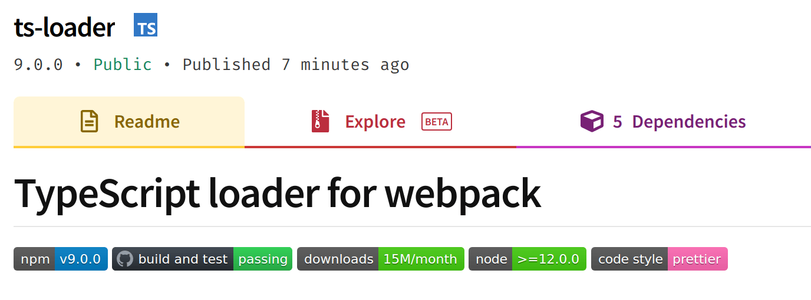

`ts-loader` has just released [v9.0.0](https://github.com/TypeStrong/ts-loader/releases/tag/v9.0.0). This post goes through what this release is all about, and what it took to ship this version. For intrigue, it includes a brief scamper into my mental health along the way. Some upgrades go smoothly - this one had some hiccups. But we'll get into that.



<!--truncate-->

## One big pull request

As of v8, `ts-loader` supported webpack 4 and webpack 5. However the webpack 5 support was best efforts, and not protected by any automated tests. `ts-loader` has two test packs:

1. A [comparison test pack](https://github.com/TypeStrong/ts-loader/tree/main/test/comparison-tests#readme) that compares transpilation and webpack compilation output with known outputs.
2. An [execution test pack](https://github.com/TypeStrong/ts-loader/tree/main/test/execution-tests#readme) that executes Karma test packs written in TypeScript using `ts-loader`.

The test packs were tightly coupled to webpack 4 (and in the case of the comparison test pack, that's unavoidable). The mission was to port `ts-loader` to be built against (and have an automated test pack that ran against) webpack 5.

This ended up being a [very big pull request](https://github.com/TypeStrong/ts-loader/pull/1251). Work on it started back in February 2021 and we're shipping now in April of 2021. I'd initially expected it would take a couple of days at most. I had underestimated.

A number of people collaborated on this PR, either with code, feedback, testing or even just responding to questions. So I'd like to say thank you to:

- [John Wallsten](https://github.com/JonWallsten) - who did a lot of the work swapping `ts-loader` over to webpack 5 APIs
- [Nick Excell](https://github.com/appzuka)
- [Andrew Branch](https://github.com/andrewbranch)
- [Alexander Akait](https://github.com/alexander-akait) - who provided webpack 5 expertise and ideas
- [Tobias Koppers](https://github.com/sokra) - who got me out of a hole - more on that later

## What's changed

Let's go through what's different in v9. There's two breaking changes:

- The minimum webpack version supported is now webpack 5. This simplifies the codebase, which previously had to if/else the various API registrations based on the version of webpack being used.
- The minimum node version supported is now node 12. [Node 10 reaches end of life status at the end of April 2021.](https://nodejs.org/en/about/releases/)

An interesting aspect of migrating to building against webpack 5 was dropping the dependency upon [`@types/webpack`](https://www.npmjs.com/package/@types/webpack) in favour of the types that now ship with webpack 5 itself. This was a mostly great experience; however we discovered some missing pieces.

Most notably, the `LoaderContext` [wasn't strongly typed](https://github.com/webpack/webpack/blob/03961f33912ab6735d470b870eacff678735a9ed/lib/NormalModule.js#L424). `LoaderContext` is the value of `this` in the context of a running loader function. So it is probably the most interesting and important type from the perspective of a loader author.

Historically we used our own definition which had been adapted from the one in `@types/webpack`. [I've looked into the possibility of a type being exposed in webpack itself.](https://github.com/webpack/webpack/issues/13162) However, it turns out, [it's complicated - with the `LoaderContext` type being effectively created across two packages](https://github.com/webpack/webpack/pull/13164#issuecomment-821410359). The type is initially created in `webpack` and then augmented later in `loader-runner`, prior to being supplied to loaders. You can read more on that [here](https://github.com/webpack/webpack/pull/13164#issuecomment-821410359).

For now we've opted to stick with keeping [an interface in `ts-loader`](https://github.com/TypeStrong/ts-loader/pull/1251/commits/acbc71feed91fe14ec065dd9d31081af7a492f47) that models what arrives in the loader when executed. We have freshened it up somewhat, to model the webpack 5 world.

Alongside these changes, a [number of dependencies were upgraded](https://github.com/TypeStrong/ts-loader/pull/1251/files#diff-7ae45ad102eab3b6d7e7896acd08c427a9b25b346470d7bc6507b6481575d519).

## The hole

By the 19th of February most of the work was done. However, [we were experiencing different behaviour between Linux and Windows in our comparison test pack](https://github.com/TypeStrong/ts-loader/pull/1251#issuecomment-781967959).

As far as I was aware, we were doing all the appropriate work to ensure `ts-loader` and our test packs worked cross platform. But we were still experiencing problems whenever we ran the test pack on Windows. I'd done no end of tweaking but nothing worked. I couldn't explain it. I couldn't fix it. I was finding that tough to deal with.

I really want to be transparent about the warts and all aspect of open source software development. It is like all other types of software development; sometimes things go wrong and it can be tough to work out why. Right then, I was really quite unhappy. Things weren't working code-wise and I was at a loss to say why. This is not something that I dig.

I also wasn't sleeping amazingly at this point. It was winter and we'd been in lockdown in the UK for three months; as the COVID-19 pandemic ground relentlessly on. I love my family dearly. I really do. With that said, having my children around whilst I attempted to work was remarkably tough. I love those guys but, woah, was it stressful.

I was feeling at a low ebb. And I wasn't sure what to do next. So, feeling tired and pretty fed up, I took a break.

## "Anybody down there?"

Time passed. In March [Alexander Akait](https://github.com/alexander-akait) checked in to see how things were going and volunteered to help. He also [suggested what turned out to be the fix](https://github.com/TypeStrong/ts-loader/pull/1251#issuecomment-799531375); namely replacing usage of `'\'` with `'/'` in the assets supplied back to webpack. But crucially I implemented this wrong. Observe [this commit](https://github.com/TypeStrong/ts-loader/pull/1251/commits/4bcc5c9623acfd7ffbaf028781a8353b37243804):

```ts
const assetPath = path
  .relative(compilation.compiler.outputPath, outputFile.name)
  // According to @alexander-akait we should always '/' https://github.com/TypeStrong/ts-loader/pull/1251#issuecomment-799606985
  .replace(/\//g, '/');
```

If you look closely at the `replace` you'll see that I'm globally replacing `'/'` with `'/'` _rather_ than globally replacing `'\'` with `'/'`. The wasted time this caused... I could weep.

I generally thrashed around for a bit after this. Going in circles, like a six year old swimming wearing one armband. Then [Tobias kindly volunteered to help](https://github.com/TypeStrong/ts-loader/pull/1251#issuecomment-805143890). This much I've learned from a career in software: if talented people offer their assistance, grab it with both hands!

I'd been trying be as "learn in public" as possible about the issues I was facing on the pull request. The idea being, to surface the problems in a public forum where others can read and advise. And also to attempt a textual kind of [rubber duck debugging](https://en.wikipedia.org/wiki/Rubber_duck_debugging).

When Tobias pitched in, I wanted to make it as easy as possible for him to help. So I wrote up [a full description of what had changed](https://github.com/TypeStrong/ts-loader/pull/1251#issuecomment-805181069). What the divergent behaviour in test packs looked like. I shared my speculation for what might be causing the issue (I was wrong by the way). Finally I provided a simple way to get up and running with the broken code. The easier I could make it for others to collaborate on this, I figured, the greater the likelihood of an answer. Tobias got to an answer quickly:

> The problem is introduced due to some normalization logic in the test case: see [#1273](https://github.com/TypeStrong/ts-loader/pull/1273)
>
> While the PR fixes the problem, I think the paths should be normalized earlier in the pipeline to make this normalization code unnecessary. Note that asset names should have only `/` as they are filenames and not paths. Only absolute paths have `\`.

Tobias had raised a PR which introduced a workaround to resolved things in the test pack. This made me happy. More than that, he also identified that the issue lay in `ts-loader` itself. This caused me to look again at the changes I'd made, including my `replace` addition. [With fresh eyes, I now realised this was a bug](https://github.com/TypeStrong/ts-loader/pull/1251#issuecomment-805907212), and [fixed](https://github.com/TypeStrong/ts-loader/pull/1251/commits/427714e43519289bb5745ca078133d1ace8fc2c1) it.

I found then that I could revert Tobias' workaround and still have passing tests. Result!

## Release details

Now that we've got there; we've shipped. You can get the latest version of `ts-loader` on [npm](https://www.npmjs.com/package/ts-loader/v/9.0.0) and you can find the release details on [GitHub](https://github.com/TypeStrong/ts-loader/releases/tag/v9.0.0).

Thanks everyone - I couldn't have done it without your help. 🌻❤️
