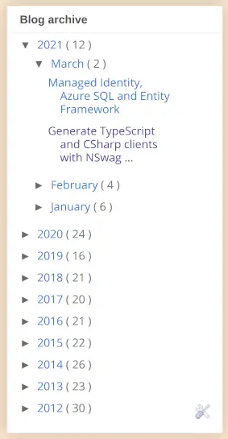

Docusaurus doesn't ship with "blog archive" functionality. By which I mean, something that allows you to look at an overview of your historic blog posts. It turns out it is fairly straightforward to implement your own. This post does just that.


## Updated 2021-09-01

As of [v2.0.0-beta.6](https://github.com/facebook/docusaurus/releases/tag/v2.0.0-beta.6), Docusauras _does_ ship with blog archive functionality that lives at the `archive` route. This is down to the work of [Gabriel Csapo](https://github.com/gabrielcsapo) in [this PR](https://github.com/facebook/docusaurus/pull/5428).

If you'd like to know how to build your own, read on... But you may not need to!

<!--truncate-->

## Blogger's blog archive

I recently went through the exercise of [migrating my blog from Blogger to Docusaurus](../2021-03-15-definitive-guide-to-migrating-from-blogger-to-docusaurus/index.md). I found that [Docusaurus](https://docusaurus.io/) was a tremendous platform upon which to build a blog, but it was missing a feature from Blogger that I valued highly; the blog archive:



The blog archive is a way by which you can browse through your historic blog posts. A place where you can see all that you've written and when. I find this very helpful. I didn't really want to make the jump without having something like that around.

## Handrolling a Docusaurus blog archive

Let's create our own blog archive in the land of the Docusaurus.

We'll create a new page under the `pages` directory called `blog-archive.js` and we'll add a link to it in our `docusaurus.config.js`:

```json
    navbar: {
      // ...
      items: [
        // ...
        { to: "blog-archive", label: "Blog Archive", position: "left" },
        // ...
      ],
    },
```

## Obtaining the blog data

This page will be powered by webpack's [`require.context`](https://webpack.js.org/guides/dependency-management/#requirecontext) function. `require.context` allows us to use webpack to obtain all of the blog modules:

```js
require.context('../../blog', false, //index.md/);
```

The code snippet above looks in the `blog` directory for files / modules ending with the suffix `"/index.md"`. Each one of these represents a blog post. The function returns a `context` object, which contains all of the data about these modules.

By reducing over that data we can construct an array of objects called `allPosts` that could drive a blog archive screen. Let's do this below, and we'll use [TypeScripts JSDoc support](https://www.typescriptlang.org/docs/handbook/jsdoc-supported-types.html) to type our JavaScript:

```tsx
/**
 * @typedef {Object} BlogPost - creates a new type named 'BlogPost'
 * @property {string} date - eg "2021-04-24T00:00:00.000Z"
 * @property {string} formattedDate - eg "April 24, 2021"
 * @property {string} title - eg "The Service Now API and TypeScript Conditional Types"
 * @property {string} permalink - eg "/2021/04/24/service-now-api-and-typescript-conditional-types"
 */

/** @type {BlogPost[]} */
const allPosts = ((ctx) => {
  /** @type {string[]} */
  const blogpostNames = ctx.keys();

  return blogpostNames.reduce(
    (blogposts, blogpostName, i) => {
      const module = ctx(blogpostName);
      const { date, formattedDate, title, permalink } = module.metadata;
      return [
        ...blogposts,
        {
          date,
          formattedDate,
          title,
          permalink,
        },
      ];
    },
    /** @type {string[]}>} */ [],
  );
})(require.context('../../blog', true, /index.md/));
```

Observe the `metadata` property in the screenshot below:


This gives us a flavour of the data available in the modules and shows how we pull out the bits that we need; `date`, `formattedDate`, `title` and `permalink`.

## Presenting it

Now we have our data in the form of `allPosts`, let's display it. We'd like to break it up into posts by year, which we can do by reducing and looking at the `date` property which is an ISO-8601 style date string taking a format that begins `yyyy-mm-dd`:

```tsx
const postsByYear = allPosts.reduceRight((posts, post) => {
  const year = post.date.split('-')[0];
  const yearPosts = posts.get(year) || [];
  return posts.set(year, [post, ...yearPosts]);
}, /** @type {Map<string, BlogPost[]>} */ new Map());

const yearsOfPosts = Array.from(postsByYear, ([year, posts]) => ({
  year,
  posts,
}));
```

Now we're ready to blast it onto the screen. We'll create two components:

- `Year` - which is a list of the posts for a given year and
- `BlogArchive` - which is the overall page and maps over `yearsOfPosts` to render `Year`s

```tsx
function Year(
  /** @type {{ year: string; posts: BlogPost[]; }} */ { year, posts },
) {
  return (
    <div className={clsx('col col--4', styles.feature)}>
      <h3>{year}</h3>
      <ul>
        {posts.map((post) => (
          <li key={post.date}>
            <Link to={post.permalink}>
              {post.formattedDate} - {post.title}
            </Link>
          </li>
        ))}
      </ul>
    </div>
  );
}

function BlogArchive() {
  return (
    <Layout title="Blog Archive">
      <header className={clsx('hero hero--primary', styles.heroBanner)}>
        <div className="container">
          <h1 className="hero__title">Blog Archive</h1>
          <p className="hero__subtitle">Historic posts</p>
        </div>
      </header>
      <main>
        {yearsOfPosts && yearsOfPosts.length > 0 && (
          <section className={styles.features}>
            <div className="container">
              <div className="row">
                {yearsOfPosts.map((props, idx) => (
                  <Year key={idx} {...props} />
                ))}
              </div>
            </div>
          </section>
        )}
      </main>
    </Layout>
  );
}
```

## Bringing it all together

We're finished! We have a delightful looking blog archive plumbed into our blog:


It is possible that a blog archive may become natively available in Docusaurus in future. If you're interested in this, you can track [this issue](https://github.com/facebook/docusaurus/issues/4431).

Here's the final code - which you can see [powering this screen](https://johnnyreilly.com/blog-archive). And you can see the code that backs it [here](https://github.com/johnnyreilly/blog.johnnyreilly.com/blob/main/blog-website/src/pages/blog-archive.js):

```tsx
import React from 'react';
import clsx from 'clsx';
import Layout from '@theme/Layout';
import Link from '@docusaurus/Link';
import styles from './styles.module.css';

/**
 * @typedef {Object} BlogPost - creates a new type named 'BlogPost'
 * @property {string} date - eg "2021-04-24T00:00:00.000Z"
 * @property {string} formattedDate - eg "April 24, 2021"
 * @property {string} title - eg "The Service Now API and TypeScript Conditional Types"
 * @property {string} permalink - eg "/2021/04/24/service-now-api-and-typescript-conditional-types"
 */

/** @type {BlogPost[]} */
const allPosts = ((ctx) => {
  /** @type {string[]} */
  const blogpostNames = ctx.keys();

  return blogpostNames.reduce(
    (blogposts, blogpostName, i) => {
      const module = ctx(blogpostName);
      const { date, formattedDate, title, permalink } = module.metadata;
      return [
        ...blogposts,
        {
          date,
          formattedDate,
          title,
          permalink,
        },
      ];
    },
    /** @type {BlogPost[]}>} */ [],
  );
  // @ts-ignore
})(require.context('../../blog', true, /index.md/));

const postsByYear = allPosts.reduceRight((posts, post) => {
  const year = post.date.split('-')[0];
  const yearPosts = posts.get(year) || [];
  return posts.set(year, [post, ...yearPosts]);
}, /** @type {Map<string, BlogPost[]>} */ new Map());

const yearsOfPosts = Array.from(postsByYear, ([year, posts]) => ({
  year,
  posts,
}));

function Year(
  /** @type {{ year: string; posts: BlogPost[]; }} */ { year, posts },
) {
  return (
    <div className={clsx('col col--4', styles.feature)}>
      <h3>{year}</h3>
      <ul>
        {posts.map((post) => (
          <li key={post.date}>
            <Link to={post.permalink}>
              {post.formattedDate} - {post.title}
            </Link>
          </li>
        ))}
      </ul>
    </div>
  );
}

function BlogArchive() {
  return (
    <Layout title="Blog Archive">
      <header className={clsx('hero hero--primary', styles.heroBanner)}>
        <div className="container">
          <h1 className="hero__title">Blog Archive</h1>
          <p className="hero__subtitle">Historic posts</p>
        </div>
      </header>
      <main>
        {yearsOfPosts && yearsOfPosts.length > 0 && (
          <section className={styles.features}>
            <div className="container">
              <div className="row">
                {yearsOfPosts.map((props, idx) => (
                  <Year key={idx} {...props} />
                ))}
              </div>
            </div>
          </section>
        )}
      </main>
    </Layout>
  );
}

export default BlogArchive;
```
