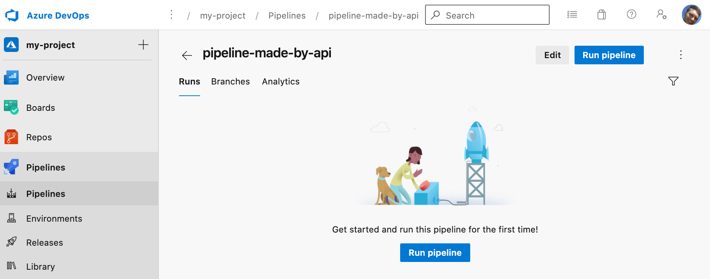

Creating an Azure Pipeline using the Azure DevOps REST API is possible, but badly documented. This post goes through how to do this; both using curl and using TypeScript.

<!--truncate-->

## curling a pipeline

The [documentation](https://docs.microsoft.com/en-us/rest/api/azure/devops/pipelines/pipelines/create?view=azure-devops-rest-7.1) for creating an Azure Pipeline using the Azure DevOps API is somewhat lacking. It doesn't mention key parameters like `repository` and `path` which are necessary to create a correctly configured pipeline. However, whilst it isn't documented officially, it can be done. You just need the recipe.

Here's a curl to make you a pipeline:

```bash
curl  --user '':'PERSONAL_ACCESS_TOKEN' --header "Content-Type: application/json" --header "Accept:application/json" https://dev.azure.com/organisation-name/sandbox/_apis/pipelines?api-version=7.1 -d @makepipeline.json
```

Looking at the above there's two things you need:

1. A personal access token. You can make one of those here: https://dev.azure.com/organisation-name/_usersSettings/tokens (where `organisation-name` is the name of your organisation)
2. A `makepipeline.json` file, which contains the details of the pipeline you want to create:

```json
{
  "folder": null,
  "name": "pipeline-made-by-api",
  "configuration": {
    "type": "yaml",
    "path": "/azure-pipelines.yml",
    "repository": {
      "id": "guid-of-repo-id",
      "name": "my-repo",
      "type": "azureReposGit"
    }
  }
}
```

Let's talk through the significant properties above:

- `folder` - can be `null` if you'd like the pipeline to be created in the root of Pipelines; otherwise provide the folder name. Incidentally a `null` will be translated into a value of `\\` which appears to be the magic value which represents the root.
- `name` - your pipeline needs a name
- `path` - this is the path to the yaml pipelines file in the repo. Note we're creating the pipeline itself here; what's actually in the pipeline sits in that file.
- `repository.id` - this is the guid that represents the repo you're creating the pipeline for. You can find this out by going to your equivalent https://dev.azure.com/organisation-name/project-name/_settings/repositories (substituting in appropriate values) and looking up your repository there.
- `repository.name` - the name of your repo

When you execute your curl you should be returned some JSON along these lines:

```json
{
  "_links": {
    "self": {
      "href": "https://dev.azure.com/organisation-name/2184049d-8bc4-484a-91e6-00fca6b5b19f/_apis/pipelines/975?revision=1"
    },
    "web": {
      "href": "https://dev.azure.com/organisation-name/2184049d-8bc4-484a-91e6-00fca6b5b19f/_build/definition?definitionId=975"
    }
  },
  "configuration": {
    "path": "/azure-pipelines.yml",
    "repository": {
      "id": "9a72560d-1622-4016-93dd-32ac85b96d03",
      "type": "azureReposGit"
    },
    "type": "yaml"
  },
  "url": "https://dev.azure.com/organisation-name/2184049d-8bc4-484a-91e6-00fca6b5b19f/_apis/pipelines/975?revision=1",
  "id": 975,
  "revision": 1,
  "name": "pipeline-made-by-api",
  "folder": "\\"
}
```

And inside Azure DevOps you'll now have a shiny new pipeline:



## What if I want to use TypeScript?

If you'd like to do the same in TypeScript, you can use the `azure-devops-node-api` package. Just like the official documentaion, the package is short of the necessary parameters to create a pipeline such as `repository` and `path`. But by combining a little `fetch` with the `azure-devops-node-api` you can get the job done.

Here's a TypeScript example:

```ts
import * as nodeApi from 'azure-devops-node-api';

function makeWebApi({
  organization,
  personalAccessToken,
}: {
  organization: string;
  personalAccessToken: string;
}) {
  const authHandler = nodeApi.getPersonalAccessTokenHandler(
    personalAccessToken,
    /** allowCrossOriginAuthentication */ true,
  );

  const webApi = new nodeApi.WebApi(
    `https://dev.azure.com/${organization}`,
    authHandler,
  );

  return webApi;
}

interface RepositoryNameAndId {
  id: string;
  name: string;
}

async function getRepository({
  personalAccessToken,
  organization,
  projectName,
  repositoryName,
}: {
  personalAccessToken: string;
  organization: string;
  projectName: string;
  repositoryName: string;
}): Promise<RepositoryNameAndId> {
  const webApi = makeWebApi({ organization, personalAccessToken });
  const gitApi = await webApi.getGitApi();

  const repository = await gitApi.getRepository(repositoryName, projectName);
  if (!repository?.id || !repository?.name) {
    throw new Error(`Repository ${repositoryName} not found`);
  }

  return {
    name: repository.name,
    id: repository.id,
  };
}

async function createPipeline({
  personalAccessToken,
  organization,
  projectName,
  repositoryName,
  repositoryId,
  pathToAzurePipelinesYml,
  pipelineName,
  folderName,
}: {
  personalAccessToken: string;
  organization: string;
  projectName: string;
  repositoryName: string;
  repositoryId: string;
  /** eg "/azure-pipelines.yml" */
  pathToAzurePipelinesYml: string;
  pipelineName: string;
  folderName: string;
}): Promise<CreatePipelinePostResponse> {
  // https://learn.microsoft.com/en-us/rest/api/azure/devops/pipelines/pipelines/create?view=azure-devops-rest-7.1
  const url = `https://dev.azure.com/${organization}/${projectName}/_apis/pipelines?api-version=7.1`;

  const payload: CreatePipelinePostPayload = {
      folder: folderName,
      name: pipelineName,
      configuration: {
        type: 'yaml',
        path: pathToAzurePipelinesYml,
        repository: {
          id: repositoryId,
          name: repositoryName,
          type: 'azureReposGit',
        },
      },
    },
  };

  try {
    const response = await fetch(url, {
      method: 'POST',
      headers: {
        Accept: 'application/json',
        'Content-Type': 'application/json',
        Authorization: `Basic ${Buffer.from(`PAT:${personalAccessToken}`).toString('base64')}`,
        'X-TFS-FedAuthRedirect': 'Suppress',
      },
      body: JSON.stringify(payload),
    });

    if (!response.ok) {
      throw new Error(`HTTP error! status: ${response.status.toString()}`);
    }

    const data = (await response.json()) as CreatePipelinePostResponse;

    return data;
  } catch (error) {
    console.error('Error:', error);
    throw error;
  }
}

interface CreatePipelinePostPayload {
  configuration: {
    type: 'yaml';
    path: string;
    repository: {
      id: string;
      type: 'azureReposGit';
      name: string;
    };
  };
  folder: null | string;
  name: string;
}

interface CreatePipelinePostResponse {
  _links: {
    self: {
      href: string;
    };
    web: {
      href: string;
    };
  };
  configuration: {
    path: string;
    repository: {
      id: string;
      type: string;
    };
    type: string;
  };
  folder: string;
  id: number;
  name: string;
  revision: number;
  url: string;
}

// Get the repository so we can make the pipeline
const repository = await getRepository({
  personalAccessToken: personalAccessToken,
  organization: azureDevOpsOrganization,
  projectName: azureDevOpsProject,
  repositoryName: azureDevOpsRepository,
});

const pipeline = await createPipeline({
  pathToAzurePipelinesYml: '/.azuredevops/azure-pipeline.yml',
  folderName: repository.name, // this could be `null` if you want the pipeline to be created in the root
  pipelineName: `${repository.name}-azure-pipeline`,
  organization: azureDevOpsOrganization,
  projectName: azureDevOpsProject,
  repositoryName: repository.name,
  repositoryId: repository.id,
  personalAccessToken: personalAccessToken,
});
```

The above code:

1. Gets the repository id using the `azure-devops-node-api`
2. Creates a pipeline using `fetch` and the Azure DevOps REST API, with the types we've created to help us understand the shape of the data we're working with
