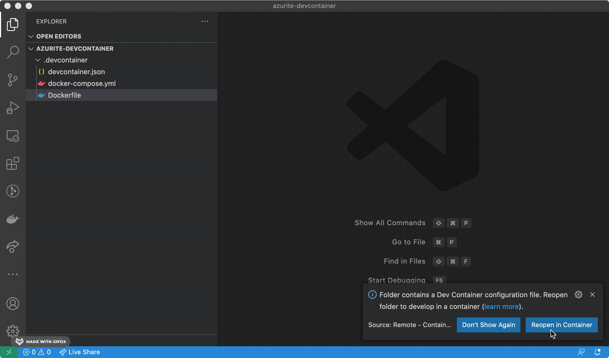
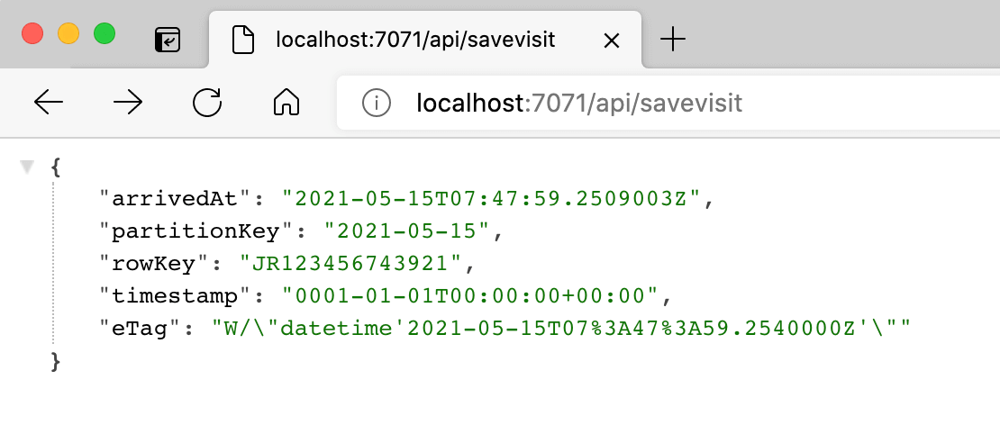
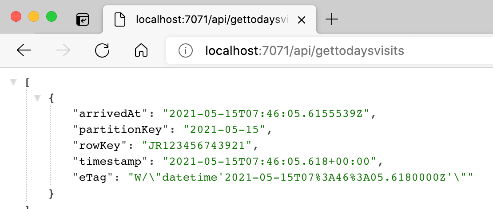

It's great to be able to develop locally without needing a "real" database to connect to. [Azurite](https://github.com/Azure/Azurite) is an Azure Storage emulator which exists to support just that. This post demonstrates how to run Azurite v3 in a [dev container](https://code.visualstudio.com/docs/remote/containers), such that you can access the Table Storage API, which is currently in preview.

<!--truncate-->

## Azurite in VS Code

[Azurite v3.12.0](https://github.com/Azure/Azurite/releases/tag/v3.12.0) recently shipped, and with it came:

> Preview of Table Service in npm package and docker image. (Visual Studio Code extension doesn't support Table Service in this release)

You'll note that whilst there's a VS Code extension for Azurite, it doesn't have support for the Table Service yet. However, we do have it available in the form of a Docker image. So whilst we may not be able to directly use the Table APIs of Azurite in VS Code, what we could do instead is use a dev container.

We'll start by making ourselves a new directory and open VS Code in that location:

```bash
mkdir azurite-devcontainer
code azurite-devcontainer
```

We're going to initialise a dev container there for function apps based upon [the example Azure Functions & C# - .NET Core 3.1 container](https://github.com/microsoft/vscode-dev-containers/tree/master/containers/azure-functions-dotnetcore-3.1). We'll use it later to test our Azurite connectivity. To do that let's create ourselves a `.devcontainer` directory:

```bash
mkdir .devcontainer
```

And inside there we'll add a `devcontainer.json`:

```json
// For format details, see https://aka.ms/devcontainer.json. For config options, see the README at:
// https://github.com/microsoft/vscode-dev-containers/tree/v0.177.0/containers/azure-functions-dotnetcore-3.1
{
  "name": "Azurite and Azure Functions & C# - .NET Core 3.1",
  "dockerComposeFile": "docker-compose.yml",
  "service": "app",
  "workspaceFolder": "/workspace",
  "forwardPorts": [7071],

  // Set *default* container specific settings.json values on container create.
  "settings": {
    "terminal.integrated.defaultProfile.linux": "/bin/bash"
  },

  // Add the IDs of extensions you want installed when the container is created.
  "extensions": [
    "ms-azuretools.vscode-azurefunctions",
    "ms-dotnettools.csharp"
  ],

  // Use 'postCreateCommand' to run commands after the container is created.
  // "postCreateCommand": "dotnet restore",

  // Comment out connect as root instead. More info: https://aka.ms/vscode-remote/containers/non-root.
  "remoteUser": "vscode"
}
```

As we can see, we're referencing a `docker-compose.yml` file; let's add that:

```yml
version: '3'

services:
  app:
    build:
      context: .
      dockerfile: Dockerfile
      args:
        # On Linux, you may need to update USER_UID and USER_GID below if not your local UID is not 1000.
        USER_UID: 10000
        USER_GID: 10000

    init: true
    volumes:
      - ..:/workspace:cached

    # Overrides default command so things don't shut down after the process ends.
    command: sleep infinity

    # Uncomment the next line to use a non-root user for all processes.
    user: vscode

  # run azurite and expose the relevant ports
  azurite:
    image: ./'mcr.microsoft.com/azure-storage/azurite'
    ports:
      - '10000:10000'
      - '10001:10001'
      - '10002:10002'
```

It consists of two services; `app` and `azurite`. `azurite` is the Docker image of Azurite, which exposes the Azurite ports so `app` can access it. Note the name of `azurite`; that will turn out to be significant later. We're actually only going to use the Table Storage port of `10002`, but this would allow us to use Blobs and Queues also. The `azurite` service is effectively going to be executing this command for us when it runs:

```bash
docker run -p 10000:10000 -p 10001:10001 -p 10002:10002 mcr.microsoft.com/azure-storage/azurite
```

Now let's look at `app`. This is our Azure Functions container. It references a `Dockerfile` which we need to add:

```dockerfile
# Find the Dockerfile for mcr.microsoft.com/azure-functions/dotnet:3.0-dotnet3-core-tools at this URL
# https://github.com/Azure/azure-functions-docker/blob/master/host/3.0/buster/amd64/dotnet/dotnet-core-tools.Dockerfile
FROM mcr.microsoft.com/azure-functions/dotnet:3.0-dotnet3-core-tools
```

We now have ourselves a dev container! VS Code should prompt us to reopen inside the container:



## Make a function app

Now we're inside our container, we're going to make ourselves a function app that will use Azurite. Let's fire up the terminal in VS Code and create a function app containing a simple HTTP function:

```bash
mkdir src
cd src
func init TableStorage --dotnet
cd TableStorage
```

We need to add a package for the APIs which interact with Table Storage:

```bash
dotnet restore
dotnet add package Microsoft.Azure.Cosmos.Table --version 1.0.8
```

The name is somewhat misleading, as it's both for Cosmos _and_ for Table Storage. Famously, naming things is hard 😉.

Our mission is to be able to write and read from Azurite Table Storage. We need something to read and write that we care about. I like to visit [Kew Gardens](https://www.kew.org/kew-gardens) and so let's imagine ourselves a system which tracks visitors to Kew.

We're going to add a class called `KewGardensVisit`:

```cs
using System;
using Microsoft.Azure.Cosmos.Table;

namespace TableStorage
{
    public class KewGardenVisit : TableEntity
    {
        public KewGardenVisit() {}
        public KewGardenVisit(DateTime arrivedAt, string memberId)
        {
            PartitionKey = arrivedAt.ToString("yyyy-MM-dd", System.Globalization.CultureInfo.InvariantCulture);
            RowKey = memberId;

            ArrivedAt = arrivedAt;
        }

        public DateTime ArrivedAt { get; set; }
    }
}
```

Now we have our entity, let's add a class called `HelloAzuriteTableStorage` which will contain functions which interact with the storage:

```cs
using System;
using System.Linq;
using System.Threading.Tasks;
using Microsoft.AspNetCore.Mvc;
using Microsoft.Azure.WebJobs;
using Microsoft.Azure.WebJobs.Extensions.Http;
using Microsoft.AspNetCore.Http;
using Microsoft.Extensions.Logging;
using Microsoft.Azure.Cosmos.Table;

namespace TableStorage
{
    public static class HelloAzuriteTableStorage
    {
        // Note how we're addressing our azurite service
        const string AZURITE_TABLESTORAGE_CONNECTIONSTRING =
            "DefaultEndpointsProtocol=http;" +
            "AccountName=devstoreaccount1;" +
            "AccountKey=Eby8vdM02xNOcqFlqUwJPLlmEtlCDXJ1OUzFT50uSRZ6IFsuFq2UVErCz4I6tq/K1SZFPTOtr/KBHBeksoGMGw==;" +
            "BlobEndpoint=http://azurite:10000/devstoreaccount1;" +
            "QueueEndpoint=http://azurite:10001/devstoreaccount1;" +
            "TableEndpoint=http://azurite:10002/devstoreaccount1;";
        const string TABLE_NAME = "KewGardenVisits";

        [FunctionName("SaveVisit")]
        public static async Task<IActionResult> RunSaveVisit(
            [HttpTrigger(AuthorizationLevel.Anonymous, "get", "post", Route = null)] HttpRequest req,
            ILogger log)
        {
            try
            {
                var table = await GetTable(log);

                // Create the InsertOrReplace table operation
                var insertOrMergeOperation = TableOperation.InsertOrMerge(new KewGardenVisit(
                    arrivedAt: DateTime.UtcNow,
                    memberId: "JR123456743921"
                ));

                // Execute the operation.
                TableResult result = await table.ExecuteAsync(insertOrMergeOperation);
                KewGardenVisit savedTelemetry = result.Result as KewGardenVisit;

                if (result.RequestCharge.HasValue)
                    log.LogInformation("Request Charge of InsertOrMerge Operation: " + result.RequestCharge);

                return new OkObjectResult(savedTelemetry);

            }
            catch (Exception e)
            {
                log.LogError(e, "Problem saving");
            }

            return new BadRequestObjectResult("There was an issue");
        }

        [FunctionName("GetTodaysVisits")]
        public static async Task<IActionResult> RunGetTodaysVisits(
            [HttpTrigger(AuthorizationLevel.Anonymous, "get", Route = null)] HttpRequest req,
            ILogger log)
        {
            try
            {
                var table = await GetTable(log);

                var snowOnTheAdoTelemetries = table.CreateQuery<KewGardenVisit>()
                    .Where(x => x.PartitionKey == DateTime.UtcNow.ToString("yyyy-MM-dd", System.Globalization.CultureInfo.InvariantCulture))
                    .ToArray();

                return new OkObjectResult(snowOnTheAdoTelemetries);

            }
            catch (Exception e)
            {
                log.LogError(e, "Problem loading");
                return new BadRequestObjectResult("There was an issue");
            }
        }

        private static async Task<CloudTable> GetTable(ILogger log)
        {
            // Construct a new TableClient using a TableSharedKeyCredential.
            var storageAccount = CloudStorageAccount.Parse(AZURITE_TABLESTORAGE_CONNECTIONSTRING); ;

            // Create a table client for interacting with the table service
            CloudTableClient tableClient = storageAccount.CreateCloudTableClient(new TableClientConfiguration());

            // Create a table client for interacting with the table service
            CloudTable table = tableClient.GetTableReference(TABLE_NAME);
            if (await table.CreateIfNotExistsAsync())
                log.LogInformation("Created Table named: {0}", TABLE_NAME);
            else
                log.LogInformation("Table {0} already exists", TABLE_NAME);

            return table;
        }
    }
}
```

There's a couple of things to draw attention to here:

- `AZURITE_TABLESTORAGE_CONNECTIONSTRING` - this mega string is based upon the [Azurite connection string docs](https://github.com/Azure/Azurite#connection-strings). The account name and key are the [Azurite default storage accounts](https://github.com/Azure/Azurite#default-storage-account). You'll note we target `TableEndpoint=http://azurite:10002/devstoreaccount1`. The `azurite` here is replacing the standard `127.0.0.1` where Azurite typically listens. This `azurite` name comes from the name of our service in the `docker-compose.yml` file.

- We're creating two functions `SaveVisit` and `GetTodaysVisits`. `SaveVisit` creates an entry in our storage to represent someone's visit. It's a hardcoded value representing me, and we're exposing a write operation at a `GET` endpoint which is not very RESTful. But this is a demo and Roy Fielding would forgive us. `GetTodaysVisits` allows us to read back the visits that have happened today.

Let's see if it works by entering `func start` and browsing to `http://localhost:7071/api/savevisit`



Looking good. Now let's see if we can query them at `http://localhost:7071/api/gettodaysvisits`:



Disco.

## Can we swap out Azurite for The Real Thing™️?

You may be thinking _"This is great! But in the end I need to write to Azure Table Storage itself; not Azurite."_

That's a fair point. Fortunately, it's only the connection string that determines where you read and write to. It would be fairly easy to dependency inject the appropriate connection string, or indeed a service that is connected to the storage you wish to target. If you want to make that happen, you can.
