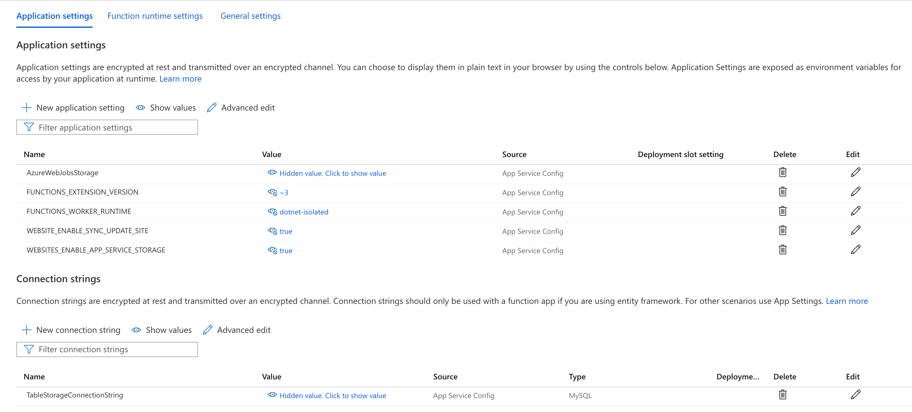

The upgrade of Azure Functions from .NET Core 3.1 to .NET 5 is significant. There's an excellent [guide](https://codetraveler.io/2021/05/28/creating-azure-functions-using-net-5/) for the general steps required to perform the upgrade. However there's a number of (unrelated) items which are not covered by that post:

<!--truncate-->

- Query params
- Dependency Injection
- Bicep
- Build

This post will show how to tackle these.


## Query params

As part of the move to .NET 5 functions, we say goodbye to [`HttpRequest`](https://docs.microsoft.com/en-us/dotnet/api/microsoft.aspnetcore.http.httprequest?view=aspnetcore-5.0) and hello to [`HttpRequestData`](https://docs.microsoft.com/en-us/dotnet/api/microsoft.azure.functions.worker.http.httprequestdata?view=azure-dotnet). Now `HttpRequest` had a useful [`Query`](https://docs.microsoft.com/en-us/dotnet/api/microsoft.aspnetcore.http.httprequest.query?view=aspnetcore-5.0#Microsoft_AspNetCore_Http_HttpRequest_Query) property which allowed for the simple extraction of query parameters like so.

```cs
var from = req.Query["from"]
```

`HttpRequestData` has no such property. However, it's straightforward to make our own. It's simply a matter of using [`System.Web.HttpUtility.ParseQueryString`](https://docs.microsoft.com/en-us/dotnet/api/system.web.httputility.parsequerystring?view=net-5.0) on `req.Url.Query` and using that:

```cs
var query = System.Web.HttpUtility.ParseQueryString(req.Url.Query);
var from = query["from"]
```

## Dependency Injection, local development and Azure Application Settings

Dependency Injection is a much more familiar shape in .NET 5 if you're familiar with .NET Core web apps. Once again we have a `Program.cs` file. To get the configuration built in such a way to support both local development and when deployed to Azure, there's a few things to do. When deployed to Azure you'll likely want to read from Azure Application Settings:



To tackle both of these, you'll want to use `AddJsonFile` and `AddEnvironmentVariables` in `ConfigureAppConfiguration`. A final `Program.cs` might look something like this:

```cs
using System;
using System.Threading.Tasks;
using Microsoft.Extensions.Configuration;
using Microsoft.Extensions.DependencyInjection;
using Microsoft.Extensions.Hosting;

namespace MyApp
{
    public class Program
    {
        public static Task Main(string[] args)
        {
            var host = new HostBuilder()
                .ConfigureAppConfiguration(configurationBuilder =>
                    configurationBuilder
                        .AddCommandLine(args)
                        // below is for local development
                        .AddJsonFile("local.settings.json", optional: true, reloadOnChange: true)
                        // below is what you need to read Application Settings in Azure
                        .AddEnvironmentVariables()
                )
                .ConfigureFunctionsWorkerDefaults()
                .ConfigureServices(services =>
                {
                    services.AddLogging();
                    services.AddHttpClient();
                })
                .Build();

            return host.RunAsync();
        }
    }
}
```

With this approach in place, when the application runs, it should construct a configuration driven by all the providers required to run our application.

## Bicep

When it comes to deploying to Azure via [Bicep](https://github.com/Azure/bicep), there's some small tweaks required:

- `appSettings.FUNCTIONS_WORKER_RUNTIME` becomes `dotnet-isolated`
- `linuxFxVersion` becomes `DOTNET-ISOLATED|5.0`

Applied to the resource itself the diff looks like this:

```diff
resource functionAppName_resource 'Microsoft.Web/sites@2018-11-01' = {
  name: functionAppName
  location: location
  tags: tags_var
  kind: 'functionapp,linux'
  identity: {
    type: 'SystemAssigned'
  }
  properties: {
    serverFarmId: appServicePlanName_resource.id
    siteConfig: {
      http20Enabled: true
      remoteDebuggingEnabled: false
      minTlsVersion: '1.2'
      appSettings: [
        {
          name: 'FUNCTIONS_EXTENSION_VERSION'
          value: '~3'
        }
        {
          name: 'FUNCTIONS_WORKER_RUNTIME'
-          value: 'dotnet'
+          value: 'dotnet-isolated'
        }
        {
          name: 'AzureWebJobsStorage'
          value: 'DefaultEndpointsProtocol=https;AccountName=${storageAccountName};AccountKey=${listKeys(resourceId('Microsoft.Storage/storageAccounts', storageAccountName), '2019-06-01').keys[0].value};EndpointSuffix=${environment().suffixes.storage}'
        }
      ]
      connectionStrings: [
        {
          name: 'TableStorageConnectionString'
          connectionString: 'DefaultEndpointsProtocol=https;AccountName=${storageAccountName};AccountKey=${listKeys(resourceId('Microsoft.Storage/storageAccounts', storageAccountName), '2019-06-01').keys[0].value};EndpointSuffix=${environment().suffixes.storage}'
        }
      ]
-      linuxFxVersion: 'DOTNETCORE|LTS'
+      linuxFxVersion: 'DOTNET-ISOLATED|5.0'
      ftpsState: 'Disabled'
      managedServiceIdentityId: 1
    }
    clientAffinityEnabled: false
    httpsOnly: true
  }
}
```

## Building .NET 5 functions

Before signing off, there's one more thing to slip in. When attempting to build .NET 5 Azure Functions with the .NET SDK _alone_, you'll encounter this error:

```
The framework 'Microsoft.NETCore.App', version '3.1.0' was not found.
```

Docs on this seem to be pretty short. The closest I came to docs was [this comment on Stack Overflow](https://stackoverflow.com/questions/66938752/net-5-the-framework-microsoft-netcore-app-version-3-1-0-was-not-found/66938753#66938753):

> To build .NET 5 functions, the .NET Core 3 SDK is required. So this must be installed alongside the 5.0.x sdk.

So with Azure Pipelines you might have have something that looks like this:

```yml
stages:
  - stage: build
    displayName: build
    pool:
      vmImage: 'ubuntu-latest'
    jobs:
      - job: BuildAndTest
        displayName: 'Build and Test'
        steps:
          # we need .NET Core SDK 3.1 too!
          - task: UseDotNet@2
            displayName: 'Install .NET Core SDK 3.1'
            inputs:
              packageType: 'sdk'
              version: 3.1.x

          - task: UseDotNet@2
            displayName: 'Install .NET SDK 5.0'
            inputs:
              packageType: 'sdk'
              version: 5.0.x

          - task: DotNetCoreCLI@2
            displayName: 'function app test'
            inputs:
              command: test

          - task: DotNetCoreCLI@2
            displayName: 'function app build'
            inputs:
              command: build
              arguments: '--configuration Release --output $(Build.ArtifactStagingDirectory)/MyApp'

          - task: DotNetCoreCLI@2
            displayName: 'function app publish'
            inputs:
              command: publish
              arguments: '--configuration Release --output $(Build.ArtifactStagingDirectory)/MyApp /p:SourceRevisionId=$(Build.SourceVersion)'
              publishWebProjects: false
              modifyOutputPath: false
              zipAfterPublish: true

          - publish: $(Build.ArtifactStagingDirectory)/MyApp
            artifact: functionapp
```

Have fun building .NET 5 functions!
