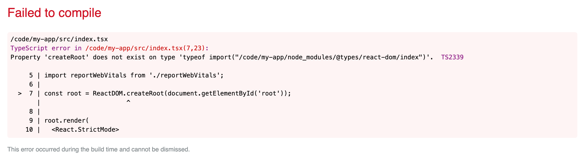

[React 18 alpha has been released](https://reactjs.org/blog/2021/06/08/the-plan-for-react-18.html); but can we use it with TypeScript? The answer is "yes", but you need to do a couple of things to make that happen. This post will show you what to do.

<!--truncate-->

## Creating a React App with TypeScript

Let's create ourselves a vanilla React TypeScript app with [Create React App](https://create-react-app.dev/):

```shell
yarn create react-app my-app --template typescript
```

Now let's upgrade the version of React to `@next`:

```shell
yarn add react@next react-dom@next
```

Which will leave you with entries in the `package.json` which use React 18. It will likely look something like this:

```json
    "react": "^18.0.0-alpha-e6be2d531",
    "react-dom": "^18.0.0-alpha-e6be2d531",
```

If we run `yarn start` we'll find ourselves running a React 18 app. Exciting!

## Using the new APIs

So let's try using [`ReactDOM.createRoot`](https://github.com/reactwg/react-18/discussions/5) API. It's this API that opts our application into using new features of React 18. We'll open up `index.tsx` and make this change:

```diff
-ReactDOM.render(
-  <React.StrictMode>
-    <App />
-  </React.StrictMode>,
-  document.getElementById('root')
-);
+const root = ReactDOM.createRoot(document.getElementById('root'));
+
+root.render(
+  <React.StrictMode>
+    <App />
+  </React.StrictMode>
+);
```

If we were running JavaScript alone, this would work. However, because we're using TypeScript as well, we're now confronted with an error:

> `Property 'createRoot' does not exist on type 'typeof import("/code/my-app/node_modules/@types/react-dom/index")'. TS2339`



This is the TypeScript compiler complaining that it doesn't know anything about `ReactDOM.createRoot`. This is because the type definitions that are currently in place in our application don't have that API defined.

Let's upgrade our type definitions:

```shell
yarn add @types/react @types/react-dom
```

We might reasonably hope that everything should work now. Alas it does not. The same error is presenting. TypeScript is not happy.

## Telling TypeScript about the new APIs

If we take a look at the [PR that added support for the APIs](https://github.com/DefinitelyTyped/DefinitelyTyped/pull/53685), we'll find some tips. If you look at one of the [`next.d.ts`](https://github.com/DefinitelyTyped/DefinitelyTyped/blob/a07e9cfb005682fb6be0a2e85113eac131c3006f/types/react/next.d.ts) you'll find this info, courtesy of [Sebastian Silbermann](https://twitter.com/sebsilbermann):

````ts
/**
 * These are types for things that are present in the upcoming React 18 release.
 *
 * Once React 18 is released they can just be moved to the main index file.
 *
 * To load the types declared here in an actual project, there are three ways. The easiest one,
 * if your `tsconfig.json` already has a `"types"` array in the `"compilerOptions"` section,
 * is to add `"react/next"` to the `"types"` array.
 *
 * Alternatively, a specific import syntax can to be used from a typescript file.
 * This module does not exist in reality, which is why the {} is important:
 *
 * ```ts
 * import {} from 'react/next'
 * ```
 *
 * It is also possible to include it through a triple-slash reference:
 *
 * ```ts
 * /// <reference types="react/next" />
 * ```
 *
 * Either the import or the reference only needs to appear once, anywhere in the project.
 */
````

Let's try the first item on the list. We'll edit our `tsconfig.json` and add a new entry to the `"compilerOptions"` section:

```json
    "types": ["react/next", "react-dom/next"]
```

If we restart our build with `yarn start` we're now presented with a _different_ error:

> `Argument of type 'HTMLElement | null' is not assignable to parameter of type 'Element | Document | DocumentFragment | Comment'. Type 'null' is not assignable to type 'Element | Document | DocumentFragment | Comment'. TS2345`


Now this is actually nothing to do with issues with our new React type definitions. They are fine. This is TypeScript saying "it's not guaranteed that `document.getElementById('root')` returns something that is not `null`... since we're in `strictNullChecks` mode you need to be sure `root` is not null".

We'll deal with that by testing we do have an element in play before invoking `ReactDOM.createRoot`:

```diff
-const root = ReactDOM.createRoot(document.getElementById('root'));
+const rootElement = document.getElementById('root');
+if (!rootElement) throw new Error('Failed to find the root element');
+const root = ReactDOM.createRoot(rootElement);
```

Now that change is made, we have a working React 18 application, using TypeScript. Enjoy!

[This post was originally published on LogRocket.](https://blog.logrocket.com/how-to-use-typescript-with-react-18-alpha/)

<head>
    <link rel="canonical" href="https://blog.logrocket.com/how-to-use-typescript-with-react-18-alpha/" />
</head>
