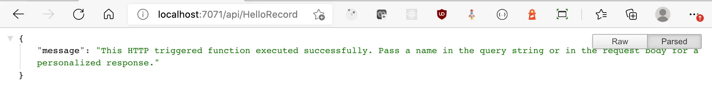

C# 9 has some amazing features. Azure Functions are have two modes: isolated and in-process. Whilst isolated supports .NET 5 (and hence C# 9), in-process supports .NET Core 3.1 (C# 8). This post shows how we can use C# 9 with in-process Azure Functions running on .NET Core 3.1.


<!--truncate-->

## Azure Functions: in-process and isolated

Historically .NET Azure Functions have been in-process. This changed with .NET 5 where a new model was introduced named "isolated". [To quote from the roadmap](https://techcommunity.microsoft.com/t5/apps-on-azure/net-on-azure-functions-roadmap/ba-p/2197916):

> Running in an isolated process decouples .NET functions from the Azure Functions host—allowing us to more easily support new .NET versions and address pain points associated with sharing a single process.

However, the initial launch of isolated functions [does not have the full level of functionality enjoyed by in-process functions](https://docs.microsoft.com/en-us/azure/azure-functions/dotnet-isolated-process-guide#differences-with-net-class-library-functions). This will happen, according the roadmap:

> Long term, our vision is to have full feature parity out of process, bringing many of the features that are currently exclusive to the in-process model to the isolated model. We plan to begin delivering improvements to the isolated model after the .NET 6 general availability release.

In the future, in-process functions will be retired in favour of isolated functions. However, it will be .NET 7 (scheduled to ship in November 2022) before that takes place:


As the image taken from the roadmap shows, when .NET 5 shipped, it did not support in-process Azure Functions. When .NET 6 ships in November, it should.

In the meantime, we would like to use C# 9.

## Setting up a C# 8 project

We're have the [Azure Functions Core Tools](https://docs.microsoft.com/en-us/azure/azure-functions/functions-run-local) installed, so let's create a new function project:

```bash
func new --worker-runtime dotnet --template "Http Trigger" --name "HelloRecord"
```

The above command scaffolds out a .NET Core 3.1 Azure function project which contains a single Azure function. The `--worker-runtime dotnet` parameter is what causes an in-process .NET Core 3.1 function being created. You should have a `.csproj` file that looks like this:

```xml
<Project Sdk="Microsoft.NET.Sdk">
  <PropertyGroup>
    <TargetFramework>netcoreapp3.1</TargetFramework>
    <AzureFunctionsVersion>v3</AzureFunctionsVersion>
  </PropertyGroup>
  <ItemGroup>
    <PackageReference Include="Microsoft.NET.Sdk.Functions" Version="3.0.11" />
  </ItemGroup>
  <ItemGroup>
    <None Update="host.json">
      <CopyToOutputDirectory>PreserveNewest</CopyToOutputDirectory>
    </None>
    <None Update="local.settings.json">
      <CopyToOutputDirectory>PreserveNewest</CopyToOutputDirectory>
      <CopyToPublishDirectory>Never</CopyToPublishDirectory>
    </None>
  </ItemGroup>
</Project>
```

We're running with C# 8 and .NET Core 3.1 at this point. What does it take to get us to C# 9?

## What does it take to get to C# 9?

There's a [great post on Reddit addressing using C# 9 with .NET Core 3.1 which says:](https://www.reddit.com/r/csharp/comments/kiplz8/can_i_use_c90_with_aspnet_core_31/)

> You can use `<LangVersion>9.0</LangVersion>`, and VS even includes support for suggesting a language upgrade.
>
> However, there are three categories of features in C#:
>
> 1. features that are entirely part of the compiler. Those will work.
> 2. features that require BCL additions. Since you're on the older BCL, those will need to be backported. For example, to use init; and record, you can use https://github.com/manuelroemer/IsExternalInit.
> 3. features that require runtime additions. Those cannot be added at all. For example, default interface members in C# 8, and covariant return types in C# 9.

Of the above, 1 and 2 add a tremendous amount of value. The features of 3 are great, but more niche. Speaking personally, I care a great deal about [Record types](https://docs.microsoft.com/en-us/dotnet/csharp/whats-new/csharp-9#record-types). So let's apply this.

## Adding C# 9 to the in-process function

To get C# into the mix, we want to make two changes:

- add a `<LangVersion>9.0</LangVersion>` to the `<PropertyGroup>` element of our `.csproj` file
- add a package reference to the [`IsExternalInit`](https://github.com/manuelroemer/IsExternalInit)

The applied changes look like this:

```diff
<Project Sdk="Microsoft.NET.Sdk">
  <PropertyGroup>
    <TargetFramework>netcoreapp3.1</TargetFramework>
+    <LangVersion>9.0</LangVersion>
    <AzureFunctionsVersion>v3</AzureFunctionsVersion>
  </PropertyGroup>
  <ItemGroup>
    <PackageReference Include="Microsoft.NET.Sdk.Functions" Version="3.0.11" />
+    <PackageReference Include="IsExternalInit" Version="1.0.1" PrivateAssets="all" />
  </ItemGroup>
  <ItemGroup>
    <None Update="host.json">
      <CopyToOutputDirectory>PreserveNewest</CopyToOutputDirectory>
    </None>
    <None Update="local.settings.json">
      <CopyToOutputDirectory>PreserveNewest</CopyToOutputDirectory>
      <CopyToPublishDirectory>Never</CopyToPublishDirectory>
    </None>
  </ItemGroup>
</Project>
```

If we used `dotnet add package IsExternalInit`, we might be using a different syntax in the `.csproj`. Be not afeard - that won't affect usage.

## Making a C# 9 program

Now we can theoretically use C# 9.... Let's use C# 9. We'll tweak our `HelloRecord.cs` file, add in a simple `record` named `MessageRecord` and tweak the `Run` method to use it:

```cs
using System;
using System.IO;
using System.Threading.Tasks;
using Microsoft.AspNetCore.Mvc;
using Microsoft.Azure.WebJobs;
using Microsoft.Azure.WebJobs.Extensions.Http;
using Microsoft.AspNetCore.Http;
using Microsoft.Extensions.Logging;
using Newtonsoft.Json;

namespace tmp
{
    public record MessageRecord(string message);

    public static class HelloRecord
    {
        [FunctionName("HelloRecord")]
        public static async Task<IActionResult> Run(
            [HttpTrigger(AuthorizationLevel.Function, "get", "post", Route = null)] HttpRequest req,
            ILogger log)
        {
            log.LogInformation("C# HTTP trigger function processed a request.");

            string name = req.Query["name"];

            string requestBody = await new StreamReader(req.Body).ReadToEndAsync();
            dynamic data = JsonConvert.DeserializeObject(requestBody);
            name = name ?? data?.name;

            var responseMessage = new MessageRecord(string.IsNullOrEmpty(name)
                ? "This HTTP triggered function executed successfully. Pass a name in the query string or in the request body for a personalized response."
                : $"Hello, {name}. This HTTP triggered function executed successfully.");

            return new OkObjectResult(responseMessage);
        }
    }
}
```

If we kick off our function with `func start`:



We can see we can compile, and output is as we might expect and hope. Likewise if we try and debug in VS Code, we can:


## Best before...

So, we've now a way to use C# 9 (or most of it) with in-process .NET Core 3.1 apps. This should serve until .NET 6 ships in November 2021 and we're able to use C# 9 by default.
