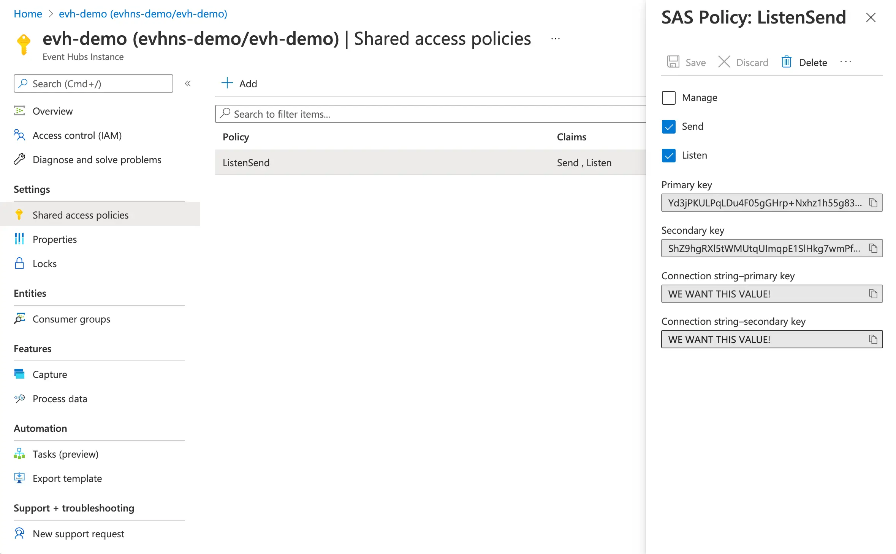

If we're provisioning resources in Azure with Bicep, we may have a need to acquire the connection strings and keys of our newly deployed infrastructure. For example, the connection strings of an event hub or the access keys of a storage account. Perhaps we'd like to use them to run an end-to-end test, perhaps we'd like to store these secrets somewhere for later consumption. This post shows how to do that using Bicep and the `listKeys` helper. Optionally it shows how we could consume this in Azure Pipelines.

Please note that exporting keys / connection strings etc from Bicep / ARM templates is generally considered to be a less secure approach. This is because these values will be visible inside the deployments section of the Azure Portal. Anyone who has access to this will be able to see them. An alternative approach would be permissioning our pipeline to access the resources directly. You can read about that approach [here](../2021-09-12-permissioning-azure-pipelines-bicep-role-assignments/index.md).

Alternatively, if you're just thinking about how to configure your Azure Container Apps / Azure Static Web Apps / Azure Function Apps etc with connection strings and keys there is another way. You can perform configuration directly within Bicep, without ever exposing secrets. [Read about that approach here](../2024-03-10-configure-azure-connection-strings-keys-in-azure-bicep/index.md).


<!--truncate-->

## Event Hub connection string

First of all, let's provision an Azure Event Hub. This involves deploying an event hub namespace, an event hub in that namespace and an authorization rule. The following Bicep will do this for us:

```bicep
// Create an event hub namespace

var eventHubNamespaceName = 'evhns-demo'

resource eventHubNamespace 'Microsoft.EventHub/namespaces@2021-01-01-preview' = {
  name: eventHubNamespaceName
  location: resourceGroup().location
  sku: {
    name: 'Standard'
    tier: 'Standard'
    capacity: 1
  }
  properties: {
    zoneRedundant: true
  }
}

// Create an event hub inside the namespace

var eventHubName = 'evh-demo'

resource eventHubNamespaceName_eventHubName 'Microsoft.EventHub/namespaces/eventhubs@2021-01-01-preview' = {
  parent: eventHubNamespace
  name: eventHubName
  properties: {
    messageRetentionInDays: 7
    partitionCount: 1
  }
}

// Grant Listen and Send on our event hub

resource eventHubNamespaceName_eventHubName_ListenSend 'Microsoft.EventHub/namespaces/eventhubs/authorizationRules@2021-01-01-preview' = {
  parent: eventHubNamespaceName_eventHubName
  name: 'ListenSend'
  properties: {
    rights: [
      'Listen'
      'Send'
    ]
  }
  dependsOn: [
    eventHubNamespace
  ]
}
```

When this is deployed to Azure, it will result in creating something like this:



As we can see, there are connection strings available which can be used to access the event hub. How do we get a connection string that we can play with? It's easily achieved by appending the following to our Bicep:

```bicep
// Determine our connection string

var eventHubNamespaceConnectionString = listKeys(eventHubNamespaceName_eventHubName_ListenSend.id, eventHubNamespaceName_eventHubName_ListenSend.apiVersion).primaryConnectionString

// Output our variables

output eventHubNamespaceConnectionString string = eventHubNamespaceConnectionString
output eventHubName string = eventHubName
```

What we're doing here is using the [`listKeys`](https://docs.microsoft.com/en-us/azure/azure-resource-manager/bicep/bicep-functions-resource#list) helper on our authorization rule and retrieving the handy `primaryConnectionString`, which is then exposed as an output variable.

## Storage Account connection string

We'd like to obtain a connection string for a storage account also. Let's put together a Bicep file that creates a storage account and a container therein. (Incidentally, it's fairly common to have a storage account provisioned alongside an event hub to facilitate reading from an event hub.)

```bicep
// Create a storage account

var storageAccountName = 'stdemo'

resource eventHubNamespaceName_storageAccount 'Microsoft.Storage/storageAccounts@2021-02-01' = {
  name: storageAccountName
  location: resourceGroup().location
  sku: {
    name: 'Standard_LRS'
    tier: 'Standard'
  }
  kind: 'StorageV2'
  properties: {
    networkAcls: {
      bypass: 'AzureServices'
      defaultAction: 'Allow'
    }
    accessTier: 'Hot'
    allowBlobPublicAccess: false
    minimumTlsVersion: 'TLS1_2'
    allowSharedKeyAccess: true
  }
}

// create a container inside that storage account

var blobContainerName = 'test-container'

resource storageAccountName_default_containerName 'Microsoft.Storage/storageAccounts/blobServices/containers@2021-02-01' = {
  name: '${storageAccountName}/default/${blobContainerName}'
  dependsOn: [
    eventHubNamespaceName_storageAccount
  ]
}
```

When this is deployed to Azure, it will result in creating something like this:


Again we can see, there are connection strings available in the Azure Portal, which can be used to access the storage account. However, things aren't quite as simple as previously; in that there doesn't seem to be a way to directly acquire a connection string. What we can do, is acquire a key; and construct ourselves a connection string with that. Here's how:

```bicep
// Determine our connection string

var blobStorageConnectionString = 'DefaultEndpointsProtocol=https;AccountName=${eventHubNamespaceName_storageAccount.name};EndpointSuffix=${environment().suffixes.storage};AccountKey=${listKeys(eventHubNamespaceName_storageAccount.id, eventHubNamespaceName_storageAccount.apiVersion).keys[0].value}'

// Output our variable

output blobStorageConnectionString string = blobStorageConnectionString
output blobContainerName string = blobContainerName
```

If you just wanted to know how to acquire connection strings from Bicep then you can stop now; we're done! But if you're curious on how the Bicep might connect to ~~the shoulder~~ Azure Pipelines... Read on.

## From Bicep to Azure Pipelines

If we put together our snippets above into a single Bicep file it would look like this:

```bicep
// Create an event hub namespace

var eventHubNamespaceName = 'evhns-demo'

resource eventHubNamespace 'Microsoft.EventHub/namespaces@2021-01-01-preview' = {
  name: eventHubNamespaceName
  location: resourceGroup().location
  sku: {
    name: 'Standard'
    tier: 'Standard'
    capacity: 1
  }
  properties: {
    zoneRedundant: true
  }
}

// Create an event hub inside the namespace

var eventHubName = 'evh-demo'

resource eventHubNamespaceName_eventHubName 'Microsoft.EventHub/namespaces/eventhubs@2021-01-01-preview' = {
  parent: eventHubNamespace
  name: eventHubName
  properties: {
    messageRetentionInDays: 7
    partitionCount: 1
  }
}

// Grant Listen and Send on our event hub

resource eventHubNamespaceName_eventHubName_ListenSend 'Microsoft.EventHub/namespaces/eventhubs/authorizationRules@2021-01-01-preview' = {
  parent: eventHubNamespaceName_eventHubName
  name: 'ListenSend'
  properties: {
    rights: [
      'Listen'
      'Send'
    ]
  }
  dependsOn: [
    eventHubNamespace
  ]
}

// Create a storage account

var storageAccountName = 'stdemo'

resource eventHubNamespaceName_storageAccount 'Microsoft.Storage/storageAccounts@2021-02-01' = {
  name: storageAccountName
  location: resourceGroup().location
  sku: {
    name: 'Standard_LRS'
    tier: 'Standard'
  }
  kind: 'StorageV2'
  properties: {
    networkAcls: {
      bypass: 'AzureServices'
      defaultAction: 'Allow'
    }
    accessTier: 'Hot'
    allowBlobPublicAccess: false
    minimumTlsVersion: 'TLS1_2'
    allowSharedKeyAccess: true
  }
}

// create a container inside that storage account

var blobContainerName = 'test-container'

resource storageAccountName_default_containerName 'Microsoft.Storage/storageAccounts/blobServices/containers@2021-02-01' = {
  name: '${storageAccountName}/default/${blobContainerName}'
  dependsOn: [
    eventHubNamespaceName_storageAccount
  ]
}

// Determine our connection strings

var blobStorageConnectionString       = 'DefaultEndpointsProtocol=https;AccountName=${eventHubNamespaceName_storageAccount.name};EndpointSuffix=${environment().suffixes.storage};AccountKey=${listKeys(eventHubNamespaceName_storageAccount.id, eventHubNamespaceName_storageAccount.apiVersion).keys[0].value}'
var eventHubNamespaceConnectionString = listKeys(eventHubNamespaceName_eventHubName_ListenSend.id, eventHubNamespaceName_eventHubName_ListenSend.apiVersion).primaryConnectionString

// Output our variables

output blobStorageConnectionString string = blobStorageConnectionString
output blobContainerName string = blobContainerName
output eventHubNamespaceConnectionString string = eventHubNamespaceConnectionString
output eventHubName string = eventHubName
```

This might be consumed in an Azure Pipeline that looks like this:

```yml
- bash: az bicep build --file infra/our-test-app/main.bicep
  displayName: 'Compile Bicep to ARM'

- task: AzureResourceManagerTemplateDeployment@3
  name: DeploySharedInfra
  displayName: Deploy Shared ARM Template
  inputs:
    deploymentScope: Resource Group
    azureResourceManagerConnection: ${{ parameters.serviceConnection }}
    subscriptionId: $(subscriptionId)
    action: Create Or Update Resource Group
    resourceGroupName: $(azureResourceGroup)
    location: $(location)
    templateLocation: Linked artifact
    csmFile: 'infra/our-test-app/main.json' # created by bash script
    deploymentMode: Incremental
    deploymentOutputs: deployOutputs

- task: PowerShell@2
  name: 'SetOutputVariables'
  displayName: 'Set Output Variables'
  inputs:
    targetType: inline
    script: |
      $armOutputObj = '$(deployOutputs)' | ConvertFrom-Json
      $armOutputObj.PSObject.Properties | ForEach-Object {
        $keyname = $_.Name
        $value = $_.Value.value

        # Creates a standard pipeline variable
        Write-Output "##vso[task.setvariable variable=$keyName;]$value"

        # Creates an output variable
        Write-Output "##vso[task.setvariable variable=$keyName;issecret=true;isOutput=true]$value"

        # Display keys in pipeline
        Write-Output "output variable: $keyName"
      }
    pwsh: true
```

Above we can see:

- the Bicep get compiled to ARM
- the ARM is deployed to Azure, with `deploymentOutputs` being passed out at the end
- the outputs are turned into secret output variables inside the pipeline (the names of which are printed to the console)

With the above in place, we now have all of our variables in place; `blobStorageConnectionString`, `blobContainerName`, `eventHubNamespaceConnectionString` and `eventHubName`. These could now be consumed in whatever way is useful. Consider the following:

```yml
- task: UseDotNet@2
  displayName: 'Install .NET Core SDK 3.1.x'
  inputs:
    packageType: 'sdk'
    version: 3.1.x

- task: DotNetCoreCLI@2
  displayName: 'dotnet run eventhub test'
  inputs:
    command: 'run'
    arguments: 'eventhub test --eventHubNamespaceConnectionString "$(eventHubNamespaceConnectionString)" --eventHubName "$(eventHubName)" --blobStorageConnectionString "$(blobStorageConnectionString)" --blobContainerName "$(blobContainerName)"'
    workingDirectory: '$(Build.SourcesDirectory)/OurTestApp'
```

Here we run a .NET application and pass it our connection strings. Please note, there's nothing .NET specific about what we're doing above - it could be any kind of application, bash script or similar that consumes our connection strings. The significant thing is that we can acquire connection strings in an automated fashion, for use in whichever manner pleases us.
