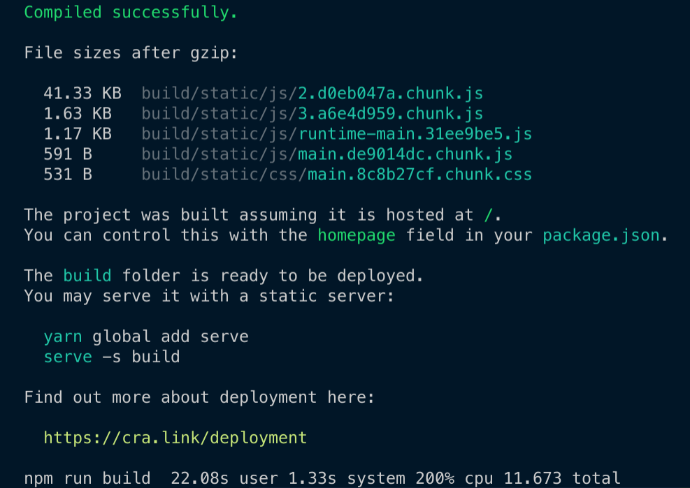
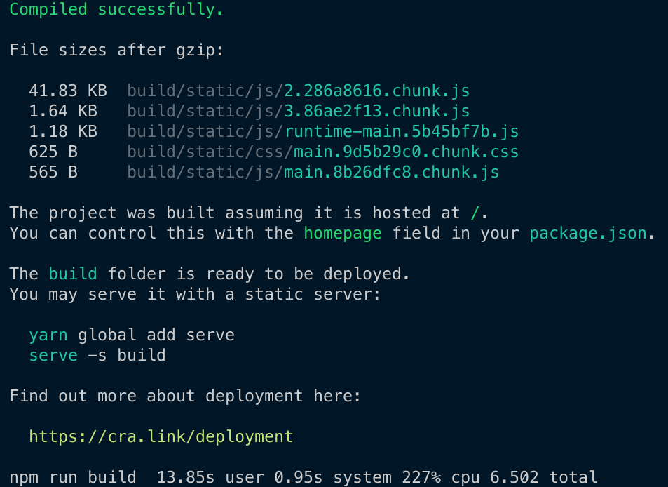

Builds can be made faster using tools like [esbuild](https://github.com/evanw/esbuild). However, if you're invested in [webpack](https://github.com/webpack/webpack) but would still like to take advantage of speedier builds, there is a way. This post takes us through using esbuild alongside webpack using [esbuild-loader](https://github.com/privatenumber/esbuild-loader).


<!--truncate-->

## Web development

With apologies to those suffering from JavaScript fatigue, once again the world of web development is evolving. It's long been common practice to run your JavaScript and TypeScript through some kind of Node.js based build tool, like webpack or rollup.js. These tools are written in the same language they compile to; JavaScript (or TypeScript). The new kids on the blog are tools like [esbuild](https://github.com/evanw/esbuild), [Vite](https://github.com/vitejs/vite) and [swc](https://github.com/swc-project/swc). The significant difference between these and their predecessors is that they are written in languages like Go and Rust. Go and Rust enjoy far greater performance than JavaScript. This translates into significantly faster builds. If you'd like to read about esbuild directly there's a [great post](https://blog.logrocket.com/fast-javascript-bundling-with-esbuild/) about it.

These new tools are transformative and represent a likely future of build tooling for the web. In the long term, the likes of esbuild, Vite and friends may well come to displace the current standard build tools. So the webpacks, the rollups and so on.

However, that’s the long term. There’s a lot of projects out there that are already heavily invested in their current build tooling. Mostly webpack. Migrating to a new build tool is no small piece of work. New projects might start with Vite, but existing ones are less likely to be ported. There’s a reason webpack is so popular. It does a lot of things very well indeed. It's battle tested on large projects; it's mature and it handles many use cases.

So if you’re a team that wants to have faster builds, but doesn’t have the time to go through a big migration... Is there anything you can do? Yes. There’s a middle ground to be explored. There’s a relatively new project named [esbuild-loader](https://github.com/privatenumber/esbuild-loader) developed by [hiroki osame](https://twitter.com/privatenumbr). It's a webpack loader built on top of esbuild. It allows users to swap out `ts-loader` or `babel-loader` with itself, and massively improve build speeds.

To declare an interest here, I'm the primary maintainer of [ts-loader](https://github.com/TypeStrong/ts-loader); a popular TypeScript loader that is commonly used with webpack. However, I feel strongly that the important thing here is developer productivity. As Node.js-based projects, `ts-loader` and `babel-loader` will never be able to compete with `esbuild-loader` in the same way. As a language, Go really, uh, goes!

Whilst esbuild may not work for all use cases, it will for the majority. As such `esbuild-loader` represents a middle ground; and an early way to get access to the increased build speed that esbuild offers _without_ saying goodbye to webpack. This post will look at using `esbuild-loader` in your webpack setup.

## Migrating an existing project to esbuild

It's very straightforward to migrate a project which uses either `babel-loader` or `ts-loader` to `esbuild-loader`. You install the dependency:

```bash
npm i -D esbuild-loader
```

Then if we are currently using `babel-loader`, we make this change to our `webpack.config.js`:

```diff
  module.exports = {
    module: {
      rules: [
-       {
-         test: /\.js$/,
-         use: 'babel-loader',
-       },
+       {
+         test: /\.js$/,
+         loader: 'esbuild-loader',
+         options: {
+           loader: 'jsx',  // Remove this if you're not using JSX
+           target: 'es2015'  // Syntax to compile to (see options below for possible values)
+         }
+       },

        ...
      ],
    },
  }
```

Or if we're using `ts-loader`, we make this change to our `webpack.config.js`:

```diff
  module.exports = {
    module: {
      rules: [
-       {
-         test: /\.tsx?$/,
-         use: 'ts-loader'
-       },
+       {
+         test: /\.tsx?$/,
+         loader: 'esbuild-loader',
+         options: {
+           loader: 'tsx',  // Or 'ts' if you don't need tsx
+           target: 'es2015'
+         }
+       },

        ...
      ]
    },
  }
```

## Creating a baseline application

Let's try `esbuild-loader` out in practice. We're going to create a new React application using [Create React App](https://create-react-app.dev/):

```bash
npx create-react-app my-app --template typescript
```

This will scaffold out a new React application using TypeScript in the `my-app` directory. It's worth knowing that Create React App uses `babel-loader` behind the scenes.

CRA also uses the [fork-ts-checker-webpack-plugin](https://github.com/TypeStrong/fork-ts-checker-webpack-plugin) to provide TypeScript type checking. This is very useful, as esbuild _just_ does transpilation and [does not intend to provide type checking support](https://esbuild.github.io/faq/#upcoming-roadmap). So it's tremendous we still have that plugin in place as otherwise we would lose type checking.

So we can understand the advantage of moving to esbuild, we first need a baseline to understand what performance looks like with babel-loader. We'll run `time npm run build` to execute a build of our simple app:



Our complete build, TypeScript type checking, transpilation, minification and so on, all took 22.08 seconds. The question now is, what will happen if we drop esbuild into the mix?

## CRACO

One way to customise a Create React App build is by running `npm run eject` and then customising the code that CRA pumps out. Doing so is fine, but it means you can't keep track with CRA's evolution. An alternative is to use a tool like [CRACO](https://github.com/gsoft-inc/craco) which allows us to tweak configuration in place. It describes itself this way:

> *C*reate *R*eact *A*pp *C*onfiguration *O*verride is an easy and comprehensible configuration layer for create-react-app.

We're going to use CRACO, so we'll add `esbuild-loader` and CRACO as dependencies:

```bash
npm install @craco/craco esbuild-loader --save-dev
```

Then we'll swap over our various `scripts` in our `package.json` to use `CRACO`:

```json
"start": "craco start",
"build": "craco build",
"test": "craco test",
```

Our app now uses CRACO, but we haven't yet configured it. So we'll add a `craco.config.js` file to the root of our project. This is where we swap out `babel-loader` for `esbuild-loader`:

```js
const {
  addAfterLoader,
  removeLoaders,
  loaderByName,
  getLoaders,
  throwUnexpectedConfigError,
} = require('@craco/craco');
const { ESBuildMinifyPlugin } = require('esbuild-loader');

const throwError = (message) =>
  throwUnexpectedConfigError({
    packageName: 'craco',
    githubRepo: 'gsoft-inc/craco',
    message,
    githubIssueQuery: 'webpack',
  });

module.exports = {
  webpack: {
    configure: (webpackConfig, { paths }) => {
      const { hasFoundAny, matches } = getLoaders(
        webpackConfig,
        loaderByName('babel-loader'),
      );
      if (!hasFoundAny) throwError('failed to find babel-loader');

      console.log('removing babel-loader');
      const { hasRemovedAny, removedCount } = removeLoaders(
        webpackConfig,
        loaderByName('babel-loader'),
      );
      if (!hasRemovedAny) throwError('no babel-loader to remove');
      if (removedCount !== 2)
        throwError('had expected to remove 2 babel loader instances');

      console.log('adding esbuild-loader');

      const tsLoader = {
        test: /\.(js|mjs|jsx|ts|tsx)$/,
        include: paths.appSrc,
        loader: require.resolve('esbuild-loader'),
        options: {
          loader: 'tsx',
          target: 'es2015',
        },
      };

      const { isAdded: tsLoaderIsAdded } = addAfterLoader(
        webpackConfig,
        loaderByName('url-loader'),
        tsLoader,
      );
      if (!tsLoaderIsAdded) throwError('failed to add esbuild-loader');
      console.log('added esbuild-loader');

      console.log('adding non-application JS babel-loader back');
      const { isAdded: babelLoaderIsAdded } = addAfterLoader(
        webpackConfig,
        loaderByName('esbuild-loader'),
        matches[1].loader, // babel-loader
      );
      if (!babelLoaderIsAdded)
        throwError('failed to add back babel-loader for non-application JS');
      console.log('added non-application JS babel-loader back');

      console.log('replacing TerserPlugin with ESBuildMinifyPlugin');
      webpackConfig.optimization.minimizer = [
        new ESBuildMinifyPlugin({
          target: 'es2015',
        }),
      ];

      return webpackConfig;
    },
  },
};
```

So what's happening here? The script looks for `babel-loader` usages in the default Create React App config. There will be two; one for TypeScript / JavaScript application code (we want to replace this) and one for non application JavaScript code. It's not too clear what non application JavaScript code there is or can be, so we'll leave it in place; it may be important. Significantly, the code we care about is the application code.

You cannot remove a _single_ loader using `CRACO`, so instead we'll remove both and we'll add back the non application JavaScript `babel-loader`. We'll also add `esbuild-loader` with the `{ loader: 'tsx', target: 'es2015' }` option set (to ensure we can process JSX/TSX).

Finally we'll swap out using Terser for JavaScript minification for esbuild as well.

Our migration is complete. The next time we build we'll have Create React App running using `esbuild-loader` _without_ having ejected. Once again we'll run `time npm run build` to execute a build of our simple app and determine how long it takes:



Our complete build, TypeScript type checking, transpilation, minification and so on, all took 13.85 seconds. By migrating to `esbuild-loader` we've reduced our overall compilation time by approximately one third; this is a tremendous improvement!

As your codebase scales and your application grows, compilation time can skyrocket also. With `esbuild-loader` you should get ongoing benefits to your build time.

[This post was originally published on LogRocket.](https://blog.logrocket.com/webpack-or-esbuild-why-not-both/)

<head>
    <link rel="canonical" href="https://blog.logrocket.com/webpack-or-esbuild-why-not-both/" />
</head>
