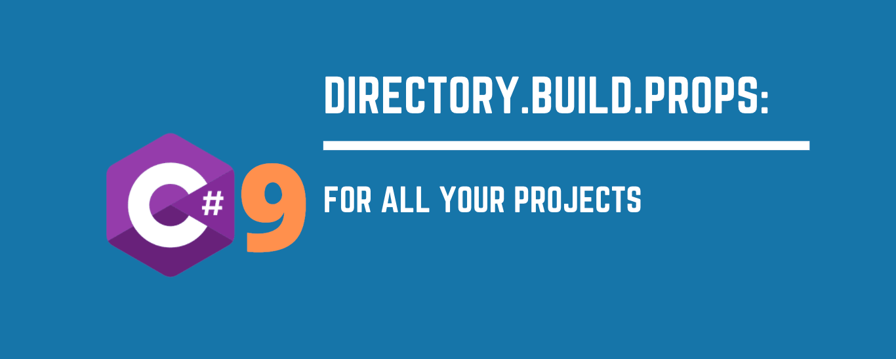

.NET Core can make use of C# 9 by making some changes to your `.csproj` files. There is a way to opt all projects in a solution into this behaviour in a _single_ place, through using a `Directory.Build.props` file and / or a `Directory.Build.targets` file. Here's how to do it.



<!--truncate-->

## "have you the good news about `Directory.Build.props`"?

[I wrote recently about using C# 9 with in-process Azure Functions.](../2021-07-01-c-sharp-9-azure-functions-in-process/index.md) What that amounted to, was using C# 9 with .NET Core.

One of the best things about blogging, is all that you get to learn along the way. After I put up that post, [Daniel Earwicker](https://twitter.com/danielearwicker) was kind enough to send this message:

[](https://twitter.com/danielearwicker/status/1412678642203828226)

I was intrigued that Daniel was able to configure all the projects in a solution to use the same approach using some strange incantations named `Directory.Build.props` and `Directory.Build.targets`. [Microsoft describes them thusly](https://docs.microsoft.com/en-us/visualstudio/msbuild/customize-your-build?view=vs-2019#directorybuildprops-and-directorybuildtargets):

> Prior to MSBuild version 15, if you wanted to provide a new, custom property to projects in your solution, you had to manually add a reference to that property to every project file in the solution. Or, you had to define the property in a `.props` file and then explicitly import the `.props` file in every project in the solution, among other things.
>
> However, now you can add a new property to every project in one step by defining it in a single file called `Directory.Build.props` in the root folder that contains your source.

Let's see if we can put it to use.

## `Directory.Build.props`: C# 9 for all

So, rather than us updating each of our `.csproj` files, we should be able to create a `Directory.Build.props` file to sit alongside our `.sln` file in the root of our source code. We'll add this into the file:

```xml
<Project>
 <PropertyGroup>
    <!-- use C# 9 -->
    <LangVersion>9.0</LangVersion>
 </PropertyGroup>
 <ItemGroup>
    <!-- allows some C# 9 support with .NET Core 3.1 https://github.com/manuelroemer/IsExternalInit -->
    <PackageReference Include="IsExternalInit" Version="1.0.1">
      <IncludeAssets>runtime; build; native; contentfiles; analyzers; buildtransitive</IncludeAssets>
      <PrivateAssets>all</PrivateAssets>
    </PackageReference>
  </ItemGroup>
</Project>
```

Now we're free to add projects into the solution, which will _already_ support C# 9 without us taking any further steps. It's as simple as that! Thanks to Daniel for sharing this super handy tip. ❤️🌻
