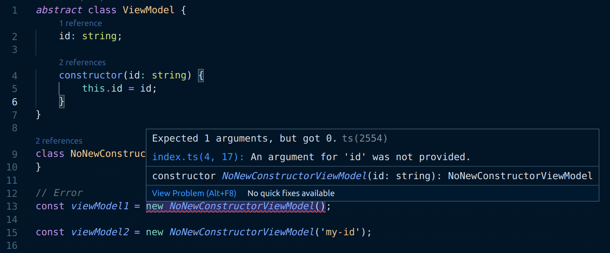
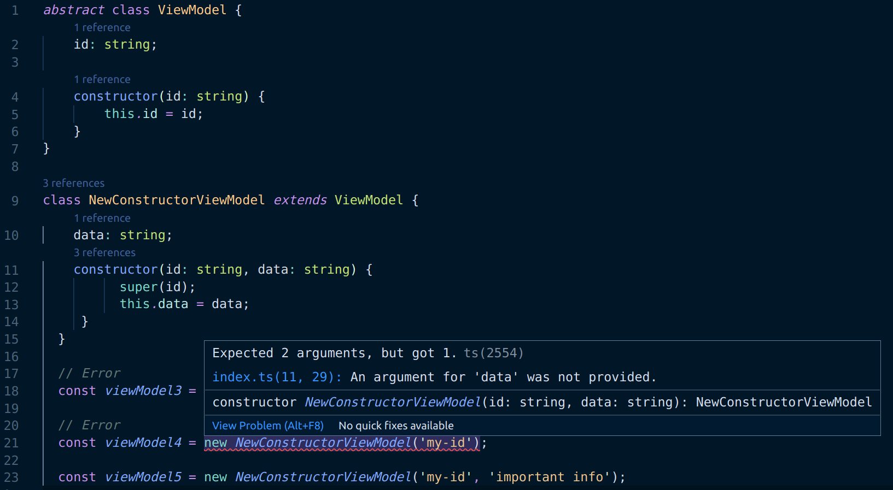

TypeScript has the ability to define classes as abstract. This means they cannot be instantiated directly, only non-abstract subclasses can be. Let's take a look at what this means when it comes to constructor usage.

<!--truncate-->

## Making a scratchpad

In order that we can dig into this, let's create ourselves a scratchpad project to work with. We're going to create a node project and install TypeScript as a dependency.

```bash
mkdir ts-abstract-constructors
cd ts-abstract-constructors
npm init --yes
npm install typescript @types/node --save-dev
```

We now have a `package.json` file set up. We need to initialise a TypeScript project as well:

```
npx tsc --init
```

This will give us a `tsconfig.json` file that will drive configuration of TypeScript. By default TypeScript transpiles to an older version of JavaScript that predates classes. So we'll update the config to target a newer version of the language that does include them:

```json
    "target": "es2020",
    "lib": ["es2020"],
```

Let's create ourselves a TypeScript file called `index.ts`. The name is not significant; we just need a file to develop in.

Finally we'll add a script to our `package.json` that compiles our TypeScript to JavaScript, and then runs the JS with node:

```json
"start": "tsc --project \".\" && node index.js"
```

## Making an abstract class

Now we're ready. Let's add an abstract class with a constructor to our `index.ts` file:

```ts
abstract class ViewModel {
  id: string;

  constructor(id: string) {
    this.id = id;
  }
}
```

Consider the `ViewModel` class above. Let's say we're building some kind of CRUD app, we'll have different views. Each of those views will have a corresponding viewmodel which is a subclass of the `ViewModel` abstract class. The `ViewModel` class has a mandatory `id` parameter in the constructor. This is to ensure that every viewmodel has an `id` value. If this were a real app, `id` would likely be the value with which an entity was looked up in some kind of database.

Importantly, all subclasses of `ViewModel` should either:

- not implement a constructor at all, leaving the base class constructor to become the default constructor of the subclass _or_

- implement their own constructor which invokes the `ViewModel` base class constructor.

## Taking our abstract class for a spin

Now we have it, let's see what we can do with our abstract class. First of all, can we instantiate our abstract class? We shouldn't be able to do this:

```
const viewModel = new ViewModel('my-id');

console.log(`the id is: ${viewModel.id}`);
```

And sure enough, running `npm start` results in the following error (which is also being reported by our editor; VS Code).

```shell
index.ts:9:19 - error TS2511: Cannot create an instance of an abstract class.

const viewModel = new ViewModel('my-id');
```


Tremendous. However, it's worth remembering that `abstract` is a TypeScript concept. When we compile our TS, although it's throwing a compilation error, it still transpiles an `index.js` file that looks like this:

```js
'use strict';
class ViewModel {
  constructor(id) {
    this.id = id;
  }
}
const viewModel = new ViewModel('my-id');
console.log(`the id is: ${viewModel.id}`);
```

As we can see, there's no mention of `abstract`; it's just a straightforward `class`. In fact, if we directly execute the file with `node index.js` we can see an output of:

```
the id is: my-id
```

So the transpiled code is valid JavaScript even if the source code isn't valid TypeScript. This all reminds us that `abstract` is a TypeScript construct.

## Subclassing without a new constructor

Let's now create our first subclass of `ViewModel` and attempt to instantiate it:

```ts
class NoNewConstructorViewModel extends ViewModel {}

// error TS2554: Expected 1 arguments, but got 0.
const viewModel1 = new NoNewConstructorViewModel();

const viewModel2 = new NoNewConstructorViewModel('my-id');
```



As the TypeScript compiler tells us, the second of these instantiations is legitimate as it relies upon the constructor from the base class as we'd hope. The first is not as there is no parameterless constructor.

## Subclassing with a new constructor

Having done that, let's try subclassing and implementing a new constructor which has two parameters (to differentiate from the constructor we're overriding):

```ts
class NewConstructorViewModel extends ViewModel {
  data: string;
  constructor(id: string, data: string) {
    super(id);
    this.data = data;
  }
}

// error TS2554: Expected 2 arguments, but got 0.
const viewModel3 = new NewConstructorViewModel();

// error TS2554: Expected 2 arguments, but got 1.
const viewModel4 = new NewConstructorViewModel('my-id');

const viewModel5 = new NewConstructorViewModel('my-id', 'important info');
```



Again, only one of the attempted instantiations is legitimate. `viewModel3` is not as there is no parameterless constructor. `viewModel4` is not as we have overridden the base class constructor with our new one that has two parameters. Hence `viewModel5` is our "Goldilocks" instantiation; it's just right!

It's also worth noting that we're calling `super` in the `NewConstructorViewModel` constructor. This invokes the constructor of the `ViewModel` base (or "super") class. TypeScript enforces that we pass the appropriate arguments (in our case a single `string`).

## Wrapping it up

We've seen that TypeScript ensures correct usage of constructors when we have an abstract class. Importantly, all subclasses of abstract classes either:

- do not implement a constructor at all, leaving the base class constructor (the abstract constructor) to become the default constructor of the subclass _or_

- implement their own constructor which invokes the base (or "super") class constructor with the correct arguments.

[This post was originally published on LogRocket.](https://blog.logrocket.com/typescript-abstract-classes-and-constructors/)

<head>
    <link rel="canonical" href="https://blog.logrocket.com/typescript-abstract-classes-and-constructors/" />
</head>
