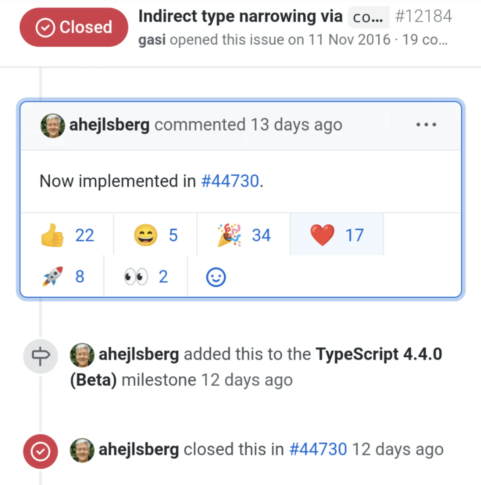

An exciting feature is shipping with TypeScript 4.4. It has the name ["Control Flow Analysis of Aliased Conditions"](https://devblogs.microsoft.com/typescript/announcing-typescript-4-4-beta/#cfa-aliased-conditions) which is quite a mouthful. This post unpacks what this feature is, and demonstrates the contribution it makes to improving the readability of code.

<!--truncate-->

## Updated 30th September 2021

This blog evolved to become a talk:

<iframe width="560" height="315" src="https://www.youtube.com/embed/LxZx3ycrxI0" title="YouTube video player" frameBorder="0" allow="accelerometer; autoplay; clipboard-write; encrypted-media; gyroscope; picture-in-picture" allowFullScreen></iframe>

<!--truncate-->

## Indirect type narrowing via `const`

On June 24th 2021, an issue on the TypeScript GitHub repository with the title "Indirect type narrowing via `const`" was closed by [Anders Hejlsberg](https://www.twitter.com/ahejlsberg). The issue had been open since 2016 and it was closed as it was covered by [a pull request addressing control flow analysis of aliased conditional expressions and discriminants](https://github.com/microsoft/TypeScript/pull/44730).

It's fair to say that the TypeScript community was very excited about this, both judging from reactions on the issue:

[](https://github.com/microsoft/TypeScript/issues/12184#issuecomment-867928408)

And also the general delight on Twitter:

[](https://www.twitter.com/johnny_reilly/status/1408162514504933378)

What Zeh said is a great explanation of the significance of this feature:

> Lack of type narrowing with consts made me repeat code, or avoid helpfully namef consts, too many times

With this feature we're going to have the possibility of more readable code, and less repetition. That's amazing!

## The code we would like to write

Rather than starting with an explanation of what this new language feature is, let's instead start from the position of writing some code and seeing what's possible with TypeScript 4.4 that we couldn't tackle previously.

Here's a simple function that adds all the parameters it receives and returns the total. It's a tolerant function and will allow people to supply numbers in the form of strings as well; so it would successfully process `'2'` as it would `2`. This is, of course, a slightly contrived example, but should be useful for demonstrating the new feature.

```ts
function add(...thingsToAdd: (string | number)[]): number {
  let total = 0;
  for (const thingToAdd of thingsToAdd) {
    if (typeof thingToAdd === 'string') {
      total += Number(thingToAdd);
    } else {
      total += thingToAdd;
    }
  }
  return total;
}

console.log(add(1, '7', '3', 9));
```

[Try it out in the TypeScript playground.](https://www.typescriptlang.org/play?ts=4.3.5#code/GYVwdgxgLglg9mABAQwCaoBQDodQBYxgDmAzgCpwCC6AXIhiVAE6FGIA+iYIAtgEYBTJgEoA2gF1hdbvyGIA3gChEKxABsBURFDhRkaxAF5EABgDcy1cDhN6EBI20FiFaqkRxgT1uSrphCpaqqjBeGFAAngAOAp7eLn7uhsmIAOSMLMSpAUrBeao6egYA1MYAcryCTOHORK7+FvkqAL6IAmokAoFNeYX6iKXxdYmNTc1BiOPBTJogTEh9ahbjivZgJHAaWGpwRBhomACMADRpAOypp6kAzJeIAJzCwkA)

If we look at this function, whilst it works, it's not super expressive. The `typeof thingToAdd === 'string'` performs two purposes:

1. It narrows the type from `string | number` to `string`
2. It branches the logic, such that the `string` can be coerced into a `number` and added to the total.

You can infer this from reading the code. However, what if we were to re-write it to capture intent? Let's try creating a `shouldCoerceToNumber` constant which expresses the action we need to take:

```ts
function add(...thingsToAdd: (string | number)[]): number {
  let total = 0;
  for (const thingToAdd of thingsToAdd) {
    const shouldCoerceToNumber = typeof thingToAdd === 'string';
    if (shouldCoerceToNumber) {
      total += Number(thingToAdd);
    } else {
      total += thingToAdd;
    }
  }
  return total;
}

console.log(add(1, '7', '3', 9));
```

[Try it out in the TypeScript playground.](https://www.typescriptlang.org/play?ts=4.3.5#code/GYVwdgxgLglg9mABAQwCaoBQDodQBYxgDmAzgCpwCC6AXIhiVAE6FGIA+iYIAtgEYBTJgEoA2gF1hdbvyGIA3gChEKxABsBURFDhRkaxAF5EABgDcy1cDhN6EBI20FiFaqkRxgT1uSrphCpaqqvZgjiR4cCBqqADCcEIQAhQAcryCtsZQAJ4ADgKe3i5+7oZliADkjCzEFRbBwTBeDJHRcQlMSanpQgFKDQPauvqIANTGabJMGPisrv71gwC+iAJqJAKBgw06egbjRUTzqIsDS0GI58FMmiBMSLv6FueKoSRwGlhqcEQYaJgARgANJUAOwVEEVADMEMQAE5hMIgA)

This is valid code; however TypeScript 4.3 is choking with an error:


The error being surfaced is:

> `Operator '+=' cannot be applied to types 'number' and 'string | number'.(2365)`

What's happening here, is TypeScript _does not remember_ that `shouldCoerceToNumber` represents a type narrowing of `thingToAdd` from `string | number` to `string`. So the type of `thingToAdd` remains unchanged from `string | number` when we write code that depends upon it.

This has terrible consequences. It means we can't write this more expressive code that we're interested in, and would be better for maintainers of our codebase. And this is what TypeScript 4.4, with our new feature, unlocks. Let's change the playground to use TypeScript 4.4 instead:


[Try it out in the TypeScript playground.](https://www.typescriptlang.org/play?ts=4.4.0-beta#code/GYVwdgxgLglg9mABAQwCaoBQDodQBYxgDmAzgCpwCC6AXIhiVAE6FGIA+iYIAtgEYBTJgEoA2gF1hdbvyGIA3gChEKxABsBURFDhRkaxAF5EABgDcy1cDhN6EBI20FiFaqkRxgT1uSrphCpaqqvZgjiR4cCBqqADCcEIQAhQAcryCtsZQAJ4ADgKe3i5+7oZliADkjCzEFRbBwTBeDJHRcQlMSanpQgFKDQPauvqIANTGabJMGPisrv71gwC+iAJqJAKBgw06egbjRUTzqIsDS0GI58FMmiBMSLv6FueKoSRwGlhqcEQYaJgARgANJUAOwVEEVADMEMQAE5hMIgA)

Delightfully, we no longer have errors now we've made the switch. And as the screenshot shows, the `thingToAdd` variable has been narrowed to a `string`. This is because Control Flow Analysis of Aliased Conditions is now in play.

So we're now writing more expressive code, and TypeScript is willing us on our way.

## Read more

This feature is a tremendous addition to the TypeScript language. It should have a significant long-term positive impact on how people write code with TypeScript.

To read more, do check out the excellent [TypeScript 4.4 beta release notes](https://devblogs.microsoft.com/typescript/announcing-typescript-4-4-beta/#cfa-aliased-conditions). There's also some other exciting feature shipping with this release as well. Thanks very much to the TypeScript team for once again improving the language, and making a real contribution to people being able to write readable code.

[This post was originally published on LogRocket.](https://blog.logrocket.com/typescript-4-4-and-more-readable-code/)

<head>
    <link rel="canonical" href="https://blog.logrocket.com/typescript-4-4-and-more-readable-code/" />
</head>
