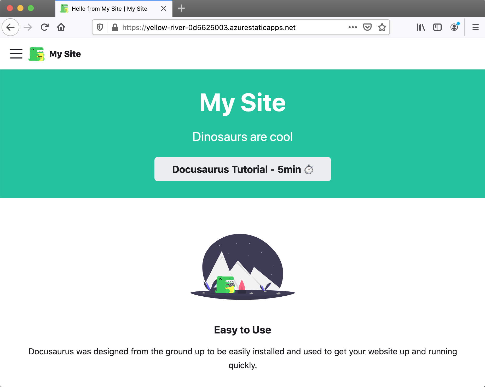

This post demonstrates how to deploy [Azure Static Web Apps](https://docs.microsoft.com/en-us/azure/static-web-apps/overview) using Bicep and Azure DevOps. It includes a workaround for the ["Provider is invalid.  Cannot change the Provider. Please detach your static site first if you wish to use to another deployment provider." issue](https://github.com/Azure/static-web-apps/issues/516).


## Bicep template

The first thing we're going to do is create a folder where our Bicep file for deploying our Azure Static Web App will live:

```bash
mkdir infra/static-web-app -p
```

Then we'll create a `main.bicep` file:

```bicep
param repositoryUrl string
param repositoryBranch string

param location string = 'westeurope'
param skuName string = 'Free'
param skuTier string = 'Free'

param appName string

resource staticWebApp 'Microsoft.Web/staticSites@2020-12-01' = {
  name: appName
  location: location
  tags: tagsObj
  sku: {
    name: skuName
    tier: skuTier
  }
  properties: {
    // The provider, repositoryUrl and branch fields are required for successive deployments to succeed
    // for more details see: https://github.com/Azure/static-web-apps/issues/516
    provider: 'DevOps'
    repositoryUrl: repositoryUrl
    branch: repositoryBranch
    buildProperties: {
      skipGithubActionWorkflowGeneration: true
    }
  }
}

output deployment_token string = listSecrets(staticWebApp.id, staticWebApp.apiVersion).properties.apiKey 
```

There's some things to draw attention to in the code above:

1. The `provider`, `repositoryUrl` and `branch` fields are required for successive deployments to succeed. In our case we're deploying via Azure DevOps and so our provider is `'DevOps'`. For more details, [look at this issue](https://github.com/Azure/static-web-apps/issues/516). 
2. We're creating a `deployment_token` which we'll need in order that we can deploy into the Azure Static Web App resource.

## Static Web App

In order that we can test out Azure Static Web Apps, what we need is a static web app.  You could use pretty much anything here; we're going to use Docusaurus.  We'll execute this single command: 

```bash
npx @docusaurus/init@latest init static-web-app classic
```

Which will scaffold a Docusaurus site in a folder named `static-web-app`. We don't need to change it any further; let's just see if we can deploy it.

## Azure Pipeline

We're going to add an `azure-pipelines.yml` file which Azure DevOps can use to power a pipeline:  

```yml
stages:
- stage: build
  displayName: build
  pool:
    vmImage: 'ubuntu-latest'
  jobs:
  - job: BuildAndDeploy
    displayName: 'Build and Deploy'
    steps:
    - checkout: self
      submodules: true
        
    - bash: az bicep build --file infra/static-web-app/main.bicep
      displayName: "Compile Bicep to ARM"

    - task: AzureResourceManagerTemplateDeployment@3
      name: DeployStaticWebAppInfra
      displayName: Deploy Static Web App infra
      inputs:
        deploymentScope: Resource Group
        azureResourceManagerConnection: ${{ parameters.serviceConnection }}
        subscriptionId: $(subscriptionId)
        action: Create Or Update Resource Group
        resourceGroupName: $(azureResourceGroup)
        location: $(location)
        templateLocation: Linked artifact
        csmFile: 'infra/static-web-app/main.json' # created by bash script
        overrideParameters: >-
          -repositoryUrl $(repo)
          -repositoryBranch $(Build.SourceBranchName)
          -appName $(staticWebAppName)
        deploymentMode: Incremental
        deploymentOutputs: deploymentOutputs

    - task: PowerShell@2
      name: 'SetDeploymentOutputVariables'
      displayName: "Set Deployment Output Variables"
      inputs:
        targetType: inline
        script: |
          $armOutputObj = '$(deploymentOutputs)' | ConvertFrom-Json
          $armOutputObj.PSObject.Properties | ForEach-Object {
            $keyname = $_.Name
            $value = $_.Value.value

            # Creates a standard pipeline variable
            Write-Output "##vso[task.setvariable variable=$keyName;]$value"

            # Creates an output variable
            Write-Output "##vso[task.setvariable variable=$keyName;issecret=true;isOutput=true]$value"

            # Display keys in pipeline
            Write-Output "output variable: $keyName"
          }
        pwsh: true

    - task: AzureStaticWebApp@0
      name: DeployStaticWebApp
      displayName: Deploy Static Web App
      inputs:
        app_location: 'static-web-app'
        # api_location: 'api'
        output_location: 'build'
        azure_static_web_apps_api_token: $(deployment_token) # captured from deploymentOutputs
```

When the pipeline is run, it does the following:

1. Compiles our Bicep into an ARM template
2. Deploys the compiled ARM template to Azure
3. Captures the deployment outputs (essentially the `deployment_token`) and converts them into variables to use in the pipeline
4. Deploys our Static Web App using the `deployment_token`

A successful pipeline looks something like this:


What you might notice is that the `AzureStaticWebApp` is itself installing and building our application. This is handled by [Microsoft Oryx](https://github.com/Microsoft/Oryx). The upshot of this is that we don't need to manually run `npm install` and `npm build` ourselves; the `AzureStaticWebApp` task will take care of it for us.

Finally, let's see if we've deployed something successfully...



We have! It's worth noting that you'll likely want to give your Azure Static Web App a lovelier URL, and perhaps even put it behind Azure Front Door as well.