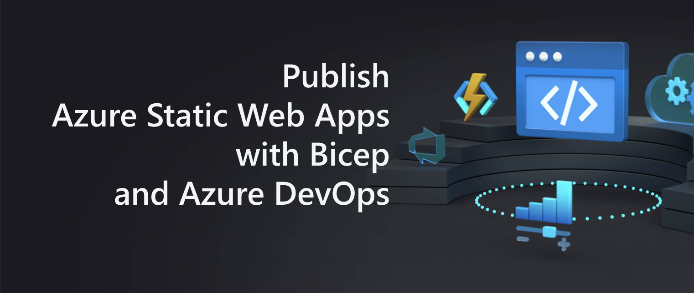
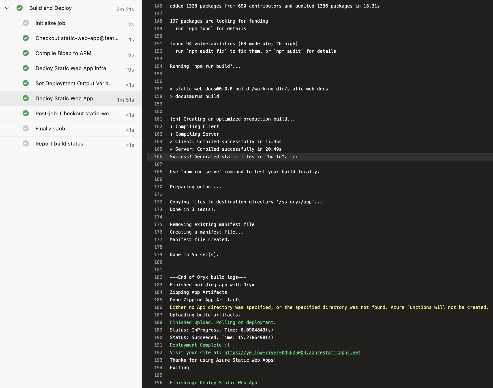
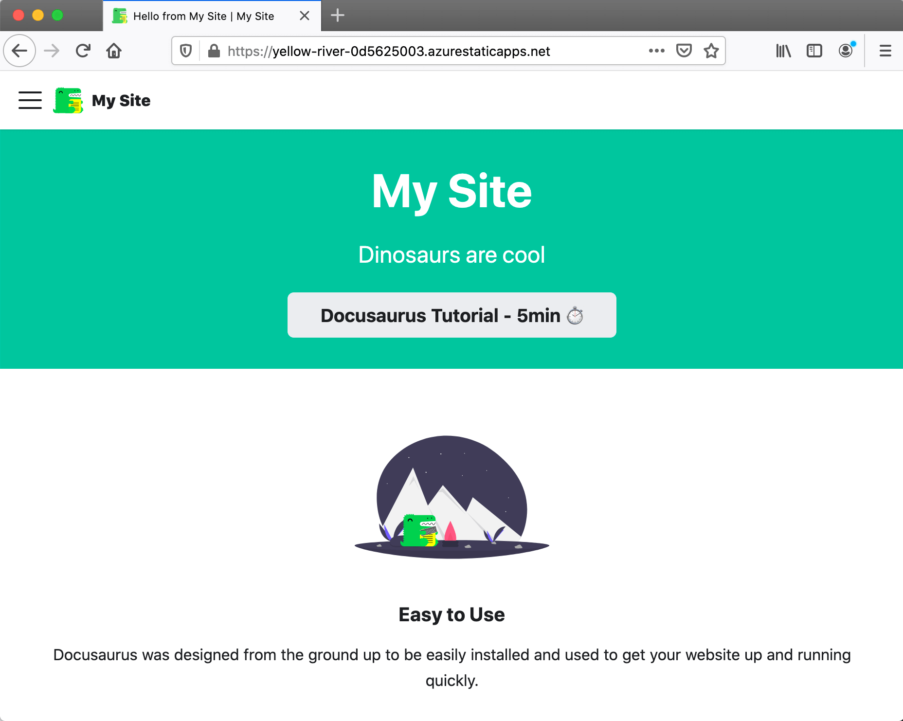

This post demonstrates how to deploy [Azure Static Web Apps](https://docs.microsoft.com/en-us/azure/static-web-apps/overview) using Bicep and Azure DevOps. It includes a few workarounds for the ["Provider is invalid. Cannot change the Provider. Please detach your static site first if you wish to use to another deployment provider." issue](https://github.com/Azure/static-web-apps/issues/516).



<!--truncate-->

## Bicep template

The first thing we're going to do is create a folder where our Bicep file for deploying our Azure Static Web App will live:

```bash
mkdir infra/static-web-app -p
```

Then we'll create a `main.bicep` file:

```bicep
param repositoryUrl string
param repositoryBranch string

param location string = 'westeurope'
param skuName string = 'Free'
param skuTier string = 'Free'

param appName string

resource staticWebApp 'Microsoft.Web/staticSites@2020-12-01' = {
  name: appName
  location: location
  sku: {
    name: skuName
    tier: skuTier
  }
  properties: {
    // The provider, repositoryUrl and branch fields are required for successive deployments to succeed
    // for more details see: https://github.com/Azure/static-web-apps/issues/516
    provider: 'DevOps'
    repositoryUrl: repositoryUrl
    branch: repositoryBranch
    buildProperties: {
      skipGithubActionWorkflowGeneration: true
    }
  }
}
```

There's some things to draw attention to in the code above. The `provider`, `repositoryUrl` and `branch` fields are required for successive deployments to succeed. In our case we're deploying via Azure DevOps and so our provider is `'DevOps'`. For more details, [look at this issue](https://github.com/Azure/static-web-apps/issues/516).

## Static Web App

In order that we can test out Azure Static Web Apps, what we need is a static web app. You could use pretty much anything here; we're going to use Docusaurus. We'll execute this single command:

```bash
npx @docusaurus/init@latest init static-web-app classic
```

Which will scaffold a Docusaurus site in a folder named `static-web-app`. We don't need to change it any further; let's just see if we can deploy it.

## Azure Pipeline

We're going to add an `azure-pipelines.yml` file which Azure DevOps can use to power a pipeline:

```yml
trigger:
  - main

pool:
  vmImage: ubuntu-latest

steps:
  - checkout: self
    submodules: true

  - bash: az bicep build --file infra/static-web-app/main.bicep
    displayName: 'Compile Bicep to ARM'

  - task: AzureResourceManagerTemplateDeployment@3
    name: DeployStaticWebAppInfra
    displayName: Deploy Static Web App infra
    inputs:
      deploymentScope: Resource Group
      azureResourceManagerConnection: $(serviceConnection)
      subscriptionId: $(subscriptionId)
      action: Create Or Update Resource Group
      resourceGroupName: $(azureResourceGroup)
      location: $(location)
      templateLocation: Linked artifact
      csmFile: 'infra/static-web-app/main.json' # created by bash script
      overrideParameters: >-
        -repositoryUrl $(repo)
        -repositoryBranch $(Build.SourceBranchName)
        -appName $(staticWebAppName)
      deploymentMode: Incremental
      deploymentOutputs: deploymentOutputs

  # Only necessary when consuming deploymentOutputs
  # - task: PowerShell@2
  #   name: 'SetDeploymentOutputVariables'
  #   displayName: 'Set Deployment Output Variables'
  #   inputs:
  #     targetType: inline
  #     script: |
  #       $armOutputObj = '$(deploymentOutputs)' | ConvertFrom-Json
  #       $armOutputObj.PSObject.Properties | ForEach-Object {
  #         $keyname = $_.Name
  #         $value = $_.Value.value

  #         # Creates a standard pipeline variable
  #         Write-Output "##vso[task.setvariable variable=$keyName;issecret=true]$value"

  #         # Display keys in pipeline
  #         Write-Output "output variable: $keyName"
  #       }
  #     pwsh: true

  - task: AzureCLI@2
    displayName: 'Acquire API key for deployment'
    inputs:
      azureSubscription: $(serviceConnection)
      scriptType: bash
      scriptLocation: inlineScript
      inlineScript: |
        APIKEY=$(az staticwebapp secrets list --name $(staticWebAppName) | jq -r '.properties.apiKey')
        echo "##vso[task.setvariable variable=apiKey;issecret=true]$APIKEY"

  - task: AzureStaticWebApp@0
    name: DeployStaticWebApp
    displayName: Deploy Static Web App
    inputs:
      app_location: 'static-web-app'
      # api_location: 'api' # we don't have an API
      output_location: 'build'
      azure_static_web_apps_api_token: $(apiKey)
```

When the pipeline is run, it does the following:

1. Compiles our Bicep into an ARM template
2. Deploys the compiled ARM template to Azure
3. Captures the deployment outputs (essentially the `deployment_token`) and converts them into variables to use in the pipeline
4. Deploys our Static Web App using the `deployment_token`

The pipeline depends upon a number of variables:

- `azureResourceGroup` - the name of your resource group in Azure where the app will be deployed
- `location` - where your app is deployed, eg `northeurope`
- `repo` - the URL of your repository in Azure DevOps, eg https://dev.azure.com/johnnyreilly/_git/azure-static-web-apps
- `serviceConnection` - the name of your AzureRM service connection in Azure DevOps
- `staticWebAppName` - the name of your static web app, eg `azure-static-web-apps-johnnyreilly`
- `subscriptionId` - your Azure subscription id from the [Azure Portal](https://portal.azure.com)

A successful pipeline looks something like this:



What you might notice is that the `AzureStaticWebApp` is itself installing and building our application. This is handled by [Microsoft Oryx](https://github.com/Microsoft/Oryx). The upshot of this is that we don't need to manually run `npm install` and `npm build` ourselves; the `AzureStaticWebApp` task will take care of it for us.

Finally, let's see if we've deployed something successfully...



We have! It's worth noting that you'll likely want to give your Azure Static Web App a lovelier URL, and perhaps even put it behind Azure Front Door as well.

## `Provider is invalid` workaround 2

[Shane Neff](https://www.linkedin.com/in/shaneneff/) was attempting to follow the instructions in this post and encountered issues. He shared his struggles with me as he encountered the ["Provider is invalid. Cannot change the Provider. Please detach your static site first if you wish to use to another deployment provider." issue](https://github.com/Azure/static-web-apps/issues/516).

He was good enough to share his solution as well, which is inserting this task at the start of the pipeline (before the `az bicep build` step):

```yml
- task: AzureCLI@2
  inputs:
    azureSubscription: '<name of your service connection>'
    scriptType: 'bash'
    scriptLocation: 'inlineScript'
    inlineScript: 'az staticwebapp disconnect -n <name of your app>'
```

I haven't had the problems that Shane has had myself, but I wanted to share his fix for the people out there who almost certainly are bumping on this.
