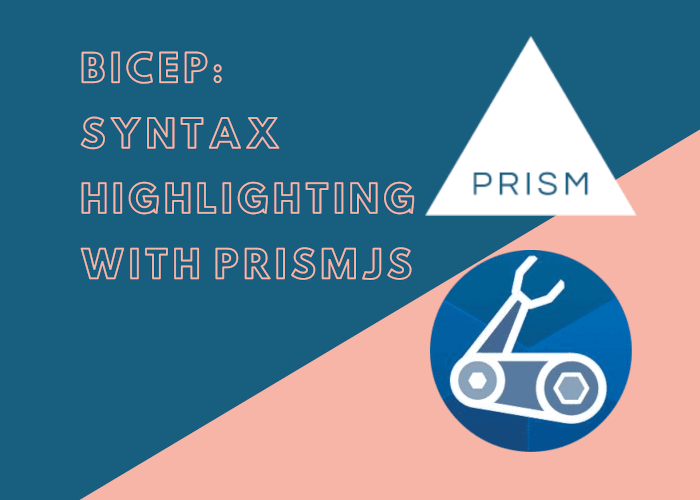

Bicep is an amazing language, it's also very new. If you want to write attractive code snippets about Bicep, you can by using PrismJS (and Docusaurus). This post shows you how.



<!--truncate-->

## Syntax highlighting

I've been writing blog posts about Bicep for a little while. I was frustrated that the code snippets were entirely unhighlighted. I'm keen my posts are as readable as possible, and so I [looked into adding support to PrismJS](https://github.com/PrismJS/prism/pull/3027) which is what [Docusaurus](https://docusaurus.io/) uses to power syntax highlighting.

Whilst my regex fu is amateur at best, happily [Michael Schmidt](https://github.com/RunDevelopment) of the PrismJS family is considerably better. He took the support I added and [made it much better](https://github.com/PrismJS/prism/pull/3028).

## Docusaurus meet Bicep

If you have any code snippets that start with three backticks and the word `bicep`...

````
```bicep
// code goes here...
````

... then ideally you'd like to see some syntax highlighting in your post. Since Bicep isn't "in the box" for Docusaurus you need to [explicitly opt into support like so:](https://docusaurus.io/docs/next/markdown-features/code-blocks#supported-languages)

```js
    prism: {
      additionalLanguages: ["powershell", "csharp", "docker", "bicep"],
    },
```

Above you can see a snippet from my own [`docusaurus.config.js`](https://github.com/johnnyreilly/blog.johnnyreilly.com/blob/b2df93efb72adc32d9f45de4f727e890e59a4919/blog-website/docusaurus.config.js#L185) which adds Bicep, alongside the other additional languages I use.

With this in place, you would typically get all the syntax highlighting support you need.

## Early adoption workaround

I'm writing this post before the latest version of PrismJS has shipped. As such, Bicep support isn't available by default yet. But if you're an early adopter, you can get support right now. The secret is adding a `resolutions` section to your `package.json` which points to the GitHub Repo [where Prism lives](https://github.com/PrismJS/prism):

```json
  "resolutions": {
    "prismjs": "PrismJS/prism"
  },
```

This will mean that Yarn (if you're using Docusaurus you're probably using Yarn) pulls `prismjs` directly from GitHub, as demonstrated by the `yarn.lock` file:

```
prismjs@PrismJS/prism, prismjs@^1.23.0:
  version "1.24.1"
  resolved "https://codeload.github.com/PrismJS/prism/tar.gz/59f449d33dc9fd19302f21aad95fc0b5028ac830"
```

## What does it look like?

Finally, let's see if works. Here's a Bicep code snippet that I borrowed from [an earlier post](../2021-08-19-bicep-syntax-highlighting-with-prismjs/index.md):

```bicep
param repositoryUrl string
param repositoryBranch string

param location string = 'westeurope'
param skuName string = 'Free'
param skuTier string = 'Free'

param appName string

resource staticWebApp 'Microsoft.Web/staticSites@2020-12-01' = {
  name: appName
  location: location
  tags: tagsObj
  sku: {
    name: skuName
    tier: skuTier
  }
  properties: {
    // The provider, repositoryUrl and branch fields are required for successive deployments to succeed
    // for more details see: https://github.com/Azure/static-web-apps/issues/516
    provider: 'DevOps'
    repositoryUrl: repositoryUrl
    branch: repositoryBranch
    buildProperties: {
      skipGithubActionWorkflowGeneration: true
    }
  }
}
```

As you can see, it's delightfully highlighted by PrismJS. Enjoy!
