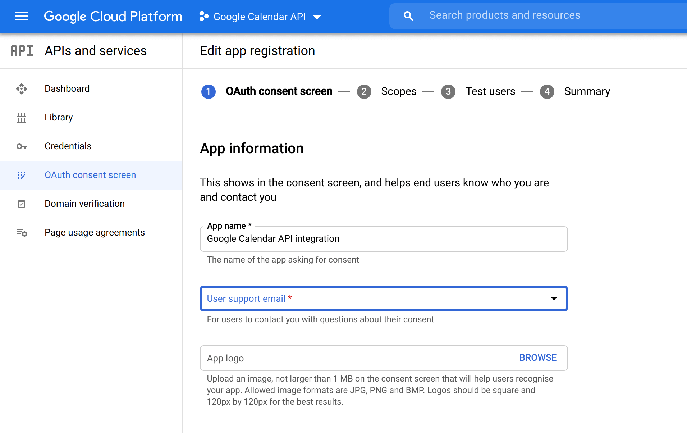

Google has a wealth of APIs which we can interact with. At the time of writing, there's more than two hundred available; including YouTube, Google Calendar and GMail (alongside many others). To integrate with these APIs, it's necessary to authenticate and then use that credential with the API. This post will take you through how to do just that using TypeScript. It will also demonstrate how to use one of those APIs: the Google Calendar API.

<!--truncate-->

## Creating an OAuth 2.0 Client ID on the Google Cloud Platform

The first thing we need to do is go to the [Google Cloud Platform to create a project](https://console.cloud.google.com/projectcreate). The name of the project doesn't matter particularly; although it can be helpful to name the project to align with the API you're intending to consume. That's what we'll do here as we plan to integrate with the Google Calendar API:


The project is the container in which the OAuth 2.0 Client ID will be housed. Now we've created the project, let's go to the [credentials screen](https://console.cloud.google.com/apis/credentials) and create an OAuth Client ID using the Create Credentials dropdown:


You'll likely have to create an OAuth consent screen before you can create the OAuth Client ID. Going through the journey of doing that feels a little daunting as many questions have to be answered. This is because the consent screen can be used for a variety of purposes beyond the API authentication we're looking at today.

When challenged, you can generally accept the defaults and proceed. The user type you'll require will be "External":


You'll also be required to create an app registration - all that's really required here is a name (which can be anything) and your email address:



You don't need to worry about scopes. You can either plan to publish the app, or alternately set yourself up to be a test user - you'll need to do one of these in order that you can authenticate with the app. Continuing to the end of the journey should provide you with the OAuth consent screen which you need in order that you may then create the OAuth Client ID.

Creating the OAuth Client ID is slightly confusing as the "Application type" required is "TVs and Limited Input devices".


We're using this type of application as we want to acquire a [refresh token](https://oauth.net/2/grant-types/refresh-token/) which we'll be able to use in future to aquire access tokens which will be used to access the Google APIs.

Once it's created, you'll be able to download the Client ID from the Google Cloud Platform:


When you download it, it should look something like this:

```json
{
  "installed": {
    "client_id": "CLIENT_ID",
    "project_id": "PROJECT_ID",
    "auth_uri": "https://accounts.google.com/o/oauth2/auth",
    "token_uri": "https://oauth2.googleapis.com/token",
    "auth_provider_x509_cert_url": "https://www.googleapis.com/oauth2/v1/certs",
    "client_secret": "CLIENT_SECRET",
    "redirect_uris": ["urn:ietf:wg:oauth:2.0:oob", "http://localhost"]
  }
}
```

You'll need the `client_id`, `client_secret` and `redirect_uris` - but keep them in a safe place and don't commit `client_id` and `client_secret` to source control!

## Acquiring a refresh token

Now we've got our `client_id` and `client_secret`, we're ready to write a simple node command line application which we can use to obtain a refresh token. This is actually a multi-stage process that will end up looking like this:

- Provide the Google authentication provider with the `client_id` and `client_secret`, in return it will provide an authentication URL.
- Open the authentication URL in the browser and grant consent, the provider will hand over a code.
- Provide the Google authentication provider with the `client_id`, `client_secret` and the code, it will acquire and provide users with a refresh token.

Let's start coding. We'll initialise a TypeScript Node project like so:

```bash
mkdir src
cd src
npm init -y
npm install googleapis ts-node typescript yargs @types/yargs @types/node
npx tsc --init
```

We've added a number of dependencies that will allow us to write a TypeScript Node command line application. We've also added a dependency to the [`googleapis`](https://www.npmjs.com/package/googleapis) package which describes itself as:

> Node.js client library for using Google APIs. Support for authorization and authentication with OAuth 2.0, API Keys and JWT tokens is included.

We're going to make use of the OAuth 2.0 part. We'll start our journey by creating a file called `google-api-auth.ts`:

```ts
import { getArgs, makeOAuth2Client } from './shared';

async function getToken() {
  const { clientId, clientSecret, code } = await getArgs();
  const oauth2Client = makeOAuth2Client({ clientId, clientSecret });

  if (code) await getRefreshToken(code);
  else getAuthUrl();

  async function getAuthUrl() {
    const url = oauth2Client.generateAuthUrl({
      // 'online' (default) or 'offline' (gets refresh_token)
      access_type: 'offline',

      // scopes are documented here: https://developers.google.com/identity/protocols/oauth2/scopes#calendar
      scope: [
        'https://www.googleapis.com/auth/calendar',
        'https://www.googleapis.com/auth/calendar.events',
      ],
    });

    console.log(`Go to this URL to acquire a refresh token:\n\n${url}\n`);
  }

  async function getRefreshToken(code: string) {
    const token = await oauth2Client.getToken(code);
    console.log(token);
  }
}

getToken();
```

And a common file named `shared.ts` which `google-api-auth.ts` imports and which we'll re-use later:

```ts
import { google } from 'googleapis';
import yargs from 'yargs/yargs';
const { hideBin } = require('yargs/helpers');

export async function getArgs() {
  const argv = await Promise.resolve(yargs(hideBin(process.argv)).argv);

  const clientId = argv['clientId'] as string;
  const clientSecret = argv['clientSecret'] as string;

  const code = argv.code as string | undefined;
  const refreshToken = argv.refreshToken as string | undefined;
  const test = argv.test as boolean;

  if (!clientId) throw new Error('No clientId ');
  console.log('We have a clientId');

  if (!clientSecret) throw new Error('No clientSecret');
  console.log('We have a clientSecret');

  if (code) console.log('We have a code');
  if (refreshToken) console.log('We have a refreshToken');

  return { code, clientId, clientSecret, refreshToken, test };
}

export function makeOAuth2Client({
  clientId,
  clientSecret,
}: {
  clientId: string;
  clientSecret: string;
}) {
  return new google.auth.OAuth2(
    /* YOUR_CLIENT_ID */ clientId,
    /* YOUR_CLIENT_SECRET */ clientSecret,
    /* YOUR_REDIRECT_URL */ 'urn:ietf:wg:oauth:2.0:oob',
  );
}
```

The `getToken` function above does these things:

1. If given a `client_id` and `client_secret` it will obtain an authentication URL.
2. If given a `client_id`, `client_secret` and `code` it will obtain a refresh token (scoped to access the Google Calendar API).

We'll add an entry to our `package.json` which will allow us to run our console app:

```json
    "google-api-auth": "ts-node google-api-auth.ts"
```

Now we're ready to acquire the refresh token. We'll run the following command (substituting in the appropriate values):

`npm run google-api-auth -- --clientId CLIENT_ID --clientSecret CLIENT_SECRET`

Click on the URL that is generated in the console, it should open up a consent screen in the browser which looks like this:


Authenticate and grant consent and you should get a code:


Then (quickly) paste the acquired code into the following command:

`npm run google-api-auth -- --clientId CLIENT_ID --clientSecret CLIENT_SECRET --code THISISTHECODE`

The `refresh_token` (alongside much else) will be printed to the console. Grab it and put it somewhere secure. Again, no storing in source control!

It's worth taking a moment to reflect on what we've done. We've acquired a refresh token which involved a certain amount of human interaction. We've had to run a console command, do some work in a browser and run another commmand. You wouldn't want to do this repeatedly because it involves human interaction. Intentionally it cannot be automated. However, once you've acquired the refresh token, you can use it repeatedly until it expires (which may be never or at least years in the future). So once you have the refresh token, and you've stored it securely, you have what you need to be able to automate an API interaction.

## Accessing the Google Calendar API

Let's test out our refresh token by attempting to access the Google Calendar API. We'll create a `calendar.ts` file

```ts
import { google } from 'googleapis';
import { getArgs, makeOAuth2Client } from './shared';

async function makeCalendarClient() {
  const { clientId, clientSecret, refreshToken } = await getArgs();
  const oauth2Client = makeOAuth2Client({ clientId, clientSecret });
  oauth2Client.setCredentials({
    refresh_token: refreshToken,
  });

  const calendarClient = google.calendar({
    version: 'v3',
    auth: oauth2Client,
  });
  return calendarClient;
}

async function getCalendar() {
  const calendarClient = await makeCalendarClient();

  const { data: calendars, status } = await calendarClient.calendarList.list();

  if (status === 200) {
    console.log('calendars', calendars);
  } else {
    console.log('there was an issue...', status);
  }
}

getCalendar();
```

The `getCalendar` function above uses the `client_id`, `client_secret` and `refresh_token` to access the Google Calendar API and retrieve the list of calendars.

We'll add an entry to our `package.json` which will allow us to run this function:

```json
    "calendar": "ts-node calendar.ts",
```

Now we're ready to test `calendar.ts`. We'll run the following command (substituting in the appropriate values):

`npm run calendar -- --clientId CLIENT_ID --clientSecret CLIENT_SECRET --refreshToken REFRESH_TOKEN`

When we run for the first time, we may encounter a self explanatory message which tells us that we need enable the calendar API for our application:

```
(node:31563) UnhandledPromiseRejectionWarning: Error: Google Calendar API has not been used in project 77777777777777 before or it is disabled. Enable it by visiting https://console.developers.google.com/apis/api/calendar-json.googleapis.com/overview?project=77777777777777 then retry. If you enabled this API recently, wait a few minutes for the action to propagate to our systems and retry.
```

Once enabled, we can run successfully for the first time. Consequently we should see something like this showing up in the console:


This demonstrates that we're successfully integrating with a Google API using our refresh token.

## Today the Google Calendar API, tomorrow the (Google API) world!

What we've demonstrated here is integrating with the Google Calendar API. However, that is not the limit of what we can do. As we discussed earlier, Google has more than two hundred APIs we can interact with, and the key to that interaction is following the same steps for authentication that this post outlines.

Let's imagine that we want to integrate with the YouTube API or the GMail API. We'd be able to follow the steps in this post, using different [scopes for the refresh token appropriate to the API](https://developers.google.com/identity/protocols/oauth2/scopes#calendar), and build an integration against that API. [Take a look at the available APIs](https://developers.google.com/apis-explorer) here.

The approach outlined by this post is the key to integrating with a multitude of Google APIs. Happy integrating!

The idea of this was sparked by [Martin Fowler's post](https://martinfowler.com/articles/command-line-google.html) on the topic which comes from a Ruby angle.

[This post was originally published on LogRocket.](https://blog.logrocket.com/how-to-authenticate-access-google-apis-using-oauth-2-0/)

<head>
    <link rel="canonical" href="https://blog.logrocket.com/how-to-authenticate-access-google-apis-using-oauth-2-0/" />
</head>
