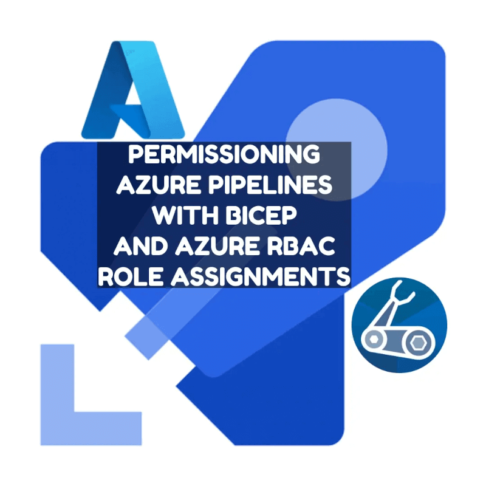
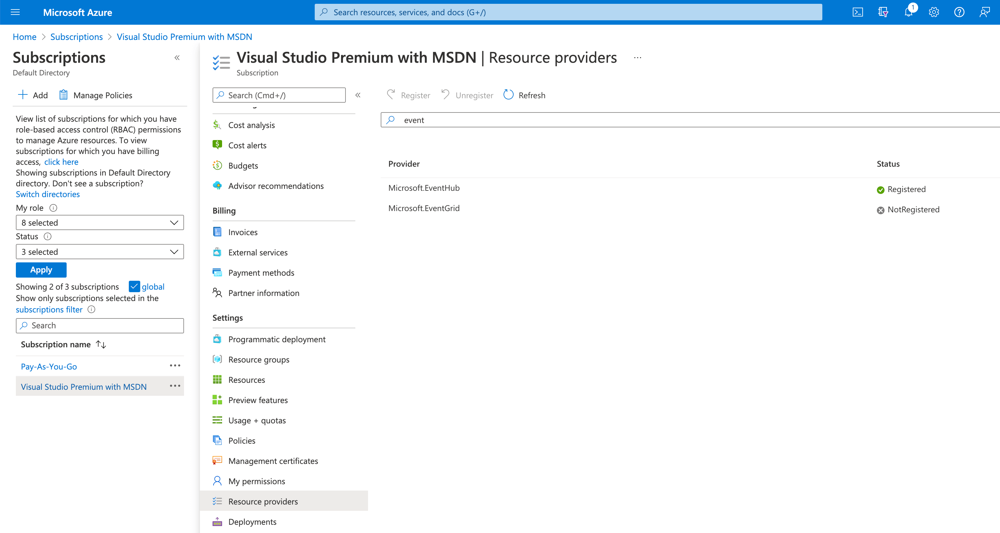
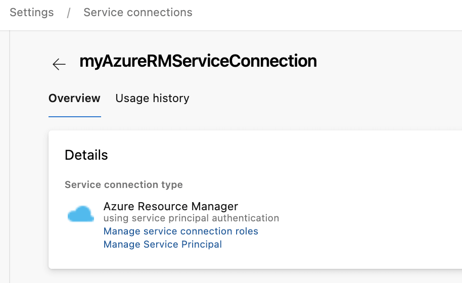
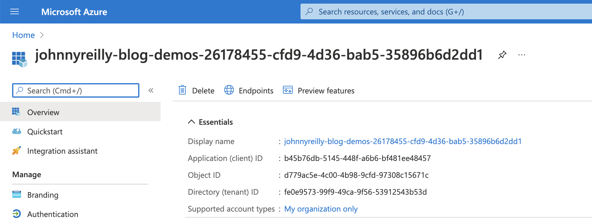
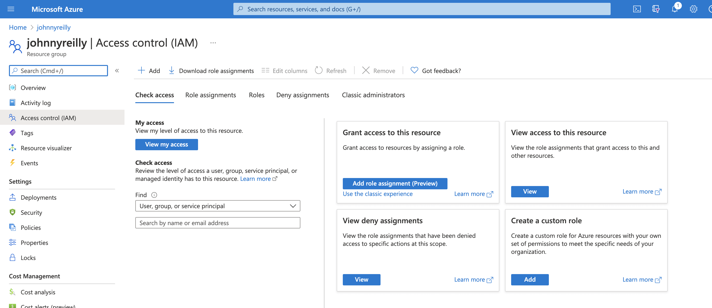
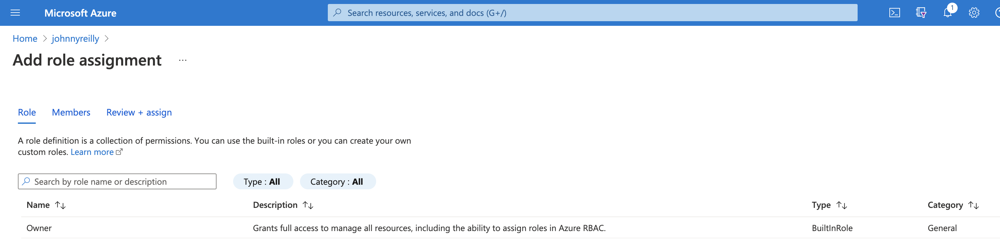
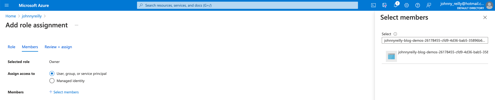
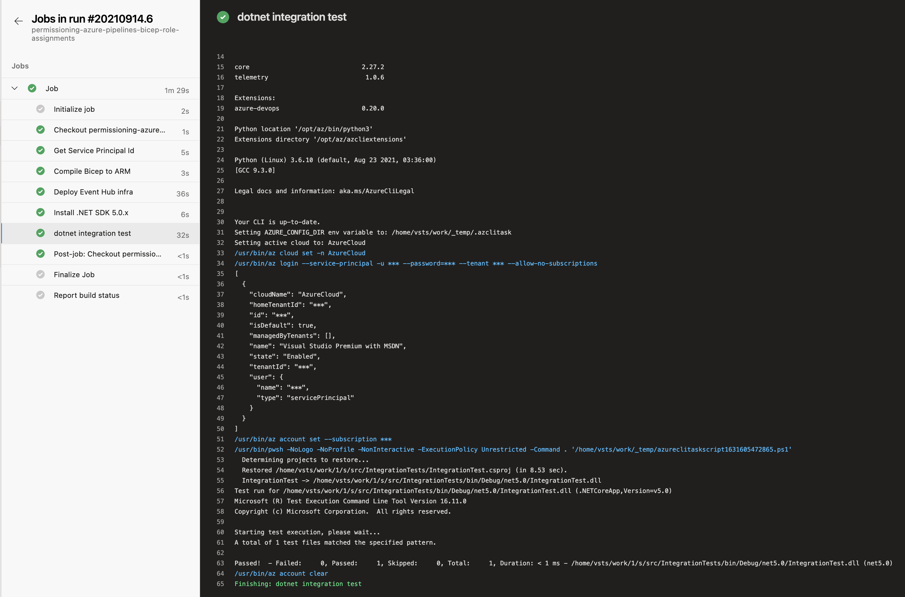

How can we deploy resources to Azure, and then run an integration test through them in the context of an Azure Pipeline? This post will show how to do this by permissioning our Azure Pipeline to access these resources using Azure RBAC role assignments. It will also demonstrate a dotnet test that runs in the context of the pipeline and makes use of those role assignments.



<!--truncate-->

We're following this approach as an alternative to [exporting connection strings](../2021-07-07-output-connection-strings-and-keys-from-azure-bicep/index.md), as these can be viewed in the Azure Portal; which may be an security issue if you have many people who are able to access the portal and view deployment outputs.

We're going to demonstrate this approach using Event Hubs. It's worth calling out that this is a generally useful approach which can be applied to any Azure resources that support Azure RBAC Role Assignments. So wherever in this post you read "Event Hubs", imagine substituting other Azure resources you're working with.

The post will do the following:

- Add Event Hubs to our Azure subscription
- Permission our service connection / service principal
- Deploy to Azure with Bicep
- Write an integration test
- Write a pipeline to bring it all together

## Add Event Hubs to your subscription

First of all, we may need to add Event Hubs to our Azure subscription.

Without this in place, we may encounter errors of the type:

> ##[error]MissingSubscriptionRegistration: The subscription is not registered to use namespace 'Microsoft.EventHub'. See https://aka.ms/rps-not-found for how to register subscriptions.

We do this by going to "Resource Providers" in the [Azure Portal](https://portal.azure.com) and registering the resources you need. Lots are registered by default, but not all.



## Permission our service connection / service principal

In order that we can run pipelines related to Azure, we mostly need to have an Azure Resource Manager service connection set up in Azure DevOps. Once that exists, we also need to give it a role assignment to allow it to create role assignments of its own when pipelines are running.

Without this in place, we may encounter errors of the type:

> ##[error]The template deployment failed with error: 'Authorization failed for template resource `{GUID-THE-FIRST}` of type `Microsoft.Authorization/roleAssignments`. The client `{GUID-THE-SECOND}` with object id `{GUID-THE-SECOND}` does not have permission to perform action `Microsoft.Authorization/roleAssignments/write` at scope `/subscriptions/\*\*\*/resourceGroups/johnnyreilly/providers/Microsoft.EventHub/namespaces/evhns-demo/providers/Microsoft.Authorization/roleAssignments/{GUID-THE-FIRST}`.'.

Essentially, we want to be able to run pipelines that say "hey Azure, we want to give permissions to our service connection". We are doing this _with_ the self same service connection, so (chicken and egg) we first need to give it permission to give those commands in future. This is a little confusing; but let's role with it. (Pun most definitely intended. 😉)

To grant that permission / add that role assignment, we go to the service connection in Azure Devops:



We can see there's two links here; first we'll click on "Manage Service Principal", which will take us to the service principal in the Azure Portal:



Take note of the display name of the service principal; we'll need that as we click on the "Manage service connection roles" link, which will take us to the resource groups IAM page in the Azure Portal:



Here we can click on "Add role assignment", select "Owner":



Then when selecting members we should be able to look up the service principal to assign it:



We now have a service connection which we should be able to use for granting permissions / role assignments, which is what we need.

## Event Hub and Role Assignment with Bicep

Next we want a Bicep file that will, when run, provision an Event Hub and a role assignment which will allow our Azure Pipeline (via its service connection) to interact with it.

```bicep
@description('Name of the eventhub namespace')
param eventHubNamespaceName string

@description('Name of the eventhub name')
param eventHubName string

@description('The service principal')
param principalId string

// Create an Event Hub namespace
resource eventHubNamespace 'Microsoft.EventHub/namespaces@2021-01-01-preview' = {
  name: eventHubNamespaceName
  location: resourceGroup().location
  sku: {
    name: 'Standard'
    tier: 'Standard'
    capacity: 1
  }
  properties: {
    zoneRedundant: true
  }
}

// Create an Event Hub inside the namespace
resource eventHub 'Microsoft.EventHub/namespaces/eventhubs@2021-01-01-preview' = {
  parent: eventHubNamespace
  name: eventHubName
  properties: {
    messageRetentionInDays: 7
    partitionCount: 1
  }
}

// give Azure Pipelines Service Principal permissions against the Event Hub

var roleDefinitionAzureEventHubsDataOwner = subscriptionResourceId('Microsoft.Authorization/roleDefinitions', 'f526a384-b230-433a-b45c-95f59c4a2dec')

resource integrationTestEventHubReceiverNamespaceRoleAssignment 'Microsoft.Authorization/roleAssignments@2018-01-01-preview' = {
  name: guid(principalId, eventHub.id, roleDefinitionAzureEventHubsDataOwner)
  scope: eventHubNamespace
  properties: {
    roleDefinitionId: roleDefinitionAzureEventHubsDataOwner
    principalId: principalId
  }
}
```

Do note that our bicep template takes the service principal id as a parameter. We're going to supply this later from our Azure Pipeline.

## Our test

We're now going to write a dotnet integration test which will make use of the infrastructure deployed by our Bicep template. Let's create a new test project:

```
mkdir src
cd src
dotnet new xunit -o IntegrationTests
cd IntegrationTests
dotnet add package Azure.Identity
dotnet add package Azure.Messaging.EventHubs
dotnet add package FluentAssertions
dotnet add package Microsoft.Extensions.Configuration.EnvironmentVariables
```

We'll create a test file called `EventHubTest.cs` with these contents:

```cs
using System;
using System.Collections.Generic;
using System.Linq;
using System.Text;
using System.Threading;
using System.Threading.Tasks;
using Azure.Identity;
using Azure.Messaging.EventHubs;
using Azure.Messaging.EventHubs.Consumer;
using Azure.Messaging.EventHubs.Producer;
using FluentAssertions;
using Microsoft.Extensions.Configuration;
using Newtonsoft.Json;
using Xunit;
using Xunit.Abstractions;

namespace IntegrationTests
{
    public record EchoMessage(string Id, string Message, DateTime Timestamp);

    public class EventHubTest
    {
        private readonly ITestOutputHelper _output;

        public EventHubTest(ITestOutputHelper output)
        {
            _output = output;
        }

        [Fact]
        public async Task Can_post_message_to_event_hub_and_read_it_back()
        {
            // ARRANGE
            var configuration = new ConfigurationBuilder()
                .AddEnvironmentVariables()
                .Build();

            // populated by variables specified in the Azure Pipeline
            var eventhubNamespaceName = configuration["EVENTHUBNAMESPACENAME"];
            eventhubNamespaceName.Should().NotBeNull();
            var eventhubName = configuration["EVENTHUBNAME"];
            eventhubName.Should().NotBeNull();
            var tenantId = configuration["TENANTID"];
            tenantId.Should().NotBeNull();

            // populated as a consequence of the addSpnToEnvironment in the azure-pipelines.yml
            var servicePrincipalId = configuration["SERVICEPRINCIPALID"];
            servicePrincipalId.Should().NotBeNull();
            var servicePrincipalKey = configuration["SERVICEPRINCIPALKEY"];
            servicePrincipalKey.Should().NotBeNull();

            var fullyQualifiedNamespace = $"{eventhubNamespaceName}.servicebus.windows.net";

            var clientCredential = new ClientSecretCredential(tenantId, servicePrincipalId, servicePrincipalKey);
            var eventHubClient = new EventHubProducerClient(
                fullyQualifiedNamespace: fullyQualifiedNamespace,
                eventHubName: eventhubName,
                credential: clientCredential
            );
            var ourGuid = Guid.NewGuid().ToString();
            var now = DateTime.UtcNow;
            var sentEchoMessage = new EchoMessage(Id: ourGuid, Message: $"Test message", Timestamp: now);
            var sentEventData = new EventData(
                Encoding.UTF8.GetBytes(JsonConvert.SerializeObject(sentEchoMessage))
            );

            // ACT
            await eventHubClient.SendAsync(new List<EventData> { sentEventData }, CancellationToken.None);

            var eventHubConsumerClient = new EventHubConsumerClient(
                consumerGroup: EventHubConsumerClient.DefaultConsumerGroupName,
                fullyQualifiedNamespace: fullyQualifiedNamespace,
                eventHubName: eventhubName,
                credential: clientCredential
            );

            List<PartitionEvent> partitionEvents = new();
            await foreach (var partitionEvent in eventHubConsumerClient.ReadEventsAsync(new ReadEventOptions
            {
                MaximumWaitTime = TimeSpan.FromSeconds(10)
            }))
            {
                if (partitionEvent.Data == null) break;
                _output.WriteLine(Encoding.UTF8.GetString(partitionEvent.Data.EventBody.ToArray()));
                partitionEvents.Add(partitionEvent);
            }

            // ASSERT
            partitionEvents.Count.Should().BeGreaterOrEqualTo(1);
            var firstOne = partitionEvents.FirstOrDefault(evnt =>
              ExtractTypeFromEventBody<EchoMessage>(evnt, _output)?.Id == ourGuid
            );
            var receivedEchoMessage = ExtractTypeFromEventBody<EchoMessage>(firstOne, _output);
            receivedEchoMessage.Should().BeEquivalentTo(sentEchoMessage, because: "the event body should be the same one posted to the message queue");
        }

        private static T ExtractTypeFromEventBody<T>(PartitionEvent evnt, ITestOutputHelper _output)
        {
            try
            {
                return JsonConvert.DeserializeObject<T>(Encoding.UTF8.GetString(evnt.Data.EventBody.ToArray()));
            }
            catch (JsonException)
            {
                _output.WriteLine("[" + Encoding.UTF8.GetString(evnt.Data.EventBody.ToArray()) + "] is probably not JSON");
                return default(T);
            }
        }
    }
}
```

Let's talk through what happens in the test above:

1. We read in Event Hub connection configuration for the test from environment variables. (These will be supplied by an Azure Pipeline that we will create shortly.)
2. We post a message to the Event Hub.
3. We read a message back from the Event Hub.
4. We confirm that the message we read back matches the one we posted.

Now that we have our test, we want to be able to execute it. For that we need an Azure Pipeline!

## Azure Pipeline

We're going to add an `azure-pipelines.yml` file which Azure DevOps can use to power a pipeline:

```yml
variables:
  - name: eventHubNamespaceName
    value: evhns-demo
  - name: eventHubName
    value: evh-demo

pool:
  vmImage: ubuntu-latest

steps:
  - task: AzureCLI@2
    displayName: Get Service Principal Id
    inputs:
      azureSubscription: $(serviceConnection)
      scriptType: bash
      scriptLocation: inlineScript
      addSpnToEnvironment: true
      inlineScript: |
        PRINCIPAL_ID=$(az ad sp show --id $servicePrincipalId --query objectId -o tsv)
        echo "##vso[task.setvariable variable=PIPELINE_PRINCIPAL_ID;]$PRINCIPAL_ID"

  - bash: az bicep build --file infra/main.bicep
    displayName: 'Compile Bicep to ARM'

  - task: AzureResourceManagerTemplateDeployment@3
    name: DeployEventHubInfra
    displayName: Deploy Event Hub infra
    inputs:
      deploymentScope: Resource Group
      azureResourceManagerConnection: $(serviceConnection)
      subscriptionId: $(subscriptionId)
      action: Create Or Update Resource Group
      resourceGroupName: $(azureResourceGroup)
      location: $(location)
      templateLocation: Linked artifact
      csmFile: 'infra/main.json' # created by bash script
      overrideParameters: >-
        -eventHubNamespaceName $(eventHubNamespaceName)
        -eventHubName $(eventHubName)
        -principalId $(PIPELINE_PRINCIPAL_ID)
      deploymentMode: Incremental

  - task: UseDotNet@2
    displayName: 'Install .NET SDK 5.0.x'
    inputs:
      packageType: 'sdk'
      version: 5.0.x

  - task: AzureCLI@2
    displayName: dotnet integration test
    inputs:
      azureSubscription: $(serviceConnection)
      scriptType: pscore
      scriptLocation: inlineScript
      addSpnToEnvironment: true # allows access to service principal details in script
      inlineScript: |
        cd $(Build.SourcesDirectory)/src/IntegrationTests
        dotnet test
```

When the pipeline is run, it does the following:

1. Gets the service principal id from the service connection.
2. Compiles our Bicep into an ARM template
3. Deploys the compiled ARM template to Azure
4. Installs the dotnet SDK
5. Uses the [Azure CLI task](https://docs.microsoft.com/en-us/azure/devops/pipelines/tasks/deploy/azure-cli?view=azure-devops) which allows us to access service principal details in the pipeline to run our dotnet test.

We'll create a pipeline in Azure DevOps pointing to this file, and we'll also create the variables that it depends upon:

- `azureResourceGroup` - the name of your resource group in Azure where the app will be deployed
- `location` - where your app is deployed, eg `northeurope`
- `serviceConnection` - the name of your AzureRM service connection in Azure DevOps
- `subscriptionId` - your Azure subscription id from the [Azure Portal](https://portal.azure.com)
- `tenantId` - the Azure tenant id from the [Azure Portal](https://portal.azure.com)

## Running the pipeline

Now we're ready to run our pipeline:



Here we can see that the pipeline runs and the test passes. That means we've successfully provisioned the Event Hub and permissioned our pipeline to be able to access it using Azure RBAC role assignments. We then wrote a test which used the pipeline credentials to interact with the Event Hub. To see the repo that demostrates this, [look here](https://dev.azure.com/johnnyreilly/blog-demos/_git/permissioning-azure-pipelines-bicep-role-assignments).

Just to reiterate: we've demonstrated this approach using Event Hubs. This is a generally useful approach which can be applied to any Azure resources that support Azure RBAC Role Assignments.

Thanks to [Jamie McCrindle](https://twitter.com/foldr) for helping out with permissioning the service connection / service principal. [His post on rotating `AZURE_CREDENTIALS` in GitHub with Terraform](https://foldr.uk/rotating-azure-credentials-in-github-with-terraform) provides useful background for those who would like to do similar permissioning using Terraform.
