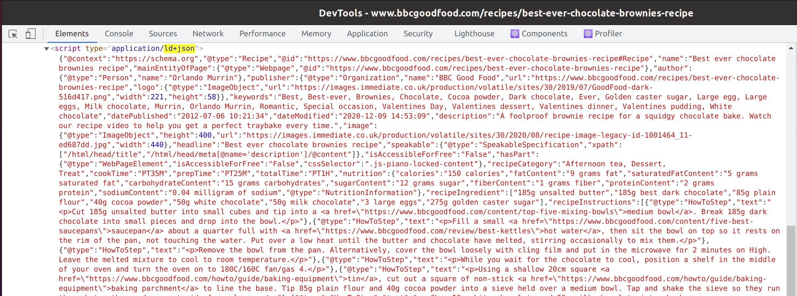
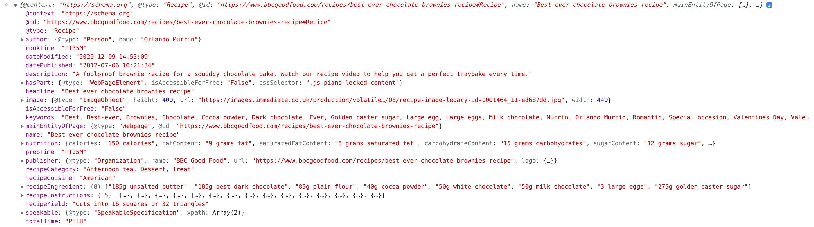
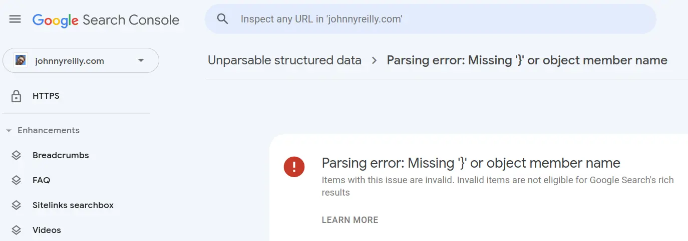
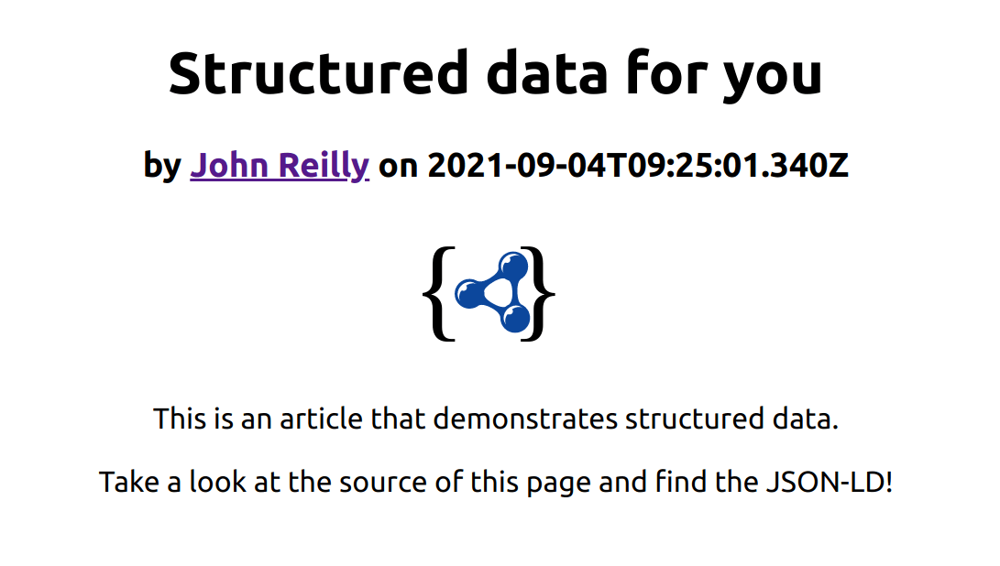
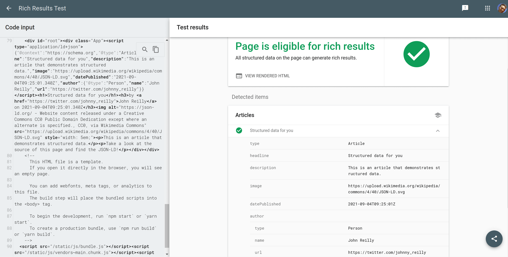

People being able to discover your website when they search is important. This post is about how you can add structured data to a site. Adding structured data will help search engines like Google understand your content, and get it in front of more eyeballs. We'll illustrate this by making a simple React app which incorporates structured data.


<!--truncate-->

## Updated 5th January 2023

This blog evolved to become a talk:

<iframe width="560" height="315" src="https://www.youtube.com/embed/zi1CHB-eVck?start=282" title="YouTube video player" frameBorder="0" allow="accelerometer; autoplay; clipboard-write; encrypted-media; gyroscope; picture-in-picture" allowFullScreen></iframe>

If you'd like to read about the related topic of [adding breadcrumb Structured Data to a Docusaurus app, I've another post covering that](../2023-02-05-docusaurus-blogs-adding-breadcrumb-structured-data/index.md).

## What is structured data?

Google, DuckDuckGo and others are proficient at understanding the content of websites. However, scraping HTML is not a highly reliable way to categorise content. HTML is about presentation and it can have all manner of different structures. To make the life of search engines easier, there's a standardized format known as "structured data" which can be embedded within a page. That standardized format allows you to explicitly declare the type of content the page contains.

So let's say you've written an article, you can reliably state in a language that Google understands "this page is an article, it has this title, this description and image and was published on this date". There are hundreds of types of structured data available, and you can read about all of them in depth at https://schema.org/ which is maintained by representatives of the search engine community.

It's worth knowing that whilst there are many types of structured data available to choose from, there are definitely more popular options and those that are more niche. So [Article](https://schema.org/Article) is likely to be used a great deal more than, perhaps, [MolecularEntity](https://schema.org/MolecularEntity).

As well as there being different types of structured data, there also a variety of formats which can be used to provide it; these include [JSON-LD](http://json-ld.org/), [Microdata](https://www.w3.org/TR/microdata/) and [RDFa](https://rdfa.info/). Google explicitly prefer JSON-LD and so that's what we'll focus on. JSON-LD is effectively a rending of a piece of JSON inside a `script` tag with the custom type of `application/ld+json`. For example:

```html
<script type="application/ld+json">
  {
    "@context": "https://schema.org/",
    "@type": "Recipe",
    "name": "Chocolate Brownie",
    "author": {
      "@type": "Person",
      "name": "John Reilly"
    },
    "datePublished": "2014-09-01",
    "description": "The most amazing chocolate brownie recipe",
    "prepTime": "PT60M"
  }
</script>
```

## Structured data in action

Whilst structured data is helpful for search engines in general, it can also make a difference to the way your content is rendered _inside_ search results. For instance, let's search for "best brownie recipe" in Google and see what shows up:


When you look at the screenshot above, you'll notice that at the top of the list (before the main search results) there's a carousel which shows various brownie recipe links, with dedicated pictures, titles and descriptions. Where did this come from? The answer, unsurprisingly, is structured data.

If we click on the first link, we're taken to the recipe in question. Looking at the HTML of that page we find a number of JSON-LD sections:



If we grab the content of one JSON-LD section and paste it into the devtools console, it becomes much easier to read:



If we look at the `@type` property we can see it's a `"Recipe"`. This means it's an example of the https://schema.org/Recipe schema. If we look further at the `headline` property, it reads `"Best ever chocolate brownies recipe"`. That matches up with headline that was displayed in the search results.

Now we have a sense of what the various search engines are using as they categorise the page, and we understand exactly what is powering the carousel in the Google search results.

Incidentally, there's a special name for this "carousel"; it is a "rich result". A rich result is a search result singled out for special treatment when it is displayed. Google provide a [Rich Results Test tool](https://search.google.com/test/rich-results) which allows you to validate if a site provides structured data which is eligible to be featured in rich results. We'll make use of this later.

## Adding structured data to a website

Now we'll make ourselves a React app and add structured data to it. In the console we'll execute the following command:

```bash
npx create-react-app my-app
```

We now have a simple React app which consists of a single page. Let's replace the content of the existing `App.js` file with this:

```jsx
//@ts-check
import './App.css';

function App() {
  // https://schema.org/Article
  const articleStructuredData = {
    '@context': 'https://schema.org',
    '@type': 'Article',
    headline: 'Structured data for you',
    description: 'This is an article that demonstrates structured data.',
    image: 'https://upload.wikimedia.org/wikipedia/commons/4/40/JSON-LD.svg',
    datePublished: new Date('2021-09-04T09:25:01.340Z').toISOString(),
    author: {
      '@type': 'Person',
      name: 'John Reilly',
      url: 'https://johnnyreilly.com/about',
    },
  };

  return (
    <div className="App">
      <script
        type="application/ld+json"
        dangerouslySetInnerHTML={{
          __html: JSON.stringify(articleStructuredData),
        }}
      />

      <h1>{articleStructuredData.headline}</h1>
      <h3>
        by{' '}
        <a href={articleStructuredData.author.url}>
          {articleStructuredData.author.name}
        </a>{' '}
        on {articleStructuredData.datePublished}
      </h3>

      

      <p>{articleStructuredData.description}</p>

      <p>Take a look at the source of this page and find the JSON-LD!</p>
    </div>
  );
}

export default App;
```

If we look at the code above, we can see we're creating a JavaScript object literal named `articleStructuredData` which contains the data of an `https://schema.org/Article`. Our `articleStructuredData` is then used to do two things:

1. to contribute to the content of the page
2. to render a JSON-LD script element: `<script type="application/ld+json">` which is populated by calling `JSON.stringify(articleStructuredData)`

### A note on JSON-LD and `dangerouslySetInnerHTML`

You'll note we're using `dangerouslySetInnerHTML` to render the JSON-LD script element. That is because an issue arises if we instead inline it like so:

```html
<script type="application/ld+json">
  {JSON.stringify(articleStructuredData)}
</script>
```

If we do this, the `"` characters in the JSON would be escaped as `&quot;` and would look like something this:

```html
<script type="application/ld+json">
  {
    &quot;@context&quot;: &quot;https://schema.org&quot;,
    &quot;@type&quot;: &quot;Article&quot;,
    &quot;headline&quot;: &quot;Structured data for you&quot;,
    &quot;description&quot;: &quot;This is an article that demonstrates structured data.&quot;,
    &quot;image&quot;: &quot;https://upload.wikimedia.org/wikipedia/commons/4/40/JSON-LD.svg&quot;,
    &quot;datePublished&quot;: &quot;2020-02-11T06:42:03.706Z&quot;,
    &quot;author&quot;: {
      &quot;@type&quot;: &quot;Person&quot;,
      &quot;name&quot;: &quot;John Reilly&quot;,
      &quot;url&quot;: &quot;https://johnnyreilly.com/about&quot;,
    }
  }
</script>
```

Rather than:

```html
<script type="application/ld+json">
  {
    "@context": "https://schema.org",
    "@type": "Article",
    "headline": "Structured data for you",
    "description": "This is an article that demonstrates structured data.",
    "image": "https://upload.wikimedia.org/wikipedia/commons/4/40/JSON-LD.svg",
    "datePublished": "2020-02-11T06:42:03.706Z",
    "author": {
      "@type": "Person",
      "name": "John Reilly",
      "url": "https://johnnyreilly.com/about"
    }
  }
</script>
```

That `&quot;`s would make the JSON-LD invalid to some parsers. A great example of a parser troubled by this is the Google Search Console, which can trip up with a `Parsing error: Missing '}' or object member name.` error:



Using `dangerouslySetInnerHTML` resolves issues like this. It's worth noting that the "HTML" we're actually rendering is JSON, and it's safe to render that because we are the creators of it.

## Running the site

When we run our site locally with `npm start` we see a simple article site that looks like this:



Now let's see if it supports structured data in the way we hope.

## Using the Rich Results Test

If we go to `https://search.google.com/test/rich-results` we find the Rich Results Test tool. There's two ways you can test; providing a URL or providing code. In our case we don't have a public facing URL and so we're going to use the HTML that React is rendering.

In devtools we'll use the "copy outerHTML" feature to grab the HTML, then we'll paste it into Rich Results:


We hit the "TEST CODE" button and we see results that look like this:



So we've been successful in building a website that renders structured data. More than that, we're doing it in a way that we know Google will recognise and can use to render rich results in search. That's a really useful way to drive traffic to our website.

This post has illustrated what it looks like to create an `Article`. Google has some [great resources](https://developers.google.com/search/docs/advanced/structured-data/search-gallery) on other types that it supports and prioritises for rich results which should help you build the structured data you need for your particular content.

[This post was originally published on LogRocket.](https://blog.logrocket.com/react-structured-data-and-seo/)

If you found this post interesting, you may enjoy one where I went a little further and wrote [about adding FAQ Structured Data to a Docusaurus site using MDX](../2023-04-08-docusaurus-structured-data-faqs-mdx/index.md).

<head>
    <link rel="canonical" href="https://blog.logrocket.com/react-structured-data-and-seo/" />
</head>
