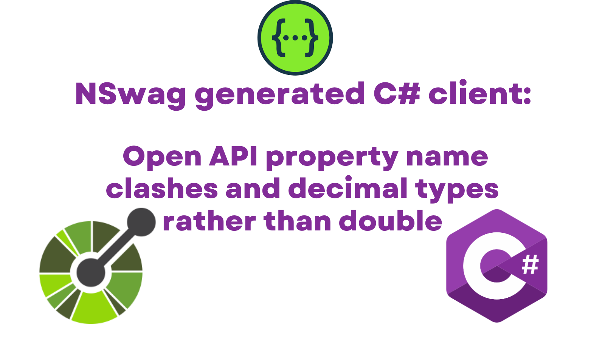

Google Discover is a way that people can find your content. To make your content more attractive, Google encourage using high quality images which are enabled by setting the `max-image-preview:large` meta tag. This post shows you how to achieve that with Docusaurus.



## Make a C# Client Generator

Before we can demonstrate the problem, let's get a console app set up that will make a C# client using an Open API file:

```sh
dotnet new console -o NSwag
cd NSwag
dotnet add package NSwag.CodeGeneration.CSharp
```

We'll also add a `petstore-simple.json` file to our project which we'll borrow from https://github.com/OAI/OpenAPI-Specification/blob/main/examples/v2.0/json/petstore-simple.json (home of the Open API specification):

```json
{
    "swagger": "2.0",
    "info": {
        "version": "1.0.0",
        "title": "Swagger Petstore",
        "description": "A sample API that uses a petstore as an example to demonstrate features in the swagger-2.0 specification",
        "termsOfService": "http://swagger.io/terms/",
        "contact": {
            "name": "Swagger API Team"
        },
        "license": {
            "name": "MIT"
        }
    },
    "host": "petstore.swagger.io",
    "basePath": "/api",
    "schemes": [
        "http"
    ],
    "consumes": [
        "application/json"
    ],
    "produces": [
        "application/json"
    ],
    "paths": {
        "/pets": {
            "get": {
                "description": "Returns all pets from the system that the user has access to",
                "operationId": "findPets",
                "produces": [
                    "application/json",
                    "application/xml",
                    "text/xml",
                    "text/html"
                ],
                "parameters": [
                    {
                        "name": "tags",
                        "in": "query",
                        "description": "tags to filter by",
                        "required": false,
                        "type": "array",
                        "items": {
                            "type": "string"
                        },
                        "collectionFormat": "csv"
                    },
                    {
                        "name": "limit",
                        "in": "query",
                        "description": "maximum number of results to return",
                        "required": false,
                        "type": "integer",
                        "format": "int32"
                    }
                ],
                "responses": {
                    "200": {
                        "description": "pet response",
                        "schema": {
                            "type": "array",
                            "items": {
                                "$ref": "#/definitions/Pet"
                            }
                        }
                    },
                    "default": {
                        "description": "unexpected error",
                        "schema": {
                            "$ref": "#/definitions/ErrorModel"
                        }
                    }
                }
            },
            "post": {
                "description": "Creates a new pet in the store.  Duplicates are allowed",
                "operationId": "addPet",
                "produces": [
                    "application/json"
                ],
                "parameters": [
                    {
                        "name": "pet",
                        "in": "body",
                        "description": "Pet to add to the store",
                        "required": true,
                        "schema": {
                            "$ref": "#/definitions/NewPet"
                        }
                    }
                ],
                "responses": {
                    "200": {
                        "description": "pet response",
                        "schema": {
                            "$ref": "#/definitions/Pet"
                        }
                    },
                    "default": {
                        "description": "unexpected error",
                        "schema": {
                            "$ref": "#/definitions/ErrorModel"
                        }
                    }
                }
            }
        },
        "/pets/{id}": {
            "get": {
                "description": "Returns a user based on a single ID, if the user does not have access to the pet",
                "operationId": "findPetById",
                "produces": [
                    "application/json",
                    "application/xml",
                    "text/xml",
                    "text/html"
                ],
                "parameters": [
                    {
                        "name": "id",
                        "in": "path",
                        "description": "ID of pet to fetch",
                        "required": true,
                        "type": "integer",
                        "format": "int64"
                    }
                ],
                "responses": {
                    "200": {
                        "description": "pet response",
                        "schema": {
                            "$ref": "#/definitions/Pet"
                        }
                    },
                    "default": {
                        "description": "unexpected error",
                        "schema": {
                            "$ref": "#/definitions/ErrorModel"
                        }
                    }
                }
            },
            "delete": {
                "description": "deletes a single pet based on the ID supplied",
                "operationId": "deletePet",
                "parameters": [
                    {
                        "name": "id",
                        "in": "path",
                        "description": "ID of pet to delete",
                        "required": true,
                        "type": "integer",
                        "format": "int64"
                    }
                ],
                "responses": {
                    "204": {
                        "description": "pet deleted"
                    },
                    "default": {
                        "description": "unexpected error",
                        "schema": {
                            "$ref": "#/definitions/ErrorModel"
                        }
                    }
                }
            }
        }
    },
    "definitions": {
        "Pet": {
            "type": "object",
            "allOf": [
                {
                    "$ref": "#/definitions/NewPet"
                },
                {
                    "required": [
                        "id"
                    ],
                    "properties": {
                        "id": {
                            "type": "integer",
                            "format": "int64"
                        }
                    }
                }
            ]
        },
        "NewPet": {
            "type": "object",
            "required": [
                "name"
            ],
            "properties": {
                "name": {
                    "type": "string"
                },
                "tag": {
                    "type": "string"
                }
            }
        },
        "ErrorModel": {
            "type": "object",
            "required": [
                "code",
                "message"
            ],
            "properties": {
                "code": {
                    "type": "integer",
                    "format": "int32"
                },
                "message": {
                    "type": "string"
                }
            }
        }
    }
}
```

We'll tweak our `NSwag.csproj` file to ensure that the `json` file is included in our build output:

```xml
<Project Sdk="Microsoft.NET.Sdk">
  <!-- ... --->
  <ItemGroup>
    <Content Include="**\*.json">
      <CopyToOutputDirectory>PreserveNewest</CopyToOutputDirectory>
    </Content>
  </ItemGroup>
</Project>
```

This will give us a console app with a reference to NSwag.  Now we'll flesh out the `Program.cs` file thusly:

```cs

```

I'm an Android user. Google Discover will present articles to me in various places on my phone. [According to the docs](https://developers.google.com/search/docs/advanced/mobile/google-discover):

> With Discover, you can get updates for your interests, like your favorite sports team or news site, without searching for them. You can choose the types of updates you want to see in Discover in the Google app or when you’re browsing the web on your phone.

It turns out that my own content is showing up in Discover. I (ahem) discovered this by looking at the Google search console and noticing a "Discover" tab:


As I read up about Discover I noticed this:

> To increase the likelihood of your content appearing in Discover, we recommend the following:
> ...
>
> - Include compelling, high-quality images in your content, especially large images that are more likely to generate visits from Discover. Large images need to be at least 1200 px wide and enabled by the `max-image-preview:large` setting...

I was already trying to include images with my blog posts as described... But `max-image-preview:large` was news to me. [Reading up further](https://developers.google.com/search/docs/advanced/robots/robots_meta_tag#max-image-preview) revealed that the "setting" was simply a meta tag to be added to the HTML that looked like this:

```html
<meta name="robots" content="max-image-preview:standard" />
```

Incidentally, applying this setting will affect all forms of search results. So not just Discover, but Google web search, Google Images and Assistant as well. The result of having this meta tag will be that bigger images are displayed in search results, which should make the content more attractive.

## Docusaurus let's get meta

Now we understand what we want (an extra meta tag on all our pages), how do we apply this to Docusaurus?

Well, it's remarkably simple. There's an optional [`metadatas`](https://docusaurus.io/docs/api/themes/configuration#metadatas) property in `docusaurus.config.js`. This property allows you to configure additional html metadatas (and override existing ones). The property is an array of `Metadata`, each entry of which will be directly passed to the `<meta />` tag.

So in our case we'd want to pass an object with `name: 'robots'` and `content: 'max-image-preview:large'` to render our desired meta tag. Which looks like this:

```js
/** @type {import('@docusaurus/types').DocusaurusConfig} */
module.exports = {
  //...
  themeConfig: {
    // <meta name="robots" content="max-image-preview:large">
    metadatas: [{ name: 'robots', content: 'max-image-preview:large' }],
    //...
  },
  //...
};
```

With that in place, we find our expected `meta` tag is now part of our rendered HTML:


## Meta meta

We should now have a more Google Discover-friendly website which is tremendous!

Before signing off, here's a fun fact: the PR that published this blog post is the _same_ PR that added `max-image-preview:standard` to my blog. [Peep it here](https://github.com/johnnyreilly/blog.johnnyreilly.com/pull/114) - meta in so many ways 😉
