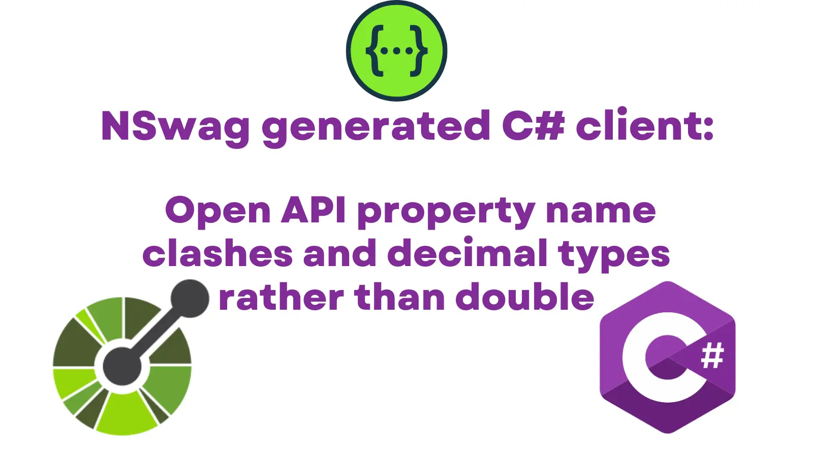

NSwag is a great tool for generating client libraries in C# and TypeScript from Open API / Swagger definitions. You can face issues where Open API property names collide due to the nature of the C# language, and when you want to use `decimal` for your floating point numeric type over `double`. This post demonstrates how to get over both issues.



<!--truncate-->

## Make a C# Client Generator

Let's get a console app set up that will allow us to generate a C# client using an Open API file:

```sh
dotnet new console -o NSwag
cd NSwag
dotnet add package NSwag.CodeGeneration.CSharp
```

We'll also add a `petstore-simple.json` file to our project which we'll borrow from https://github.com/OAI/OpenAPI-Specification/blob/main/examples/v2.0/json/petstore-simple.json (home of the Open API specification):

```json
{
  "swagger": "2.0",
  "info": {
    "version": "1.0.0",
    "title": "Swagger Petstore",
    "description": "A sample API that uses a petstore as an example to demonstrate features in the swagger-2.0 specification",
    "termsOfService": "http://swagger.io/terms/",
    "contact": {
      "name": "Swagger API Team"
    },
    "license": {
      "name": "MIT"
    }
  },
  "host": "petstore.swagger.io",
  "basePath": "/api",
  "schemes": ["http"],
  "consumes": ["application/json"],
  "produces": ["application/json"],
  "paths": {
    "/pets": {
      "get": {
        "description": "Returns all pets from the system that the user has access to",
        "operationId": "findPets",
        "produces": [
          "application/json",
          "application/xml",
          "text/xml",
          "text/html"
        ],
        "parameters": [
          {
            "name": "tags",
            "in": "query",
            "description": "tags to filter by",
            "required": false,
            "type": "array",
            "items": {
              "type": "string"
            },
            "collectionFormat": "csv"
          },
          {
            "name": "limit",
            "in": "query",
            "description": "maximum number of results to return",
            "required": false,
            "type": "integer",
            "format": "int32"
          }
        ],
        "responses": {
          "200": {
            "description": "pet response",
            "schema": {
              "type": "array",
              "items": {
                "$ref": "#/definitions/Pet"
              }
            }
          },
          "default": {
            "description": "unexpected error",
            "schema": {
              "$ref": "#/definitions/ErrorModel"
            }
          }
        }
      },
      "post": {
        "description": "Creates a new pet in the store.  Duplicates are allowed",
        "operationId": "addPet",
        "produces": ["application/json"],
        "parameters": [
          {
            "name": "pet",
            "in": "body",
            "description": "Pet to add to the store",
            "required": true,
            "schema": {
              "$ref": "#/definitions/NewPet"
            }
          }
        ],
        "responses": {
          "200": {
            "description": "pet response",
            "schema": {
              "$ref": "#/definitions/Pet"
            }
          },
          "default": {
            "description": "unexpected error",
            "schema": {
              "$ref": "#/definitions/ErrorModel"
            }
          }
        }
      }
    },
    "/pets/{id}": {
      "get": {
        "description": "Returns a user based on a single ID, if the user does not have access to the pet",
        "operationId": "findPetById",
        "produces": [
          "application/json",
          "application/xml",
          "text/xml",
          "text/html"
        ],
        "parameters": [
          {
            "name": "id",
            "in": "path",
            "description": "ID of pet to fetch",
            "required": true,
            "type": "integer",
            "format": "int64"
          }
        ],
        "responses": {
          "200": {
            "description": "pet response",
            "schema": {
              "$ref": "#/definitions/Pet"
            }
          },
          "default": {
            "description": "unexpected error",
            "schema": {
              "$ref": "#/definitions/ErrorModel"
            }
          }
        }
      },
      "delete": {
        "description": "deletes a single pet based on the ID supplied",
        "operationId": "deletePet",
        "parameters": [
          {
            "name": "id",
            "in": "path",
            "description": "ID of pet to delete",
            "required": true,
            "type": "integer",
            "format": "int64"
          }
        ],
        "responses": {
          "204": {
            "description": "pet deleted"
          },
          "default": {
            "description": "unexpected error",
            "schema": {
              "$ref": "#/definitions/ErrorModel"
            }
          }
        }
      }
    }
  },
  "definitions": {
    "Pet": {
      "type": "object",
      "allOf": [
        {
          "$ref": "#/definitions/NewPet"
        },
        {
          "required": ["id"],
          "properties": {
            "id": {
              "type": "integer",
              "format": "int64"
            }
          }
        }
      ]
    },
    "NewPet": {
      "type": "object",
      "required": ["name"],
      "properties": {
        "name": {
          "type": "string"
        },
        "tag": {
          "type": "string"
        }
      }
    },
    "ErrorModel": {
      "type": "object",
      "required": ["code", "message"],
      "properties": {
        "code": {
          "type": "integer",
          "format": "int32"
        },
        "message": {
          "type": "string"
        }
      }
    }
  }
}
```

We'll tweak our `NSwag.csproj` file to ensure that the `json` file is included in our build output:

```xml
<Project Sdk="Microsoft.NET.Sdk">
  <!-- ... --->
  <ItemGroup>
    <Content Include="**\*.json">
      <CopyToOutputDirectory>PreserveNewest</CopyToOutputDirectory>
    </Content>
  </ItemGroup>
</Project>
```

This will give us a console app with a reference to NSwag. Now we'll flesh out the `Program.cs` file thusly:

```cs
using System;
using System.IO;
using System.Reflection;
using System.Threading.Tasks;
using NJsonSchema;
using NJsonSchema.Visitors;
using NSwag.CodeGeneration.CSharp;

namespace NSwag {
    class Program {
        static async Task Main(string[] args) {
            Console.WriteLine("Generating client...");
            await ClientGenerator.GenerateCSharpClient();
            Console.WriteLine("Generated client.");
        }
    }

    public static class ClientGenerator {

        public async static Task GenerateCSharpClient() =>
            GenerateClient(
                // https://github.com/OAI/OpenAPI-Specification/blob/main/examples/v2.0/json/petstore-simple.json
                document: await GetDocumentFromFile("petstore-simple.json"),
                generatedLocation: "GeneratedClient.cs",
                generateCode: (OpenApiDocument document) => {
                    var settings = new CSharpClientGeneratorSettings();

                    var generator = new CSharpClientGenerator(document, settings);
                    var code = generator.GenerateFile();
                    return code;
                }
            );

        private static void GenerateClient(OpenApiDocument document, string generatedLocation, Func<OpenApiDocument, string> generateCode) {
            var root = Path.GetDirectoryName(Assembly.GetEntryAssembly().Location);
            var location = Path.GetFullPath(Path.Join(root, @"../../../", generatedLocation));

            Console.WriteLine($"Generating {location}...");

            var code = generateCode(document);

            System.IO.File.WriteAllText(location, code);
        }

        private static async Task<OpenApiDocument> GetDocumentFromFile(string swaggerJsonFilePath) {
            var root = Path.GetDirectoryName(Assembly.GetEntryAssembly().Location);
            var swaggerJson = await File.ReadAllTextAsync(Path.GetFullPath(Path.Join(root, swaggerJsonFilePath)));
            var document = await OpenApiDocument.FromJsonAsync(swaggerJson);

            return document;
        }
    }
}
```

If we perform a `dotnet run` we now pump out a `GeneratedClient.cs` file which is a C# client library for the pet store. Fabulous.

So far so dandy. We're taking an Open API `json` file and generating a C# client library from it.

## When properties collide

It's time to break things. We're presently generating a `Pet` class that looks like this:

```cs
[System.CodeDom.Compiler.GeneratedCode("NJsonSchema", "10.5.2.0 (Newtonsoft.Json v13.0.0.0)")]
public partial class Pet : NewPet
{
    [Newtonsoft.Json.JsonProperty("id", Required = Newtonsoft.Json.Required.Always)]
    public long Id { get; set; }
}
```

We're going to take our `Pet` definition in the `petstore-simple.json` file, and add a new `@id` property alongside the `id` property:

```json
"Pet": {
    "type": "object",
    "allOf": [
        {
            "$ref": "#/definitions/NewPet"
        },
        {
            "required": [
                "id"
            ],
            "properties": {
                "id": {
                    "type": "integer",
                    "format": "int64"
                },
                "@id": {
                    "type": "integer",
                    "format": "int64"
                }
            }
        }
    ]
},
```

For why? Whilst this may seem esoteric, this is a scenario that can present. It's not unknown to encounter properties which are identical, save for an `@` prefix. This is often the case for meta-properties.

What do we get if we run our generator over that?

```cs
[System.CodeDom.Compiler.GeneratedCode("NJsonSchema", "10.5.2.0 (Newtonsoft.Json v13.0.0.0)")]
public partial class Pet : NewPet
{
    [Newtonsoft.Json.JsonProperty("id", Required = Newtonsoft.Json.Required.Always)]
    public long Id { get; set; }

    [Newtonsoft.Json.JsonProperty("@id", Required = Newtonsoft.Json.Required.Always)]
    public long Id { get; set; }
}
```

We get code that doesn't compile. You can't have two properties in a C# class with the same name. You also cannot have `@` as a character in a C# property or variable name. To quote the [docs](https://docs.microsoft.com/en-us/dotnet/csharp/language-reference/tokens/verbatim):

> The @ special character serves as a verbatim identifier.

It so happens that, by default, NSwag purges `@` characters from property names. If there isn't another property which is named the same save for an `@` prefix, this is a fine strategy. If there is, as for us now, you're toast.

There's a workaround. We'll create a new `HandleAtCSharpPropertyNameGenerator` class:

```cs
/// <summary>
/// Replace characters which will not comply with C# syntax with something that will
/// </summary>
public class HandleAtCSharpPropertyNameGenerator : NJsonSchema.CodeGeneration.IPropertyNameGenerator {
    /// <summary>Generates the property name.</summary>
    /// <param name="property">The property.</param>
    /// <returns>The new name.</returns>
    public virtual string Generate(JsonSchemaProperty property) =>
        ConversionUtilities.ConvertToUpperCamelCase(property.Name
            .Replace("\"", string.Empty)
            .Replace("@", "__") // make "@" => "__", so "@type" => "__type"
            .Replace("?", string.Empty)
            .Replace("$", string.Empty)
            .Replace("[", string.Empty)
            .Replace("]", string.Empty)
            .Replace("(", "_")
            .Replace(")", string.Empty)
            .Replace(".", "-")
            .Replace("=", "-")
            .Replace("+", "plus"), true)
            .Replace("*", "Star")
            .Replace(":", "_")
            .Replace("-", "_")
            .Replace("#", "_");
}
```

This is a replacement for the `CSharpPropertyNameGenerator` that NSwag ships with. Rather than purging the `@` character, it replaces usage with a double underscore: `__`.

We'll make use of our new `PropertyNameGenerator`:

```cs
public async static Task GenerateCSharpClient() =>
    GenerateClient(
        // https://github.com/OAI/OpenAPI-Specification/blob/main/examples/v2.0/json/petstore-simple.json
        document: await GetDocumentFromFile("petstore-simple.json"),
        generatedLocation: "GeneratedClient.cs",
        generateCode: (OpenApiDocument document) => {
            var settings = new CSharpClientGeneratorSettings {
                CSharpGeneratorSettings = {
                    PropertyNameGenerator = new HandleAtCSharpPropertyNameGenerator() // @ shouldn't cause us problems
                }
            };

            var generator = new CSharpClientGenerator(document, settings);
            var code = generator.GenerateFile();
            return code;
        }
    );
```

With this in place, when we `dotnet run` we create a class that looks like this:

```cs
[System.CodeDom.Compiler.GeneratedCode("NJsonSchema", "10.5.2.0 (Newtonsoft.Json v13.0.0.0)")]
public partial class Pet : NewPet
{
    [Newtonsoft.Json.JsonProperty("id", Required = Newtonsoft.Json.Required.Always)]
    public long Id { get; set; }

    [Newtonsoft.Json.JsonProperty("@id", Required = Newtonsoft.Json.Required.Always)]
    public long __id { get; set; }
}
```

So the newly generated property name is `__id` rather than the clashing `Id`. Rather wonderfully, this works. It resolves the issue we faced. We've chosen to use `__` as our prefix - we could choose something else if that worked better for us.

Knowing that this hook exists is super useful.

## Use `decimal` not `double` for floating point numbers

Another common problem with generated C# clients is the number type used to represent floating point numbers. The default for C# is `double`.

This is a reasonable choice when you consider the [official format](https://swagger.io/docs/specification/data-models/data-types/#numbers) for highly precise floating point numbers is `double`:

> OpenAPI has two numeric types, `number` and `integer`, where `number` includes both integer and floating-point numbers. An optional `format` keyword serves as a hint for the tools to use a specific numeric type:
>
> `float` - Floating-point numbers.
> `double` - Floating-point numbers with double precision.

Let's tweak our pet definition to reflect this:

```json
"Pet": {
    "type": "object",
    "allOf": [
        {
            "$ref": "#/definitions/NewPet"
        },
        {
            "required": [
                "id"
            ],
            "properties": {
                "id": {
                    "type": "number",
                    "format": "double"
                },
                "@id": {
                    "type": "number",
                    "format": "double"
                }
            }
        }
    ]
},
```

With this in place, when we `dotnet run` we create a class that looks like this:

```cs
[System.CodeDom.Compiler.GeneratedCode("NJsonSchema", "10.5.2.0 (Newtonsoft.Json v13.0.0.0)")]
public partial class Pet : NewPet
{
    [Newtonsoft.Json.JsonProperty("id", Required = Newtonsoft.Json.Required.Always)]
    public double Id { get; set; }

    [Newtonsoft.Json.JsonProperty("@id", Required = Newtonsoft.Json.Required.Always)]
    public double __id { get; set; }
}
```

C# developers may well rather work with a [`decimal`](https://docs.microsoft.com/en-us/dotnet/api/system.decimal?view=net-5.0) type which can handle "financial calculations that require large numbers of significant integral and fractional digits and no round-off errors".

There is a way to switch from using `double` to `decimal` in your generated clients. I've been using the approach for some years, and I suspect I first adapted it from [a comment on GitHub](https://github.com/RicoSuter/NSwag/issues/1814#issuecomment-448752684).

It uses the [visitor pattern](https://en.m.wikipedia.org/wiki/Visitor_pattern) and looks like this:

```cs
/// <summary>
/// By default the C# decimal number type used is double; this makes it decimal
/// </summary>
public class DoubleToDecimalVisitor : JsonSchemaVisitorBase {
    protected override JsonSchema VisitSchema(JsonSchema schema, string path, string typeNameHint) {
        if (schema.Type == JsonObjectType.Number)
            schema.Format = JsonFormatStrings.Decimal;

        return schema;
    }
}
```

The code above, when invoked upon our `OpenApiDocument`, changes the format of all number types to be `decimal`. Which results in code along these lines:

```cs
[System.CodeDom.Compiler.GeneratedCode("NJsonSchema", "10.5.2.0 (Newtonsoft.Json v13.0.0.0)")]
public partial class Pet : NewPet
{
    [Newtonsoft.Json.JsonProperty("id", Required = Newtonsoft.Json.Required.Always)]
    public decimal Id { get; set; }

    [Newtonsoft.Json.JsonProperty("@id", Required = Newtonsoft.Json.Required.Always)]
    public decimal __id { get; set; }
}
```

If we take all the code, and put it together, we end up with this:

```cs
using System;
using System.IO;
using System.Reflection;
using System.Threading.Tasks;
using NJsonSchema;
using NJsonSchema.Visitors;
using NSwag.CodeGeneration.CSharp;

namespace NSwag {
    class Program {
        static async Task Main(string[] args) {
            Console.WriteLine("Generating client...");
            await ClientGenerator.GenerateCSharpClient();
            Console.WriteLine("Generated client.");
        }
    }

    public static class ClientGenerator {

        public async static Task GenerateCSharpClient() =>
            GenerateClient(
                // https://github.com/OAI/OpenAPI-Specification/blob/main/examples/v2.0/json/petstore-simple.json
                document: await GetDocumentFromFile("petstore-simple.json"),
                generatedLocation: "GeneratedClient.cs",
                generateCode: (OpenApiDocument document) => {
                    new DoubleToDecimalVisitor().Visit(document); // we want decimals not doubles

                    var settings = new CSharpClientGeneratorSettings {
                        CSharpGeneratorSettings = {
                            PropertyNameGenerator = new HandleAtCSharpPropertyNameGenerator() // @ shouldn't cause us problems
                        }
                    };

                    var generator = new CSharpClientGenerator(document, settings);
                    var code = generator.GenerateFile();
                    return code;
                }
            );

        private static void GenerateClient(OpenApiDocument document, string generatedLocation, Func<OpenApiDocument, string> generateCode) {
            var root = Path.GetDirectoryName(Assembly.GetEntryAssembly().Location);
            var location = Path.GetFullPath(Path.Join(root, @"../../../", generatedLocation));

            Console.WriteLine($"Generating {location}...");

            var code = generateCode(document);

            System.IO.File.WriteAllText(location, code);
        }

        private static async Task<OpenApiDocument> GetDocumentFromFile(string swaggerJsonFilePath) {
            var root = Path.GetDirectoryName(Assembly.GetEntryAssembly().Location);
            var swaggerJson = await File.ReadAllTextAsync(Path.GetFullPath(Path.Join(root, swaggerJsonFilePath)));
            var document = await OpenApiDocument.FromJsonAsync(swaggerJson);

            return document;
        }
    }

    /// <summary>
    /// By default the C# decimal number type used is double; this makes it decimal
    /// </summary>
    public class DoubleToDecimalVisitor : JsonSchemaVisitorBase {
        protected override JsonSchema VisitSchema(JsonSchema schema, string path, string typeNameHint) {
            if (schema.Type == JsonObjectType.Number)
                schema.Format = JsonFormatStrings.Decimal;

            return schema;
        }
    }

    /// <summary>
    /// Replace characters which will not comply with C# syntax with something that will
    /// </summary>
    public class HandleAtCSharpPropertyNameGenerator : NJsonSchema.CodeGeneration.IPropertyNameGenerator {
        /// <summary>Generates the property name.</summary>
        /// <param name="property">The property.</param>
        /// <returns>The new name.</returns>
        public virtual string Generate(JsonSchemaProperty property) =>
            ConversionUtilities.ConvertToUpperCamelCase(property.Name
                .Replace("\"", string.Empty)
                .Replace("@", "__") // make "@" => "__", so "@type" => "__type"
                .Replace("?", string.Empty)
                .Replace("$", string.Empty)
                .Replace("[", string.Empty)
                .Replace("]", string.Empty)
                .Replace("(", "_")
                .Replace(")", string.Empty)
                .Replace(".", "-")
                .Replace("=", "-")
                .Replace("+", "plus"), true)
                .Replace("*", "Star")
                .Replace(":", "_")
                .Replace("-", "_")
                .Replace("#", "_");
    }
}
```

## Conclusion

This post takes the tremendous NSwag, and demonstrates a mechanism for using it to create C# clients from an Open API / Swagger documents which:

- can handle property names with an `@` prefix which might collide with the same property without the prefix
- use `decimal` as the preferred number type for floating point numbers
