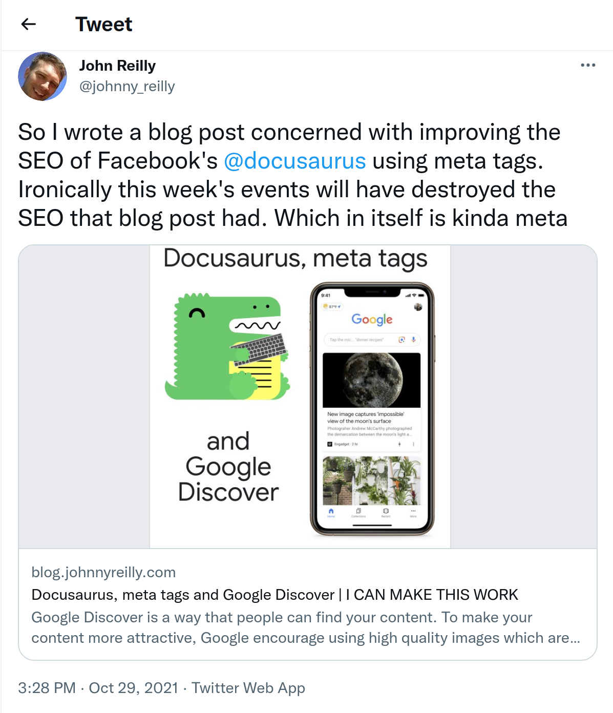

The Open Graph protocol has become the standard mechanism for sharing rich content on the web. Whilst the mechanism is roughly standardised, the rendering is not. It's like the web in the year 2000. Back then, a single piece of HTML could be rendered in many different ways, depending upon the browser. The same statement is true now for Open Graph sharing. Sharing can look very different depending upon the platform which is displaying the preview. This post looks at what implementing Open Graph tags for sharing previews looks like and also an examine the different platform rendering issue.

## Open Graph protocol and sharing

The [Open Graph protocol](https://ogp.me/) came out of Facebook and it describes itself thusly:

> The Open Graph protocol enables any web page to become a rich object in a social graph. For instance, this is used on Facebook to allow any web page to have the same functionality as any other object on Facebook.

What Open Graph is all about, is meta tags. Adding meta tags to an HTML page to explicitly define pieces of standardised information. Now there's many purposes for this, and we're interested in just one: sharing.

You may have noticed, that when you share a URL, the platform on which you're sharing it may display a kind of "preview" of the link. Here's an example of sharing a link to a blog on Twitter:

Sharing a link has automagically generated a preview "card" at the bottom of the tweet. It contains an image, it has the title of the blog and it has some description of the post as well.

Twitter made this card using a combination of Open Graph metatags (and some custom tags) which my blog surfaces.

This looks pretty fabulous and it gives the reader of that tweet some fairly rich information about what might be in that post. It potentially saves readers a click if it's obvious that the post isn't particularly interesting to them. Conversely, it makes it more likely that the reader will click if it does seem intriguing. Sharing previews are an asset.

## Open Graph meta tags

...

## When platforms diverge

Now we have a sense of what sharing previews look like and what powers them. So far we've looked just at Twitter for examples of sharing previews. However, support for Open Graph sharing previews is widespread. Examples of other places where you can use them include: Facebook, Polywork, Slack, Teams, Linked In, Outlook.com, Discord... The list is now very long indeed.

However, each platform implements sharing previews according to their own standard. What does mean? Well, a link shared on Twitter will look different to an image shared on Outlook.com. For example:

Above I'm sharing a link to a blog post. The image is to the left, the title and description is to the right. Now let's look at the same link shared on Twitter:

Here the image is above the title and the description. More distressingly, the image has been cropped which renders the title slightly unreadable.

https://developer.twitter.com/en/docs/twitter-for-websites/cards/guides/getting-started#twitter-cards-and-open-graph
