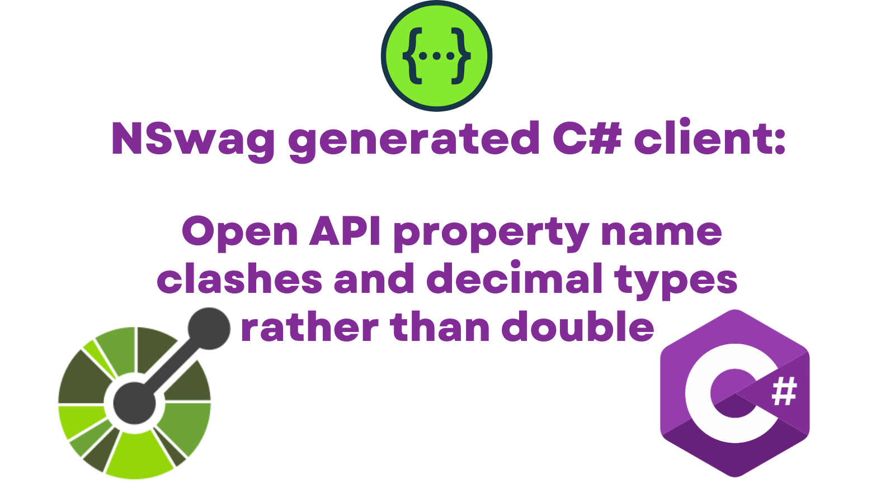

The Open Graph protocol has become the standard mechanism for sharing rich content on the web. Whilst the mechanism is roughly standardised, the rendering is not. It's like the web in the year 2000; a single piece of HTML may be rendered in many different ways, depending upon the browser. The same statement is true now for Open Graph sharing. Sharing can look very different depending upon the platform doing the rendering. This post is a discussion of that issue.

https://ogp.me/

https://developer.twitter.com/en/docs/twitter-for-websites/cards/guides/getting-started#twitter-cards-and-open-graph
