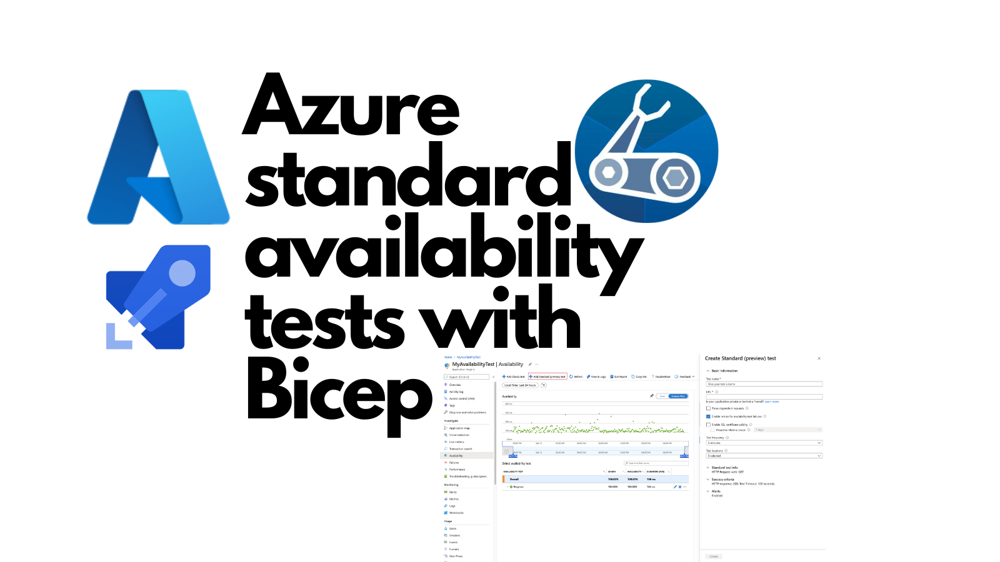
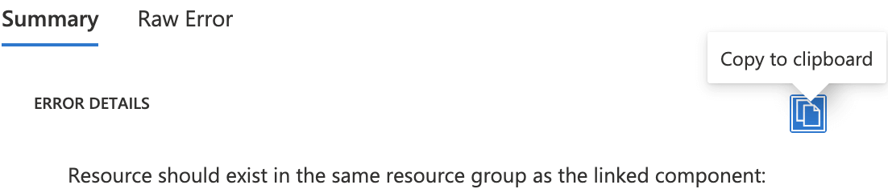
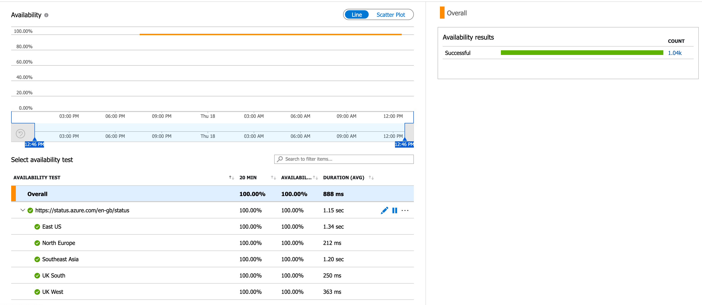

Azure standard tests are a tremendous way to monitor the uptime of your services in Azure. Sometimes also called availability tests, web tests and ping tests, this post goes through how to deploy one using Bicep. It also looks at some of the gotchas that you may encounter as you're setting it up.



<!--truncate-->

## What are standard tests?

To quote the [docs](https://docs.microsoft.com/en-us/azure/azure-monitor/app/availability-standard-tests):

> Standard tests are a single request test that is similar to the URL ping test but more advanced. In addition to validating whether an endpoint is responding and measuring the performance, Standard tests also includes SSL certificate validity, proactive lifetime check, HTTP request verb (for example GET,HEAD,POST, etc.), custom headers, and custom data associated with your HTTP request.

So we can use these to:

- send requests to a URL
- from a variety of geographic locations
- and determine if it is responding with a 200 status code

The URL may be one of our own service URLs, but it could be checking any kind of URL. It's web specific, not Azure specific.

## Standard test Bicep

Now we're going to write a Bicep module that provisions a standard test named `standard-test.bicep`:

```bicep
@description('Tags that our resources need')
param tags object

@description('The resource id of the app insights which the webtest will reference')
param appInsightsResourceId string

@description('The name of the webtest to create')
param standardTestName string

@description('URL to test')
param urlToTest string

@description('Interval in seconds between test runs for this WebTest. Default value is 300.')
param frequency int = 300

@description('Seconds until this WebTest will timeout and fail. Default value is 30.')
param timeout int = 30

// useful reference:
// https://docs.microsoft.com/en-us/azure/azure-monitor/app/monitor-web-app-availability#azure
@allowed([
  'emea-au-syd-edge' // Australia East
  'latam-br-gru-edge' // Brazil South
  'us-fl-mia-edge' // Central US
  'apac-hk-hkn-azr' // East Asia
  'us-va-ash-azr' // East US
  'emea-ch-zrh-edge' // France South (Formerly France Central)
  'emea-fr-pra-edge' // France Central
  'apac-jp-kaw-edge' // Japan East
  'emea-gb-db3-azr' // North Europe
  'us-il-ch1-azr' // North Central US
  'us-tx-sn1-azr' // South Central US
  'apac-sg-sin-azr' // Southeast Asia
  'emea-se-sto-edge' // UK West
  'emea-nl-ams-azr' // West Europe
  'us-ca-sjc-azr' // West US
  'emea-ru-msa-edge' // UK South
])
@description('The populations (locations) for the test')
param testPopulations array = [
  'emea-se-sto-edge' // UK West
  'emea-ru-msa-edge' // UK South
  'emea-gb-db3-azr' // North Europe
  'us-va-ash-azr' // East US
  'apac-sg-sin-azr' // Southeast Asia
]

var tagsWithHiddenLink = union({
  'hidden-link:${appInsightsResourceId}': 'Resource'
}, tags)

resource standardWebTest 'Microsoft.Insights/webtests@2018-05-01-preview' = {
  name: standardTestName
  location: resourceGroup().location
  tags: tagsWithHiddenLink
  kind: 'ping'
  properties: {
    SyntheticMonitorId: urlToTest
    Name: urlToTest
    Description: null
    Enabled: true
    Frequency: frequency
    Timeout: timeout
    Kind: 'standard'
    RetryEnabled: true
    Locations: [for testPopulation in testPopulations: {
      Id: testPopulation
    }]
    Configuration: null
    Request: {
      RequestUrl: urlToTest
      Headers: null
      HttpVerb: 'GET'
      RequestBody: null
      ParseDependentRequests: false
      FollowRedirects: null
    }
    ValidationRules: {
      ExpectedHttpStatusCode: 200
      IgnoreHttpsStatusCode: false
      ContentValidation: null
      SSLCheck: true
      SSLCertRemainingLifetimeCheck: 7
    }
  }
}

output standardWebTestName string = standardWebTest.name
output standardWebTestId string = standardWebTest.id
```

### Locations / populations

You'll note that a parameter to the Bicep module is `testPopulations`. These are the geographical places where requests will be sent from. You'll note we have a default value of five populations, but these could be any of the (presently) sixteen valid values. If you were wondering where those are sourced from, [here is the link to the Azure docs](https://docs.microsoft.com/en-us/azure/azure-monitor/app/availability-standard-tests#location-population-tags).

### The `hidden-link` tag

Another significant call out should go to the `hidden-link` tag. The `hidden-link` tag is a mandatory tag that connects the test (known in Azure as a "webtest") to an app insights instance.

If you do not provide a `hidden-link` tag, or if you try to specify a resource group other than the app insights resource group, Azure will fail to deploy your test and you may find yourself presented with an error like this in the deployments section of the Azure Portal.

> Resource should exist in the same resource group as the linked component



In our module we set both the `hidden-link` tag as well as the tags that have been supplied via the `tags` parameter.

### App insights and standard tests share a resource group

Another thing that can cause issues is the deployment of your app insights resource. It's not unusual to spin up Azure resources on demand, for a given branch of your source code. Those resources will be named in relation to the branch and will depend upon one another. I've never managed to successfully create an app insights resource, and reference it from a standard test within the same Bicep file. It appears to be necessary to separate the two actions, such that Azure recognises the existence of the app insights resource when the standard test is deployed.

If you are working with long-lived app insights it won't be an issue for you, but if you aren't it's worth being aware of.

## Using `standard-test.bicep`

Our Bicep module can be invoked from another Bicep module named `ping-them.bicep` like so:

```bicep
@description('Tags that our resources need')
param tags object

@description('The name of the app insights')
param appInsightsName string

@description('An object where the keys are the name of the web test and the values are the URL eg {"my-standard-test": "https://status.azure.com/en-gb/status"} ')
param standardTests object

var appInsightsResourceId = resourceId('Microsoft.Insights/components', appInsightsName)

module standardTestsToCreate 'standard-test.bicep' = [for standardTest in items(standardTests): {
  name: standardTest.key
  params: {
    tags: tags
    appInsightsResourceId: appInsightsResourceId
    standardTestName: standardTest.key
    urlToTest: standardTest.value
  }
}]
```

As you can see, this module itself takes a number of parameters, and will typically be invoked from some kind of continuous integration mechanism such as Azure Pipelines or GitHub Actions.

This module is written in the expectation that multiple URLs will need to be pinged, and so it has a parameter named `standardTests` which is effectively a dictionary of key-value pairs, where the key is the name of the standard test, and the value is the URL to test.

The module makes use of the [`items`](https://docs.microsoft.com/en-us/azure/azure-resource-manager/bicep/bicep-functions-array#items) array helper in Bicep to convert the object into an array that can be iterated over.

## Azure Pipelines test

We're going to use Azure Pipelines to test this out. Here's an `azure-pipelines.yml` file:

```yml
trigger:
  - main

pool:
  vmImage: ubuntu-latest

steps:
  - checkout: self
    submodules: true

  - bash: az bicep build --file ping-them.bicep
    displayName: 'Compile Bicep to ARM'

  - task: AzureResourceManagerTemplateDeployment@3
    name: DeploySharedWebTests
    displayName: Deploy Shared Web Tests
    inputs:
      deploymentScope: Resource Group
      azureResourceManagerConnection: ${{ variables.serviceConnection }}
      subscriptionId: $(subscriptionId)
      action: Create Or Update Resource Group
      resourceGroupName: $(resourceGroup)
      location: $(location)
      templateLocation: Linked artifact
      csmFile: 'ping-them.json' # created by bash script
      overrideParameters: >-
        -tags {"owner": "@johnny_reilly", "branch": "$(Build.SourceBranchName)"}
        -appInsightsName $(appInsightsName)
        -standardTests {"my-standard-test": "https://status.azure.com/en-gb/status"}
      deploymentMode: Incremental
```

When run, it invokes our `ping-them.bicep` module, passing two URLs to test.

When executed, you end up with a delightful "availability test" (which is your standard test) in Azure:


