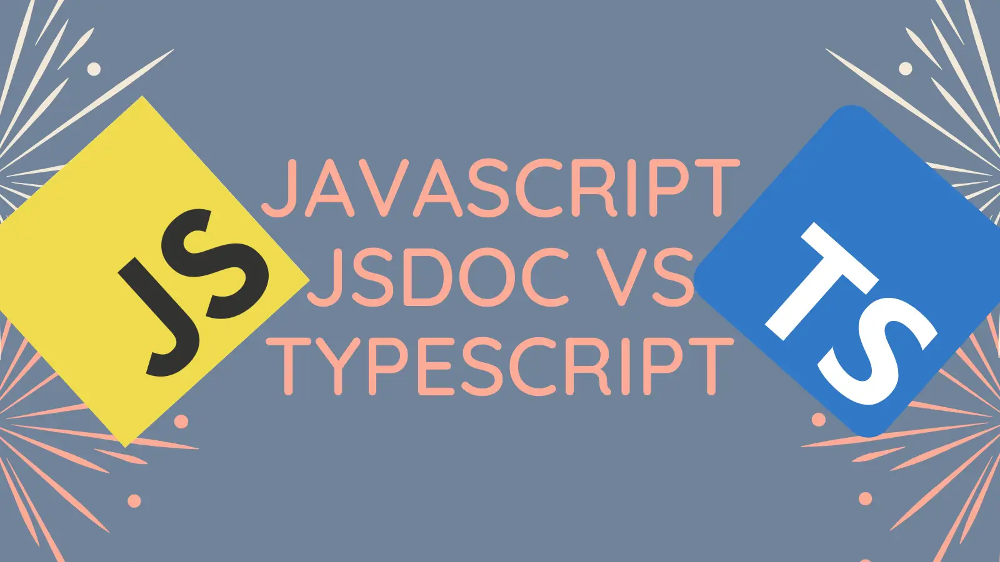

There's a debate to be had about whether using JavaScript or TypeScript leads to better outcomes when building a project. The introduction of using JSDoc annotations to type a JavaScript codebase introduces a new dynamic to this discussion. This post will investigate what that looks like, and come to an (opinionated) conclusion.



If you'd like to learn more about setting up a codebase to be type checked with JSDoc and TypeScript, then [read this guide](../2024-09-02-typescript-eslint-with-jsdoc-js/index.md).

<!--truncate-->

## Updated 29th March 2023

This blog evolved to become a talk:

<iframe width="560" height="315" src="https://www.youtube.com/embed/5MZoAcheyE4?start=240" title="YouTube video player" frameBorder="0" allow="accelerometer; autoplay; clipboard-write; encrypted-media; gyroscope; picture-in-picture" allowFullScreen></iframe>

Slightly surreally, there's an [audiobook version of this post](https://www.youtube.com/watch?v=pj8SoTZbCTE) thanks to ThePrimeagen. Essentially he reads the blog post and says he didn't like it. But it made me laugh 😉:

<iframe width="560" height="315" src="https://www.youtube.com/embed/pj8SoTZbCTE" title="YouTube video player" frameBorder="0" allow="accelerometer; autoplay; clipboard-write; encrypted-media; gyroscope; picture-in-picture; web-share" allowFullScreen></iframe>

If you're looking for a good reference on using JSDoc with TypeScript then [read this guide](https://www.typescriptlang.org/docs/handbook/jsdoc-supported-types.html).

## Background

If you'd talked to me in 2018, I would have solidly recommended using TypeScript, and steering away from JavaScript. The rationale is simple: I'm exceedingly convinced of the value that static typing provides in terms of productivity / avoiding bugs in production. I appreciate this can be a contentious issue, but that is my settled opinion on the subject. Other opinions are available.

TypeScript has long had a good static typing story. JavaScript is dynamically typed and so historically has not. Thanks to TypeScript support for JSDoc, JavaScript can now be statically type checked.

## What is JSDoc JavaScript?

JSDoc itself actually dates way back to 1999. According to the [Wikipedia entry](https://en.wikipedia.org/wiki/JSDoc):

> JSDoc is a markup language used to annotate JavaScript source code files. Using comments containing JSDoc, programmers can add documentation describing the application programming interface of the code they're creating.

The TypeScript team have taken JSDoc support and run with it. You can now use a [variant of JSDoc annotations](https://www.typescriptlang.org/docs/handbook/jsdoc-supported-types.html) to provide type information in JavaScript files.

What does this look like? Well, to take a simple example, a TypeScript statement like so:

```ts
let myString: string;
```

Could become the equivalent JavaScript statement with a JSDoc annotation:

```ts
/** @type {string} */
let myString;
```

This is type enhanced JavaScript which the TypeScript compiler can understand and type check.

## Why use JSDoc JavaScript?

Why would you use JSDoc JavaScript instead of TypeScript? Well there's a number of possible use cases.

Perhaps you're writing simple node scripts and you'd like a little type safety to avoid mistakes. Or perhaps you want to dip your project's toe in the waters of static type checking but without fully committing. JSDoc allows for that. Or perhaps your team simply prefers not having a compile step.

That, in fact, was the rationale of the webpack team. A little bit of history: webpack has always been a JavaScript codebase. As the codebase grew and grew, there was often discussion about using static typing. However, having a compilation step wasn't desired.

TypeScript had been quietly adding support for type checking JavaScript with the assistance of JSDoc for some time. Initial support arrived with the `--checkJs` compiler option in [TypeScript 2.3](https://www.typescriptlang.org/docs/handbook/release-notes/typescript-2-3.html#errors-in-js-files-with---checkjs).

A community member by the name of [Mohsen Azimi](https://twitter.com/mohsen____) experimentally started out using this approach to type check the webpack codebase. [His PR](https://github.com/webpack/webpack/pull/6862) ended up being a test case that helped improve the type checking of JavaScript by TypeScript. TypeScript v2.9 shipped with a whole host of JSDoc improvements as a consequence of the webpack work. Being such a widely used project this also helped popularise the approach of using JSDoc to type check JavaScript codebases. It demonstrated that this approach could work on a significantly sized codebase.

These days, JSDoc type checking with TypeScript is extremely powerful. Whilst not quite on par with TypeScript (not all TypeScript syntax is supported in JSDoc) the gap in functionality is pretty small.

It's a completely legitimate choice to build a JavaScript codebase with all the benefits of static typing.

## Why use TypeScript?

So if you were starting a project today, and you'd decided you wanted to make use of static typing, how do you choose? TypeScript or JavaScript with JSDoc?

Well, unless you've a compelling need to avoid a compilation step, I'm going to suggest that TypeScript may be the better choice for a number of reasons.

Firstly, the tooling support for using TypeScript directly is better than that for JSDoc JavaScript. At the time of writing, things like refactoring tools etc in your editor work more effectively with TypeScript than with JSDoc JavaScript. (Although these are improving as time goes by.)

Secondly, working with JSDoc is distinctly "noisier". It requires far more keystrokes to achieve the same level of type safety. Consider the following TypeScript:

```ts
function stringsStringStrings(
  p1: string,
  p2?: string,
  p3?: string,
  p4 = 'test',
): string {
  // ...
}
```

As compared to the equivalent JSDoc JavaScript:

```ts
/**
 * @param {string}  p1
 * @param {string=} p2
 * @param {string} [p3]
 * @param {string} [p4="test"]
 * @return {string}
 */
function stringsStringStrings(p1, p2, p3, p4) {
  // ...
}
```

It may be my own familiarity with TypeScript speaking, but I find that the TypeScript is easier to read and comprehend as compared to the JSDoc JavaScript alternative. The fact that all JSDoc annotations live in comments, rather than directly in syntax, makes it harder to follow. (It certainly doesn't help that many VS Code themes present comments in a very faint colour.)

My final reason for favouring TypeScript comes down to falling into the ["pit of success"](https://blog.codinghorror.com/falling-into-the-pit-of-success/). You're cutting _against_ the grain when it comes to static typing and JavaScript. You can have it, but you have to work that bit harder to ensure that you have statically typed code. On the other hand, you're cutting _with_ the grain when it comes to static typing and TypeScript. You have to work hard to opt out of static typing. The TypeScript defaults tend towards static typing, whilst the JavaScript defaults tend away.

As someone who very much favours static typing, you can imagine how this is compelling to me!

## It's your choice!

So in a way, I don't feel super strongly whether people use JavaScript or TypeScript. But having static typing will likely be a benefit to new projects. Bottom line, I'm keen that people fall into the "pit of success", so my recommendation for a new project would be TypeScript.

I really like JSDoc myself, and will often use it on small projects. It's a fantastic addition to TypeScript's capabilities. For bigger projects, I'll likely go with TypeScript from the get go. But really, this is a choice - and either is great.

[This post was originally published on LogRocket.](https://blog.logrocket.com/typescript-vs-jsdoc-javascript/)

<head>
    <link rel="canonical" href="https://blog.logrocket.com/typescript-vs-jsdoc-javascript/" />
</head>
