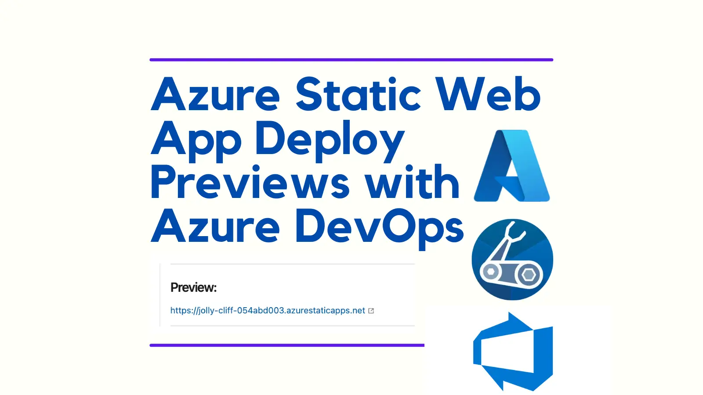
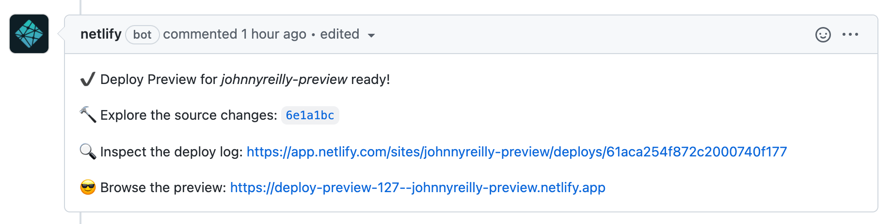
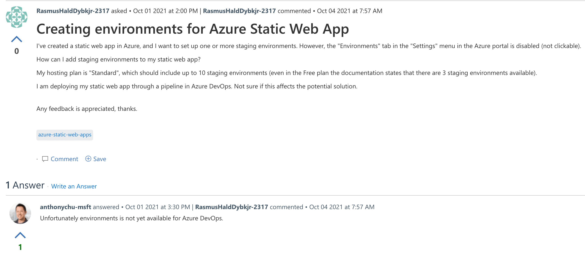
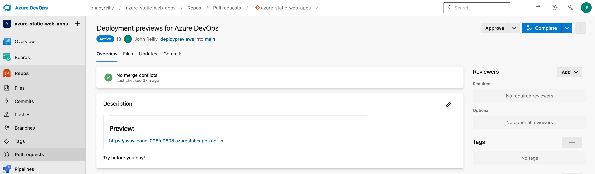

I love [Netlify deploy previews](https://www.netlify.com/products/deploy-previews/). This post implements a pull request deployment preview mechanism for Azure Static Web Apps in the context of Azure DevOps which is very much inspired by the Netlify offering.



<!--truncate-->

Having a build of your latest pull request which is deployed and clickable from the PR itself is a wonderful developer experience. It reduces friction for testing out changes by allowing you to see the impact from within the PR itself. No checking to see if an environment is free with the rest of the team, then manually running a pipeline and waiting whilst a deployment happens. No. It's all there without you having to lift a finger. I use Netlify deploy previews on my blog and have become accustomed to the delight that is this:



I love this and I wanted to implement the "browse the preview" mechanism in Azure DevOps as well, using Azure Static Web Apps. This blog post contains two things:

1. A pull request deployment environment mechanism using Azure and Azure Pipelines with Bicep.
2. A mechanism for updating a pull request in Azure DevOps with a link to the deployment environment (the "browse the preview")

It's worth bearing in mind that there's a very similar feature to what we're going to build for **1.** in SWAs now called "staging environments" that is presently only available on GitHub and not Azure DevOps:

[](https://docs.microsoft.com/en-us/answers/questions/574288/creating-environments-for-azure-static-web-app.html)

It's possible that in future the deployment environment aspect of this blog post may be rendered redundant by staging environments landing in Azure DevOps. However, the second part, which updates a PR in ADO with a link is probably generally useful. And it may be the case that the approach of provisioning an environment on demand and extracting a URL could be reworked to work with App Service and similar too.

I wrote about using [SWAs with Azure DevOps earlier this year](../2021-08-15-bicep-azure-static-web-apps-azure-devops/index.md). This blog post will take the form of a [pull request on the code written in that post](https://dev.azure.com/johnnyreilly/azure-static-web-apps/_git/azure-static-web-apps/pullrequest/3). [The finished code for this blog post can be found here](https://dev.azure.com/johnnyreilly/azure-static-web-apps/_git/azure-static-web-apps?version=GThand-rolled-deploy-previews).

## Getting `defaultHostName` from Static Web Apps

The first thing we're going to do is take the Bicep from that post and tweak it to the following:

```bicep
param appName string
param repositoryUrl string
param repositoryBranch string

param skuName string = 'Free'
param skuTier string = 'Free'

resource staticWebApp 'Microsoft.Web/staticSites@2021-02-01' = {
  name: repositoryBranch == 'main' ? appName : '${appName}-${repositoryBranch}'
  location: resourceGroup().location
  sku: {
    name: skuName
    tier: skuTier
  }
  properties: {
    // The provider, repositoryUrl and branch fields are required for successive deployments to succeed
    // for more details see: https://github.com/Azure/static-web-apps/issues/516
    provider: 'DevOps'
    repositoryUrl: repositoryUrl
    branch: repositoryBranch
    buildProperties: {
      skipGithubActionWorkflowGeneration: true
    }
  }
}

output staticWebAppDefaultHostName string = staticWebApp.properties.defaultHostname // eg gentle-bush-0db02ce03.azurestaticapps.net
output staticWebAppId string = staticWebApp.id
output staticWebAppName string = staticWebApp.name
```

There's some changes in here. First of all we're using a newer version of the `staticSites` resource in Azure. You'll also see that we name the resource conditionally now. If we're on the `main` branch we name it as we did before with `appName`. But if we aren't then we suffix the `name` with the `repositoryBranch`. It's worth knowing that [there are restrictions and conventions for Azure resource naming](https://docs.microsoft.com/en-us/azure/cloud-adoption-framework/ready/azure-best-practices/resource-abbreviations#compute-and-web). If you have a branch name that is just alphanumerics and hyphens you'll be fine.

You'll see the output of the Bicep file has changed. Previously we were outputting the `apiKey` that we used for deployment. This isn't the securest of approaches as, by having this as a deployment output, this data can be accessed by people who share access with your Azure portal. So we're going to use a different (and more secure) approach to acquire this in our pipeline later.

More significantly, we are now outputting the `staticWebAppDefaultHostName` of our newly provisioned SWA. This is the location where people will be able to view the deployment preview. Since we want to pump that into our pull request description, so people can click on the link, we are going to need this. We're also pumping out the `staticWebAppId` and `staticWebAppName`. We'll use the `staticWebAppName` to acquire the `apiKey` in our pipeline.

## Azure Pipelines tweaks

Now to the pipeline. After the deployment, our updated pipeline is going to acquire the `apiKey` for deployment like so:

```yml
- task: AzureCLI@2
  displayName: 'Acquire API key for deployment'
  inputs:
    azureSubscription: $(serviceConnection)
    scriptType: bash
    scriptLocation: inlineScript
    inlineScript: |
      APIKEY=$(az staticwebapp secrets list --name $(staticWebAppName) | jq -r '.properties.apiKey')
      echo "##vso[task.setvariable variable=apiKey;issecret=true]$APIKEY"
```

The above uses the [Azure CLI task](https://docs.microsoft.com/en-us/azure/devops/pipelines/tasks/deploy/azure-cli?view=azure-devops) to acquire the `apiKey`. It uses [jq](https://stedolan.github.io/jq/) to pull out the required property from the JSON and writes it as a secret variable in the pipeline to be used in the deployment.

At the end of the pipeline, if we're not on the `main` branch, the the pipeline is going to run a custom script that will update the PR with the preview URL:

```yml
- task: Npm@1
  displayName: 'Pull request preview install'
  condition: and(succeeded(), ne(variables.isMain, 'true'))
  inputs:
    command: 'install'
    workingDir: pull-request-preview

- task: Npm@1
  displayName: 'Pull request preview'
  condition: and(succeeded(), ne(variables.isMain, 'true'))
  inputs:
    command: 'custom'
    customCommand: 'run pull-request-preview -- --sat "$(System.AccessToken)" --project "$(System.TeamProject)" --repository "$(Build.Repository.Name)" --systemCollectionUri "$(System.CollectionUri)" --pullRequestId $(System.PullRequest.PullRequestId) --previewUrl "https://$(staticWebAppDefaultHostName)"'
    workingDir: pull-request-preview
```

We haven't written that script yet; we will in a moment.

The complete `azure-piplines.yml` is below, and you'll notice we've moved all variables save for the `subscriptionId` into the `azure-pipelines.yml` and we're using a `westeurope` location / resource group as at present `staticSites` is not available everywhere:

```yml
pool:
  vmImage: ubuntu-latest

variables:
  # subscriptionId is a variable defined on the pipeline itself
  - name: appName
    value: 'our-static-web-app'
  - name: location
    value: 'westeurope' # at time of writing static sites are available in limited locations such as westeurope
  - name: serviceConnection
    value: 'azureRMWestEurope'
  - name: azureResourceGroup # this resource group lives in westeurope
    value: 'johnnyreilly'

steps:
  - checkout: self
    submodules: true

  - bash: az bicep build --file infra/static-web-app/main.bicep
    displayName: 'Compile Bicep to ARM'

  - task: AzureResourceManagerTemplateDeployment@3
    name: DeployStaticWebAppInfra
    displayName: Deploy Static Web App infra
    inputs:
      deploymentScope: Resource Group
      azureResourceManagerConnection: $(serviceConnection)
      subscriptionId: $(subscriptionId)
      action: Create Or Update Resource Group
      resourceGroupName: $(azureResourceGroup)
      location: $(location)
      templateLocation: Linked artifact
      csmFile: 'infra/static-web-app/main.json' # created by bash script
      overrideParameters: >-
        -repositoryUrl $(Build.Repository.Uri)
        -repositoryBranch $(Build.SourceBranchName)
        -appName $(appName)
      deploymentMode: Incremental
      deploymentOutputs: deploymentOutputs

  - task: PowerShell@2
    name: 'SetDeploymentOutputVariables'
    displayName: 'Set Deployment Output Variables'
    inputs:
      targetType: inline
      script: |
        $armOutputObj = '$(deploymentOutputs)' | ConvertFrom-Json
        $armOutputObj.PSObject.Properties | ForEach-Object {
          $keyname = $_.Name
          $value = $_.Value.value

          # Creates a standard pipeline variable
          Write-Output "##vso[task.setvariable variable=$keyName;]$value"

          # Display keys and values in pipeline
          Write-Output "output variable: $keyName $value"
        }
      pwsh: true

  - task: AzureCLI@2
    displayName: 'Acquire API key for deployment'
    inputs:
      azureSubscription: $(serviceConnection)
      scriptType: bash
      scriptLocation: inlineScript
      inlineScript: |
        APIKEY=$(az staticwebapp secrets list --name $(staticWebAppName) | jq -r '.properties.apiKey')
        echo "##vso[task.setvariable variable=apiKey;issecret=true]$APIKEY"

  - task: AzureStaticWebApp@0
    name: DeployStaticWebApp
    displayName: Deploy Static Web App
    inputs:
      app_location: 'static-web-app'
      # api_location: 'api'
      output_location: 'build'
      azure_static_web_apps_api_token: $(apiKey)

  - task: Npm@1
    displayName: 'Pull request preview install'
    condition: and(succeeded(), ne(variables.isMain, 'true'))
    inputs:
      command: 'install'
      workingDir: pull-request-preview

  - task: Npm@1
    displayName: 'Pull request preview'
    condition: and(succeeded(), ne(variables.isMain, 'true'))
    inputs:
      command: 'custom'
      customCommand: 'run pull-request-preview -- --sat "$(System.AccessToken)" --project "$(System.TeamProject)" --repository "$(Build.Repository.Name)" --systemCollectionUri "$(System.CollectionUri)" --pullRequestId $(System.PullRequest.PullRequestId) --previewUrl "https://$(staticWebAppDefaultHostName)"'
      workingDir: pull-request-preview
```

## Updating the PR with a preview URL

We want to be able to update our pull request with our deploy URL. To make that happen, we're going to whiz up a little node app using TypeScript, ts-node and [the azure-devops-node-api package](https://github.com/microsoft/azure-devops-node-api).

Let's create our app:

```bash
mkdir pull-request-preview
cd pull-request-preview
npm init --yes
npm install @types/node @types/yargs ts-node typescript azure-devops-node-api yargs --save
```

We'll update our newly created `package.json` file with a `pull-request-preview` script which will be the entry point.

```json
  "scripts": {
    "pull-request-preview": "ts-node ./index.ts"
  },
```

We'll add a `tsconfig.json` file that looks like this:

```json
{
  "compilerOptions": {
    "target": "ES2015",
    "module": "CommonJS",
    "strict": true,
    "esModuleInterop": true,
    "moduleResolution": "node"
  }
}
```

Finally we'll add our script in a new `index.ts` file:

```ts
#!/usr/bin/env node
import yargs from 'yargs/yargs';
import * as nodeApi from 'azure-devops-node-api';
import { IGitApi } from 'azure-devops-node-api/GitApi';
import { PullRequestStatus } from 'azure-devops-node-api/interfaces/GitInterfaces';

const parser = yargs(process.argv.slice(2)).options({
  pat: { type: 'string', default: '' },
  sat: { type: 'string', default: '' },
  systemCollectionUri: { type: 'string', demandOption: true },
  project: { type: 'string', demandOption: true },
  repository: { type: 'string', demandOption: true },
  pullRequestId: { type: 'number' },
  previewUrl: { type: 'string', demandOption: true },
});

(async () => {
  await run(await parser.argv);
})();

async function run({
  pat,
  sat,
  project,
  repository,
  systemCollectionUri,
  pullRequestId,
  previewUrl,
}: {
  pat: string;
  sat: string;
  systemCollectionUri: string;
  project: string;
  repository: string;
  pullRequestId: number | undefined;
  previewUrl: string;
}) {
  const config: Config = { project, repository };
  const gitApi = await getGitApi({ pat, sat, systemCollectionUri });

  if (!pullRequestId)
    console.log(
      'No pull request id supplied, so will look up latest active PR',
    );

  const pullRequestIdToUpdate =
    pullRequestId || (await getActivePullRequestId({ gitApi, config }));
  if (!pullRequestIdToUpdate) {
    console.log('No pull request found');
    return;
  }

  console.log(
    `Updating ${systemCollectionUri}/${project}/_git/${repository}/pullrequest/${pullRequestIdToUpdate} with a preview URL of ${previewUrl}`,
  );

  const pullRequest = await getPullRequest({
    gitApi,
    config,
    pullRequestId: pullRequestIdToUpdate,
  });

  await updatePullRequestDescription({
    gitApi,
    config,
    pullRequestId: pullRequestIdToUpdate,
    description: makePreviewDescriptionMarkdown(
      pullRequest.description!,
      previewUrl,
    ),
  });

  console.log(
    `Updated pull request description a preview URL of ${previewUrl}`,
  );
}

interface Config {
  project: string;
  repository: string;
}

async function getGitApi({
  sat,
  pat,
  systemCollectionUri,
}: {
  pat: string;
  sat: string;
  systemCollectionUri: string;
}) {
  const authHandler = pat
    ? nodeApi.getPersonalAccessTokenHandler(
        pat,
        /** allowCrossOriginAuthentication */ true,
      )
    : nodeApi.getHandlerFromToken(
        sat,
        /** allowCrossOriginAuthentication */ true,
      );

  const webApi = new nodeApi.WebApi(systemCollectionUri, authHandler);
  const gitApi = await webApi.getGitApi();

  return gitApi;
}

async function getActivePullRequestId({
  gitApi,
  config,
}: {
  gitApi: IGitApi;
  config: Config;
}) {
  const topActivePullRequest = await gitApi.getPullRequests(
    config.repository, // repository.id!,
    { status: PullRequestStatus.Active },
    config.project,
    undefined,
    /** skip */ 0,
    /** top */ 1,
  );

  return topActivePullRequest.length > 0
    ? topActivePullRequest[0].pullRequestId
    : undefined;
}

async function getPullRequest({
  gitApi,
  config,
  pullRequestId,
}: {
  gitApi: IGitApi;
  config: Config;
  pullRequestId: number;
}) {
  const pullRequest = await gitApi.getPullRequest(
    config.repository, // repository.id!,
    pullRequestId,
    config.project,
    undefined,
    /** skip */ 0,
    /** top */ 1,
    /** includeCommits */ false,
    /** includeWorkItemRefs */ false,
  );
  return pullRequest;
}

async function updatePullRequestDescription({
  gitApi,
  config,
  pullRequestId,
  description,
}: {
  gitApi: IGitApi;
  config: Config;
  pullRequestId: number;
  description: string;
}) {
  // To do an update with the API you must provide a new object with only the properties you are updating
  const updatePullRequest = {
    description,
  };
  await gitApi.updatePullRequest(
    updatePullRequest,
    config.repository,
    pullRequestId,
    config.project,
  );
}

function makePreviewDescriptionMarkdown(desc: string, previewUrl: string) {
  const previewRegex = /(> -*\n> # Preview:\n.*\n>.*\n> -*\n)/;

  const makePreview = (previewUrl: string) => `> ---
> # Preview:
> ${previewUrl}
> 
> ---
`;

  const alreadyHasPreview = desc.match(previewRegex);
  return alreadyHasPreview
    ? desc.replace(previewRegex, makePreview(previewUrl))
    : makePreview(previewUrl) + desc;
}
```

The above code does two things:

1. Looks up the pull request, using the details supplied from the pipeline. It's worth noting that the `System.PullRequest.PullRequestId` variable is [initialized only if the build ran because of a Git PR affected by a branch policy](https://docs.microsoft.com/en-us/azure/devops/pipelines/build/variables?view=azure-devops&tabs=yaml). If you don't have that set up, the script falls back to using the latest active pull request. This is generally useful when you're getting set up in the first place; you won't want to rely on this behaviour.
2. Updates the pull request description with a prefix piece of markdown that provides the link to the preview URL. This is our "browse the preview":
   

This script could be refactored into a dedicated Azure Pipelines custom task.

## Permissions

The first time you run this you may encounter a permissions error of the form:

```
Error: TF401027: You need the Git 'PullRequestContribute' permission to perform this action.
```

To remedy this you need to give your build service the relevant permissions to update a pull request. You can do that by going to the security settings of your repo and setting "Contribute to pull requests" to "Allow" for your build service:


## Enjoy! (and keep Azure tidy)

When the pipeline is now run you can see that a deployment preview link is now updated onto the PR description:



This will happen whenever a PR is raised which is tremendous.

A thing to remember, is that there's nothing in this post that tears down the temporary deployment after the pull request has been merged. It will hang around. We happen to be using free resources in this post, but if we weren't there would be cost implications. Either way, you'll want to clean up unused environments as a matter of course. And I'd advise automating that.

So be tidy and cost aware with this approach.
