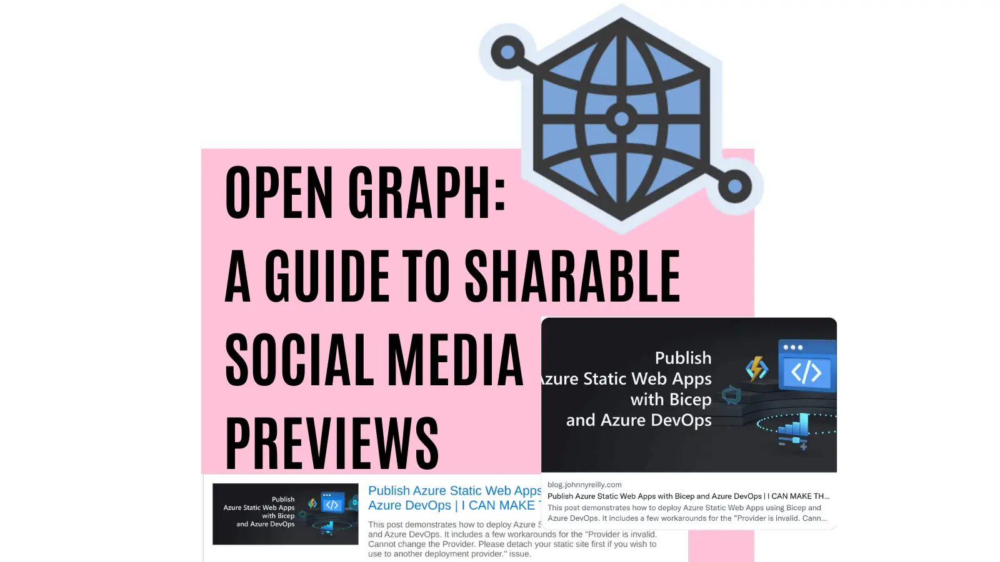
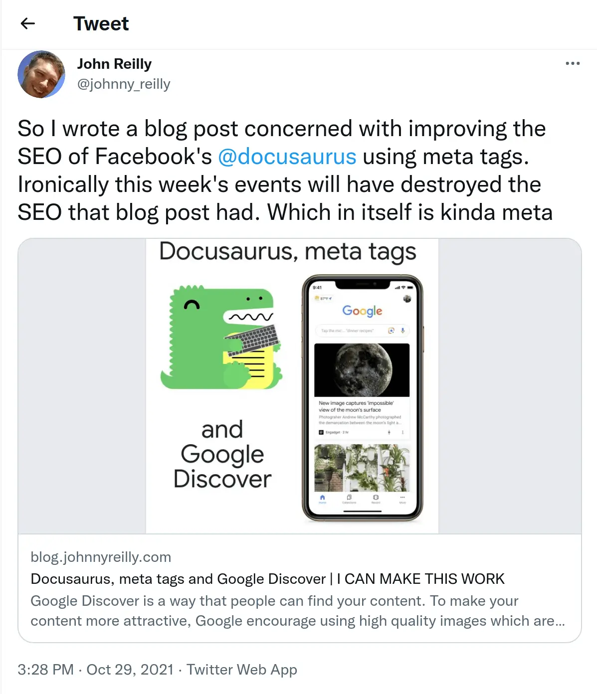
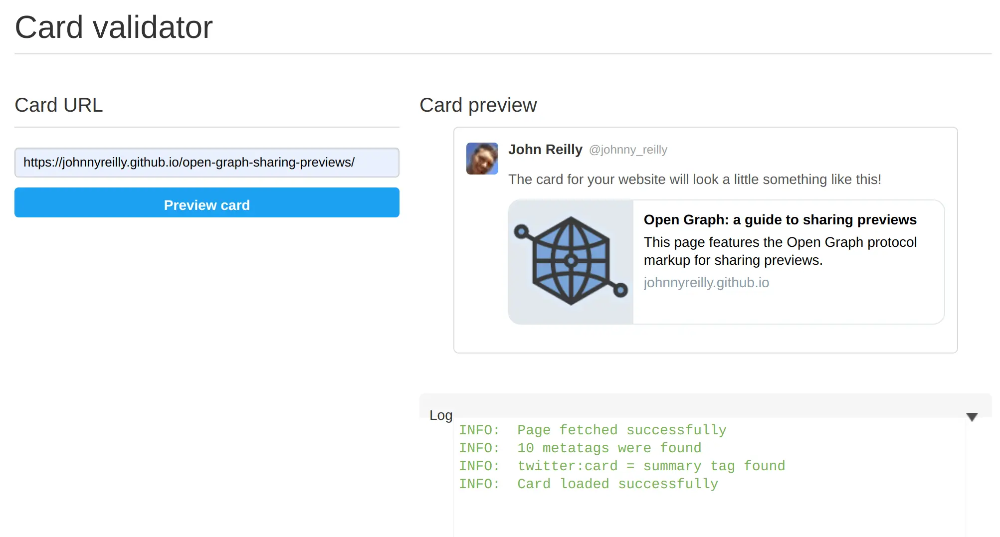
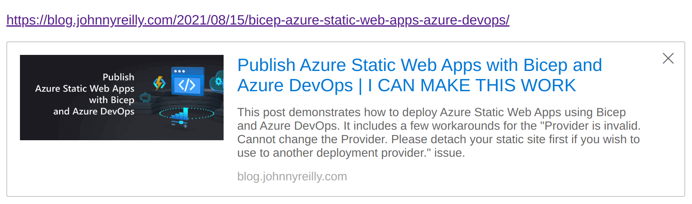

The Open Graph protocol has become the standard mechanism for sharing rich content on the web. This post looks at what implementing Open Graph tags for sharable previews (often called social media previews) looks like, the tools you can use and also examines the different platform rendering issue.



<!--truncate-->

## Updated: 26 November 2022

I've updated this post to advise on image types to favour.

## Open Graph protocol and sharing

You may have noticed, that when you share a URL, the platform on which you're sharing may display a kind of "preview" of the link. Here's an example of sharing a link to a blog on Twitter:

[](https://twitter.com/johnny_reilly/status/1454092877722800131)

Sharing a link has automagically generated a preview "card" at the bottom of the tweet. It contains an image, it has the title of the blog and it has a description of the post as well.

This looks pretty fabulous and it gives the reader of that tweet some fairly rich information about what might be in that post. It potentially saves readers a click if it's obvious that the post isn't particularly interesting to them. Conversely, it makes it more likely that the reader will click if it does seem intriguing. Sharing previews are an asset.

Twitter made this card using a combination of Open Graph metatags (and some custom tags) which my blog surfaces.

## Open Graph meta tags

The [Open Graph protocol](https://ogp.me/) came out of Facebook and it describes itself thusly:

> The Open Graph protocol enables any web page to become a rich object in a social graph. For instance, this is used on Facebook to allow any web page to have the same functionality as any other object on Facebook.

What Open Graph is all about, is meta tags. Adding meta tags to an HTML page to explicitly define pieces of standardised information. Now there's many purposes for this, and we're interested in just one: sharing.

Now that we understand what sharing previews give us, let's understand how they work. The [Open Graph](https://ogp.me/#metadata) website has a great walkthrough of the minimum requirement for Open Graph:

> - `og:title` - The title of your object as it should appear within the graph, e.g., "The Rock".
> - `og:type` - The type of your object, e.g., "video.movie". Depending on the type you specify, other properties may also be required.
> - `og:image` - An image URL which should represent your object within the graph.
> - `og:url` - The canonical URL of your object that will be used as its permanent ID in the graph, e.g., "https://www.imdb.com/title/tt0117500/".
>
> As an example, the following is the Open Graph protocol markup for The Rock on IMDB:
>
> ```html
> <html prefix="og: https://ogp.me/ns#">
>   <head>
>     <title>The Rock (1996)</title>
>     <meta property="og:title" content="The Rock" />
>     <meta property="og:type" content="video.movie" />
>     <meta property="og:url" content="https://www.imdb.com/title/tt0117500/" />
>     <meta
>       property="og:image"
>       content="https://ia.media-imdb.com/images/rock.jpg"
>     />
>     ...
>   </head>
>   ...
> </html>
> ```

Sharing previews have very similar, but crucially slightly different, requirements. Five tags are required to generate a sharable preview:

- `og:title` - The title of your page
- `og:description` - A description of the content of that page
- `og:image` - An image URL which should appear in the social media share.
- `og:url` - The canonical URL of your web page.
- `twitter:card` - A [custom tag which is only required by Twitter](https://developer.twitter.com/en/docs/twitter-for-websites/cards/guides/getting-started#started) indicating the type of share, be it `"summary"`, `"summary_large_image"`, `"app"`, or `"player"`. Probably `"summary"` or `"summary_large_image"` for most use cases.

If we implement these, then our page will offer sharable previews.

With this understanding in place; we can take a look at what it would look like to add sharable previews to a website. We'll make ourselves a React website with:

```
npx react-static create
```

When prompted, name the site `demo` and select the `blank` template.

Please note, nothing that we're doing here is React specific; it's applicable to all websites regardless of the technology they're built with; this is just a straightforward way to demo a website.

We're using [`react-static`](https://github.com/react-static/react-static) for this demo because it is a static site generator. This is significant because, as a general rule, many platforms that support sharing, do not crawl dynamically generated meta tags. By this we mean, tags generated by JavaScript at runtime. Rather, these tags must be baked into the HTML that is served up, so a static site generator like `react-static` fits the brief well as it takes care of this.

We're going to replace the `App.js` that is scaffolded out with our own `App.js`:

```jsx
import * as React from 'react';
import { Head } from 'react-static';
import './app.css';

function App() {
  const openGraphData = {
    title: 'Open Graph: a guide to sharing previews',
    description:
      'This page features the Open Graph protocol markup for sharing previews.',
    url: 'https://johnnyreilly.github.io/open-graph-sharing-previews/',
    image:
      'https://upload.wikimedia.org/wikipedia/commons/7/72/Open_Graph_protocol_logo.png',
  };
  return (
    <div className="App">
      <Head>
        <meta property="og:title" content={openGraphData.title} />
        <meta property="og:description" content={openGraphData.description} />
        <meta property="og:url" content={openGraphData.url} />
        <meta property="og:image" content={openGraphData.image} />
        <meta name="twitter:card" content="summary" />
      </Head>
      <h1>{openGraphData.title}</h1>
      
      <h2>Share it and see!</h2>
    </div>
  );
}

export default App;
```

The code above renders the required meta tags for sharing previews. When we build and deploy this we can see they show up like so:


## Tools for testing sharing

Now we have a demo, it would be tremendous to be able to test it out. There's various official tools to test your URLs:

- [Twitter](https://cards-dev.twitter.com/validator)
- [Facebook](https://developers.facebook.com/tools/debug/)
- [LinkedIn](https://www.linkedin.com/post-inspector/inspect/)

There's also a number of unoffical "aggregator" tools that attempt to render the appearance of your social previews across multiple platforms to save you going to each tool in turn:

- https://www.opengraph.xyz/
- https://metatags.io/
- https://socialsharepreview.com/

Let's test out the Twitter validator:



Terrific! We have sharable previews enabled for the site we've made.

## Sharable preview rendering: not yet standard

Now we have a sense of what sharing previews look like, what powers them and how to implement them. So far we've looked just at Twitter for examples of sharing previews. However, support for Open Graph sharing previews is widespread. Examples of other places where you can use them include: Facebook, Polywork, Slack, Teams, Linked In, Outlook.com, Discord... The list is now very long indeed.

However, each platform implements sharing previews according to their own standard. What does mean? Well, a link shared on Twitter will look different to one shared on Outlook.com. For example:



Above I'm sharing a link to a blog post. The image is to the left, the title and description is to the right. Now let's look at the same link shared on Twitter:

[](https://twitter.com/AzureWeekly/status/1436733027489652743)

Here the image is above the title and the description. More distressingly, the image has been cropped which renders the title slightly unreadable.

So whilst the mechanism for sharing is roughly standardised, the rendering is not. It's not dissimilar to the web in the year 2000. Back then, a single piece of HTML could be rendered in many different ways, depending upon the browser. The same statement is true now for Open Graph sharing. Sharing can look very different depending upon the platform which is displaying the preview. The only way to avoid this at present is to thoroughly on all the platforms where we want to share links; ensuring the sharable previews look acceptable.

## `og:image` type: PNG, JPEG or WebP? What's best?

Let's think about the type of image we reference in the `og:image` tag for a moment. This is the image that will be displayed in the sharing preview:

```html
<meta property="og:image" content="https://ia.media-imdb.com/images/rock.jpg" />
```

We can use any image format we like. However, there are some considerations to bear in mind. Whilst you might imagine that the image format is not important, it is. This is because not all platforms support all image formats. Whilst say Twitter and Facebook support PNG, JPEG and WebP, other platforms do not. For example, Teams does not support WebP. So if we want to share a link on Teams, we likely want to use a JPEG or PNG image.

I should tell you that I learned this the hard way, deciding to use WebP for most of the images on my blog, including the Open Graph image. I was then surprised to find that the images were not displaying in Teams. I had to go back and change the Open Graph images back to PNG. Don't be me.

Incidentally, the world could use a "caniuse" for Open Graph sharing previews. I'd love to see one.

## Conclusion

In this post we've understood what sharable previews are, how to add them to a website, how to test them and some of the rough edges to be aware of.

[This post was originally published on LogRocket.](https://blog.logrocket.com/open-graph-sharable-social-media-previews/)

<head>
    <link rel="canonical" href="https://blog.logrocket.com/open-graph-sharable-social-media-previews/" />
</head>
