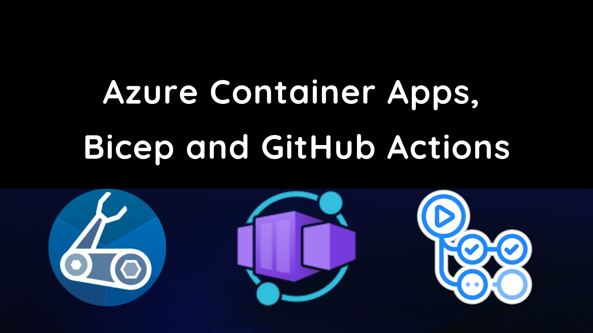
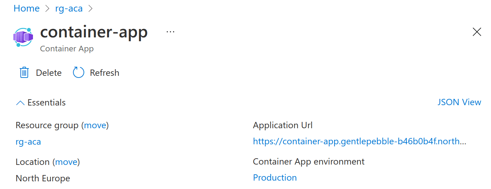
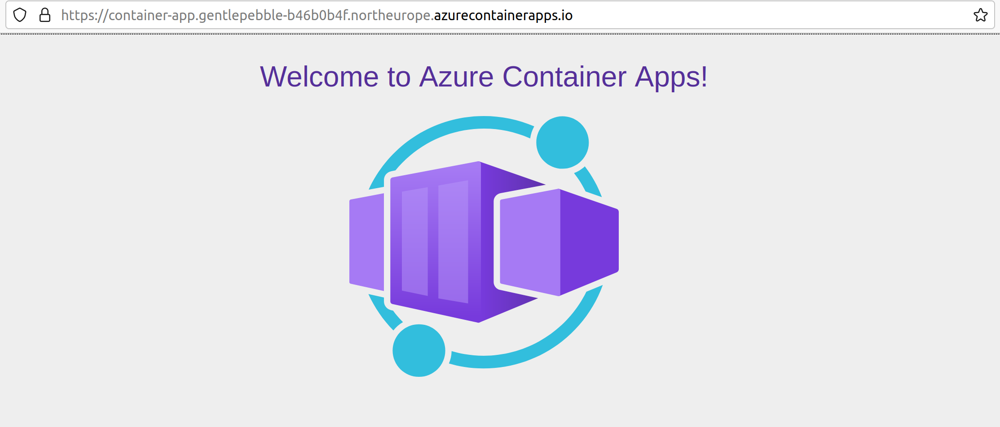

Azure Container Apps are an exciting way to deploy containers to Azure. This post shows how to deploy the infrastructure for an Azure Container App to Azure using Bicep and GitHub Actions. The [Azure Container App documentation](https://docs.microsoft.com/en-us/azure/container-apps/) features quickstarts for deploying your first container app using both the Azure Portal and the Azure CLI. These are great, but there's a gap if you prefer to deploy using Bicep and you'd like to get your CI/CD setup right from the beginning. This post aims to fill that gap.

If you're interested in building your own containers as well, it's worth looking at [this follow up post](../2021-12-27-azure-container-apps-build-and-deploy-with-bicep-and-github-actions/index.md).



<!--truncate-->

## Updated 02/05/2022

This post has been updated to reflect the migration of Azure Container Apps from the Microsoft.Web namespace to the Microsoft.App namespace in March 2022. See: https://github.com/microsoft/azure-container-apps/issues/109

## Bicep

Let's begin with the Bicep required to deploy an Azure Container App.

In our new repository we'll create an `infra` directory, into which we'll place a `main.bicep` file which will contain our Bicep template.

I've pared this down to the simplest Bicep template that I can; it only requires a name parameter:

```bicep
param name string
param secrets array = []

var location = resourceGroup().location
var environmentName = 'Production'
var workspaceName = '${name}-log-analytics'

resource workspace 'Microsoft.OperationalInsights/workspaces@2021-12-01-preview' = {
  name: workspaceName
  location: location
  properties: {
    sku: {
      name: 'PerGB2018'
    }
    retentionInDays: 30
    workspaceCapping: {}
  }
}

resource environment 'Microsoft.App/managedEnvironments@2022-01-01-preview' = {
  name: environmentName
  location: location
  properties: {
    appLogsConfiguration: {
      destination: 'log-analytics'
      logAnalyticsConfiguration: {
        customerId: workspace.properties.customerId
        sharedKey: listKeys(workspace.id, workspace.apiVersion).primarySharedKey
      }
    }
  }
}

resource containerApp 'Microsoft.App/containerApps@2022-01-01-preview' = {
  name: name
  kind: 'containerapps'
  location: location
  properties: {
    managedEnvironmentId: environment.id
    configuration: {
      secrets: secrets
      registries: []
      ingress: {
        'external':true
        'targetPort':80
      }
    }
    template: {
      containers: [
        {
          'name':'simple-hello-world-container'
          'image':'mcr.microsoft.com/azuredocs/containerapps-helloworld:latest'
          'command':[]
          'resources':{
            'cpu':'.25'
            'memory':'.5Gi'
          }
        }
      ]
    }
  }
}
```

Some things to note from the template:

- We're deploying three resources; a container app, a kube environment and an operational insights.
- Just like the official quickstarts we're going to use the `containerapps-helloworld` image.

## Setting up a resource group

In order that you can deploy your Bicep, we're going to need a resource group to send it to. Right now, Azure Container Apps aren't available everywhere. So we're going to create ourselves a resource group in North Europe which does support ACAs:

```shell
az group create -g rg-aca -l northeurope
```

## Deploying with the Azure CLI

With this resource group in place, we could simply deploy using the Azure CLI like so:

```shell
az deployment group create \
  --resource-group rg-aca \
  --template-file ./infra/main.bicep \
  --parameters \
    name='container-app'
```

## Deploying with GitHub Actions

However, we're aiming to set up a GitHub Action to do this for us. We'll create a `.github/workflows/deploy.yaml` file in our repository:

```yaml
name: Deploy
on:
  push:
    branches: [main]
  workflow_dispatch:

env:
  RESOURCE_GROUP: rg-aca

jobs:
  deploy:
    runs-on: ubuntu-latest
    steps:
      - name: Checkout repository
        uses: actions/checkout@v2

      - name: Azure Login
        uses: azure/login@v1
        with:
          creds: ${{ secrets.AZURE_CREDENTIALS }}

      - name: Deploy bicep
        uses: azure/CLI@v2
        with:
          inlineScript: |
            az deployment group create \
              --resource-group ${{ env.RESOURCE_GROUP }} \
              --template-file ./infra/main.bicep \
              --parameters \
                name='container-app'
```

The above GitHub action is very simple. It:

1. Logs into Azure using some `AZURE_CREDENTIALS` we'll set up in a moment.
2. Invokes the Azure CLI to deploy our Bicep template.

Let's create that `AZURE_CREDENTIALS` secret in GitHub:


We'll use the Azure CLI once more:

```shell
az ad sp create-for-rbac --name "myApp" --role contributor \
    --scopes /subscriptions/{subscription-id}/resourceGroups/{resource-group} \
    --sdk-auth
```

Remember to replace the `{subscription-id}` with your subscription id and `{resource-group}` with the name of your resource group (`rg-aca` if you're following along). This command will pump out a lump of JSON that looks something like this:

```json
{
  "clientId": "a-client-id",
  "clientSecret": "a-client-secret",
  "subscriptionId": "a-subscription-id",
  "tenantId": "a-tenant-id",
  "activeDirectoryEndpointUrl": "https://login.microsoftonline.com",
  "resourceManagerEndpointUrl": "https://management.azure.com/",
  "activeDirectoryGraphResourceId": "https://graph.windows.net/",
  "sqlManagementEndpointUrl": "https://management.core.windows.net:8443/",
  "galleryEndpointUrl": "https://gallery.azure.com/",
  "managementEndpointUrl": "https://management.core.windows.net/"
}
```

Take this and save it as the `AZURE_CREDENTIALS` secret in Azure.

## Running it

When the GitHub Action has been run you'll find that Azure Container App is now showing up inside the Azure Portal:



You'll see a URL is displayed, when you go that URL you'll find the hello world image is running!


