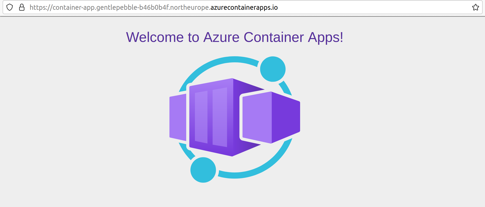

Azure Container Apps are an exciting way to deploy containers to Azure. This post shows how to build and deploy a simple web application to Azure Container Apps using Bicep and GitHub Actions. It follows on from the [previous post](../2021-12-19-azure-container-apps-bicep-and-github-actions/index.md) which deployed infrastructure and a "hello world" container, this time introducing the building of a container and storing it in the [GitHub container registry](https://docs.github.com/en/packages/working-with-a-github-packages-registry/working-with-the-container-registry).


## The containerised convent

I learn the most about a technology when I'm using it to build something. It so happens that I have an aunt that's a nun, and long ago she persuaded me to build her convent a website. I'm a good nephew and I complied. Since that time I've been merrily overengineering it for fun and non-profit.

My aunts website is a node app that is containerised and runs on [Azure App Service Web App for Containers](https://azure.microsoft.com/en-gb/services/app-service/containers/). Given that it is already in a container, this makes it a great candidate for porting to Azure Container Apps.

So that's what we'll do in this post. But where I'm building and deploying my aunt's container, you could equally be substituting your own.

## Bicep

Let's begin with the Bicep required to deploy our Azure Container App.

In our repository we'll create an `infra` directory, into which we'll place a `main.bicep` file which will contain our Bicep template:

```bicep
param nodeImage string
param nodePort int
param nodeIsExternalIngress bool

param containerRegistry string
param containerRegistryUsername string
@secure()
param containerRegistryPassword string

param tags object

@secure()
param APPSETTINGS_API_KEY string
param APPSETTINGS_DOMAIN string
param APPSETTINGS_FROM_EMAIL string
param APPSETTINGS_RECIPIENT_EMAIL string

var location = resourceGroup().location
var environmentName = 'env-${uniqueString(resourceGroup().id)}'
var minReplicas = 0

var nodeServiceAppName = 'node-app'
var workspaceName = '${nodeServiceAppName}-log-analytics'
var appInsightsName = '${nodeServiceAppName}-app-insights'

var containerRegistryPasswordRef = 'container-registry-password'
var mailgunApiKeyRef = 'mailgun-api-key'

resource workspace 'Microsoft.OperationalInsights/workspaces@2020-08-01' = {
  name: workspaceName
  location: location
  tags: tags
  properties: {
    sku: {
      name: 'PerGB2018'
    }
    retentionInDays: 30
    workspaceCapping: {}
  }
}

resource appInsights 'Microsoft.Insights/components@2020-02-02-preview' = {
  name: appInsightsName
  location: location
  tags: tags
  kind: 'web'
  properties: {
    Application_Type: 'web'
    Flow_Type: 'Bluefield'
  }
}

resource environment 'Microsoft.Web/kubeEnvironments@2021-03-01' = {
  name: environmentName
  location: location
  tags: tags
  properties: {
    type: 'managed'
    internalLoadBalancerEnabled: false
    appLogsConfiguration: {
      destination: 'log-analytics'
      logAnalyticsConfiguration: {
        customerId: workspace.properties.customerId
        sharedKey: listKeys(workspace.id, workspace.apiVersion).primarySharedKey
      }
    }
    containerAppsConfiguration: {
      daprAIInstrumentationKey: appInsights.properties.InstrumentationKey
    }
  }
}

resource containerApp 'Microsoft.Web/containerapps@2021-03-01' = {
  name: nodeServiceAppName
  kind: 'containerapps'
  tags: tags
  location: location
  properties: {
    kubeEnvironmentId: environment.id
    configuration: {
      secrets: [
        {
          name: containerRegistryPasswordRef
          value: containerRegistryPassword
        }
        {
          name: mailgunApiKeyRef
          value: APPSETTINGS_API_KEY
        }
      ]
      registries: [
        {
          server: containerRegistry
          username: containerRegistryUsername
          passwordSecretRef: containerRegistryPasswordRef
        }
      ]
      ingress: {
        'external': nodeIsExternalIngress
        'targetPort': nodePort
      }
    }
    template: {
      containers: [
        {
          image: nodeImage
          name: nodeServiceAppName
          transport: 'auto'
          env: [
            {
              name: 'APPSETTINGS_API_KEY'
              secretref: mailgunApiKeyRef
            }
            {
              name: 'APPSETTINGS_DOMAIN'
              value: APPSETTINGS_DOMAIN
            }
            {
              name: 'APPSETTINGS_FROM_EMAIL'
              value: APPSETTINGS_FROM_EMAIL
            }
            {
              name: 'APPSETTINGS_RECIPIENT_EMAIL'
              value: APPSETTINGS_RECIPIENT_EMAIL
            }
          ]
        }
      ]
      scale: {
        minReplicas: minReplicas
      }
    }
  }
}
```

Let's talk through this template. The environment, workspace and app insights resources are fairly self explanatory. The `containerApp` resource is where the action is. We'll drill into that resource and the parameters used to configure it.

### The node container app

We're going to create a single container app for our node web application. This is configured with these parameters:

```bicep
param nodeImage string
param nodePort int
param nodeIsExternalIngress bool
```

The above parameters relate to the node application that represents the website. The `nodeImage` is the container image which should be deployed to a container app. The `nodePort` is the port from the app which should be exposed (`3000` in our case). `nodeIsExternalIngress` is [whether the container should be accessible on the internet](https://docs.microsoft.com/en-us/azure/container-apps/ingress?tabs=bash#configuration). (Always `true` incidentally.)

When these parameters are applied to the `containerApp` resource, it looks like this:

```bicep
var nodeServiceAppName = 'node-app'

resource containerApp 'Microsoft.Web/containerapps@2021-03-01' = {
  // ...
  properties: {
      // ...
      ingress: {
        'external': nodeIsExternalIngress
        'targetPort': nodePort
      }
    }
    template: {
      containers: [
        {
          image: nodeImage
          name: nodeServiceAppName
          // ...
        }
      ]
      // ...
    }
  }
}
```

### Accessing the GitHub Container Registry

Given that we've told Bicep to deploy an `image`, we're going to need to tell it what registry it can use to acquire that image. Our template takes these parameters:

```bicep
param containerRegistry string
param containerRegistryUsername string
@secure()
param containerRegistryPassword string

param tags object
```

With the exception of the `tags` object which is metadata to apply to resources, these parameters are related to the container registry where our images will be stored. GitHub's in our case. Remember, what we deploy to Azure Container Apps are container images. To get something running in an ACA, it first has to reside in a container registry. There's a multitude of container registries out there and we're using the one directly available in GitHub. As an alternative, we could use an [Azure Container Registry](https://azure.microsoft.com/en-us/services/container-registry/), or [Docker Hub](https://hub.docker.com/) - or something else entirely!

Do note the [`@secure()`](https://docs.microsoft.com/en-us/azure/azure-resource-manager/bicep/parameters#secure-parameters) decorator. This marks the `containerRegistryPassword` parameter as secure. The value for a secure parameter isn't saved to the deployment history and isn't logged. Typically you'll want to mark secrets like this with `@secure()`.

You can see below that we use these to configure the `registries` property of our container app. This tells the ACA where it can go to collect the image it needs. You can also see our first usage of secrets here. We declare the `containerRegistryPassword` as a secret which is stored against the ref `'container-registry-password'`; captured as the variable `containerRegistryPasswordRef`. That variable is then referenced in the `passwordSecretRef` property - thus telling ACA where it can find the password.

```bicep
var containerRegistryPasswordRef = 'container-registry-password'

resource containerApp 'Microsoft.Web/containerapps@2021-03-01' = {
  // ...
  properties: {
    // ...
    configuration: {
      secrets: [
        {
          name: containerRegistryPasswordRef
          value: containerRegistryPassword
        }
        // ...
      ]
      registries: [
        {
          server: containerRegistry
          username: containerRegistryUsername
          passwordSecretRef: containerRegistryPasswordRef
        }
      ]
      // ...
    }
    // ...
  }
}
```

### Secrets / Configuration

The final collection of parameters are unrelated to the infrastructure of deployment, rather they are the things required to configure our running application:

```bicep
@secure()
param APPSETTINGS_API_KEY string
param APPSETTINGS_DOMAIN string
param APPSETTINGS_FROM_EMAIL string
param APPSETTINGS_RECIPIENT_EMAIL string
```

Again we've got a secret marked with `@secure()` in the form of our `APPSETTINGS_API_KEY`. Just as we did with `containerRegistryPassword`, we declare `APPSETTINGS_API_KEY` to be a secret, which is stored against the ref `'mailgun-api-key'`; captured as the variable `mailgunApiKeyRef`.

All of our configuration is exposed to the running application through environment variables. By and large this is achieved through the mechanism of key / value pairs (well technically `name` / `value`) with a slight variation for secrets. Similar to the `passwordSecretRef` mechanism we used for the registry password, we use a `secretref` in place of `value` when passing a secret, and the value will be the ref that was set up in the `secrets` section; `mailgunApiKeyRef` in this case.

```bicep
var mailgunApiKeyRef = 'mailgun-api-key'

resource containerApp 'Microsoft.Web/containerapps@2021-03-01' = {
  // ...
  properties: {
    // ...
    configuration: {
      secrets: [
        // ...
        {
          name: mailgunApiKeyRef
          value: APPSETTINGS_API_KEY
        }
      ]
      // ...
    }
    template: {
      containers: [
        {
          // ...
          env: [
            {
              name: 'APPSETTINGS_API_KEY'
              secretref: mailgunApiKeyRef
            }
            {
              name: 'APPSETTINGS_DOMAIN'
              value: APPSETTINGS_DOMAIN
            }
            {
              name: 'APPSETTINGS_FROM_EMAIL'
              value: APPSETTINGS_FROM_EMAIL
            }
            {
              name: 'APPSETTINGS_RECIPIENT_EMAIL'
              value: APPSETTINGS_RECIPIENT_EMAIL
            }
          ]
        }
      ]
      // ...
    }
  }
}
```

## Setting up a resource group

In order that you can deploy your Bicep, we're going to need a resource group to send it to. Right now, Azure Container Apps aren't available everywhere. So we're going to create ourselves a resource group in North Europe which does support ACAs:

```shell
az group create -g rg-aca -l northeurope
```

## Deploying with the Azure CLI

With this resource group in place, we could simply deploy using the Azure CLI like so:

```shell
az deployment group create \
  --resource-group rg-aca \
  --template-file ./infra/main.bicep \
  --parameters \
    name='container-app'
```

## Deploying with GitHub Actions

However, we're aiming to set up a GitHub Action to do this for us. We'll create a `.github/workflows/deploy.yaml` file in our repository:

```yaml
name: Deploy
on:
  push:
    branches: [main]
  workflow_dispatch:

env:
  RESOURCE_GROUP: rg-aca

jobs:
  deploy:
    runs-on: ubuntu-latest
    steps:
      - name: Checkout repository
        uses: actions/checkout@v2

      - name: Azure Login
        uses: azure/login@v1
        with:
          creds: ${{ secrets.AZURE_CREDENTIALS }}

      - name: Deploy bicep
        uses: azure/CLI@v1
        with:
          inlineScript: |
            az deployment group create \
              --resource-group ${{ env.RESOURCE_GROUP }} \
              --template-file ./infra/main.bicep \
              --parameters \
                name='container-app'
```

The above GitHub action is very simple. It:

1. Logs into Azure using some `AZURE_CREDENTIALS` we'll set up in a moment.
2. Invokes the Azure CLI to deploy our Bicep template.

Let's create that `AZURE_CREDENTIALS` secret in GitHub:


We'll use the Azure CLI once more:

```shell
az ad sp create-for-rbac --name "myApp" --role contributor \
    --scopes /subscriptions/{subscription-id}/resourceGroups/{resource-group} \
    --sdk-auth
```

Remember to replace the `{subscription-id}` with your subscription id and `{resource-group}` with the name of your resource group (`rg-aca` if you're following along). This command will pump out a lump of JSON that looks something like this:

```json
{
  "clientId": "a-client-id",
  "clientSecret": "a-client-secret",
  "subscriptionId": "a-subscription-id",
  "tenantId": "a-tenant-id",
  "activeDirectoryEndpointUrl": "https://login.microsoftonline.com",
  "resourceManagerEndpointUrl": "https://management.azure.com/",
  "activeDirectoryGraphResourceId": "https://graph.windows.net/",
  "sqlManagementEndpointUrl": "https://management.core.windows.net:8443/",
  "galleryEndpointUrl": "https://gallery.azure.com/",
  "managementEndpointUrl": "https://management.core.windows.net/"
}
```

Take this and save it as the `AZURE_CREDENTIALS` secret in Azure.

## Running it

When the GitHub Action has been run you'll find that Azure Container App is now showing up inside the Azure Portal:


You'll see a URL is displayed, when you go that URL you'll find the hello world image is running!


