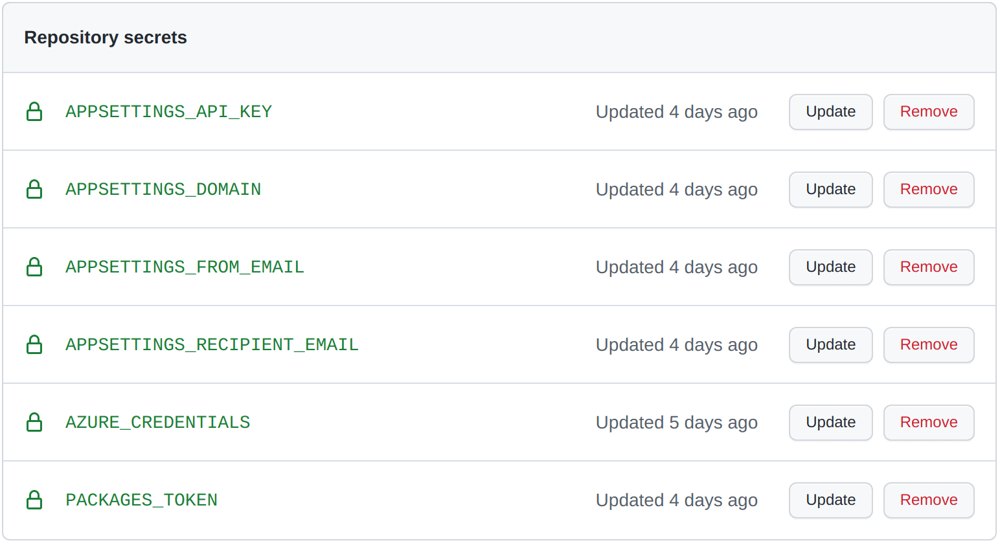
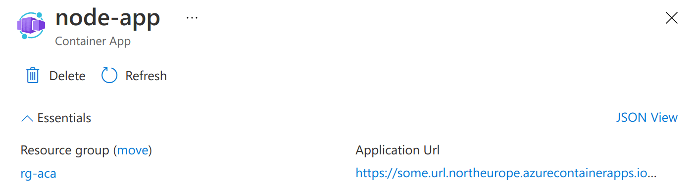

This post shows how to build and deploy a simple web application to Azure Container Apps using Bicep and GitHub Actions. This includes the configuration and deployment of secrets.

This post follows on from the [previous post](../2021-12-19-azure-container-apps-bicep-and-github-actions/index.md) which deployed infrastructure and a "hello world" container, this time introducing the building of an image and storing it in the [GitHub container registry](https://docs.github.com/en/packages/working-with-a-github-packages-registry/working-with-the-container-registry) so it can be deployed.

If you'd like to learn more about using dapr with Azure Container Apps then you might want to read [this post](../2022-01-22-azure-container-apps-dapr-bicep-github-actions-debug-devcontainer/index.md).


<!--truncate-->

## Updated 02/05/2022

This post has been updated to reflect the migration of Azure Container Apps from the Microsoft.Web namespace to the Microsoft.App namespace in March 2022. See: https://github.com/microsoft/azure-container-apps/issues/109

## The containerised convent

I learn the most about a technology when I'm using it to build something. It so happens that I have an aunt that's a nun, and long ago she persuaded me to build her convent a website. I'm a good nephew and I complied. Since that time I've been merrily overengineering it for fun and non-profit.

My aunts website is a pretty vanilla node app. Significantly it is already containerised and runs on [Azure App Service Web App for Containers](https://azure.microsoft.com/en-gb/services/app-service/containers/). Given it lives in the context of a container, this makes it a great candidate for porting to Azure Container Apps.

So that's what we'll do in this post. But where I'm building and deploying my aunt's container, you could equally be substituting your own; with some minimal changes.

## Bicep

Let's begin with the Bicep required to deploy our Azure Container App.

In our repository we'll create an `infra` directory, into which we'll place a `main.bicep` file which will contain our Bicep template:

```bicep
param nodeImage string
param nodePort int
param nodeIsExternalIngress bool

param containerRegistry string
param containerRegistryUsername string
@secure()
param containerRegistryPassword string

param tags object

@secure()
param APPSETTINGS_API_KEY string
param APPSETTINGS_DOMAIN string
param APPSETTINGS_FROM_EMAIL string
param APPSETTINGS_RECIPIENT_EMAIL string

var location = resourceGroup().location
var environmentName = 'env-${uniqueString(resourceGroup().id)}'
var minReplicas = 0

var nodeServiceAppName = 'node-app'
var workspaceName = '${nodeServiceAppName}-log-analytics'
var appInsightsName = '${nodeServiceAppName}-app-insights'

var containerRegistryPasswordRef = 'container-registry-password'
var mailgunApiKeyRef = 'mailgun-api-key'

resource workspace 'Microsoft.OperationalInsights/workspaces@2021-12-01-preview' = {
  name: workspaceName
  location: location
  tags: tags
  properties: {
    sku: {
      name: 'PerGB2018'
    }
    retentionInDays: 30
    workspaceCapping: {}
  }
}

resource appInsights 'Microsoft.Insights/components@2020-02-02' = {
  name: appInsightsName
  location: location
  tags: tags
  kind: 'web'
  properties: {
    Application_Type: 'web'
    Flow_Type: 'Bluefield'
  }
}

resource environment 'Microsoft.App/managedEnvironments@2022-01-01-preview' = {
  name: environmentName
  location: location
  tags: tags
  properties: {
    appLogsConfiguration: {
      destination: 'log-analytics'
      logAnalyticsConfiguration: {
        customerId: workspace.properties.customerId
        sharedKey: listKeys(workspace.id, workspace.apiVersion).primarySharedKey
      }
    }
    containerAppsConfiguration: {
      daprAIInstrumentationKey: appInsights.properties.InstrumentationKey
    }
  }
}

resource containerApp 'Microsoft.App/containerApps@2022-01-01-preview' = {
  name: nodeServiceAppName
  kind: 'containerapps'
  tags: tags
  location: location
  properties: {
    managedEnvironmentId: environment.id
    configuration: {
      secrets: [
        {
          name: containerRegistryPasswordRef
          value: containerRegistryPassword
        }
        {
          name: mailgunApiKeyRef
          value: APPSETTINGS_API_KEY
        }
      ]
      registries: [
        {
          server: containerRegistry
          username: containerRegistryUsername
          passwordSecretRef: containerRegistryPasswordRef
        }
      ]
      ingress: {
        'external': nodeIsExternalIngress
        'targetPort': nodePort
      }
    }
    template: {
      containers: [
        {
          image: nodeImage
          name: nodeServiceAppName
          transport: 'auto'
          env: [
            {
              name: 'APPSETTINGS_API_KEY'
              secretref: mailgunApiKeyRef
            }
            {
              name: 'APPSETTINGS_DOMAIN'
              value: APPSETTINGS_DOMAIN
            }
            {
              name: 'APPSETTINGS_FROM_EMAIL'
              value: APPSETTINGS_FROM_EMAIL
            }
            {
              name: 'APPSETTINGS_RECIPIENT_EMAIL'
              value: APPSETTINGS_RECIPIENT_EMAIL
            }
          ]
        }
      ]
      scale: {
        minReplicas: minReplicas
      }
    }
  }
}
```

Let's talk through this template. The environment, workspace and app insights resources are fairly self explanatory. The `containerApp` resource is where the action is. We'll drill into that resource and the parameters used to configure it.

### The node container app

We're going to create a single container app for our node web application. This is configured with these parameters:

```bicep
param nodeImage string
param nodePort int
param nodeIsExternalIngress bool
```

The above parameters relate to the node application that represents the website. The `nodeImage` is the container image which should be deployed to a container app. The `nodePort` is the port from the app which should be exposed (`3000` in our case). `nodeIsExternalIngress` is [whether the container should be accessible on the internet](https://docs.microsoft.com/en-us/azure/container-apps/ingress?tabs=bash#configuration). (Always `true` incidentally.)

When these parameters are applied to the `containerApp` resource, it looks like this:

```bicep
var nodeServiceAppName = 'node-app'

resource containerApp 'Microsoft.App/containerApps@2022-01-01-preview' = {
  // ...
  properties: {
      // ...
      ingress: {
        'external': nodeIsExternalIngress
        'targetPort': nodePort
      }
    }
    template: {
      containers: [
        {
          image: nodeImage
          name: nodeServiceAppName
          // ...
        }
      ]
      // ...
    }
  }
}
```

### Accessing the GitHub Container Registry

Given that we've told Bicep to deploy an `image`, we're going to need to tell it what registry it can use to acquire that image. Our template takes these parameters:

```bicep
param containerRegistry string
param containerRegistryUsername string
@secure()
param containerRegistryPassword string

param tags object
```

With the exception of the `tags` object which is metadata to apply to resources, these parameters are related to the container registry where our images will be stored. GitHub's in our case. Remember, what we deploy to Azure Container Apps are container images. To get something running in an ACA, it first has to reside in a container registry. There's a multitude of container registries out there and we're using the one directly available in GitHub. As an alternative, we could use an [Azure Container Registry](https://azure.microsoft.com/en-us/services/container-registry/), or [Docker Hub](https://hub.docker.com/) - or something else entirely.

Do note the [`@secure()`](https://docs.microsoft.com/en-us/azure/azure-resource-manager/bicep/parameters#secure-parameters) decorator. This marks the `containerRegistryPassword` parameter as secure. The value for a secure parameter isn't saved to the deployment history and isn't logged. Typically you'll want to mark secrets with the `@secure()` decorator for this very reason.

We use the parameters to configure the `registries` property of our container app. This tells the ACA where it can go to collect the image it needs. You can also see our first usage of secrets here. We declare the `containerRegistryPassword` as a secret which is stored against the ref `'container-registry-password'`; captured as the variable `containerRegistryPasswordRef`. That variable is then referenced in the `passwordSecretRef` property - thus telling ACA where it can find the password.

```bicep
var containerRegistryPasswordRef = 'container-registry-password'

resource containerApp 'Microsoft.App/containerApps@2022-01-01-preview' = {
  // ...
  properties: {
    // ...
    configuration: {
      secrets: [
        {
          name: containerRegistryPasswordRef
          value: containerRegistryPassword
        }
        // ...
      ]
      registries: [
        {
          server: containerRegistry
          username: containerRegistryUsername
          passwordSecretRef: containerRegistryPasswordRef
        }
      ]
      // ...
    }
    // ...
  }
}
```

### Secrets / Configuration

The final collection of parameters are unrelated to the infrastructure of deployment, rather they are the things required to configure our running application:

```bicep
@secure()
param APPSETTINGS_API_KEY string
param APPSETTINGS_DOMAIN string
param APPSETTINGS_FROM_EMAIL string
param APPSETTINGS_RECIPIENT_EMAIL string
```

Again we've got a secret marked with `@secure()` in the form of our `APPSETTINGS_API_KEY`. Just as we did with `containerRegistryPassword`, we declare `APPSETTINGS_API_KEY` to be a secret, which is stored against the ref `'mailgun-api-key'`; captured as the variable `mailgunApiKeyRef`.

All of our configuration is exposed to the running application through environment variables. By and large this is achieved through the mechanism of key / value pairs (well technically `name` / `value`) with a slight variation for secrets. Similar to the `passwordSecretRef` mechanism we used for the registry password, we use a `secretref` in place of `value` when passing a secret, and the value will be the ref that was set up in the `secrets` section; `mailgunApiKeyRef` in this case.

```bicep
var mailgunApiKeyRef = 'mailgun-api-key'

resource containerApp 'Microsoft.App/containerApps@2022-01-01-preview' = {
  // ...
  properties: {
    // ...
    configuration: {
      secrets: [
        // ...
        {
          name: mailgunApiKeyRef
          value: APPSETTINGS_API_KEY
        }
      ]
      // ...
    }
    template: {
      containers: [
        {
          // ...
          env: [
            {
              name: 'APPSETTINGS_API_KEY'
              secretref: mailgunApiKeyRef
            }
            {
              name: 'APPSETTINGS_DOMAIN'
              value: APPSETTINGS_DOMAIN
            }
            {
              name: 'APPSETTINGS_FROM_EMAIL'
              value: APPSETTINGS_FROM_EMAIL
            }
            {
              name: 'APPSETTINGS_RECIPIENT_EMAIL'
              value: APPSETTINGS_RECIPIENT_EMAIL
            }
          ]
        }
      ]
      // ...
    }
  }
}
```

## Setting up a resource group

With our Bicep in place, we're going to need a resource group to send it to. Right now, Azure Container Apps aren't available everywhere. So we're going to create ourselves a resource group in North Europe which does support ACAs:

```shell
az group create -g rg-aca -l northeurope
```

## Secrets for GitHub Actions

We're aiming to set up a GitHub Action to handle our deployment. This will depend upon a number of secrets:



We'll need to create each of these secrets.

### `AZURE_CREDENTIALS` - GitHub logging into Azure

So GitHub Actions can interact with Azure on our behalf, we need to provide it with some credentials. We'll use the Azure CLI to create these:

```shell
az ad sp create-for-rbac --name "myApp" --role contributor \
    --scopes /subscriptions/{subscription-id}/resourceGroups/{resource-group} \
    --sdk-auth
```

Remember to replace the `{subscription-id}` with your subscription id and `{resource-group}` with the name of your resource group (`rg-aca` if you're following along). This command will pump out a lump of JSON that looks something like this:

```json
{
  "clientId": "a-client-id",
  "clientSecret": "a-client-secret",
  "subscriptionId": "a-subscription-id",
  "tenantId": "a-tenant-id",
  "activeDirectoryEndpointUrl": "https://login.microsoftonline.com",
  "resourceManagerEndpointUrl": "https://management.azure.com/",
  "activeDirectoryGraphResourceId": "https://graph.windows.net/",
  "sqlManagementEndpointUrl": "https://management.core.windows.net:8443/",
  "galleryEndpointUrl": "https://gallery.azure.com/",
  "managementEndpointUrl": "https://management.core.windows.net/"
}
```

Take this and save it as the `AZURE_CREDENTIALS` secret in Azure.

### `PACKAGES_TOKEN` - Azure accessing the GitHub container registry

We also need a secret for accessing packages from Azure. We're going to be publishing packages to the GitHub container registry. Azure is going to need to be able to access this when we're deploying. ACA deployment works by telling Azure where to look for an image and providing any necessary credentials to do the acquisition. To facilitate this we'll set up a `PACKAGES_TOKEN` secret. This is a GitHub personal access token with the `read:packages` scope. [Follow the instructions here to create the token.](https://docs.github.com/en/authentication/keeping-your-account-and-data-secure/creating-a-personal-access-token)

### Secrets for the app

Alongside these infrastructure / deployment related secrets, we'll need ones to configure the app at runtime:

- `APPSETTINGS_API_KEY` - an API key for Mailgun which will be used to send emails
- `APPSETTINGS_DOMAIN` - the domain for the email eg `mg.poorclaresarundel.org`
- `APPSETTINGS_FROM_EMAIL` - who automated emails should come from eg `noreply@mg.poorclaresarundel.org`
- `APPSETTINGS_RECIPIENT_EMAIL` - the email address emails should be sent to

Strictly speaking, only the API key is a secret. But to simplify this post we'll configure all of these as secrets in GitHub.

## Deploying with GitHub Actions

With our secrets configured, we're now well placed to write our GitHub Action. We'll create a `.github/workflows/deploy.yaml` file in our repository and populate it thusly:

```yaml
# yaml-language-server: $schema=./build.yaml
name: Build and Deploy
on:
  # Trigger the workflow on push or pull request,
  # but only for the main branch
  push:
    branches:
      - main
  pull_request:
    branches:
      - main
    # Publish semver tags as releases.
    tags: ['v*.*.*']
  workflow_dispatch:

env:
  RESOURCE_GROUP: rg-aca
  REGISTRY: ghcr.io
  IMAGE_NAME: ${{ github.repository }}

jobs:
  build:
    runs-on: ubuntu-latest
    strategy:
      matrix:
        services:
          [{ 'imageName': 'node-service', 'directory': './node-service' }]
    permissions:
      contents: read
      packages: write
    outputs:
      containerImage-node: ${{ steps.image-tag.outputs.image-node-service }}
    steps:
      - name: Checkout repository
        uses: actions/checkout@v2

      # Login against a Docker registry except on PR
      # https://github.com/docker/login-action
      - name: Log into registry ${{ env.REGISTRY }}
        if: github.event_name != 'pull_request'
        uses: docker/login-action@v1
        with:
          registry: ${{ env.REGISTRY }}
          username: ${{ github.actor }}
          password: ${{ secrets.GITHUB_TOKEN }}

      # Extract metadata (tags, labels) for Docker
      # https://github.com/docker/metadata-action
      - name: Extract Docker metadata
        id: meta
        uses: docker/metadata-action@v3
        with:
          images: ${{ env.REGISTRY }}/${{ env.IMAGE_NAME }}/${{ matrix.services.imageName }}
          tags: |
            type=semver,pattern={{version}}
            type=semver,pattern={{major}}.{{minor}}
            type=semver,pattern={{major}}
            type=ref,event=branch
            type=sha

      # Build and push Docker image with Buildx (don't push on PR)
      # https://github.com/docker/build-push-action
      - name: Build and push Docker image
        uses: docker/build-push-action@v2
        with:
          context: ${{ matrix.services.directory }}
          push: ${{ github.event_name != 'pull_request' }}
          tags: ${{ steps.meta.outputs.tags }}
          labels: ${{ steps.meta.outputs.labels }}

      - name: Output image tag
        id: image-tag
        run: |
          name=$(echo "image-${{ matrix.services.imageName }}" | tr '[:upper:]' '[:lower:]')
          value=$(echo "${{ env.REGISTRY }}/${{ env.IMAGE_NAME }}/${{ matrix.services.imageName }}:sha-$(git rev-parse --short HEAD)" | tr '[:upper:]' '[:lower:]')
          echo "setting output: $name=$value"
          echo "$name=$value" >> $GITHUB_OUTPUT

  deploy:
    runs-on: ubuntu-latest
    needs: [build]
    steps:
      - name: Checkout repository
        uses: actions/checkout@v2

      - name: Azure Login
        uses: azure/login@v1
        with:
          creds: ${{ secrets.AZURE_CREDENTIALS }}

      - name: Deploy bicep
        uses: azure/CLI@v2
        if: github.event_name != 'pull_request'
        with:
          inlineScript: |
            tags='{"owner":"johnnyreilly", "email":"johnny_reilly@hotmail.com"}'
            az deployment group create \
              --resource-group ${{ env.RESOURCE_GROUP }} \
              --template-file ./infra/main.bicep \
              --parameters \
                  nodeImage='${{ needs.build.outputs.containerImage-node }}' \
                  nodePort=3000 \
                  nodeIsExternalIngress=true \
                  containerRegistry=${{ env.REGISTRY }} \
                  containerRegistryUsername=${{ github.actor }} \
                  containerRegistryPassword=${{ secrets.PACKAGES_TOKEN }} \
                  tags="$tags" \
                  APPSETTINGS_API_KEY="${{ secrets.APPSETTINGS_API_KEY }}" \
                  APPSETTINGS_DOMAIN="${{ secrets.APPSETTINGS_DOMAIN }}" \
                  APPSETTINGS_FROM_EMAIL="${{ secrets.APPSETTINGS_FROM_EMAIL }}" \
                  APPSETTINGS_RECIPIENT_EMAIL="${{ secrets.APPSETTINGS_RECIPIENT_EMAIL }}"

      - name: What-if bicep
        uses: azure/CLI@v2
        if: github.event_name == 'pull_request'
        with:
          inlineScript: |
            tags='{"owner":"johnnyreilly", "email":"johnny_reilly@hotmail.com"}'
            az deployment group what-if \
              --resource-group ${{ env.RESOURCE_GROUP }} \
              --template-file ./infra/main.bicep \
              --parameters \
                  nodeImage='${{ needs.build.outputs.containerImage-node }}' \
                  nodePort=3000 \
                  nodeIsExternalIngress=true \
                  containerRegistry=${{ env.REGISTRY }} \
                  containerRegistryUsername=${{ github.actor }} \
                  containerRegistryPassword=${{ secrets.PACKAGES_TOKEN }} \
                  tags="$tags" \
                  APPSETTINGS_API_KEY="${{ secrets.APPSETTINGS_API_KEY }}" \
                  APPSETTINGS_DOMAIN="${{ secrets.APPSETTINGS_DOMAIN }}" \
                  APPSETTINGS_FROM_EMAIL="${{ secrets.APPSETTINGS_FROM_EMAIL }}" \
                  APPSETTINGS_RECIPIENT_EMAIL="${{ secrets.APPSETTINGS_RECIPIENT_EMAIL }}"
```

There's a lot in this workflow. Let's dig into the `build` and `deploy` jobs to see what's happening.

### `build` - building our image

The `build` job is all about building our container images and pushing then to the GitHub registry. It's heavily inspired by [Jeff Hollan](https://twitter.com/jeffhollan)'s [Azure sample app GHA](https://github.com/Azure-Samples/container-apps-store-api-microservice). When we look at the `strategy` we can see a `matrix` of `services` consisting of a single service; our node app:

```yaml
strategy:
  matrix:
    services: [{ 'imageName': 'node-service', 'directory': './node-service' }]
```

This is a matrix because a typical use case of an Azure Container App will be multi-container, so we're starting generic from the beginning. The `outputs` pumps out the details of our `containerImage-node` image to be used later:

```yaml
outputs:
  containerImage-node: ${{ steps.image-tag.outputs.image-node-service }}
```

With that understanding in place, let's examine what each of the steps in the `build` job does

- `Log into registry` - logs into the GitHub container registry
- `Extract Docker metadata` - acquire tags which will be used for versioning
- `Build and push Docker image` - build the docker image and if this is not a PR: tag, label and push it to the registry
- `Output image tag` - write out the image tag for usage in deployment

### `deploy` - shipping our image to Azure

The `deploy` job does two possible things with our Bicep template; `main.bicep`.

In the case of a pull request, it runs the [`az deployment group what-if`](https://docs.microsoft.com/en-us/cli/azure/deployment/group?view=azure-cli-latest#az_deployment_group_what_if) - this allows us to see what the effect would be of applying a PR to our infrastructure.

```yaml
- name: What-if bicep
  uses: azure/CLI@v2
  if: github.event_name == 'pull_request'
  with:
    inlineScript: |
      tags='{"owner":"johnnyreilly", "email":"johnny_reilly@hotmail.com"}'
      az deployment group what-if \
        --resource-group ${{ env.RESOURCE_GROUP }} \
        --template-file ./infra/main.bicep \
        --parameters \
            nodeImage='${{ needs.build.outputs.containerImage-node }}' \
            nodePort=3000 \
            nodeIsExternalIngress=true \
            containerRegistry=${{ env.REGISTRY }} \
            containerRegistryUsername=${{ github.actor }} \
            containerRegistryPassword=${{ secrets.PACKAGES_TOKEN }} \
            tags="$tags" \
            APPSETTINGS_API_KEY="${{ secrets.APPSETTINGS_API_KEY }}" \
            APPSETTINGS_DOMAIN="${{ secrets.APPSETTINGS_DOMAIN }}" \
            APPSETTINGS_FROM_EMAIL="${{ secrets.APPSETTINGS_FROM_EMAIL }}" \
            APPSETTINGS_RECIPIENT_EMAIL="${{ secrets.APPSETTINGS_RECIPIENT_EMAIL }}"
```

When it's not a pull request, it runs the [`az deployment group create`](https://docs.microsoft.com/en-us/cli/azure/deployment/group?view=azure-cli-latest#az_deployment_group_create) command which performs a deployment of our `main.bicep` file.

```yaml
- name: Deploy bicep
  uses: azure/CLI@v2
  if: github.event_name != 'pull_request'
  with:
    inlineScript: |
      tags='{"owner":"johnnyreilly", "email":"johnny_reilly@hotmail.com"}'
      az deployment group create \
        --resource-group ${{ env.RESOURCE_GROUP }} \
        --template-file ./infra/main.bicep \
        --parameters \
            nodeImage='${{ needs.build.outputs.containerImage-node }}' \
            nodePort=3000 \
            nodeIsExternalIngress=true \
            containerRegistry=${{ env.REGISTRY }} \
            containerRegistryUsername=${{ github.actor }} \
            containerRegistryPassword=${{ secrets.PACKAGES_TOKEN }} \
            tags="$tags" \
            APPSETTINGS_API_KEY="${{ secrets.APPSETTINGS_API_KEY }}" \
            APPSETTINGS_DOMAIN="${{ secrets.APPSETTINGS_DOMAIN }}" \
            APPSETTINGS_FROM_EMAIL="${{ secrets.APPSETTINGS_FROM_EMAIL }}" \
            APPSETTINGS_RECIPIENT_EMAIL="${{ secrets.APPSETTINGS_RECIPIENT_EMAIL }}"
```

In either case we pass the same set of parameters:

```shell
nodeImage='${{ needs.build.outputs.containerImage-node }}' \
nodePort=3000 \
nodeIsExternalIngress=true \
containerRegistry=${{ env.REGISTRY }} \
containerRegistryUsername=${{ github.actor }} \
containerRegistryPassword=${{ secrets.PACKAGES_TOKEN }} \
tags="$tags" \
APPSETTINGS_API_KEY="${{ secrets.APPSETTINGS_API_KEY }}" \
APPSETTINGS_DOMAIN="${{ secrets.APPSETTINGS_DOMAIN }}" \
APPSETTINGS_FROM_EMAIL="${{ secrets.APPSETTINGS_FROM_EMAIL }}" \
APPSETTINGS_RECIPIENT_EMAIL="${{ secrets.APPSETTINGS_RECIPIENT_EMAIL }}"
```

These are either:

- secrets we set up earlier
- environment variables declared at the start of the script or
- outputs from the build step - this is where we acquire our node image

## Running it

When the GitHub Action has been run you'll find that Azure Container App is now showing up inside the Azure Portal in your resource group, alongside the other resources:


And when we take a closer look at the container app, we find a URL we can navigate to:



Congratulations! You've built and deployed a simple web app to Azure Container Apps with Bicep and GitHub Actions and secrets.
