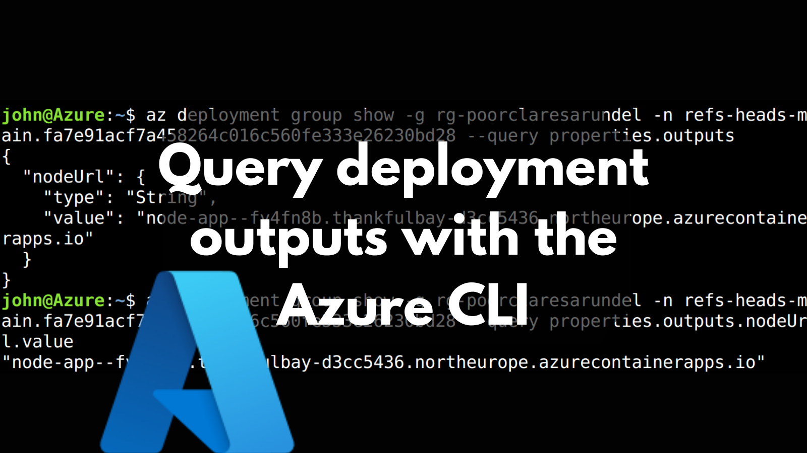
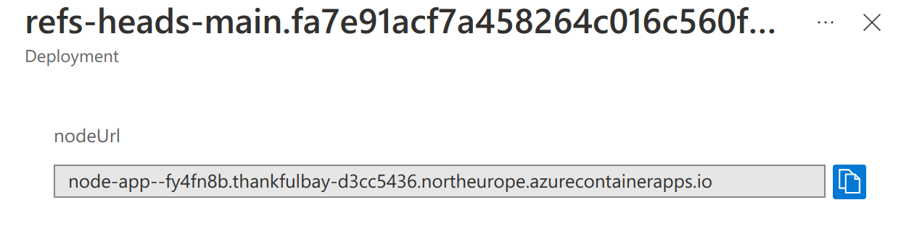

It's often desirable to query the outputs of deployments to Azure. This post demonstrates how to do this using the Azure CLI, bash and jq. It also shows how to generically convert deployment outputs to GitHub Action job outputs.



<!--truncate-->

## Deployment outputs

When we deploy something to Azure, we frequently have outputs which we want to use. Let's consider the canonical case, whereby a website is created and we want to use the URL of where it has been deployed. We can see these values in the Azure Portal:



The above deployment has a single output of `nodeUrl`. Rather than logging into the portal to acquire this value, how can we do so using the Azure CLI and bash?

## Acquire all outputs

The way to acquire outputs from the Azure CLI is using the [`az group deployment show`](https://docs.microsoft.com/en-us/cli/azure/group/deployment?view=azure-cli-latest#az_group_deployment_show) command:

```bash
az deployment group show \
  -g <resource-group-name> \
  -n <deployment-name> \
  --query properties.outputs
```

Running the above will produce a piece of JSON that contains all our outputs. In our case, we have a single deployment output: `nodeUrl`. So our JSON looks like this:

```json
{
  "nodeUrl": {
    "type": "String",
    "value": "some.url.northeurope.azurecontainerapps.io"
  }
}
```

## Acquire an individual output

To acquire an individual output, you can provide a targeted `--query` to pull out the value you care about. However, there's a slight issue:

```bash
john@Azure:~$ NODE_URL=$(az deployment group show -g rg-aca -n our-deployment --query properties.outputs.nodeUrl.value)
john@Azure:~$ echo $NODE_URL
"some.url.northeurope.azurecontainerapps.io"
```

The value we capture in the `NODE_URL` variable above is surrounded by quotes. These will probably get in the way when we're scripting something with this. Rather than purging them with bash, I tend to use [`jq`'s `--raw-output / -r` option](https://stedolan.github.io/jq/manual/) to grab the raw string.

```bash
john@Azure:~$ NODE_URL=$(az deployment group show -g rg-aca -n our-deployment --query properties.outputs | jq -r '.nodeUrl.value')
john@Azure:~$ echo $NODE_URL
some.url.northeurope.azurecontainerapps.io
```

Perfect!

There's another approach you could use which [Aleksandar Nikolić shared](https://twitter.com/alexandair/status/1476554234543890437), which means jq needn't be used at all; using the `tsv` output formatter:

```bash
john@Azure:~$ NODE_URL=$(az deployment group show -g rg-aca -n our-deployment --query properties.outputs.nodeUrl.value -o tsv)
john@Azure:~$ echo $NODE_URL
some.url.northeurope.azurecontainerapps.io
```

## Convert deployment outputs to GitHub Action job outputs

Before wrapping up, here's one more useful script, if you find yourself automating in the context of GitHub Actions. It's often useful to take the deployment outputs, and convert them into GHA job outputs that can be used in other jobs.

With JSON and [jq](https://stedolan.github.io/jq/) in hand, it's possible to expose these like so:

```bash
DEPLOYMENT_OUTPUTS=$(az deployment group show \
  --resource-group ${{ env.RESOURCE_GROUP }} \
  --name $DEPLOYMENT_NAME \
  --query properties.outputs)

echo 'convert deployment outputs to outputs'
echo $DEPLOYMENT_OUTPUTS | jq -c '. | to_entries[] | [.key, .value.value]' |
  while IFS=$"\n" read -r c; do
    OUTPUT_NAME=$(echo "$c" | jq -r '.[0]')
    OUTPUT_VALUE=$(echo "$c" | jq -r '.[1]')
    echo "setting output $OUTPUT_NAME=$OUTPUT_VALUE"
    echo "$OUTPUT_NAME=$OUTPUT_VALUE" >> $GITHUB_OUTPUT
  done
```
