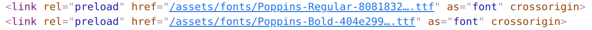

When we're using custom fonts in our websites, it's good practice to preload the fonts to minimise the [flash of unstyled text](https://css-tricks.com/fout-foit-foft/). This post shows how to achieve this with Docusaurus.

<!--truncate-->

It does so by building a Docusaurus plugin which makes use of [Satyendra Singh](https://github.com/sn-satyendra)'s excellent [`webpack-font-preload-plugin`](https://github.com/sn-satyendra/webpack-font-preload-plugin).

**Updated 03/11/2022:** Subsequently this post demonstrates how to achieve font preloading directly, by using the the `headTags` API.


## Preload web fonts with Docusaurus

To quote the docs of the `webpack-font-preload-plugin`:

> The [preload](https://developer.mozilla.org/en-US/docs/Web/HTML/Preloading_content) value of the `<link>` element's `rel` attribute lets you declare fetch requests in the HTML's `<head>`, specifying resources that your page will need very soon, which you want to start loading early in the page lifecycle, before browsers' main rendering machinery kicks in. This ensures they are available earlier and are less likely to block the page's render, improving performance.
>
> This plugin specifically targets fonts used with the application which are bundled using webpack. The plugin would add `<link>` tags in the begining of `<head>` of your html:
>
> ```html
> <link rel="preload" href="/font1.woff" as="font" crossorigin />
> <link rel="preload" href="/font2.woff" as="font" crossorigin />
> ```

If you want to learn more about preloading web fonts, it's also worth [reading this excellent article](https://web.dev/codelab-preload-web-fonts/).

The blog you're reading is built with [Docusaurus](https://docusaurus.io/). Our mission: for the HTML our Docusaurus build pumps out to feature preload `link` elements. Something like this:

```html
<link
  rel="preload"
  href="/assets/fonts/Poppins-Regular-8081832fc5cfbf634aa664a9eff0350e.ttf"
  as="font"
  crossorigin=""
/>
```

This `link` element has the `rel="preload"` attribute set, which triggers font preloading.

But the thing to take from the above text is that the filename features a hash in the name. This demonstrates that the font is being pumped through the Docusaurus build, which is powered by webpack. So we need some webpack whispering to get font preloading going.

## Making a plugin

We're going to make a minimal [Docusaurus plugin](https://docusaurus.io/docs/using-plugins#creating-plugins) using `webpack-font-preload-plugin`. Let's add it to our project:

```shell
yarn add webpack-font-preload-plugin
```

Now in the `docusaurus.config.js` we can create our minimal plugin:

```js
const FontPreloadPlugin = require('webpack-font-preload-plugin');

//...
/** @type {import('@docusaurus/types').Config} */
const config = {
  //...
  plugins: [
    function preloadFontPlugin(_context, _options) {
      return {
        name: 'preload-font-plugin',
        configureWebpack(_config, _isServer) {
          return {
            plugins: [new FontPreloadPlugin()],
          };
        },
      };
    },
    // ...
  ],
  //...
};
```

It's a super simple plugin, it does nothing more than `new` up an instance of the webpack plugin, inside the context of the `configureWebpack` method. That's all that's required.

With this in place we're now seeing the `<link rel="preload" ... />` elements being included in the HTML pumped out of our Docusaurus build. This means we have font preloading working:



Huzzah!

## Using the `headTags` API

If you're using [Docusaurus 2.2 or greater](https://docusaurus.io/blog/releases/2.2#config-headtags) you can use the new [`headTags` API](https://docusaurus.io/docs/api/docusaurus-config#headTags) and bypass using an extra dependency entirely.

To make this work, we need to ensure that our fonts live in the `static` directory which is reliably addressable - not hashed by webpack. We can then use the `headTags` API to add the `link` elements to the `head` of the HTML:

```js
module.exports = {
  // ...
  headTags: [
    // the entry below will make this tag: <link rel="preload" href="/fonts/Poppins-Regular.ttf" as="font" type="font/ttf" crossorigin="anonymous">
    {
      tagName: 'link',
      attributes: {
        rel: 'preload',
        href: '/fonts/Poppins-Regular.ttf',
        as: 'font',
        type: 'font/ttf',
        crossorigin: 'anonymous',
      },
    },
    // the entry below will make this tag: <link rel="preload" href="/fonts/Poppins-Bold.ttf" as="font" type="font/ttf" crossorigin="anonymous">
    {
      tagName: 'link',
      attributes: {
        rel: 'preload',
        href: '/fonts/Poppins-Bold.ttf',
        as: 'font',
        type: 'font/ttf',
        crossorigin: 'anonymous',
      },
    },
  ],
  // ...
};
```

In our `custom.css` we need to add the following:

```css
@font-face {
  font-family: 'Poppins';
  src: url('https://johnnyreilly.com/fonts/Poppins-Regular.ttf');
  font-weight: 400;
  font-style: normal;
  font-display: swap;
}

@font-face {
  font-family: 'Poppins';
  src: url('https://johnnyreilly.com/fonts/Poppins-Bold.ttf');
  font-weight: 700;
  font-style: normal;
  font-display: swap;
}
```

Note that the urls are fully qualified to prevent webpack from trying to bundle them. Another bonus of using the `static` folder is that we can apply long term caching. I'm using [Azure Static Web Apps](https://azure.microsoft.com/en-us/products/app-service/static/) to run my site and so I'm achieving this with the following in `staticwebapp.config.json`:

```json
{
  "trailingSlash": "auto",
  "routes": [
    {
      "route": "/img/*",
      "headers": {
        "cache-control": "must-revalidate, max-age=15770000"
      }
    },
    {
      "route": "/fonts/*",
      "headers": {
        "cache-control": "must-revalidate, max-age=15770000"
      }
    }
  ],
  "globalHeaders": {
    "content-security-policy": "default-src https: 'unsafe-eval' 'unsafe-inline'; object-src 'none'; script-src 'self' https://www.googleanalytics.com https://www.google-analytics.com https://www.googleoptimize.com https://www.googletagmanager.com 'unsafe-inline'; img-src 'self' data: https: https://johnnyreilly.com https://thankful-sky-0bfc7e803-320.westeurope.1.azurestaticapps.net https://www.google-analytics.com https://www.googletagmanager.com",
    "X-Clacks-Overhead": "GNU Terry Pratchett",
    "Access-Control-Allow-Origin": "*"
  }
}
```

Things to note from the above:

- `Access-Control-Allow-Origin` and `Vary` are in place to allow my staging sites to access the fonts from the production site. Without this, the fonts won't load in the staging site.
- The `img` and `fonts` directories sit under the `static` directory. For those directories we're going to use `cache-control` set to 6 months for the fonts and static images. They rarely change and so this is an appropriate strategy.

This blog post was migrated to the `headTags` API approach with the release of Docusaurus 2.2.0. [You can see the PR here](https://github.com/johnnyreilly/blog.johnnyreilly.com/pull/321).
