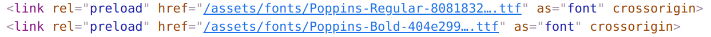

This post shows how to build and deploy two Azure Container Apps using Bicep and GitHub Actions. These apps will communicate using dapr, be built in VS Code using a devcontainer and be entirely debuggable.

This post follows on from the [previous post](../2021-12-27-azure-container-apps-build-and-deploy-with-bicep-and-github-actions/index.md) which built and deployed a simple web application to Azure Container Apps using Bicep and GitHub Actions.

a "hello world" container, this time introducing the building of an image and storing it in the [GitHub container registry](https://docs.github.com/en/packages/working-with-a-github-packages-registry/working-with-the-container-registry) so it can be deployed.

When we're using custom fonts in our websites, it's good practice to preload the fonts to minimise the [flash of unstyled text](https://css-tricks.com/fout-foit-foft/). This post shows how to achieve this with Docusaurus. It does so by building a Docusaurus plugin which makes use of [Satyendra Singh](https://github.com/sn-satyendra)'s excellent [`webpack-font-preload-plugin`](https://github.com/sn-satyendra/webpack-font-preload-plugin)


## Preload web fonts with Docusaurus

To quote the docs of the `webpack-font-preload-plugin`:

> The [preload](https://developer.mozilla.org/en-US/docs/Web/HTML/Preloading_content) value of the `<link>` element's `rel` attribute lets you declare fetch requests in the HTML's `<head>`, specifying resources that your page will need very soon, which you want to start loading early in the page lifecycle, before browsers' main rendering machinery kicks in. This ensures they are available earlier and are less likely to block the page's render, improving performance.
>
> This plugin specifically targets fonts used with the application which are bundled using webpack. The plugin would add `<link>` tags in the begining of `<head>` of your html:
>
> ```html
> <link rel="preload" href="/font1.woff" as="font" crossorigin />
> <link rel="preload" href="/font2.woff" as="font" crossorigin />
> ```

If you want to learn more about preloading web fonts, it's also worth [reading this excellent article](https://web.dev/codelab-preload-web-fonts/).

The blog you're reading is built with [Docusaurus](https://docusaurus.io/). Our mission: for the HTML our Docusaurus build pumps out to feature preload `link` elements. Something like this:

```html
<link
  rel="preload"
  href="/assets/fonts/Poppins-Regular-8081832fc5cfbf634aa664a9eff0350e.ttf"
  as="font"
  crossorigin=""
/>
```

This `link` element has the `rel="preload"` attribute set, which triggers font preloading.

But the thing to take from the above text is that the filename features a hash in the name. This demonstrates that the font is being pumped through the Docusaurus build, which is powered by webpack. So we need some webpack whispering to get font preloading going.

## Making a plugin

We're going to make a minimal [Docusaurus plugin](https://docusaurus.io/docs/using-plugins#creating-plugins) using `webpack-font-preload-plugin`. Let's add it to our project:

```shell
yarn add webpack-font-preload-plugin
```

Now in the `docusaurus.config.js` we can create our minimal plugin:

```js
const FontPreloadPlugin = require('webpack-font-preload-plugin');

//...
/** @type {import('@docusaurus/types').Config} */
const config = {
  //...
  plugins: [
    function preloadFontPlugin(_context, _options) {
      return {
        name: 'preload-font-plugin',
        configureWebpack(_config, _isServer) {
          return {
            plugins: [new FontPreloadPlugin()],
          };
        },
      };
    },
    // ...
  ],
  //...
};
```

It's a super simple plugin, it does nothing more than `new` up an instance of the webpack plugin, inside the context of the `configureWebpack` method. That's all that's required.

With this in place we're now seeing the `<link rel="preload" ... />` elements being included in the HTML pumped out of our Docusaurus build. This means we have font preloading working:



Huzzah!
