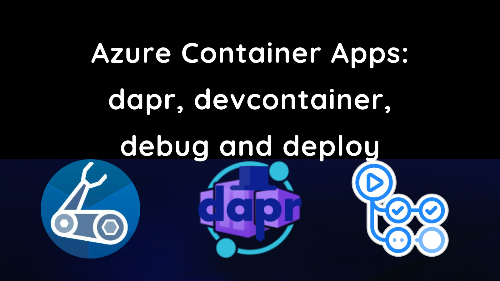

This post shows how to build and deploy two Azure Container Apps using Bicep and GitHub Actions. These apps will communicate using [dapr](https://docs.dapr.io/), be built in [VS Code using a devcontainer](https://code.visualstudio.com/docs/remote/containers) and be entirely debuggable.

This post follows on from the [previous post](../2021-12-27-azure-container-apps-build-and-deploy-with-bicep-and-github-actions/index.md) which built and deployed a simple web application to Azure Container Apps using Bicep and GitHub Actions using the GitHub container registry.

As an engineer, I'm productive when:

- I'm able to easily debug my code
- Integrating different services together is a turnkey experience

I've found that using dapr and VS Code I'm able to achieve that. I'm can build an application made up of multiple services, compose them together using dapr and deploy them to Azure Container Apps with relative ease.

In this post we're going to build an example of that from scratch, with a [koa/node.js](https://koajs.com/) (built with TypeScript) front end that will communicate with a [dotnet](https://dotnet.microsoft.com/en-us/) service via dapr.

All the work done in this post can be found in the [`dapr-devcontainer-debug-and-deploy`](https://github.com/johnnyreilly/dapr-devcontainer-debug-and-deploy) repo. As a note, if you're interested in this topic it's also worth looking at the [`Azure-Samples/container-apps-store-api-microservice`](https://github.com/Azure-Samples/container-apps-store-api-microservice) repo.



## Setting up our devcontainer

The first thing we'll do is set up our devcontainer. We're going to use a tweaked version of the [docker-in-docker](https://github.com/microsoft/vscode-dev-containers/tree/main/containers/docker-in-docker) image from the [vscode-dev-containers](https://github.com/microsoft/vscode-dev-containers) repo.

In the root of our project we'll create a `.devcontainer` folder, and within that a `library-scripts` folder. There's a number of communal scripts from the vscode-dev-containers repo which we're going to want to copy into in our `library-scripts` folder:

- [docker-in-docker-debian.sh](https://github.com/microsoft/vscode-dev-containers/blob/d93de4632781372d4b4da1699e27ae3a2404c96c/script-library/docker-in-docker-debian.sh) - for installing Docker in Docker
- [azcli-debian.sh](https://github.com/microsoft/vscode-dev-containers/blob/d93de4632781372d4b4da1699e27ae3a2404c96c/script-library/azcli-debian.sh) - for installing the Azure CLI

In the `.devcontainer` folder we want to create a `Dockerfile`:

```Dockerfile
# [Choice] .NET version: 6.0, 5.0, 3.1, 2.1
ARG VARIANT=3.1
FROM mcr.microsoft.com/vscode/devcontainers/dotnet:0-${VARIANT}
RUN su vscode -c "umask 0002 && dotnet tool install -g Microsoft.Tye --version \"0.10.0-alpha.21420.1\" 2>&1"

# [Choice] Node.js version: none, lts/*, 16, 14, 12, 10
ARG NODE_VERSION="14"
RUN if [ "${NODE_VERSION}" != "none" ]; then su vscode -c "umask 0002 && . /usr/local/share/nvm/nvm.sh && nvm install ${NODE_VERSION} 2>&1"; fi

# [Option] Install Azure CLI
ARG INSTALL_AZURE_CLI="false"
COPY library-scripts/azcli-debian.sh /tmp/library-scripts/
RUN if [ "$INSTALL_AZURE_CLI" = "true" ]; then bash /tmp/library-scripts/azcli-debian.sh; fi \
    && apt-get clean -y && rm -rf /var/lib/apt/lists/* /tmp/library-scripts \
    && az bicep install

# [Option] Enable non-root Docker access in container
ARG ENABLE_NONROOT_DOCKER="true"
# [Option] Use the OSS Moby CLI instead of the licensed Docker CLI
ARG USE_MOBY="true"
# [Option] Engine/CLI Version
ARG DOCKER_VERSION="latest"

# Enable new "BUILDKIT" mode for Docker CLI
ENV DOCKER_BUILDKIT=1

ARG USERNAME=vscode

# Install needed packages and setup non-root user. Use a separate RUN statement to add your
# own dependencies. A user of "automatic" attempts to reuse an user ID if one already exists.
COPY library-scripts/docker-in-docker-debian.sh /tmp/library-scripts/
RUN apt-get update \
    && apt-get install python3-pip -y \
# Use Docker script from script library to set things up
    && /bin/bash /tmp/library-scripts/docker-in-docker-debian.sh "${ENABLE_NONROOT_DOCKER}" "${USERNAME}" "${USE_MOBY}" "${DOCKER_VERSION}"

# Install Dapr
RUN wget -q https://raw.githubusercontent.com/dapr/cli/master/install/install.sh -O - | /bin/bash \
    # Clean up
    && apt-get autoremove -y && apt-get clean -y && rm -rf /var/lib/apt/lists/* /tmp/library-scripts/

# Add daprd to the path for the VS Code Dapr extension.
ENV PATH="${PATH}:/home/${USERNAME}/.dapr/bin"

# Install Tye
ENV PATH=/home/${USERNAME}/.dotnet/tools:$PATH

VOLUME [ "/var/lib/docker" ]

# Setting the ENTRYPOINT to docker-init.sh will configure non-root access
# to the Docker socket. The script will also execute CMD as needed.
ENTRYPOINT [ "/usr/local/share/docker-init.sh" ]
CMD [ "sleep", "infinity" ]

# [Optional] Uncomment this section to install additional OS packages.
# RUN apt-get update && export DEBIAN_FRONTEND=noninteractive \
#     && apt-get -y install --no-install-recommends <your-package-list-here>
```

The above is a loose riff on the [docker-in-docker Dockerfile](https://github.com/microsoft/vscode-dev-containers/blob/main/containers/docker-in-docker/.devcontainer/Dockerfile), lovingly mixed with the [Azure-Samples container-apps Dockerfile](https://github.com/Azure-Samples/container-apps-store-api-microservice/blob/main/.devcontainer/Dockerfile).

It installs the following:

- Dot Net
- Node.js
- the Azure CLI
- Docker
- Bicep
- Dapr

Now we have our `Dockerfile`, we need a `devcontainer.json` to go with it:

```json
// For format details, see https://aka.ms/devcontainer.json. For config options, see the README at:
// https://github.com/microsoft/vscode-dev-containers/tree/v0.205.0/containers/dapr-dotnet
{
  "name": "dapr",
  "build": {
    "dockerfile": "Dockerfile",
    "args": {
      // Update 'VARIANT' to pick a .NET Core version: 3.1, 5.0, 6.0
      "VARIANT": "6.0",
      // Options
      "NODE_VERSION": "lts/*",
      "INSTALL_AZURE_CLI": "true"
    }
  },
  "runArgs": ["--init", "--privileged"],
  "mounts": ["source=dind-var-lib-docker,target=/var/lib/docker,type=volume"],
  "overrideCommand": false,

  // Use this environment variable if you need to bind mount your local source code into a new container.
  "remoteEnv": {
    "LOCAL_WORKSPACE_FOLDER": "${localWorkspaceFolder}",
    "PATH": "/home/vscode/.dapr/bin/:/home/vscode/.dotnet/tools:$PATH${containerEnv:PATH}"
  },

  // Set *default* container specific settings.json values on container create.
  "settings": {},

  // Add the IDs of extensions you want installed when the container is created.
  "extensions": [
    "ms-azuretools.vscode-dapr",
    "ms-azuretools.vscode-docker",
    "ms-dotnettools.csharp",
    "ms-vscode.azurecli",
    "ms-azuretools.vscode-bicep"
  ],

  // Use 'forwardPorts' to make a list of ports inside the container available locally.
  // "forwardPorts": [],

  // Ensure Dapr is running on opening the container
  "postCreateCommand": "dapr uninstall --all && dapr init",

  // Comment out connect as root instead. More info: https://aka.ms/vscode-remote/containers/non-root.
  "remoteUser": "vscode",
  "features": {
    "azure-cli": "latest"
  }
}
```

The above will:

- install Node 16 / dotnet 6 and the latest Azure CLI
- install a number of VS Code extensions related to dapr / Docker / Bicep / Azure / C#
- install dapr when the container starts

We're ready! Reopen your repo in a container (it will take a while first time out) and you'll be ready to go.
