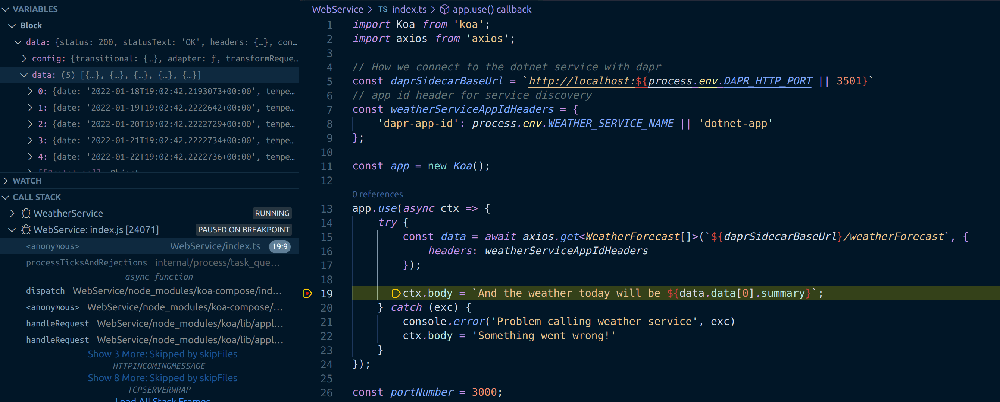
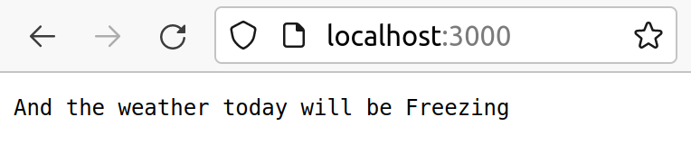

This post shows how to build and deploy two Azure Container Apps using Bicep and GitHub Actions. These apps will communicate using [dapr](https://docs.dapr.io/), be built in [VS Code using a devcontainer](https://code.visualstudio.com/docs/remote/containers) and be entirely debuggable.

This post follows on from the [previous post](../2021-12-27-azure-container-apps-build-and-deploy-with-bicep-and-github-actions/index.md) which built and deployed a simple web application to Azure Container Apps using Bicep and GitHub Actions using the GitHub container registry.

As an engineer, I'm productive when:

- I'm able to easily debug my code
- Integrating different services together is a turnkey experience

I've found that using dapr and VS Code I'm able to achieve that. I'm can build an application made up of multiple services, compose them together using dapr and deploy them to Azure Container Apps with relative ease.

In this post we're going to build an example of that from scratch, with a [koa/node.js](https://koajs.com/) (built with TypeScript) front end that will communicate with a [dotnet](https://dotnet.microsoft.com/en-us/) service via dapr.

All the work done in this post can be found in the [`dapr-devcontainer-debug-and-deploy`](https://github.com/johnnyreilly/dapr-devcontainer-debug-and-deploy) repo. As a note, if you're interested in this topic it's also worth looking at the [`Azure-Samples/container-apps-store-api-microservice`](https://github.com/Azure-Samples/container-apps-store-api-microservice) repo.


## Setting up our devcontainer

The first thing we'll do is set up our devcontainer. We're going to use a tweaked version of the [docker-in-docker](https://github.com/microsoft/vscode-dev-containers/tree/main/containers/docker-in-docker) image from the [vscode-dev-containers](https://github.com/microsoft/vscode-dev-containers) repo.

In the root of our project we'll create a `.devcontainer` folder, and within that a `library-scripts` folder. There's a number of communal scripts from the vscode-dev-containers repo which we're going to want to copy into in our `library-scripts` folder:

- [docker-in-docker-debian.sh](https://github.com/microsoft/vscode-dev-containers/blob/d93de4632781372d4b4da1699e27ae3a2404c96c/script-library/docker-in-docker-debian.sh) - for installing Docker in Docker
- [azcli-debian.sh](https://github.com/microsoft/vscode-dev-containers/blob/d93de4632781372d4b4da1699e27ae3a2404c96c/script-library/azcli-debian.sh) - for installing the Azure CLI

In the `.devcontainer` folder we want to create a `Dockerfile`:

```Dockerfile
# [Choice] .NET version: 6.0, 5.0, 3.1, 2.1
ARG VARIANT=3.1
FROM mcr.microsoft.com/vscode/devcontainers/dotnet:0-${VARIANT}
RUN su vscode -c "umask 0002 && dotnet tool install -g Microsoft.Tye --version \"0.10.0-alpha.21420.1\" 2>&1"

# [Choice] Node.js version: none, lts/*, 16, 14, 12, 10
ARG NODE_VERSION="14"
RUN if [ "${NODE_VERSION}" != "none" ]; then su vscode -c "umask 0002 && . /usr/local/share/nvm/nvm.sh && nvm install ${NODE_VERSION} 2>&1"; fi

# [Option] Install Azure CLI
ARG INSTALL_AZURE_CLI="false"
COPY library-scripts/azcli-debian.sh /tmp/library-scripts/
RUN if [ "$INSTALL_AZURE_CLI" = "true" ]; then bash /tmp/library-scripts/azcli-debian.sh; fi \
    && apt-get clean -y && rm -rf /var/lib/apt/lists/* /tmp/library-scripts \
    && az bicep install

# [Option] Enable non-root Docker access in container
ARG ENABLE_NONROOT_DOCKER="true"
# [Option] Use the OSS Moby CLI instead of the licensed Docker CLI
ARG USE_MOBY="true"
# [Option] Engine/CLI Version
ARG DOCKER_VERSION="latest"

# Enable new "BUILDKIT" mode for Docker CLI
ENV DOCKER_BUILDKIT=1

ARG USERNAME=vscode

# Install needed packages and setup non-root user. Use a separate RUN statement to add your
# own dependencies. A user of "automatic" attempts to reuse an user ID if one already exists.
COPY library-scripts/docker-in-docker-debian.sh /tmp/library-scripts/
RUN apt-get update \
    && apt-get install python3-pip -y \
# Use Docker script from script library to set things up
    && /bin/bash /tmp/library-scripts/docker-in-docker-debian.sh "${ENABLE_NONROOT_DOCKER}" "${USERNAME}" "${USE_MOBY}" "${DOCKER_VERSION}"

# Install Dapr
RUN wget -q https://raw.githubusercontent.com/dapr/cli/master/install/install.sh -O - | /bin/bash \
    # Clean up
    && apt-get autoremove -y && apt-get clean -y && rm -rf /var/lib/apt/lists/* /tmp/library-scripts/

# Add daprd to the path for the VS Code Dapr extension.
ENV PATH="${PATH}:/home/${USERNAME}/.dapr/bin"

# Install Tye
ENV PATH=/home/${USERNAME}/.dotnet/tools:$PATH

VOLUME [ "/var/lib/docker" ]

# Setting the ENTRYPOINT to docker-init.sh will configure non-root access
# to the Docker socket. The script will also execute CMD as needed.
ENTRYPOINT [ "/usr/local/share/docker-init.sh" ]
CMD [ "sleep", "infinity" ]

# [Optional] Uncomment this section to install additional OS packages.
# RUN apt-get update && export DEBIAN_FRONTEND=noninteractive \
#     && apt-get -y install --no-install-recommends <your-package-list-here>
```

The above is a loose riff on the [docker-in-docker Dockerfile](https://github.com/microsoft/vscode-dev-containers/blob/main/containers/docker-in-docker/.devcontainer/Dockerfile), lovingly mixed with the [Azure-Samples container-apps Dockerfile](https://github.com/Azure-Samples/container-apps-store-api-microservice/blob/main/.devcontainer/Dockerfile).

It installs the following:

- Dot Net
- Node.js
- the Azure CLI
- Docker
- Bicep
- Dapr

Now we have our `Dockerfile`, we need a `devcontainer.json` to go with it:

```json
// For format details, see https://aka.ms/devcontainer.json. For config options, see the README at:
// https://github.com/microsoft/vscode-dev-containers/tree/v0.205.0/containers/dapr-dotnet
{
  "name": "dapr",
  "build": {
    "dockerfile": "Dockerfile",
    "args": {
      // Update 'VARIANT' to pick a .NET Core version: 3.1, 5.0, 6.0
      "VARIANT": "6.0",
      // Options
      "NODE_VERSION": "lts/*",
      "INSTALL_AZURE_CLI": "true"
    }
  },
  "runArgs": ["--init", "--privileged"],
  "mounts": ["source=dind-var-lib-docker,target=/var/lib/docker,type=volume"],
  "overrideCommand": false,

  // Use this environment variable if you need to bind mount your local source code into a new container.
  "remoteEnv": {
    "LOCAL_WORKSPACE_FOLDER": "${localWorkspaceFolder}",
    "PATH": "/home/vscode/.dapr/bin/:/home/vscode/.dotnet/tools:$PATH${containerEnv:PATH}"
  },

  // Set *default* container specific settings.json values on container create.
  "settings": {},

  // Add the IDs of extensions you want installed when the container is created.
  "extensions": [
    "ms-azuretools.vscode-dapr",
    "ms-azuretools.vscode-docker",
    "ms-dotnettools.csharp",
    "ms-vscode.azurecli",
    "ms-azuretools.vscode-bicep"
  ],

  // Use 'forwardPorts' to make a list of ports inside the container available locally.
  // "forwardPorts": [],

  // Ensure Dapr is running on opening the container
  "postCreateCommand": "dapr uninstall --all && dapr init",

  // Comment out connect as root instead. More info: https://aka.ms/vscode-remote/containers/non-root.
  "remoteUser": "vscode",
  "features": {
    "azure-cli": "latest"
  }
}
```

The above will:

- install Node 16 / dotnet 6 and the latest Azure CLI
- install a number of VS Code extensions related to dapr / Docker / Bicep / Azure / C#
- install dapr when the container starts

We're ready! Reopen your repo in a container (it will take a while first time out) and you'll be ready to go.

## Create a dotnet service

Now we're going to create a dotnet service. The aim of this post is not to build a specific application, but rather to demonstrate how simple service to service communication is with dapr. So we'll use the web api template that ships with dotnet 6. That arrives with a fake weather API included, so we'll name our service accordingly:

```sh
dotnet new webapi -o WeatherService
```

Inside the created `Program.cs`, find the following line and delete it:

```cs
app.UseHttpsRedirection();
```

HTTPS is important, however Azure Container Apps are going to tackle that for us.

## Create a Node.js service (with Koa)

Creating our dotnet service was very simple. We're now going to create a web app with Node.js and Koa that calls our dotnet service. This will be a little more complicated - but still surprisingly simple thanks to the great API choices of dapr.

Let's make that service:

```sh
mkdir WebService
cd WebService
npm init -y
npm install koa axios --save
npm install @types/koa @types/node @types/axios typescript --save-dev
```

We're installing the following:

- [koa](https://koajs.com/) - the web framework we're going to use
- [axios](https://axios-http.com/) - to make calls to our dotnet service via HTTP / dapr
- [TypeScript](https://www.typescriptlang.org/) and associated type definitions, so we can take advantage of static typing. Admittedly since we're building a minimal example this is not super beneficial; but TS makes me happy and I'd certainly want static typing in place if going beyond a simple example. Start as you mean to go on.

We'll create a `tsconfig.json`:

```json
{
  "compilerOptions": {
    "esModuleInterop": true,
    "module": "commonjs",
    "target": "es2017",
    "noImplicitAny": true,
    "outDir": "./dist",
    "strict": true,
    "sourceMap": true
  }
}
```

We'll update the `scripts` section of our `package.json` like so:

```json
  "scripts": {
    "build": "tsc",
    "start": "node dist/index.js"
  },
```

So we can build and start our web app. Now let's write it!

We're going to create an `index.ts` file:

```ts
import Koa from 'koa';
import axios from 'axios';

// How we connect to the dotnet service with dapr
const daprSidecarBaseUrl = `http://localhost:${
  process.env.DAPR_HTTP_PORT || 3501
}`;
// app id header for service discovery
const weatherServiceAppIdHeaders = {
  'dapr-app-id': process.env.WEATHER_SERVICE_NAME || 'dotnet-app',
};

const app = new Koa();

app.use(async (ctx) => {
  try {
    const data = await axios.get<WeatherForecast[]>(
      `${daprSidecarBaseUrl}/weatherForecast`,
      {
        headers: weatherServiceAppIdHeaders,
      }
    );

    ctx.body = `And the weather today will be ${data.data[0].summary}`;
  } catch (exc) {
    console.error('Problem calling weather service', exc);
    ctx.body = 'Something went wrong!';
  }
});

const portNumber = 3000;
app.listen(portNumber);
console.log(`listening on port ${portNumber}`);

interface WeatherForecast {
  date: string;
  temperatureC: number;
  temperatureF: number;
  summary: string;
}
```

The above code is fairly simple but is achieving quite a lot. It:

- uses various environment variables to construct the URLs / headers which allow connecting to the dapr sidecar running alongside the app, and consequently to the weather service through the dapr sidecar running alongside the weather service. We're going to set up the environment variables which this code relies upon later.
- spins up a web server with koa on port 3000
- that web server, when sent an HTTP request, will call the `weatherForecast` endpoint of the dotnet app. It will grab what comes back, take the first entry in there and surface that up as the weather forecast.
- We're also defining a `WeatherForecast` interface to represent the type of the data that comes back from the dotnet service

It's worth dwelling for a moment on the simplicity that dapr is affording us here. We're able to make HTTP requests to our dotnet service just like they were any other service running locally. What's actually happening is illustrated by the diagram below:


We're making HTTP requests from the web service, which look like they're going directly to the weather service. But in actual fact, they're being routed through dapr sidecars until they reach their destination. Why is this fantastic? Well there's two things we aren't having to think about here:

- certificates
- inter-service authentication

Both of these can be complex and burn a large amount of engineering time. Because we're using dapr it's not a problem we have to solve. Isn't that great?

## Debugging dapr in VS Code

We want to be able to debug this code. We can achieve that in VS Code by setting a [`launch.json`](https://code.visualstudio.com/docs/editor/debugging#_launchjson-attributes) and a [`tasks.json`](https://code.visualstudio.com/docs/editor/tasks) file.

First of all we'll create a `launch.json` file in the `.vscode` folder of our repo:

```json
{
  // Use IntelliSense to learn about possible attributes.
  // Hover to view descriptions of existing attributes.
  // For more information, visit: https://go.microsoft.com/fwlink/?linkid=830387
  "version": "0.2.0",
  "compounds": [
    {
      "name": "All Container Apps",
      "configurations": ["WeatherService", "WebService"],
      "presentation": {
        "hidden": false,
        "group": "Containers",
        "order": 1
      }
    }
  ],
  "configurations": [
    {
      "name": "WeatherService",
      "type": "coreclr",
      "request": "launch",
      "preLaunchTask": "daprd-debug-dotnet",
      "postDebugTask": "daprd-down-dotnet",
      "program": "${workspaceFolder}/WeatherService/bin/Debug/net6.0/WeatherService.dll",
      "args": [],
      "cwd": "${workspaceFolder}",
      "stopAtEntry": false,
      "env": {
        "DOTNET_ENVIRONMENT": "Development",
        "DOTNET_URLS": "http://localhost:5000",
        "DAPR_HTTP_PORT": "3500",
        "DAPR_GRPC_PORT": "50000",
        "DAPR_METRICS_PORT": "9090"
      }
    },

    {
      "name": "WebService",
      "type": "node",
      "request": "launch",
      "preLaunchTask": "daprd-debug-node",
      "postDebugTask": "daprd-down-node",
      "program": "${workspaceFolder}/WebService/index.ts",
      "cwd": "${workspaceFolder}",
      "env": {
        "NODE_ENV": "development",
        "PORT": "3000",
        "DAPR_HTTP_PORT": "3501",
        "DAPR_GRPC_PORT": "50001",
        "DAPR_METRICS_PORT": "9091",
        "WEATHER_SERVICE_NAME": "dotnet-app"
      },
      "protocol": "inspector",
      "outFiles": ["${workspaceFolder}/WebService/dist/**/*.js"],
      "serverReadyAction": {
        "action": "openExternally"
      }
    }
  ]
}
```

The things to note about this are:

- we create a Node.js ("WebService") and a dotnet ("WeatherService") configuration. These are referenced by the `All Container Apps` compound. Kicking off that will start both the Node.js and the dotnet apps.
- The Node.js app runs a `daprd-debug-node` task prior to launch and a `daprd-down-node` task when debugging completes. Comparable tasks are run by the dotnet container - we'll look at these in a moment.
- Various environment variables are configured, most of which control the behaviour of dapr. When we're debugging locally we'll be using some non-typical ports to accomodate multiple dapr sidecars being in play at the same time. Note also the `"WEATHER_SERVICE_NAME": "dotnet-app"` - it's this that allows the WebService to communicate with the WeatherService - `dotnet-app` is the `appId` used to identify a service with dapr. We'll see that as we configure our `tasks.json`.

Here's the `tasks.json` we must make:

```json
{
  // See https://go.microsoft.com/fwlink/?LinkId=733558
  // for the documentation about the tasks.json format
  "version": "2.0.0",
  "tasks": [
    {
      "label": "dotnet-build",
      "command": "dotnet",
      "type": "process",
      "args": [
        "build",
        "${workspaceFolder}/WeatherService/WeatherService.csproj",
        "/property:GenerateFullPaths=true",
        "/consoleloggerparameters:NoSummary"
      ],
      "problemMatcher": "$msCompile"
    },
    {
      "label": "daprd-debug-dotnet",
      "appId": "dotnet-app",
      "appPort": 5000,
      "httpPort": 3500,
      "grpcPort": 50000,
      "metricsPort": 9090,
      "type": "daprd",
      "dependsOn": ["dotnet-build"]
    },
    {
      "label": "daprd-down-dotnet",
      "appId": "dotnet-app",
      "type": "daprd-down"
    },

    {
      "label": "npm-install",
      "type": "shell",
      "command": "npm install",
      "options": {
        "cwd": "${workspaceFolder}/WebService"
      }
    },
    {
      "label": "webservice-build",
      "type": "typescript",
      "tsconfig": "WebService/tsconfig.json",
      "problemMatcher": ["$tsc"],
      "group": {
        "kind": "build",
        "isDefault": true
      },
      "dependsOn": ["npm-install"]
    },
    {
      "label": "daprd-debug-node",
      "appId": "node-app",
      "appPort": 3000,
      "httpPort": 3501,
      "grpcPort": 50001,
      "metricsPort": 9091,
      "type": "daprd",
      "dependsOn": ["webservice-build"]
    },
    {
      "label": "daprd-down-node",
      "appId": "node-app",
      "type": "daprd-down"
    }
  ]
}
```

There's two sets of tasks here; one for the WeatherService and one for the WebService. You'll see some commonalities here. For each service there's a `daprd` task that depends upon the relevant service being built and passes the various ports for the dapr sidecar to run on that runs just before debugging kicks off. To go with that, there's a `daprd-down` task for each service that runs when debugging finishes and shuts down dapr.

We're now ready to debug our app. Let's hit F5.



And if we look at our browser:



It works! We're running a Node.js WebService which, when called, is communicating with our dotnet WeatherService and surfacing up the results. Brilliant!
