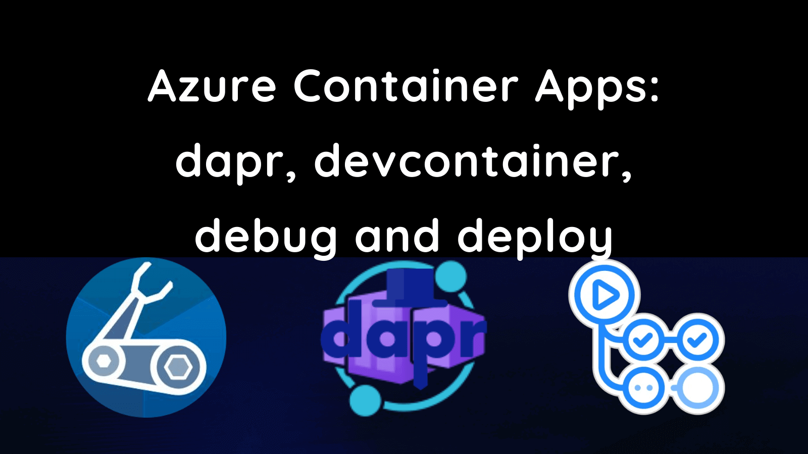
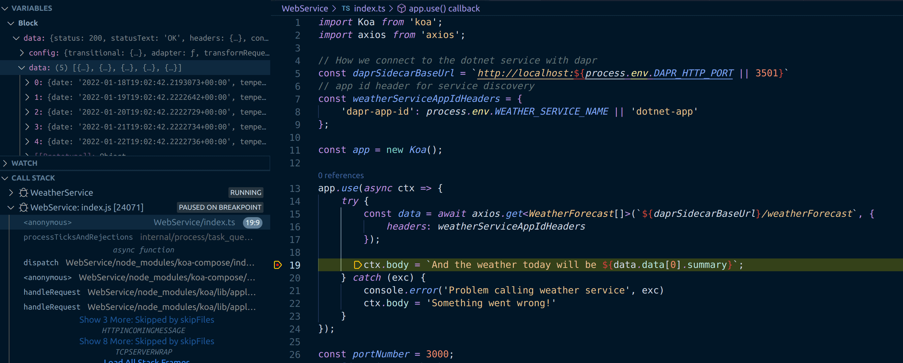
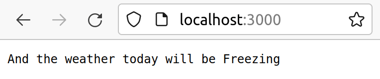
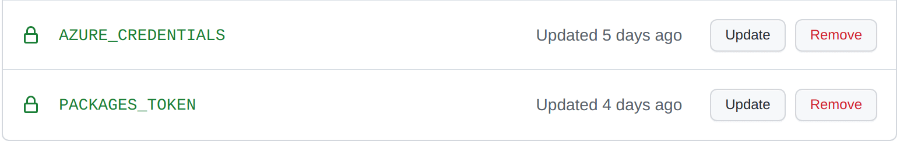
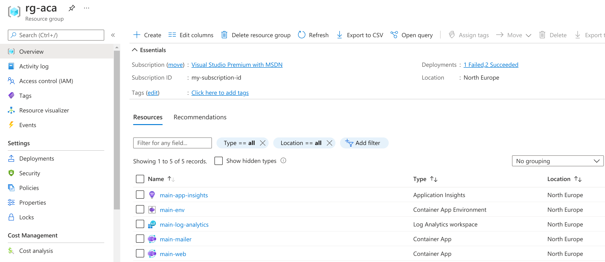
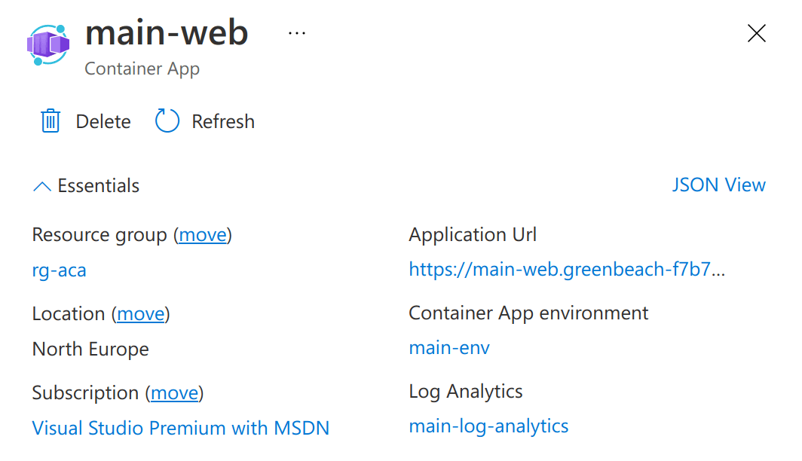
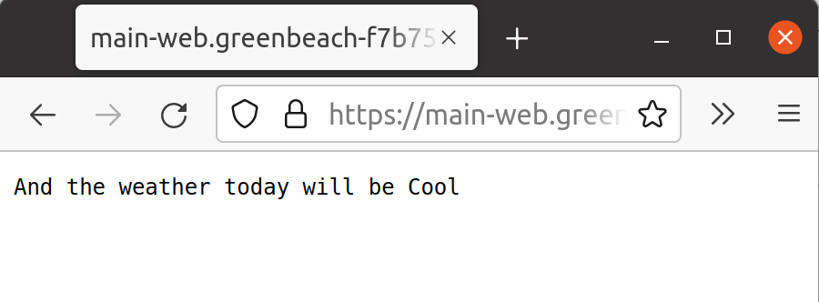

This post shows how to build and deploy two Azure Container Apps using Bicep and GitHub Actions. These apps will communicate using [dapr](https://docs.dapr.io/), be built in [VS Code using a devcontainer](https://code.visualstudio.com/docs/remote/containers). It will be possible to debug in VS Code and run with `docker-compose`.

This follows on from the [previous post](../2021-12-27-azure-container-apps-build-and-deploy-with-bicep-and-github-actions/index.md) which built and deployed a simple web application to Azure Container Apps using Bicep and GitHub Actions using the GitHub container registry.



<!--truncate-->

## Updated 02/05/2022

This post has been updated to reflect the migration of Azure Container Apps from the Microsoft.Web namespace to the Microsoft.App namespace in March 2022. See: https://github.com/microsoft/azure-container-apps/issues/109

## What we're going to build

As an engineer, I'm productive when:

- Integrating different services together is a turnkey experience and
- I'm able to easily debug my code

I've found that using dapr and VS Code I'm able to achieve both of these goals. I can build an application made up of multiple services, compose them together using dapr and deploy them to Azure Container Apps with relative ease.

In this post we're going to build an example of that from scratch, with a [koa/node.js](https://koajs.com/) (built with TypeScript) front end that will communicate with a [dotnet](https://dotnet.microsoft.com/en-us/) service via dapr.

All the work done in this post can be found in the [`dapr-devcontainer-debug-and-deploy`](https://github.com/johnnyreilly/dapr-devcontainer-debug-and-deploy/tree/v1.0.0) repo. As a note, if you're interested in this topic it's also worth looking at the [`Azure-Samples/container-apps-store-api-microservice`](https://github.com/Azure-Samples/container-apps-store-api-microservice) repo.

## Setting up our devcontainer

The first thing we'll do is set up our devcontainer. We're going to use a tweaked version of the [docker-in-docker](https://github.com/microsoft/vscode-dev-containers/tree/main/containers/docker-in-docker) image from the [vscode-dev-containers](https://github.com/microsoft/vscode-dev-containers) repo.

In the root of our project we'll create a `.devcontainer` folder, and within that a `library-scripts` folder. There's a number of communal scripts from the [`vscode-dev-containers`](https://github.com/microsoft/vscode-dev-containers) repo which we're going to lift and shift into in our `library-scripts` folder:

- [docker-in-docker-debian.sh](https://github.com/microsoft/vscode-dev-containers/blob/d93de4632781372d4b4da1699e27ae3a2404c96c/script-library/docker-in-docker-debian.sh) - for installing Docker in Docker
- [azcli-debian.sh](https://github.com/microsoft/vscode-dev-containers/blob/d93de4632781372d4b4da1699e27ae3a2404c96c/script-library/azcli-debian.sh) - for installing the Azure CLI

In the `.devcontainer` folder we want to create a `Dockerfile`:

```docker
# [Choice] .NET version: 6.0, 5.0, 3.1, 2.1
ARG VARIANT=3.1
FROM mcr.microsoft.com/vscode/devcontainers/dotnet:0-${VARIANT}
RUN su vscode -c "umask 0002 && dotnet tool install -g Microsoft.Tye --version \"0.10.0-alpha.21420.1\" 2>&1"

# [Choice] Node.js version: none, lts/*, 16, 14, 12, 10
ARG NODE_VERSION="14"
RUN if [ "${NODE_VERSION}" != "none" ]; then su vscode -c "umask 0002 && . /usr/local/share/nvm/nvm.sh && nvm install ${NODE_VERSION} 2>&1"; fi

# [Option] Install Azure CLI
ARG INSTALL_AZURE_CLI="false"
COPY library-scripts/azcli-debian.sh /tmp/library-scripts/
RUN if [ "$INSTALL_AZURE_CLI" = "true" ]; then bash /tmp/library-scripts/azcli-debian.sh; fi \
    && apt-get clean -y && rm -rf /var/lib/apt/lists/* /tmp/library-scripts \
    && az bicep install

# [Option] Enable non-root Docker access in container
ARG ENABLE_NONROOT_DOCKER="true"
# [Option] Use the OSS Moby CLI instead of the licensed Docker CLI
ARG USE_MOBY="true"
# [Option] Engine/CLI Version
ARG DOCKER_VERSION="latest"

# Enable new "BUILDKIT" mode for Docker CLI
ENV DOCKER_BUILDKIT=1

ARG USERNAME=vscode

# Install needed packages and setup non-root user. Use a separate RUN statement to add your
# own dependencies. A user of "automatic" attempts to reuse an user ID if one already exists.
COPY library-scripts/docker-in-docker-debian.sh /tmp/library-scripts/
RUN apt-get update \
    && apt-get install python3-pip -y \
# Use Docker script from script library to set things up
    && /bin/bash /tmp/library-scripts/docker-in-docker-debian.sh "${ENABLE_NONROOT_DOCKER}" "${USERNAME}" "${USE_MOBY}" "${DOCKER_VERSION}"

# Install Dapr
RUN wget -q https://raw.githubusercontent.com/dapr/cli/master/install/install.sh -O - | /bin/bash \
    # Clean up
    && apt-get autoremove -y && apt-get clean -y && rm -rf /var/lib/apt/lists/* /tmp/library-scripts/

# Add daprd to the path for the VS Code Dapr extension.
ENV PATH="${PATH}:/home/${USERNAME}/.dapr/bin"

# Install Tye
ENV PATH=/home/${USERNAME}/.dotnet/tools:$PATH

VOLUME [ "/var/lib/docker" ]

# Setting the ENTRYPOINT to docker-init.sh will configure non-root access
# to the Docker socket. The script will also execute CMD as needed.
ENTRYPOINT [ "/usr/local/share/docker-init.sh" ]
CMD [ "sleep", "infinity" ]

# [Optional] Uncomment this section to install additional OS packages.
# RUN apt-get update && export DEBIAN_FRONTEND=noninteractive \
#     && apt-get -y install --no-install-recommends <your-package-list-here>
```

The above is a loose riff on the [docker-in-docker Dockerfile](https://github.com/microsoft/vscode-dev-containers/blob/main/containers/docker-in-docker/.devcontainer/Dockerfile), lovingly mixed with the [Azure-Samples container-apps Dockerfile](https://github.com/Azure-Samples/container-apps-store-api-microservice/blob/main/.devcontainer/Dockerfile).

It installs the following:

- Dot Net
- Node.js
- the Azure CLI
- Docker
- Bicep
- Dapr

Now we have our `Dockerfile`, we need a `devcontainer.json` to go with it:

```json
// For format details, see https://aka.ms/devcontainer.json. For config options, see the README at:
// https://github.com/microsoft/vscode-dev-containers/tree/v0.205.0/containers/dapr-dotnet
{
  "name": "dapr",
  "build": {
    "dockerfile": "Dockerfile",
    "args": {
      // Update 'VARIANT' to pick a .NET Core version: 3.1, 5.0, 6.0
      "VARIANT": "6.0",
      // Options
      "NODE_VERSION": "lts/*",
      "INSTALL_AZURE_CLI": "true"
    }
  },
  "runArgs": ["--init", "--privileged"],
  "mounts": ["source=dind-var-lib-docker,target=/var/lib/docker,type=volume"],
  "overrideCommand": false,

  // Use this environment variable if you need to bind mount your local source code into a new container.
  "remoteEnv": {
    "LOCAL_WORKSPACE_FOLDER": "${localWorkspaceFolder}",
    "PATH": "/home/vscode/.dapr/bin/:/home/vscode/.dotnet/tools:$PATH${containerEnv:PATH}"
  },

  // Set *default* container specific settings.json values on container create.
  "settings": {},

  // Add the IDs of extensions you want installed when the container is created.
  "extensions": [
    "ms-azuretools.vscode-dapr",
    "ms-azuretools.vscode-docker",
    "ms-dotnettools.csharp",
    "ms-vscode.azurecli",
    "ms-azuretools.vscode-bicep"
  ],

  // Use 'forwardPorts' to make a list of ports inside the container available locally.
  // "forwardPorts": [],

  // Ensure Dapr is running on opening the container
  "postCreateCommand": "dapr uninstall --all && dapr init",

  // Comment out connect as root instead. More info: https://aka.ms/vscode-remote/containers/non-root.
  "remoteUser": "vscode",
  "features": {
    "azure-cli": "latest"
  }
}
```

The above will:

- install Node 16 / dotnet 6 and the latest Azure CLI
- install a number of VS Code extensions related to dapr / Docker / Bicep / Azure / C#
- install dapr when the container starts

We're ready! Reopen your repo in a container (it will take a while first time out) and you'll be ready to go.

## Create a dotnet service

Now we're going to create a dotnet service. The aim of this post is not to build a specific application, but rather to demonstrate how simple service to service communication is with dapr. So we'll use the web api template that ships with dotnet 6. That arrives with a fake weather API included, so we'll name our service accordingly:

```shell
dotnet new webapi -o WeatherService
```

Inside the created `Program.cs`, find the following line and delete it:

```cs
app.UseHttpsRedirection();
```

HTTPS is important, however Azure Container Apps are going to tackle that for us.

## Create a Node.js service (with Koa)

Creating our dotnet service was very simple. We're now going to create a web app with Node.js and Koa that calls our dotnet service. This will be a little more complicated - but still surprisingly simple thanks to the great API choices of dapr.

Let's make that service:

```shell
mkdir WebService
cd WebService
npm init -y
npm install koa axios --save
npm install @types/koa @types/node @types/axios typescript --save-dev
```

We're installing the following:

- [koa](https://koajs.com/) - the web framework we're going to use
- [axios](https://axios-http.com/) - to make calls to our dotnet service via HTTP / dapr
- [TypeScript](https://www.typescriptlang.org/) and associated type definitions, so we can take advantage of static typing. Admittedly since we're building a minimal example this is not super beneficial; but TS makes me happy and I'd certainly want static typing in place if going beyond a simple example. Start as you mean to go on.

We'll create a `tsconfig.json`:

```json
{
  "compilerOptions": {
    "esModuleInterop": true,
    "module": "commonjs",
    "target": "es2017",
    "noImplicitAny": true,
    "outDir": "./dist",
    "strict": true,
    "sourceMap": true
  }
}
```

We'll update the `scripts` section of our `package.json` like so:

```json
  "scripts": {
    "build": "tsc",
    "start": "node dist/index.js"
  },
```

So we can build and start our web app. Now let's write it!

We're going to create an `index.ts` file:

```ts
import Koa from 'koa';
import axios from 'axios';

// How we connect to the dotnet service with dapr
const daprSidecarBaseUrl = `http://localhost:${
  process.env.DAPR_HTTP_PORT || 3501
}`;
// app id header for service discovery
const weatherServiceAppIdHeaders = {
  'dapr-app-id': process.env.WEATHER_SERVICE_NAME || 'dotnet-app',
};

const app = new Koa();

app.use(async (ctx) => {
  try {
    const data = await axios.get<WeatherForecast[]>(
      `${daprSidecarBaseUrl}/weatherForecast`,
      {
        headers: weatherServiceAppIdHeaders,
      },
    );

    ctx.body = `And the weather today will be ${data.data[0].summary}`;
  } catch (exc) {
    console.error('Problem calling weather service', exc);
    ctx.body = 'Something went wrong!';
  }
});

const portNumber = 3000;
app.listen(portNumber);
console.log(`listening on port ${portNumber}`);

interface WeatherForecast {
  date: string;
  temperatureC: number;
  temperatureF: number;
  summary: string;
}
```

The above code is fairly simple but is achieving quite a lot. It:

- uses various environment variables to construct the URLs / headers which allow connecting to the dapr sidecar running alongside the app, and consequently to the weather service through the dapr sidecar running alongside the weather service. We're going to set up the environment variables which this code relies upon later.
- spins up a web server with koa on port 3000
- that web server, when sent an HTTP request, will call the `weatherForecast` endpoint of the dotnet app. It will grab what comes back, take the first entry in there and surface that up as the weather forecast.
- We're also defining a `WeatherForecast` interface to represent the type of the data that comes back from the dotnet service

It's worth dwelling for a moment on the simplicity that dapr is affording us here. We're able to make HTTP requests to our dotnet service just like they were any other service running locally. What's actually happening is illustrated by the diagram below:


We're making HTTP requests from the web service, which look like they're going directly to the weather service. But in actual fact, they're being routed through dapr sidecars until they reach their destination. Why is this fantastic? Well there's two things we aren't having to think about here:

- certificates
- inter-service authentication

Both of these can be complex and burn a large amount of engineering time. Because we're using dapr it's not a problem we have to solve. Isn't that great?

## Debugging dapr in VS Code

We want to be able to debug this code. We can achieve that in VS Code by setting a [`launch.json`](https://code.visualstudio.com/docs/editor/debugging#_launchjson-attributes) and a [`tasks.json`](https://code.visualstudio.com/docs/editor/tasks) file.

First of all we'll create a `launch.json` file in the `.vscode` folder of our repo:

```json
{
  // Use IntelliSense to learn about possible attributes.
  // Hover to view descriptions of existing attributes.
  // For more information, visit: https://go.microsoft.com/fwlink/?linkid=830387
  "version": "0.2.0",
  "compounds": [
    {
      "name": "All Container Apps",
      "configurations": ["WeatherService", "WebService"],
      "presentation": {
        "hidden": false,
        "group": "Containers",
        "order": 1
      }
    }
  ],
  "configurations": [
    {
      "name": "WeatherService",
      "type": "coreclr",
      "request": "launch",
      "preLaunchTask": "daprd-debug-dotnet",
      "postDebugTask": "daprd-down-dotnet",
      "program": "${workspaceFolder}/WeatherService/bin/Debug/net6.0/WeatherService.dll",
      "args": [],
      "cwd": "${workspaceFolder}/WeatherService",
      "stopAtEntry": false,
      "env": {
        "DOTNET_ENVIRONMENT": "Development",
        "DOTNET_URLS": "http://localhost:5000",
        "DAPR_HTTP_PORT": "3500",
        "DAPR_GRPC_PORT": "50000",
        "DAPR_METRICS_PORT": "9090"
      }
    },

    {
      "name": "WebService",
      "type": "node",
      "request": "launch",
      "preLaunchTask": "daprd-debug-node",
      "postDebugTask": "daprd-down-node",
      "program": "${workspaceFolder}/WebService/index.ts",
      "cwd": "${workspaceFolder}/WebService",
      "env": {
        "NODE_ENV": "development",
        "PORT": "3000",
        "DAPR_HTTP_PORT": "3501",
        "DAPR_GRPC_PORT": "50001",
        "DAPR_METRICS_PORT": "9091",
        "WEATHER_SERVICE_NAME": "dotnet-app"
      },
      "protocol": "inspector",
      "outFiles": ["${workspaceFolder}/WebService/dist/**/*.js"],
      "serverReadyAction": {
        "action": "openExternally"
      }
    }
  ]
}
```

The things to note about this are:

- we create a Node.js ("WebService") and a dotnet ("WeatherService") configuration. These are referenced by the `All Container Apps` compound. Kicking off that will start both the Node.js and the dotnet apps.
- The Node.js app runs a `daprd-debug-node` task prior to launch and a `daprd-down-node` task when debugging completes. Comparable tasks are run by the dotnet container - we'll look at these in a moment.
- Various environment variables are configured, most of which control the behaviour of dapr. When we're debugging locally we'll be using some non-typical ports to accomodate multiple dapr sidecars being in play at the same time. Note also the `"WEATHER_SERVICE_NAME": "dotnet-app"` - it's this that allows the WebService to communicate with the WeatherService - `dotnet-app` is the `appId` used to identify a service with dapr. We'll see that as we configure our `tasks.json`.

Here's the `tasks.json` we must make:

```json
{
  // See https://go.microsoft.com/fwlink/?LinkId=733558
  // for the documentation about the tasks.json format
  "version": "2.0.0",
  "tasks": [
    {
      "label": "dotnet-build",
      "command": "dotnet",
      "type": "process",
      "args": [
        "build",
        "${workspaceFolder}/WeatherService/WeatherService.csproj",
        "/property:GenerateFullPaths=true",
        "/consoleloggerparameters:NoSummary"
      ],
      "problemMatcher": "$msCompile"
    },
    {
      "label": "daprd-debug-dotnet",
      "appId": "dotnet-app",
      "appPort": 5000,
      "httpPort": 3500,
      "grpcPort": 50000,
      "metricsPort": 9090,
      "type": "daprd",
      "dependsOn": ["dotnet-build"]
    },
    {
      "label": "daprd-down-dotnet",
      "appId": "dotnet-app",
      "type": "daprd-down"
    },

    {
      "label": "npm-install",
      "type": "shell",
      "command": "npm install",
      "options": {
        "cwd": "${workspaceFolder}/WebService"
      }
    },
    {
      "label": "webservice-build",
      "type": "typescript",
      "tsconfig": "WebService/tsconfig.json",
      "problemMatcher": ["$tsc"],
      "group": {
        "kind": "build",
        "isDefault": true
      },
      "dependsOn": ["npm-install"]
    },
    {
      "label": "daprd-debug-node",
      "appId": "node-app",
      "appPort": 3000,
      "httpPort": 3501,
      "grpcPort": 50001,
      "metricsPort": 9091,
      "type": "daprd",
      "dependsOn": ["webservice-build"]
    },
    {
      "label": "daprd-down-node",
      "appId": "node-app",
      "type": "daprd-down"
    }
  ]
}
```

There's two sets of tasks here; one for the WeatherService and one for the WebService. You'll see some commonalities here. For each service there's a `daprd` task that depends upon the relevant service being built and passes the various ports for the dapr sidecar to run on that runs just before debugging kicks off. To go with that, there's a `daprd-down` task for each service that runs when debugging finishes and shuts down dapr.

We're now ready to debug our app. Let's hit F5.



And if we look at our browser:



It works! We're running a Node.js WebService which, when called, is communicating with our dotnet WeatherService and surfacing up the results. Brilliant!

## Containerising our services with Docker

Before we can deploy each of our services, they need to be containerised.

First let's add a `Dockerfile` to the `WeatherService` folder:

```docker
FROM mcr.microsoft.com/dotnet/sdk:6.0 as build
WORKDIR /app
COPY . .
RUN dotnet restore
RUN dotnet publish -o /app/publish

FROM mcr.microsoft.com/dotnet/aspnet:6.0 as runtime
WORKDIR /app
COPY --from=build /app/publish /app

ENV DOTNET_ENVIRONMENT=Production
ENV ASPNETCORE_URLS='http://+:5000'
EXPOSE 5000
ENTRYPOINT [ "dotnet", "/app/WeatherService.dll" ]
```

Then we'll add a `Dockerfile` to the `WebService` folder:

```docker
FROM node:16 AS build
WORKDIR /app
COPY package.json ./
COPY package-lock.json ./
RUN npm install

COPY . .
RUN npm run build

FROM node:16 AS runtime
WORKDIR /app
COPY --from=build /app/dist /app
COPY --from=build /app/package.json /app
COPY --from=build /app/package-lock.json /app
RUN npm install

ENV NODE_ENV production
EXPOSE 3000
ENTRYPOINT [ "node", "/app/index.js" ]
```

Likely these `Dockerfile`s could be optimised further; but we're not focussed on that just now. What we have now are two simple `Dockerfile`s that will give us images we can run. Given that one depends on the other it makes sense to bring them together with a `docker-compose.yml` file which we'll place in the root of the repo:

```yml
version: '3.4'

services:
  weatherservice:
    image: ${REGISTRY:-weatherservice}:${TAG:-latest}
    build:
      context: ./WeatherService
      dockerfile: Dockerfile
    ports:
      - '50000:50000' # Dapr instances communicate over gRPC so we need to expose the gRPC port
    environment:
      DOTNET_ENVIRONMENT: 'Development'
      ASPNETCORE_URLS: 'http://+:5000'
      DAPR_HTTP_PORT: 3500
      DAPR_GRPC_PORT: 50000
      DAPR_METRICS_PORT: 9090

  weatherservice-dapr:
    image: 'daprio/daprd:latest'
    command:
      [
        './daprd',
        '-app-id',
        'dotnet-app',
        '-app-port',
        '5000',
        '-dapr-http-port',
        '3500',
        '-placement-host-address',
        'placement:50006',
      ]
    network_mode: 'service:weatherservice'
    depends_on:
      - weatherservice

  webservice:
    image: ${REGISTRY:-webservice}:${TAG:-latest}
    ports:
      - '3000:3000' # The web front end port
      - '50001:50001' # Dapr instances communicate over gRPC so we need to expose the gRPC port
    build:
      context: ./WebService
      dockerfile: Dockerfile
    environment:
      NODE_ENV: 'development'
      PORT: '3000'
      DAPR_HTTP_PORT: 3501
      DAPR_GRPC_PORT: 50001
      DAPR_METRICS_PORT: 9091
      WEATHER_SERVICE_NAME: 'dotnet-app'

  webservice-dapr:
    image: 'daprio/daprd:latest'
    command: [
        './daprd',
        '-app-id',
        'node-app',
        '-app-port',
        '3000',
        '-dapr-http-port',
        '3501',
        '-placement-host-address',
        'placement:50006', # Dapr's placement service can be reach via the docker DNS entry
      ]
    network_mode: 'service:webservice'
    depends_on:
      - webservice

  dapr-placement:
    image: 'daprio/dapr:latest'
    command: ['./placement', '-port', '50006']
    ports:
      - '50006:50006'
```

With this in place we can run `docker-compose up` and bring up our application locally.

And now we have docker images built, we can look at deploying them.

## Deploying to Azure

At this point we have pretty much everything we need in terms of application code and the ability to build and debug it. Now we'd like to deploy it to Azure.

Let's begin with the Bicep required to deploy our Azure Container Apps.

In our repository we'll create an `infra` directory, into which we'll place a `main.bicep` file which will contain our Bicep template:

```bicep
param branchName string

param webServiceImage string
param webServicePort int
param webServiceIsExternalIngress bool

param weatherServiceImage string
param weatherServicePort int
param weatherServiceIsExternalIngress bool

param containerRegistry string
param containerRegistryUsername string
@secure()
param containerRegistryPassword string

param tags object

param location string = resourceGroup().location

var minReplicas = 0
var maxReplicas = 1

var branch = toLower(last(split(branchName, '/')))

var environmentName = 'shared-env'
var workspaceName = '${branch}-log-analytics'
var appInsightsName = '${branch}-app-insights'
var webServiceContainerAppName = '${branch}-web'
var weatherServiceContainerAppName = '${branch}-weather'

var containerRegistryPasswordRef = 'container-registry-password'

resource workspace 'Microsoft.OperationalInsights/workspaces@2021-12-01-preview' = {
  name: workspaceName
  location: location
  tags: tags
  properties: {
    sku: {
      name: 'PerGB2018'
    }
    retentionInDays: 30
    workspaceCapping: {}
  }
}

resource appInsights 'Microsoft.Insights/components@2020-02-02' = {
  name: appInsightsName
  location: location
  tags: tags
  kind: 'web'
  properties: {
    Application_Type: 'web'
    Flow_Type: 'Bluefield'
  }
}

resource environment 'Microsoft.App/managedEnvironments@2022-01-01-preview' = {
  name: environmentName
  location: location
  tags: tags
  properties: {
    daprAIInstrumentationKey: appInsights.properties.InstrumentationKey
    appLogsConfiguration: {
      destination: 'log-analytics'
      logAnalyticsConfiguration: {
        customerId: workspace.properties.customerId
        sharedKey: listKeys(workspace.id, workspace.apiVersion).primarySharedKey
      }
    }
  }
}

resource weatherServiceContainerApp 'Microsoft.App/containerApps@2022-01-01-preview' = {
  name: weatherServiceContainerAppName
  kind: 'containerapps'
  tags: tags
  location: location
  properties: {
    managedEnvironmentId: environment.id
    configuration: {
      dapr: {
        enabled: true
        appPort: weatherServicePort
        appId: weatherServiceContainerAppName
      }
      secrets: [
        {
          name: containerRegistryPasswordRef
          value: containerRegistryPassword
        }
      ]
      registries: [
        {
          server: containerRegistry
          username: containerRegistryUsername
          passwordSecretRef: containerRegistryPasswordRef
        }
      ]
      ingress: {
        external: weatherServiceIsExternalIngress
        targetPort: weatherServicePort
      }
    }
    template: {
      containers: [
        {
          image: weatherServiceImage
          name: weatherServiceContainerAppName
          transport: 'auto'
        }
      ]
      scale: {
        minReplicas: minReplicas
        maxReplicas: maxReplicas
      }
    }
  }
}

resource webServiceContainerApp 'Microsoft.App/containerApps@2022-01-01-preview' = {
  name: webServiceContainerAppName
  kind: 'containerapps'
  tags: tags
  location: location
  properties: {
    managedEnvironmentId: environment.id
    configuration: {
      dapr: {
        enabled: true
        appPort: webServicePort
        appId: webServiceContainerAppName
      }
      secrets: [
        {
          name: containerRegistryPasswordRef
          value: containerRegistryPassword
        }
      ]
      registries: [
        {
          server: containerRegistry
          username: containerRegistryUsername
          passwordSecretRef: containerRegistryPasswordRef
        }
      ]
      ingress: {
        external: webServiceIsExternalIngress
        targetPort: webServicePort
      }
    }
    template: {
      containers: [
        {
          image: webServiceImage
          name: webServiceContainerAppName
          transport: 'auto'
          env: [
            {
              name: 'WEATHER_SERVICE_NAME'
              value: weatherServiceContainerAppName
            }
          ]
        }
      ]
      scale: {
        minReplicas: minReplicas
        maxReplicas: maxReplicas
      }
    }
  }
}

output webServiceUrl string = webServiceContainerApp.properties.latestRevisionFqdn
```

This will deploy two container apps - one for our `WebService` and one for our `WeatherService`. Alongside that we've resources for logging and environments.

## Setting up a resource group

With our Bicep in place, we're going to need a resource group to send it to. Right now, Azure Container Apps aren't available everywhere. So we're going to create ourselves a resource group in North Europe which does support ACAs:

```shell
az group create -g rg-aca -l northeurope
```

## Secrets for GitHub Actions

We're aiming to set up a GitHub Action to handle our deployment. This will depend upon a number of secrets:



We'll need to create each of these secrets.

### `AZURE_CREDENTIALS` - GitHub logging into Azure

So GitHub Actions can interact with Azure on our behalf, we need to provide it with some credentials. We'll use the Azure CLI to create these:

```shell
az ad sp create-for-rbac --name "myApp" --role contributor \
    --scopes /subscriptions/{subscription-id}/resourceGroups/{resource-group} \
    --sdk-auth
```

Remember to replace the `{subscription-id}` with your subscription id and `{resource-group}` with the name of your resource group (`rg-aca` if you're following along). This command will pump out a lump of JSON that looks something like this:

```json
{
  "clientId": "a-client-id",
  "clientSecret": "a-client-secret",
  "subscriptionId": "a-subscription-id",
  "tenantId": "a-tenant-id",
  "activeDirectoryEndpointUrl": "https://login.microsoftonline.com",
  "resourceManagerEndpointUrl": "https://management.azure.com/",
  "activeDirectoryGraphResourceId": "https://graph.windows.net/",
  "sqlManagementEndpointUrl": "https://management.core.windows.net:8443/",
  "galleryEndpointUrl": "https://gallery.azure.com/",
  "managementEndpointUrl": "https://management.core.windows.net/"
}
```

Take this and save it as the `AZURE_CREDENTIALS` secret in Azure.

### `PACKAGES_TOKEN` - Azure accessing the GitHub container registry

We also need a secret for accessing packages from Azure. We're going to be publishing packages to the GitHub container registry. Azure is going to need to be able to access this when we're deploying. ACA deployment works by telling Azure where to look for an image and providing any necessary credentials to do the acquisition. To facilitate this we'll set up a `PACKAGES_TOKEN` secret. This is a GitHub personal access token with the `read:packages` scope. [Follow the instructions here to create the token.](https://docs.github.com/en/authentication/keeping-your-account-and-data-secure/creating-a-personal-access-token)

## Deploying with GitHub Actions

With our secrets configured, we're now well placed to write our GitHub Action. We'll create a `.github/workflows/build-and-deploy.yaml` file in our repository and populate it thusly:

```yaml
# yaml-language-server: $schema=./build.yaml
name: Build and Deploy
on:
  # Trigger the workflow on push or pull request,
  # but only for the main branch
  push:
    branches:
      - main
  pull_request:
    branches:
      - main
    # Publish semver tags as releases.
    tags: ['v*.*.*']
  workflow_dispatch:

env:
  RESOURCE_GROUP: rg-aca
  REGISTRY: ghcr.io
  IMAGE_NAME: ${{ github.repository }}

jobs:
  build:
    runs-on: ubuntu-latest
    strategy:
      matrix:
        services:
          [
            { 'imageName': 'node-service', 'directory': './WebService' },
            { 'imageName': 'dotnet-service', 'directory': './WeatherService' },
          ]
    permissions:
      contents: read
      packages: write
    outputs:
      image-node: ${{ steps.image-tag.outputs.image-node-service }}
      image-dotnet: ${{ steps.image-tag.outputs.image-dotnet-service }}
    steps:
      - name: Checkout repository
        uses: actions/checkout@v2

      # Login against a Docker registry except on PR
      # https://github.com/docker/login-action
      - name: Log into registry ${{ env.REGISTRY }}
        if: github.event_name != 'pull_request'
        uses: docker/login-action@v1
        with:
          registry: ${{ env.REGISTRY }}
          username: ${{ github.actor }}
          password: ${{ secrets.GITHUB_TOKEN }}

      # Extract metadata (tags, labels) for Docker
      # https://github.com/docker/metadata-action
      - name: Extract Docker metadata
        id: meta
        uses: docker/metadata-action@v3
        with:
          images: ${{ env.REGISTRY }}/${{ env.IMAGE_NAME }}/${{ matrix.services.imageName }}
          tags: |
            type=semver,pattern={{version}}
            type=semver,pattern={{major}}.{{minor}}
            type=semver,pattern={{major}}
            type=ref,event=branch
            type=sha

      # Build and push Docker image with Buildx (don't push on PR)
      # https://github.com/docker/build-push-action
      - name: Build and push Docker image
        uses: docker/build-push-action@v2
        with:
          context: ${{ matrix.services.directory }}
          push: ${{ github.event_name != 'pull_request' }}
          tags: ${{ steps.meta.outputs.tags }}
          labels: ${{ steps.meta.outputs.labels }}

      - name: Output image tag
        id: image-tag
        run: |
          name=$(echo "image-${{ matrix.services.imageName }}" | tr '[:upper:]' '[:lower:]')
          value=$(echo "${{ env.REGISTRY }}/${{ env.IMAGE_NAME }}/${{ matrix.services.imageName }}:sha-$(git rev-parse --short HEAD)" | tr '[:upper:]' '[:lower:]')
          echo "setting output: $name=$value"
          echo "$name=$value" >> $GITHUB_OUTPUT

  deploy:
    runs-on: ubuntu-latest
    needs: [build]
    steps:
      - name: Checkout repository
        uses: actions/checkout@v2

      - name: Azure Login
        uses: azure/login@v1
        with:
          creds: ${{ secrets.AZURE_CREDENTIALS }}

      - name: Deploy bicep
        uses: azure/CLI@v2
        if: github.event_name != 'pull_request'
        with:
          inlineScript: |
            REF_SHA='${{ github.ref }}.${{ github.sha }}'
            DEPLOYMENT_NAME="${REF_SHA////-}"
            echo "DEPLOYMENT_NAME=$DEPLOYMENT_NAME"

            TAGS='{"owner":"johnnyreilly", "email":"johnny_reilly@hotmail.com"}'
            az deployment group create \
              --resource-group ${{ env.RESOURCE_GROUP }} \
              --name "$DEPLOYMENT_NAME" \
              --template-file ./infra/main.bicep \
              --parameters \
                  branchName='${{ github.event.number == 0 && 'main' ||  format('pr-{0}', github.event.number) }}' \
                  webServiceImage='${{ needs.build.outputs.image-node }}' \
                  webServicePort=3000 \
                  webServiceIsExternalIngress=true \
                  weatherServiceImage='${{ needs.build.outputs.image-dotnet }}' \
                  weatherServicePort=5000 \
                  weatherServiceIsExternalIngress=false \
                  containerRegistry=${{ env.REGISTRY }} \
                  containerRegistryUsername=${{ github.actor }} \
                  containerRegistryPassword=${{ secrets.PACKAGES_TOKEN }} \
                  tags="$TAGS"
```

There's a lot in this workflow. Let's dig into the `build` and `deploy` jobs to see what's happening.

### `build` - building our image

The `build` job is all about building our container images and pushing then to the GitHub registry. It's heavily inspired by [Jeff Hollan](https://twitter.com/jeffhollan)'s [Azure sample app GHA](https://github.com/Azure-Samples/container-apps-store-api-microservice). When we look at the `strategy` we can see a `matrix` of `services` consisting of two services; our node app and our dotnet app:

```yaml
strategy:
  matrix:
    services:
      [
        { 'imageName': 'node-service', 'directory': './WebService' },
        { 'imageName': 'dotnet-service', 'directory': './WeatherService' },
      ]
```

This is a matrix because a typical use case of an Azure Container Apps will be multi-container - just as this is. The `outputs` pumps out the details of our `image-node` and `image-dotnet` images to be used later:

```yaml
outputs:
  image-node: ${{ steps.image-tag.outputs.image-node-service }}
  image-dotnet: ${{ steps.image-tag.outputs.image-dotnet-service }}
```

With that understanding in place, let's examine what each of the steps in the `build` job does

- `Log into registry` - logs into the GitHub container registry
- `Extract Docker metadata` - acquire tags which will be used for versioning
- `Build and push Docker image` - build the docker image and if this is not a PR: tag, label and push it to the registry
- `Output image tag` - write out the image tag for usage in deployment

### `deploy` - shipping our image to Azure

The `deploy` job runs the [`az deployment group create`](https://docs.microsoft.com/en-us/cli/azure/deployment/group?view=azure-cli-latest#az_deployment_group_create) command which performs a deployment of our `main.bicep` file.

```yaml
- name: Deploy bicep
  uses: azure/CLI@v2
  if: github.event_name != 'pull_request'
  with:
    inlineScript: |
      REF_SHA='${{ github.ref }}.${{ github.sha }}'
      DEPLOYMENT_NAME="${REF_SHA////-}"
      echo "DEPLOYMENT_NAME=$DEPLOYMENT_NAME"

      TAGS='{"owner":"johnnyreilly", "email":"johnny_reilly@hotmail.com"}'
      az deployment group create \
        --resource-group ${{ env.RESOURCE_GROUP }} \
        --name "$DEPLOYMENT_NAME" \
        --template-file ./infra/main.bicep \
        --parameters \
            branchName='${{ github.event.number == 0 && 'main' ||  format('pr-{0}', github.event.number) }}' \
            webServiceImage='${{ needs.build.outputs.image-node }}' \
            webServicePort=3000 \
            webServiceIsExternalIngress=true \
            weatherServiceImage='${{ needs.build.outputs.image-dotnet }}' \
            weatherServicePort=5000 \
            weatherServiceIsExternalIngress=false \
            containerRegistry=${{ env.REGISTRY }} \
            containerRegistryUsername=${{ github.actor }} \
            containerRegistryPassword=${{ secrets.PACKAGES_TOKEN }} \
            tags="$TAGS"
```

In either case we pass the same set of parameters:

```shell
branchName='${{ github.event.number == 0 && 'main' ||  format('pr-{0}', github.event.number) }}' \
webServiceImage='${{ needs.build.outputs.image-node }}' \
webServicePort=3000 \
webServiceIsExternalIngress=true \
weatherServiceImage='${{ needs.build.outputs.image-dotnet }}' \
weatherServicePort=5000 \
weatherServiceIsExternalIngress=true \
containerRegistry=${{ env.REGISTRY }} \
containerRegistryUsername=${{ github.actor }} \
containerRegistryPassword=${{ secrets.PACKAGES_TOKEN }} \
tags="$tags"
```

These are either:

- secrets we set up earlier
- [special github variables](https://docs.github.com/en/actions/learn-github-actions/contexts)
- environment variables declared at the start of the script or
- outputs from the build step - this is where we acquire our node and dotnet images

## Running it

When the GitHub Action has been run you'll find that Azure Container Apps are now showing up inside the Azure Portal in your resource group, alongside the other resources:



If we take a look at our web ACA we'll see



And when we take a closer look at the container app, we find a URL we can navigate to:



Congratulations! You've built and deployed a simple web app to Azure Container Apps with Bicep and GitHub Actions and secrets.

## `The subscription '***' cannot have more than 2 environments.`

Before signing off, it's probably worth sharing this gotcha. If you've been playing with Azure Container Apps you may have already deployed an "environment" (`Microsoft.Web/kubeEnvironments`). It's fairly common to have a limit of one environment per subscription, which is what this message is saying. So either delete other environments, share the one you have or arrange to raise the limit on your subscription.
